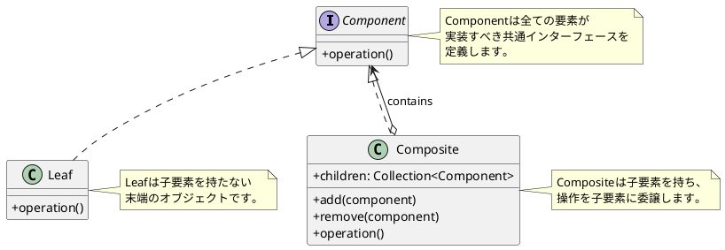
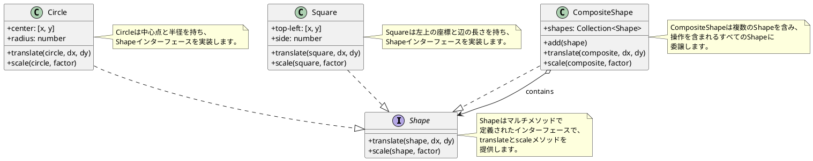
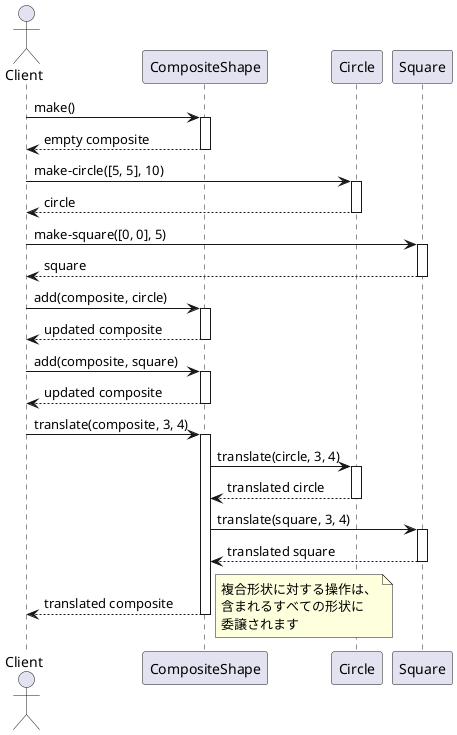
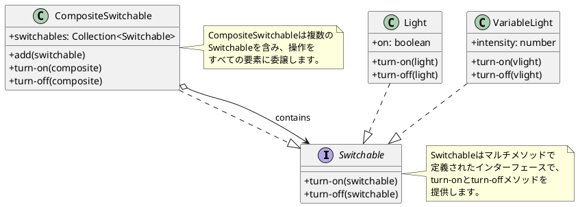
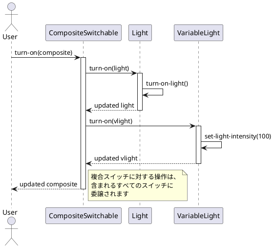

# 第7章: Composite パターン

## はじめに

Composite パターンは、オブジェクトをツリー構造で構成し、個々のオブジェクトとオブジェクトの集合を同じように扱うことができるようにするパターンです。このパターンを使用すると、クライアントは個々のオブジェクトとその組み合わせを区別せずに操作できます。

本章では、図形（Shape）とスイッチ可能オブジェクト（Switchable）を例に、Composite パターンの実装を学びます。

## 1. パターンの構造

Composite パターンは以下の要素で構成されます：

- **Component**: 全てのオブジェクトの共通インターフェース
- **Leaf**: 子要素を持たない末端オブジェクト
- **Composite**: 子要素を持つコンテナオブジェクト



## 2. Shape の例

### インターフェース定義

マルチメソッドを使用して、形状の共通インターフェースを定義します。

```clojure
(ns composite-pattern.shape
  (:require [clojure.spec.alpha :as s]))

(s/def ::type keyword?)
(s/def ::shape-type (s/keys :req [::type]))

(defmulti translate
  "形状を移動する"
  (fn [shape dx dy] (::type shape)))

(defmulti scale
  "形状を拡大/縮小する"
  (fn [shape factor] (::type shape)))
```

### Circle (Leaf)

```clojure
(ns composite-pattern.circle
  (:require [clojure.spec.alpha :as s]
            [composite-pattern.shape :as shape]))

(s/def ::center (s/tuple number? number?))
(s/def ::radius number?)
(s/def ::circle (s/keys :req [::shape/type ::radius ::center]))

(defn make-circle [center radius]
  {:post [(s/valid? ::circle %)]}
  {::shape/type ::circle
   ::center center
   ::radius radius})

(defmethod shape/translate ::circle [circle dx dy]
  (let [[x y] (::center circle)]
    (assoc circle ::center [(+ x dx) (+ y dy)])))

(defmethod shape/scale ::circle [circle factor]
  (let [radius (::radius circle)]
    (assoc circle ::radius (* radius factor))))
```

### Square (Leaf)

```clojure
(ns composite-pattern.square
  (:require [clojure.spec.alpha :as s]
            [composite-pattern.shape :as shape]))

(s/def ::top-left (s/tuple number? number?))
(s/def ::side number?)
(s/def ::square (s/keys :req [::shape/type ::side ::top-left]))

(defn make-square [top-left side]
  {:post [(s/valid? ::square %)]}
  {::shape/type ::square
   ::top-left top-left
   ::side side})

(defmethod shape/translate ::square [square dx dy]
  (let [[x y] (::top-left square)]
    (assoc square ::top-left [(+ x dx) (+ y dy)])))

(defmethod shape/scale ::square [square factor]
  (let [side (::side square)]
    (assoc square ::side (* side factor))))
```

### CompositeShape (Composite)

```clojure
(ns composite-pattern.composite-shape
  (:require [clojure.spec.alpha :as s]
            [composite-pattern.shape :as shape]))

(s/def ::shapes (s/coll-of ::shape/shape-type))
(s/def ::composite-shape (s/keys :req [::shape/type ::shapes]))

(defn make []
  {::shape/type ::composite-shape
   ::shapes []})

(defn add [cs shape]
  (update cs ::shapes conj shape))

(defmethod shape/translate ::composite-shape [cs dx dy]
  (let [translated-shapes (mapv #(shape/translate % dx dy)
                                (::shapes cs))]
    (assoc cs ::shapes translated-shapes)))

(defmethod shape/scale ::composite-shape [cs factor]
  (let [scaled-shapes (mapv #(shape/scale % factor)
                            (::shapes cs))]
    (assoc cs ::shapes scaled-shapes)))
```

### クラス図



### 使用例

```clojure
;; 個々の形状を作成
(def circle (circle/make-circle [10 10] 5))
(def square (square/make-square [0 0] 10))

;; 複合形状を作成
(def group (-> (cs/make)
               (cs/add circle)
               (cs/add square)))

;; 複合形状を移動（全ての子要素が移動する）
(def moved (shape/translate group 5 5))
;; => {:shapes [{:center [15 15] :radius 5}
;;              {:top-left [5 5] :side 10}]}

;; 複合形状を拡大（全ての子要素が拡大する）
(def scaled (shape/scale group 2))
;; => {:shapes [{:center [10 10] :radius 10}
;;              {:top-left [0 0] :side 20}]}
```

### シーケンス図



## 3. Switchable の例

### インターフェース定義

```clojure
(ns composite-pattern.switchable)

(defmulti turn-on
  "スイッチをオンにする"
  :type)

(defmulti turn-off
  "スイッチをオフにする"
  :type)
```

### Light (Leaf)

```clojure
(ns composite-pattern.light
  (:require [composite-pattern.switchable :as s]))

(defn make-light []
  {:type :light
   :on false})

(defn turn-on-light []
  (println "Light turned ON"))

(defn turn-off-light []
  (println "Light turned OFF"))

(defmethod s/turn-on :light [switchable]
  (turn-on-light)
  (assoc switchable :on true))

(defmethod s/turn-off :light [switchable]
  (turn-off-light)
  (assoc switchable :on false))
```

### VariableLight (Leaf)

```clojure
(ns composite-pattern.variable-light
  (:require [composite-pattern.switchable :as s]))

(defn make-variable-light []
  {:type :variable-light
   :intensity 0})

(defn set-light-intensity [intensity]
  (println (str "Light intensity set to " intensity)))

(defmethod s/turn-on :variable-light [switchable]
  (set-light-intensity 100)
  (assoc switchable :intensity 100))

(defmethod s/turn-off :variable-light [switchable]
  (set-light-intensity 0)
  (assoc switchable :intensity 0))
```

### CompositeSwitchable (Composite)

```clojure
(ns composite-pattern.composite-switchable
  (:require [composite-pattern.switchable :as s]))

(defn make-composite-switchable []
  {:type :composite-switchable
   :switchables []})

(defn add [composite-switchable switchable]
  (update composite-switchable :switchables conj switchable))

(defmethod s/turn-on :composite-switchable [c-switchable]
  (let [turned-on (mapv s/turn-on (:switchables c-switchable))]
    (assoc c-switchable :switchables turned-on)))

(defmethod s/turn-off :composite-switchable [c-switchable]
  (let [turned-off (mapv s/turn-off (:switchables c-switchable))]
    (assoc c-switchable :switchables turned-off)))
```

### クラス図



### 使用例

```clojure
;; 個々のライトを作成
(def light (l/make-light))
(def vlight (v/make-variable-light))

;; 複合スイッチを作成
(def room-lights (-> (cs/make-composite-switchable)
                     (cs/add light)
                     (cs/add vlight)))

;; 全てのライトをオンにする
(s/turn-on room-lights)
;; Light turned ON
;; Light intensity set to 100

;; 全てのライトをオフにする
(s/turn-off room-lights)
;; Light turned OFF
;; Light intensity set to 0
```

### シーケンス図



## 4. パターンの利点

1. **統一的な操作**: 個々のオブジェクトとグループを同じインターフェースで操作可能
2. **階層構造**: ネストした構造を自然に表現可能
3. **拡張性**: 新しい Leaf や Composite を追加しやすい
4. **再帰的な構造**: Composite は他の Composite を含むことも可能

## 5. 関数型プログラミングでの特徴

Clojure での Composite パターンの実装には以下の特徴があります：

1. **マルチメソッド**: ディスパッチ関数で型に基づいた多態性を実現
2. **イミュータブルなデータ**: 操作は新しいデータを返す（元のデータを変更しない）
3. **Spec による検証**: データの整合性を保証
4. **シンプルな構造**: クラスの代わりにマップを使用

## まとめ

本章では、Composite パターンについて学びました：

1. **Shape の例**: 図形の移動と拡大を統一的に操作
2. **Switchable の例**: 複数のスイッチをグループ化して操作
3. **マルチメソッド**: Clojure での多態性の実現方法
4. **Spec**: データ構造の検証

Composite パターンは、ツリー構造のデータを扱う際に非常に有効なパターンです。

## 参考コード

本章のコード例は以下のファイルで確認できます：

- ソースコード: `app/clojure/part3/src/composite_pattern/`
- テストコード: `app/clojure/part3/spec/composite_pattern/`

## 次章予告

次章では、**Decorator パターン**について学びます。既存の機能に新しい機能を動的に追加する方法を探ります。
