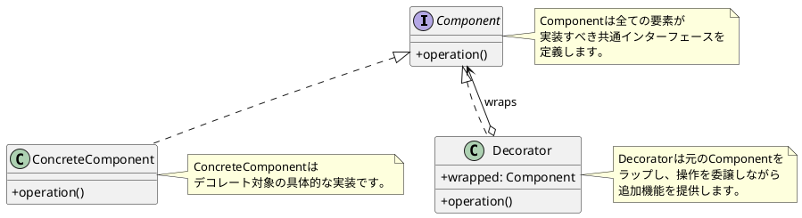
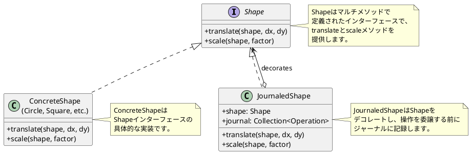
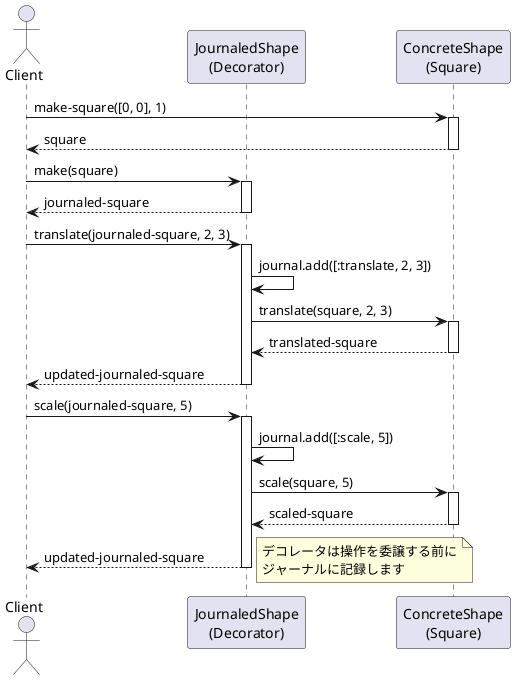
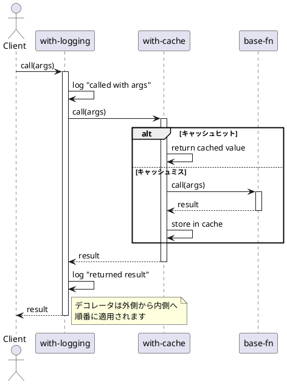

# 第8章: Decorator パターン

## はじめに

Decorator パターンは、既存のオブジェクトに新しい機能を動的に追加するパターンです。このパターンを使用すると、サブクラス化による継承よりも柔軟な方法で機能を拡張できます。

関数型プログラミングでは、高階関数を使って関数をラップし、横断的関心事（ログ、キャッシュ、認証など）を追加します。本章では、形状のジャーナリングと関数デコレータについて学びます。

## 1. パターンの構造

Decorator パターンは以下の要素で構成されます：

- **Component**: デコレート対象の共通インターフェース
- **ConcreteComponent**: 具体的なコンポーネント
- **Decorator**: Component をラップし、追加機能を提供



## 2. JournaledShape の例

### デコレータの実装

形状オブジェクトに操作の履歴を記録する機能を追加するデコレータです。

```clojure
(ns decorator-pattern.journaled-shape
  (:require [clojure.spec.alpha :as s]
            [composite-pattern.shape :as shape]))

(s/def ::journal-entry
  (s/or :translate (s/tuple #{:translate} number? number?)
        :scale (s/tuple #{:scale} number?)))
(s/def ::journal (s/coll-of ::journal-entry))
(s/def ::shape ::shape/shape-type)
(s/def ::journaled-shape (s/and
                          (s/keys :req [::shape/type ::journal ::shape])
                          #(= ::journal-shape (::shape/type %))))

(defn make
  "形状をデコレートしてジャーナル機能を追加する"
  [shape]
  {:post [(s/valid? ::journaled-shape %)]}
  {::shape/type ::journal-shape
   ::journal []
   ::shape shape})

(defmethod shape/translate ::journal-shape [js dx dy]
  (-> js
      (update ::journal conj [:translate dx dy])
      (assoc ::shape (shape/translate (::shape js) dx dy))))

(defmethod shape/scale ::journal-shape [js factor]
  (-> js
      (update ::journal conj [:scale factor])
      (assoc ::shape (shape/scale (::shape js) factor))))
```

### クラス図



### 使用例

```clojure
(require '[composite-pattern.square :as square])
(require '[decorator-pattern.journaled-shape :as js])

;; 形状をデコレート
(def journaled-square
  (-> (js/make (square/make-square [0 0] 1))
      (shape/translate 2 3)
      (shape/scale 5)))

;; ジャーナルを確認
(js/get-journal journaled-square)
;; => [[:translate 2 3] [:scale 5]]

;; 実際の形状を確認
(js/get-shape journaled-square)
;; => {:top-left [2 3], :side 5}
```

### シーケンス図



## 3. 関数デコレータ

関数型プログラミングでは、高階関数を使って関数をデコレートします。

### ログ出力デコレータ

```clojure
(defn with-logging
  "関数にログ出力を追加するデコレータ"
  [f name]
  (fn [& args]
    (println (str "[LOG] " name " called with: " args))
    (let [result (apply f args)]
      (println (str "[LOG] " name " returned: " result))
      result)))

;; 使用例
(def add-logged (with-logging + "add"))
(add-logged 2 3)
;; [LOG] add called with: (2 3)
;; [LOG] add returned: 5
;; => 5
```

### リトライデコレータ

```clojure
(defn with-retry
  "関数にリトライ機能を追加するデコレータ"
  [f max-retries]
  (fn [& args]
    (loop [attempts 0]
      (let [result (try
                     {:success true :value (apply f args)}
                     (catch Exception e
                       {:success false :error e}))]
        (if (:success result)
          (:value result)
          (if (< attempts max-retries)
            (do
              (println "[RETRY] Retrying...")
              (recur (inc attempts)))
            (throw (:error result))))))))
```

### キャッシュデコレータ

```clojure
(defn with-cache
  "関数にキャッシュを追加するデコレータ"
  [f]
  (let [cache (atom {})]
    (fn [& args]
      (if-let [cached (get @cache args)]
        (do
          (println "[CACHE] Hit for" args)
          cached)
        (let [result (apply f args)]
          (println "[CACHE] Miss for" args)
          (swap! cache assoc args result)
          result)))))

;; 使用例
(def expensive-fn-cached (with-cache expensive-fn))
```

### バリデーションデコレータ

```clojure
(defn with-validation
  "関数に入力バリデーションを追加するデコレータ"
  [f validator error-msg]
  (fn [& args]
    (if (apply validator args)
      (apply f args)
      (throw (ex-info error-msg {:args args})))))

;; 使用例
(def positive-only
  (with-validation
    (fn [x] (* x 2))
    (fn [x] (pos? x))
    "Input must be positive"))

(positive-only 5)   ;; => 10
(positive-only -5)  ;; => Exception!
```

## 4. デコレータの組み合わせ

複数のデコレータを組み合わせて使用できます。

```clojure
(defn compose-decorators
  "複数のデコレータを組み合わせる"
  [f & decorators]
  (reduce (fn [decorated decorator]
            (decorator decorated))
          f
          decorators))

;; 使用例
(def enhanced-fn
  (compose-decorators
    base-fn
    with-cache
    #(with-logging % "my-fn")
    #(with-retry % 3)))
```

### 組み合わせのシーケンス図



## 5. パターンの利点

1. **単一責任の原則**: 各デコレータは一つの機能のみを追加
2. **開放/閉鎖の原則**: 既存コードを変更せずに機能を追加
3. **柔軟な組み合わせ**: 必要な機能だけを選択して組み合わせ可能
4. **実行時の決定**: どのデコレータを適用するか実行時に決定可能

## 6. 関数型プログラミングでの特徴

Clojure での Decorator パターンの実装には以下の特徴があります：

1. **高階関数**: 関数を引数に取り、新しい関数を返す
2. **クロージャ**: 状態（キャッシュなど）を内部に保持
3. **イミュータブルなデータ**: デコレート後も元のデータは変更されない
4. **合成のしやすさ**: `comp` や `reduce` で簡単に組み合わせ可能

## まとめ

本章では、Decorator パターンについて学びました：

1. **JournaledShape**: 形状操作の履歴を記録するデコレータ
2. **関数デコレータ**: ログ、リトライ、キャッシュなどの横断的関心事
3. **デコレータの組み合わせ**: 複数のデコレータを柔軟に組み合わせ

Decorator パターンは、既存のコードを変更せずに機能を拡張する強力なパターンです。

## 参考コード

本章のコード例は以下のファイルで確認できます：

- ソースコード: `app/clojure/part3/src/decorator_pattern/`
- テストコード: `app/clojure/part3/spec/decorator_pattern/`

## 次章予告

次章では、**Adapter パターン**について学びます。異なるインターフェース間の変換とレガシーシステムとの統合を探ります。
