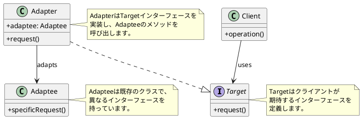
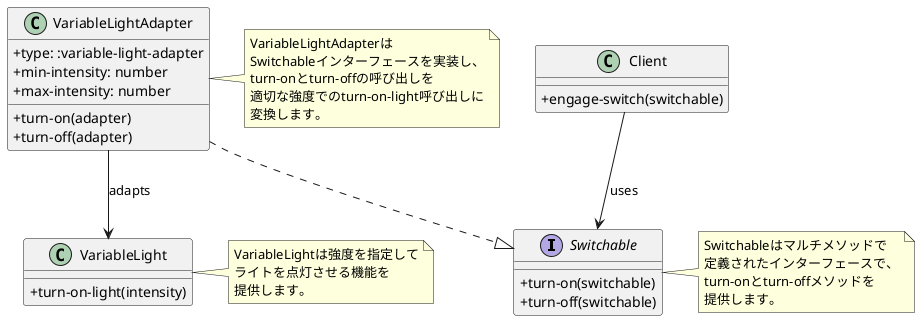
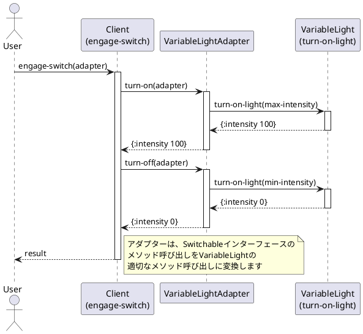
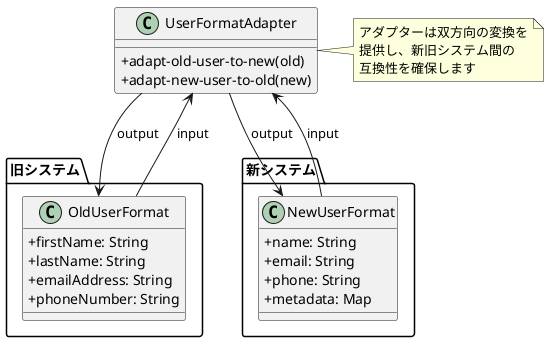

# 第9章: Adapter パターン

## はじめに

Adapter パターンは、既存のクラスのインターフェースを、クライアントが期待する別のインターフェースに変換するパターンです。このパターンを使用すると、互換性のないインターフェースを持つクラス同士を連携させることができます。

本章では、可変強度ライトのアダプターとデータフォーマット変換について学びます。

## 1. パターンの構造

Adapter パターンは以下の要素で構成されます：

- **Target**: クライアントが期待するインターフェース
- **Adaptee**: 既存のクラス（適応される側）
- **Adapter**: Target インターフェースを実装し、Adaptee を使用



## 2. VariableLight の例

### Switchable インターフェース (Target)

```clojure
(ns adapter-pattern.switchable)

(defmulti turn-on
  "スイッチをオンにする"
  :type)

(defmulti turn-off
  "スイッチをオフにする"
  :type)
```

### VariableLight (Adaptee)

可変強度を持つライトは、単純なオン/オフではなく、強度を指定する必要があります。

```clojure
(ns adapter-pattern.variable-light)

(defn turn-on-light
  "ライトを指定した強度で点灯する"
  [intensity]
  (println (str "VariableLight: intensity set to " intensity))
  {:intensity intensity})
```

### VariableLightAdapter (Adapter)

```clojure
(ns adapter-pattern.variable-light-adapter
  (:require [adapter-pattern.switchable :as s]
            [adapter-pattern.variable-light :as vl]))

(defn make-adapter
  "VariableLight のアダプターを作成する"
  [min-intensity max-intensity]
  {:type :variable-light-adapter
   :min-intensity min-intensity
   :max-intensity max-intensity})

(defmethod s/turn-on :variable-light-adapter [adapter]
  (vl/turn-on-light (:max-intensity adapter)))

(defmethod s/turn-off :variable-light-adapter [adapter]
  (vl/turn-on-light (:min-intensity adapter)))
```

### クラス図



### Client

```clojure
(ns adapter-pattern.engage-switch
  (:require [adapter-pattern.switchable :as s]))

(defn engage-switch
  "スイッチを操作する"
  [switchable]
  (println "Engaging switch...")
  (let [on-result (s/turn-on switchable)
        off-result (s/turn-off switchable)]
    {:on-result on-result
     :off-result off-result}))
```

### 使用例

```clojure
(require '[adapter-pattern.variable-light-adapter :as adapter])
(require '[adapter-pattern.engage-switch :as client])

;; アダプターを作成（最小0、最大100）
(def vl-adapter (adapter/make-adapter 0 100))

;; クライアントはSwitchableインターフェースで操作
(client/engage-switch vl-adapter)
;; Engaging switch...
;; VariableLight: intensity set to 100
;; VariableLight: intensity set to 0
;; => {:on-result {:intensity 100}, :off-result {:intensity 0}}
```

### シーケンス図



## 3. データフォーマットアダプター

### ユーザーフォーマット変換

異なるシステム間でデータフォーマットが異なる場合、アダプターを使って変換します。

```clojure
(ns adapter-pattern.data-format
  (:require [clojure.string :as str]))

(defn adapt-old-user-to-new
  "旧ユーザーフォーマットを新フォーマットに変換"
  [old-user]
  {:name (str (:lastName old-user) " " (:firstName old-user))
   :email (:emailAddress old-user)
   :phone (:phoneNumber old-user)
   :metadata {:migrated true
              :original-format :old}})

(defn adapt-new-user-to-old
  "新ユーザーフォーマットを旧フォーマットに変換"
  [new-user]
  (let [name-parts (str/split (:name new-user) #" ")
        last-name (first name-parts)
        first-name (if (> (count name-parts) 1)
                     (second name-parts)
                     "")]
    {:firstName first-name
     :lastName last-name
     :emailAddress (:email new-user)
     :phoneNumber (:phone new-user)}))
```

### 使用例

```clojure
;; 旧フォーマット → 新フォーマット
(def old-user {:firstName "太郎"
               :lastName "山田"
               :emailAddress "taro@example.com"
               :phoneNumber "090-1234-5678"})

(adapt-old-user-to-new old-user)
;; => {:name "山田 太郎"
;;     :email "taro@example.com"
;;     :phone "090-1234-5678"
;;     :metadata {:migrated true, :original-format :old}}

;; 新フォーマット → 旧フォーマット
(def new-user {:name "山田 太郎"
               :email "taro@example.com"
               :phone "090-1234-5678"})

(adapt-new-user-to-old new-user)
;; => {:firstName "太郎"
;;     :lastName "山田"
;;     :emailAddress "taro@example.com"
;;     :phoneNumber "090-1234-5678"}
```

### API レスポンスアダプター

```clojure
(defn adapt-external-api-response
  "外部API のレスポンスを内部形式に変換"
  [external-response]
  {:id (get-in external-response ["data" "identifier"])
   :name (get-in external-response ["data" "attributes" "name"])
   :created-at (get-in external-response ["data" "attributes" "createdAt"])
   :metadata {:source :external-api
              :original-id (get-in external-response ["data" "id"])}})

(defn adapt-internal-to-external
  "内部形式を外部API の形式に変換"
  [internal-data]
  {"data" {"type" "resource"
           "id" (str (:id internal-data))
           "attributes" {"name" (:name internal-data)
                         "createdAt" (:created-at internal-data)}}})
```

### データ変換の図



## 4. パターンの利点

1. **既存コードの再利用**: 既存のクラスを変更せずに新しいインターフェースで使用
2. **単一責任の原則**: インターフェース変換のロジックを分離
3. **開放/閉鎖の原則**: 新しいアダプターを追加しても既存コードは変更不要
4. **レガシーシステムとの統合**: 古いシステムと新しいシステムを連携

## 5. 関数型プログラミングでの特徴

Clojure での Adapter パターンの実装には以下の特徴があります：

1. **マルチメソッド**: ディスパッチ関数で型に基づいた多態性を実現
2. **関数による変換**: 単純なデータ変換は関数で直接実装
3. **イミュータブルなデータ**: 変換後も元のデータは変更されない
4. **合成のしやすさ**: 複数のアダプターを組み合わせ可能

## まとめ

本章では、Adapter パターンについて学びました：

1. **VariableLightAdapter**: 可変強度ライトを単純なオン/オフインターフェースに適応
2. **データフォーマットアダプター**: 異なるデータ形式間の変換
3. **マルチメソッド**: Clojure でのインターフェース適応

Adapter パターンは、既存のコードを変更せずに異なるシステムを連携させる際に非常に有効です。

## 参考コード

本章のコード例は以下のファイルで確認できます：

- ソースコード: `app/clojure/part3/src/adapter_pattern/`
- テストコード: `app/clojure/part3/spec/adapter_pattern/`

## 次章予告

次章では、**Facade パターン**について学びます。複雑なサブシステムへのシンプルなインターフェースを提供する方法を探ります。
