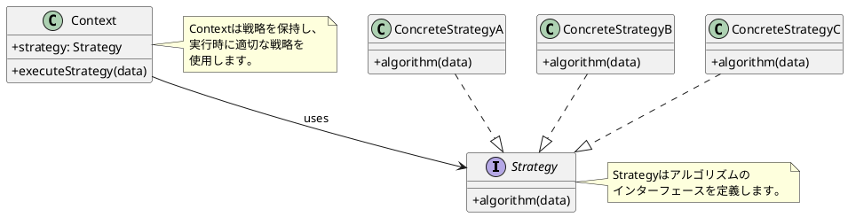
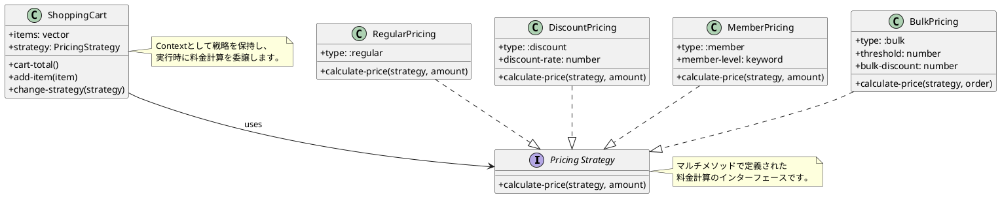
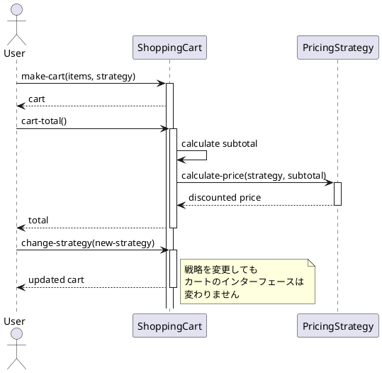
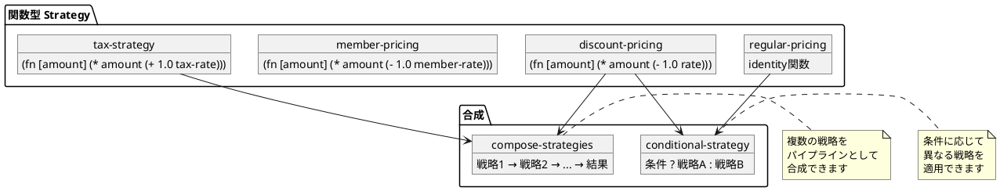

# 第10章: Strategy パターン

## はじめに

Strategy パターンは、アルゴリズムをカプセル化し、それらを交換可能にするパターンです。このパターンを使用すると、アルゴリズムをクライアントから独立して変更できます。

本章では、料金計算と配送料金の例を通じて、マルチメソッドと高階関数による Strategy パターンの実装を学びます。

## 1. パターンの構造

Strategy パターンは以下の要素で構成されます：

- **Strategy**: アルゴリズムのインターフェース
- **ConcreteStrategy**: 具体的なアルゴリズムの実装
- **Context**: Strategy を使用するクライアント



## 2. 料金計算の例

### Strategy インターフェース

```clojure
(ns strategy-pattern.pricing)

(defmulti calculate-price
  "料金を計算する"
  (fn [strategy _amount] (:type strategy)))
```

### ConcreteStrategy: 通常料金

```clojure
(defn make-regular-pricing
  "通常料金戦略を作成"
  []
  {:type :regular})

(defmethod calculate-price :regular [_strategy amount]
  amount)
```

### ConcreteStrategy: 割引料金

```clojure
(defn make-discount-pricing
  "割引料金戦略を作成"
  [discount-rate]
  {:type :discount
   :discount-rate discount-rate})

(defmethod calculate-price :discount [strategy amount]
  (let [rate (:discount-rate strategy)]
    (* amount (- 1.0 rate))))
```

### ConcreteStrategy: 会員料金

```clojure
(defn make-member-pricing
  "会員料金戦略を作成"
  [member-level]
  {:type :member
   :member-level member-level})

(defmethod calculate-price :member [strategy amount]
  (let [level (:member-level strategy)
        rate (case level
               :gold 0.20
               :silver 0.15
               :bronze 0.10
               0.0)]
    (* amount (- 1.0 rate))))
```

### クラス図



### 使用例

```clojure
(require '[strategy-pattern.pricing :as pricing])

;; 通常料金
(def regular (pricing/make-regular-pricing))
(pricing/calculate-price regular 1000)
;; => 1000

;; 10%割引
(def discount (pricing/make-discount-pricing 0.10))
(pricing/calculate-price discount 1000)
;; => 900.0

;; ゴールド会員料金
(def gold (pricing/make-member-pricing :gold))
(pricing/calculate-price gold 1000)
;; => 800.0
```

## 3. Context: ショッピングカート

### 実装

```clojure
(ns strategy-pattern.context
  (:require [strategy-pattern.pricing :as pricing]))

(defn make-cart
  "ショッピングカートを作成"
  [items pricing-strategy]
  {:items items
   :strategy pricing-strategy})

(defn cart-total
  "カートの合計金額を計算"
  [cart]
  (let [items (:items cart)
        strategy (:strategy cart)
        subtotal (reduce + (map :price items))]
    (pricing/calculate-price strategy subtotal)))

(defn change-strategy
  "料金戦略を変更"
  [cart new-strategy]
  (assoc cart :strategy new-strategy))
```

### シーケンス図



### 使用例

```clojure
(require '[strategy-pattern.context :as ctx])
(require '[strategy-pattern.pricing :as pricing])

;; カートを作成
(def items [{:name "Item A" :price 500}
            {:name "Item B" :price 500}])

(def cart (ctx/make-cart items (pricing/make-regular-pricing)))
(ctx/cart-total cart)
;; => 1000

;; 戦略を変更
(def discounted-cart (ctx/change-strategy cart (pricing/make-member-pricing :gold)))
(ctx/cart-total discounted-cart)
;; => 800.0
```

## 4. 関数型アプローチ

Clojure では、関数を第一級オブジェクトとして扱えるため、より簡潔に Strategy パターンを実装できます。

### 関数による Strategy

```clojure
(ns strategy-pattern.functional-strategy)

(defn apply-pricing
  "料金戦略を適用"
  [strategy-fn amount]
  (strategy-fn amount))

;; 戦略関数の定義
(def regular-pricing identity)

(defn discount-pricing
  "割引戦略を作成"
  [rate]
  (fn [amount]
    (* amount (- 1.0 rate))))

(defn member-pricing
  "会員戦略を作成"
  [level]
  (let [rate (case level
               :gold 0.20
               :silver 0.15
               :bronze 0.10
               0.0)]
    (fn [amount]
      (* amount (- 1.0 rate)))))
```

### 戦略の合成

関数型アプローチの大きな利点は、戦略を簡単に合成できることです。

```clojure
(defn compose-strategies
  "複数の戦略を合成"
  [& strategies]
  (fn [amount]
    (reduce (fn [a strategy] (strategy a)) amount strategies)))

(defn tax-strategy
  "税金戦略を作成"
  [tax-rate]
  (fn [amount]
    (* amount (+ 1.0 tax-rate))))

;; 使用例：割引後に税金を適用
(def discount (discount-pricing 0.10))
(def tax (tax-strategy 0.08))
(def final-price (compose-strategies discount tax))

(apply-pricing final-price 1000)
;; => 972.0  (1000 * 0.9 * 1.08)
```

### 条件付き戦略

```clojure
(defn conditional-strategy
  "条件付き戦略"
  [pred then-strategy else-strategy]
  (fn [amount]
    (if (pred amount)
      (then-strategy amount)
      (else-strategy amount))))

;; 5000円以上で20%割引
(def high-value-discount
  (conditional-strategy
    #(>= % 5000)
    (discount-pricing 0.20)
    regular-pricing))

(apply-pricing high-value-discount 6000)
;; => 4800.0

(apply-pricing high-value-discount 3000)
;; => 3000
```

### 関数型アプローチの図



## 5. 配送料金の例

Strategy パターンは配送料金計算にも適用できます。

```clojure
(defmulti calculate-shipping
  "配送料金を計算"
  (fn [strategy _weight _distance] (:type strategy)))

(defn make-standard-shipping []
  {:type :standard-shipping})

(defmethod calculate-shipping :standard-shipping [_strategy weight distance]
  (+ (* weight 10) (* distance 5)))

(defn make-express-shipping []
  {:type :express-shipping})

(defmethod calculate-shipping :express-shipping [_strategy weight distance]
  (+ (* weight 20) (* distance 15)))

(defn make-free-shipping [min-order-amount]
  {:type :free-shipping
   :min-order-amount min-order-amount})

(defmethod calculate-shipping :free-shipping [_strategy _weight _distance]
  0)
```

## 6. パターンの利点

1. **アルゴリズムの交換**: 実行時に戦略を変更可能
2. **開放/閉鎖の原則**: 新しい戦略を追加しても既存コードは変更不要
3. **条件分岐の排除**: if/switch 文の代わりにポリモーフィズムを使用
4. **テストの容易さ**: 各戦略を独立してテスト可能

## 7. 関数型プログラミングでの特徴

Clojure での Strategy パターンの実装には以下の特徴があります：

1. **マルチメソッド**: 型に基づいたディスパッチで多態性を実現
2. **高階関数**: 関数を戦略として直接渡すことができる
3. **関数合成**: 複数の戦略を簡単に組み合わせ可能
4. **イミュータブル**: 戦略の変更は新しいデータ構造を返す

## まとめ

本章では、Strategy パターンについて学びました：

1. **マルチメソッド版**: 型ベースのディスパッチによる実装
2. **関数型版**: 高階関数による簡潔な実装
3. **戦略の合成**: 複数の戦略を組み合わせる方法
4. **Context**: 戦略を使用するクライアントの実装

Strategy パターンは、アルゴリズムを柔軟に交換する必要がある場面で非常に有効です。

## 参考コード

本章のコード例は以下のファイルで確認できます：

- ソースコード: `app/clojure/part4/src/strategy_pattern/`
- テストコード: `app/clojure/part4/spec/strategy_pattern/`

## 次章予告

次章では、**Command パターン**について学びます。コマンドをデータとして表現し、バッチ処理や Undo 機能を実装する方法を探ります。
