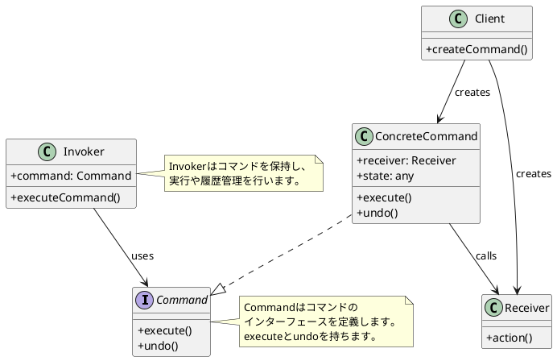
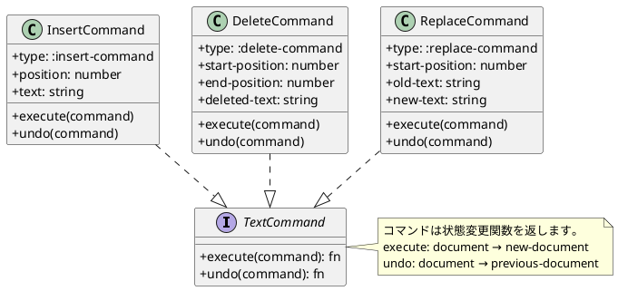
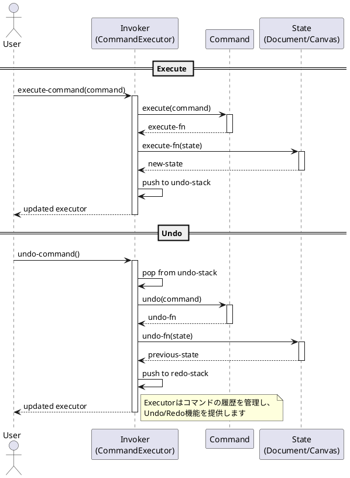
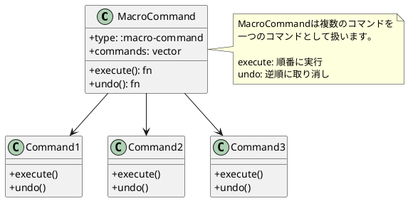

# 第11章: Command パターン

## はじめに

Command パターンは、リクエストをオブジェクトとしてカプセル化し、異なるリクエストでクライアントをパラメータ化したり、リクエストをキューに入れたり、操作の履歴を記録したりできるようにするパターンです。

本章では、テキスト編集とキャンバス操作の例を通じて、コマンドのデータ化、Undo/Redo 機能、バッチ処理の実装を学びます。

## 1. パターンの構造

Command パターンは以下の要素で構成されます：

- **Command**: コマンドのインターフェース（execute メソッド）
- **ConcreteCommand**: 具体的なコマンドの実装
- **Receiver**: コマンドを受け取り、実際の処理を行うオブジェクト
- **Invoker**: コマンドを実行するオブジェクト



## 2. Command インターフェース

### マルチメソッドによる定義

```clojure
(ns command-pattern.command)

(defmulti execute
  "コマンドを実行する"
  :type)

(defmulti undo
  "コマンドを取り消す"
  :type)
```

## 3. テキスト操作コマンド

### InsertCommand: テキスト挿入

```clojure
(ns command-pattern.text-commands
  (:require [command-pattern.command :as cmd]))

(defn make-insert-command
  "挿入コマンドを作成"
  [position text]
  {:type :insert-command
   :position position
   :text text})

(defmethod cmd/execute :insert-command [command]
  (fn [document]
    (let [pos (:position command)
          text (:text command)
          before (subs document 0 pos)
          after (subs document pos)]
      (str before text after))))

(defmethod cmd/undo :insert-command [command]
  (fn [document]
    (let [pos (:position command)
          len (count (:text command))
          before (subs document 0 pos)
          after (subs document (+ pos len))]
      (str before after))))
```

### DeleteCommand: テキスト削除

```clojure
(defn make-delete-command
  "削除コマンドを作成"
  [start-position end-position deleted-text]
  {:type :delete-command
   :start-position start-position
   :end-position end-position
   :deleted-text deleted-text})

(defmethod cmd/execute :delete-command [command]
  (fn [document]
    (let [start (:start-position command)
          end (:end-position command)
          before (subs document 0 start)
          after (subs document end)]
      (str before after))))

(defmethod cmd/undo :delete-command [command]
  (fn [document]
    (let [start (:start-position command)
          text (:deleted-text command)
          before (subs document 0 start)
          after (subs document start)]
      (str before text after))))
```

### ReplaceCommand: テキスト置換

```clojure
(defn make-replace-command
  "置換コマンドを作成"
  [start-position old-text new-text]
  {:type :replace-command
   :start-position start-position
   :old-text old-text
   :new-text new-text})

(defmethod cmd/execute :replace-command [command]
  (fn [document]
    (let [start (:start-position command)
          old-len (count (:old-text command))
          new-text (:new-text command)
          before (subs document 0 start)
          after (subs document (+ start old-len))]
      (str before new-text after))))

(defmethod cmd/undo :replace-command [command]
  (fn [document]
    (let [start (:start-position command)
          new-len (count (:new-text command))
          old-text (:old-text command)
          before (subs document 0 start)
          after (subs document (+ start new-len))]
      (str before old-text after))))
```

### クラス図



### 使用例

```clojure
(require '[command-pattern.command :as cmd])
(require '[command-pattern.text-commands :as tc])

;; 挿入コマンド
(def insert-cmd (tc/make-insert-command 5 " World"))
(def execute-fn (cmd/execute insert-cmd))
(execute-fn "Hello")
;; => "Hello World"

;; Undo
(def undo-fn (cmd/undo insert-cmd))
(undo-fn "Hello World")
;; => "Hello"
```

## 4. キャンバス操作コマンド

### AddShapeCommand: 図形追加

```clojure
(ns command-pattern.canvas-commands
  (:require [command-pattern.command :as cmd]))

(defn make-add-shape-command
  "図形追加コマンドを作成"
  [shape]
  {:type :add-shape-command
   :shape shape})

(defmethod cmd/execute :add-shape-command [command]
  (fn [canvas]
    (update canvas :shapes conj (:shape command))))

(defmethod cmd/undo :add-shape-command [command]
  (fn [canvas]
    (update canvas :shapes
            (fn [shapes]
              (filterv #(not= (:id %) (get-in command [:shape :id])) shapes)))))
```

### MoveShapeCommand: 図形移動

```clojure
(defn make-move-shape-command
  "図形移動コマンドを作成"
  [shape-id dx dy]
  {:type :move-shape-command
   :shape-id shape-id
   :dx dx
   :dy dy})

(defmethod cmd/execute :move-shape-command [command]
  (fn [canvas]
    (update canvas :shapes
            (fn [shapes]
              (mapv (fn [shape]
                      (if (= (:id shape) (:shape-id command))
                        (-> shape
                            (update :x + (:dx command))
                            (update :y + (:dy command)))
                        shape))
                    shapes)))))

(defmethod cmd/undo :move-shape-command [command]
  (fn [canvas]
    (update canvas :shapes
            (fn [shapes]
              (mapv (fn [shape]
                      (if (= (:id shape) (:shape-id command))
                        (-> shape
                            (update :x - (:dx command))
                            (update :y - (:dy command)))
                        shape))
                    shapes)))))
```

## 5. コマンド実行器

### CommandExecutor の実装

```clojure
(ns command-pattern.command-executor
  (:require [command-pattern.command :as cmd]))

(defn make-executor
  "コマンド実行器を作成"
  [initial-state]
  {:state initial-state
   :undo-stack []
   :redo-stack []})

(defn execute-command
  "コマンドを実行し、履歴に追加"
  [executor command]
  (let [state (:state executor)
        execute-fn (cmd/execute command)
        new-state (execute-fn state)]
    (-> executor
        (assoc :state new-state)
        (update :undo-stack conj command)
        (assoc :redo-stack []))))

(defn undo-command
  "最後のコマンドを取り消す"
  [executor]
  (if (seq (:undo-stack executor))
    (let [command (peek (:undo-stack executor))
          state (:state executor)
          undo-fn (cmd/undo command)
          new-state (undo-fn state)]
      (-> executor
          (assoc :state new-state)
          (update :undo-stack pop)
          (update :redo-stack conj command)))
    executor))

(defn redo-command
  "最後に取り消したコマンドを再実行"
  [executor]
  (if (seq (:redo-stack executor))
    (let [command (peek (:redo-stack executor))
          state (:state executor)
          execute-fn (cmd/execute command)
          new-state (execute-fn state)]
      (-> executor
          (assoc :state new-state)
          (update :redo-stack pop)
          (update :undo-stack conj command)))
    executor))
```

### シーケンス図



### 使用例

```clojure
(require '[command-pattern.command-executor :as exec])
(require '[command-pattern.text-commands :as tc])

;; 実行器を作成
(def executor (exec/make-executor "Hello"))

;; コマンドを実行
(def executor (exec/execute-command executor (tc/make-insert-command 5 " World")))
(exec/get-state executor)
;; => "Hello World"

;; Undo
(def executor (exec/undo-command executor))
(exec/get-state executor)
;; => "Hello"

;; Redo
(def executor (exec/redo-command executor))
(exec/get-state executor)
;; => "Hello World"
```

## 6. バッチ処理とマクロコマンド

### バッチ処理

```clojure
(defn execute-batch
  "複数のコマンドをまとめて実行"
  [executor commands]
  (reduce execute-command executor commands))

(defn undo-all
  "すべてのコマンドを取り消す"
  [executor]
  (if (can-undo? executor)
    (recur (undo-command executor))
    executor))
```

### MacroCommand

```clojure
(defn make-macro-command
  "複合コマンドを作成"
  [commands]
  {:type :macro-command
   :commands commands})

(defmethod cmd/execute :macro-command [macro]
  (fn [state]
    (reduce (fn [s command]
              ((cmd/execute command) s))
            state
            (:commands macro))))

(defmethod cmd/undo :macro-command [macro]
  (fn [state]
    (reduce (fn [s command]
              ((cmd/undo command) s))
            state
            (reverse (:commands macro)))))
```

### MacroCommand の図



### 使用例

```clojure
;; MacroCommand を使った複合操作
(def commands [(tc/make-insert-command 5 " World")
               (tc/make-insert-command 11 "!")])
(def macro (exec/make-macro-command commands))

(def executor (exec/execute-command (exec/make-executor "Hello") macro))
(exec/get-state executor)
;; => "Hello World!"

;; 一度のUndoで全体を取り消す
(def executor (exec/undo-command executor))
(exec/get-state executor)
;; => "Hello"
```

## 7. パターンの利点

1. **操作のオブジェクト化**: 操作をデータとして表現できる
2. **Undo/Redo**: 操作履歴の管理が容易
3. **バッチ処理**: 複数の操作をまとめて処理
4. **遅延実行**: コマンドをキューに入れて後で実行
5. **ログ記録**: 操作の履歴をログとして保存

## 8. 関数型プログラミングでの特徴

Clojure での Command パターンの実装には以下の特徴があります：

1. **コマンドはデータ**: コマンドは単なるマップとして表現
2. **純粋関数**: execute/undo は状態変更関数を返す純粋関数
3. **イミュータブル**: 状態は変更されず、新しい状態が返される
4. **マルチメソッド**: 型に基づいたディスパッチで多態性を実現

## まとめ

本章では、Command パターンについて学びました：

1. **コマンドのデータ化**: 操作をマップとして表現
2. **Undo/Redo**: コマンド履歴による取り消しと再実行
3. **バッチ処理**: 複数コマンドの一括実行
4. **MacroCommand**: 複合コマンドの実装

Command パターンは、操作の履歴管理や取り消し機能が必要な場面で非常に有効です。

## 参考コード

本章のコード例は以下のファイルで確認できます：

- ソースコード: `app/clojure/part4/src/command_pattern/`
- テストコード: `app/clojure/part4/spec/command_pattern/`

## 次章予告

次章では、**Visitor パターン**について学びます。データ構造と操作を分離し、新しい操作を追加しやすくする方法を探ります。
