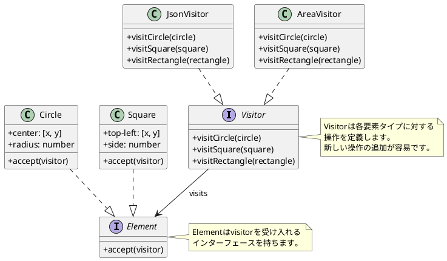
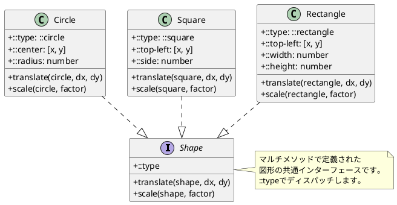
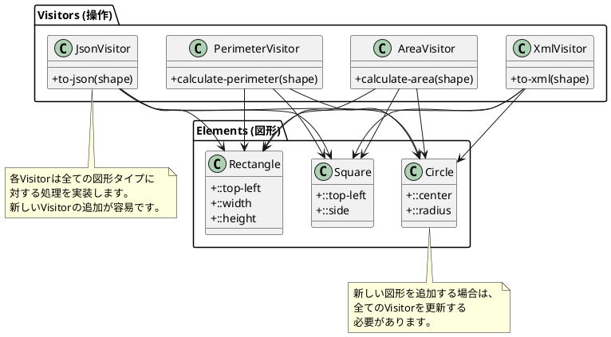
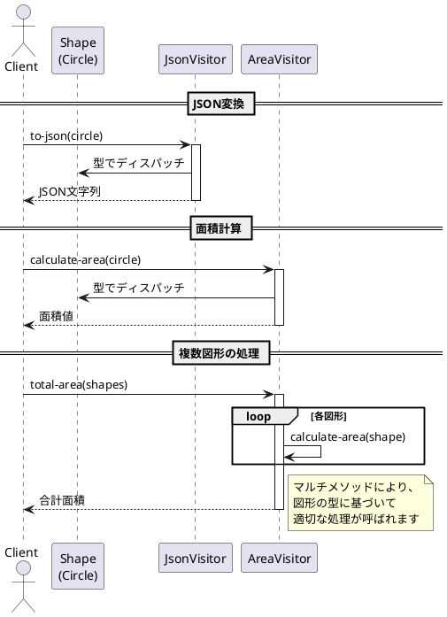
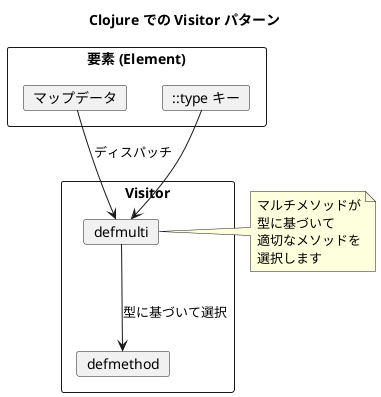

# 第12章: Visitor パターン

## はじめに

Visitor パターンは、データ構造と操作を分離し、既存のデータ構造を変更することなく新しい操作を追加できるようにするパターンです。

本章では、図形（Shape）に対する様々な操作（JSON 変換、XML 変換、面積計算、周囲長計算）を通じて、マルチメソッドによる Visitor パターンの実装を学びます。

## 1. パターンの構造

Visitor パターンは以下の要素で構成されます：

- **Visitor**: 操作のインターフェース
- **ConcreteVisitor**: 具体的な操作の実装
- **Element**: 訪問される要素のインターフェース
- **ConcreteElement**: 具体的な要素



## 2. Element: 図形の定義

### Shape インターフェース

```clojure
(ns visitor-pattern.shape)

(defmulti translate
  "図形を移動する"
  (fn [shape _dx _dy] (::type shape)))

(defmulti scale
  "図形を拡大/縮小する"
  (fn [shape _factor] (::type shape)))
```

### Circle

```clojure
(ns visitor-pattern.circle
  (:require [visitor-pattern.shape :as shape]))

(defn make
  "円を作成"
  [center radius]
  {::shape/type ::circle
   ::center center
   ::radius radius})

(defmethod shape/translate ::circle [circle dx dy]
  (let [[x y] (::center circle)]
    (assoc circle ::center [(+ x dx) (+ y dy)])))

(defmethod shape/scale ::circle [circle factor]
  (let [radius (::radius circle)]
    (assoc circle ::radius (* radius factor))))
```

### Square

```clojure
(ns visitor-pattern.square
  (:require [visitor-pattern.shape :as shape]))

(defn make
  "正方形を作成"
  [top-left side]
  {::shape/type ::square
   ::top-left top-left
   ::side side})

(defmethod shape/translate ::square [square dx dy]
  (let [[x y] (::top-left square)]
    (assoc square ::top-left [(+ x dx) (+ y dy)])))

(defmethod shape/scale ::square [square factor]
  (let [side (::side square)]
    (assoc square ::side (* side factor))))
```

### Rectangle

```clojure
(ns visitor-pattern.rectangle
  (:require [visitor-pattern.shape :as shape]))

(defn make
  "長方形を作成"
  [top-left width height]
  {::shape/type ::rectangle
   ::top-left top-left
   ::width width
   ::height height})

(defmethod shape/translate ::rectangle [rect dx dy]
  (let [[x y] (::top-left rect)]
    (assoc rect ::top-left [(+ x dx) (+ y dy)])))

(defmethod shape/scale ::rectangle [rect factor]
  (-> rect
      (update ::width * factor)
      (update ::height * factor)))
```

### クラス図



## 3. Visitor: JSON 変換

### JSON Visitor の実装

```clojure
(ns visitor-pattern.json-visitor
  (:require [visitor-pattern.shape :as shape]
            [visitor-pattern.circle :as circle]
            [visitor-pattern.square :as square]
            [visitor-pattern.rectangle :as rectangle]))

(defmulti to-json
  "図形を JSON 文字列に変換"
  ::shape/type)

(defmethod to-json ::circle/circle [circle]
  (let [{:keys [::circle/center ::circle/radius]} circle
        [x y] center]
    (format "{\"type\":\"circle\",\"center\":[%s,%s],\"radius\":%s}"
            x y radius)))

(defmethod to-json ::square/square [square]
  (let [{:keys [::square/top-left ::square/side]} square
        [x y] top-left]
    (format "{\"type\":\"square\",\"topLeft\":[%s,%s],\"side\":%s}"
            x y side)))

(defmethod to-json ::rectangle/rectangle [rect]
  (let [{:keys [::rectangle/top-left ::rectangle/width ::rectangle/height]} rect
        [x y] top-left]
    (format "{\"type\":\"rectangle\",\"topLeft\":[%s,%s],\"width\":%s,\"height\":%s}"
            x y width height)))
```

### 使用例

```clojure
(require '[visitor-pattern.json-visitor :as json])
(require '[visitor-pattern.circle :as circle])

(def c (circle/make [10 20] 5))
(json/to-json c)
;; => "{\"type\":\"circle\",\"center\":[10,20],\"radius\":5}"
```

## 4. Visitor: XML 変換

### XML Visitor の実装

```clojure
(ns visitor-pattern.xml-visitor
  (:require [visitor-pattern.shape :as shape]
            [visitor-pattern.circle :as circle]
            [visitor-pattern.square :as square]
            [visitor-pattern.rectangle :as rectangle]))

(defmulti to-xml
  "図形を XML 文字列に変換"
  ::shape/type)

(defmethod to-xml ::circle/circle [circle]
  (let [{:keys [::circle/center ::circle/radius]} circle
        [x y] center]
    (format "<circle><center x=\"%s\" y=\"%s\"/><radius>%s</radius></circle>"
            x y radius)))

(defmethod to-xml ::square/square [square]
  (let [{:keys [::square/top-left ::square/side]} square
        [x y] top-left]
    (format "<square><topLeft x=\"%s\" y=\"%s\"/><side>%s</side></square>"
            x y side)))

(defmethod to-xml ::rectangle/rectangle [rect]
  (let [{:keys [::rectangle/top-left ::rectangle/width ::rectangle/height]} rect
        [x y] top-left]
    (format "<rectangle><topLeft x=\"%s\" y=\"%s\"/><width>%s</width><height>%s</height></rectangle>"
            x y width height)))
```

## 5. Visitor: 面積計算

### Area Visitor の実装

```clojure
(ns visitor-pattern.area-visitor
  (:require [visitor-pattern.shape :as shape]
            [visitor-pattern.circle :as circle]
            [visitor-pattern.square :as square]
            [visitor-pattern.rectangle :as rectangle]))

(defmulti calculate-area
  "図形の面積を計算"
  ::shape/type)

(defmethod calculate-area ::circle/circle [circle]
  (let [radius (::circle/radius circle)]
    (* Math/PI radius radius)))

(defmethod calculate-area ::square/square [square]
  (let [side (::square/side square)]
    (* side side)))

(defmethod calculate-area ::rectangle/rectangle [rect]
  (let [width (::rectangle/width rect)
        height (::rectangle/height rect)]
    (* width height)))

(defn total-area
  "複数の図形の合計面積を計算"
  [shapes]
  (reduce + (map calculate-area shapes)))
```

## 6. Visitor: 周囲長計算

### Perimeter Visitor の実装

```clojure
(ns visitor-pattern.perimeter-visitor
  (:require [visitor-pattern.shape :as shape]
            [visitor-pattern.circle :as circle]
            [visitor-pattern.square :as square]
            [visitor-pattern.rectangle :as rectangle]))

(defmulti calculate-perimeter
  "図形の周囲長を計算"
  ::shape/type)

(defmethod calculate-perimeter ::circle/circle [circle]
  (let [radius (::circle/radius circle)]
    (* 2 Math/PI radius)))

(defmethod calculate-perimeter ::square/square [square]
  (let [side (::square/side square)]
    (* 4 side)))

(defmethod calculate-perimeter ::rectangle/rectangle [rect]
  (let [width (::rectangle/width rect)
        height (::rectangle/height rect)]
    (* 2 (+ width height))))
```

## 7. Visitor パターンの構造



## 8. シーケンス図



## 9. 新しい Visitor の追加

Visitor パターンの利点は、新しい操作を追加しやすいことです。

### 例: 描画 Visitor

```clojure
(ns visitor-pattern.draw-visitor
  (:require [visitor-pattern.shape :as shape]
            [visitor-pattern.circle :as circle]
            [visitor-pattern.square :as square]))

(defmulti draw
  "図形を描画コマンドに変換"
  ::shape/type)

(defmethod draw ::circle/circle [circle]
  (let [{:keys [::circle/center ::circle/radius]} circle
        [x y] center]
    {:command :draw-circle
     :center [x y]
     :radius radius}))

(defmethod draw ::square/square [square]
  (let [{:keys [::square/top-left ::square/side]} square
        [x y] top-left]
    {:command :draw-rect
     :position [x y]
     :width side
     :height side}))
```

## 10. パターンの利点と欠点

### 利点

1. **操作の追加が容易**: 新しい Visitor を追加するだけで新しい操作を実装可能
2. **関連操作の集約**: 同じ操作に関するコードが一箇所にまとまる
3. **要素の独立性**: 要素クラスに操作のコードを含めなくてよい

### 欠点

1. **要素の追加が困難**: 新しい要素タイプを追加すると、すべての Visitor を更新する必要がある
2. **カプセル化の破壊**: Visitor は要素の内部状態にアクセスする必要がある

## 11. 関数型プログラミングでの特徴

Clojure での Visitor パターンの実装には以下の特徴があります：

1. **マルチメソッド**: 型に基づいたディスパッチで多態性を実現
2. **オープンシステム**: 新しいメソッドを後から追加可能
3. **データとしての要素**: 要素は単なるマップとして表現
4. **純粋関数**: Visitor は副作用のない純粋関数として実装



## まとめ

本章では、Visitor パターンについて学びました：

1. **データ構造と操作の分離**: 図形データと操作を独立して定義
2. **複数の Visitor**: JSON、XML、面積、周囲長の各変換
3. **マルチメソッドによる実装**: 型に基づいたディスパッチ
4. **拡張性**: 新しい操作の追加が容易

Visitor パターンは、データ構造が安定していて、操作を頻繁に追加する必要がある場面で有効です。

## 参考コード

本章のコード例は以下のファイルで確認できます：

- ソースコード: `app/clojure/part4/src/visitor_pattern/`
- テストコード: `app/clojure/part4/spec/visitor_pattern/`

## 第4部のまとめ

第4部では、振る舞いパターンについて学びました：

- **Strategy パターン**: アルゴリズムをカプセル化し交換可能にする
- **Command パターン**: 操作をデータ化し、Undo/Redo を実現
- **Visitor パターン**: データ構造と操作を分離し、新しい操作を追加しやすくする

これらのパターンは、関数型プログラミングの特性を活かして簡潔に実装できます。
