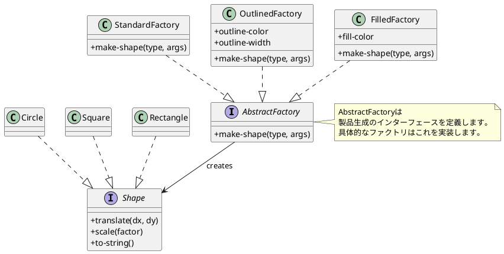
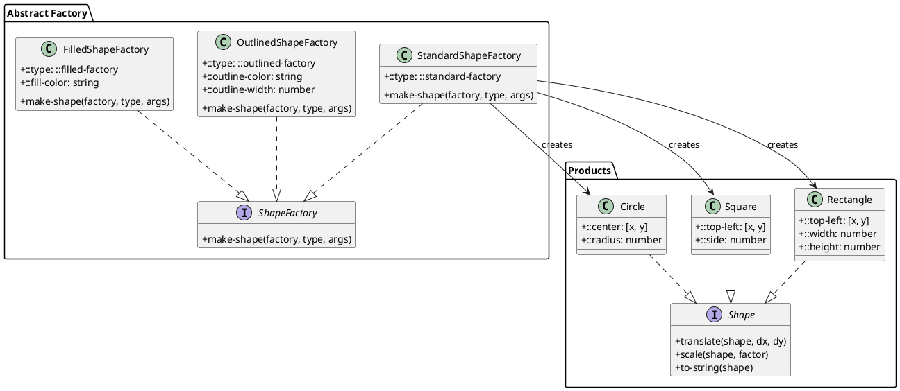
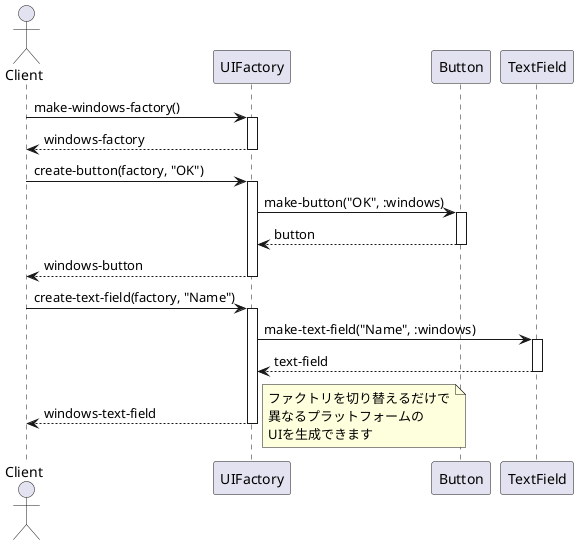
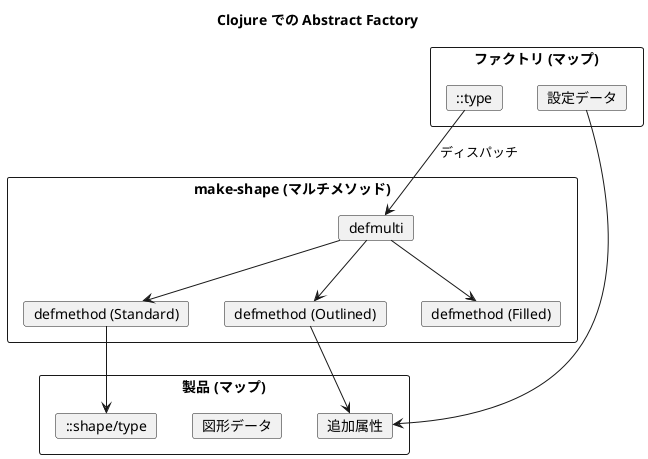

# 第13章: Abstract Factory パターン

## はじめに

Abstract Factory パターンは、関連するオブジェクトのファミリーを、その具体的なクラスを指定することなく生成するためのインターフェースを提供するパターンです。

本章では、図形ファクトリと UI ファクトリの例を通じて、マルチメソッドによる Abstract Factory パターンの実装を学びます。

## 1. パターンの構造

Abstract Factory パターンは以下の要素で構成されます：

- **AbstractFactory**: オブジェクト生成の抽象インターフェース
- **ConcreteFactory**: 具体的なオブジェクトを生成するファクトリ
- **AbstractProduct**: 生成されるオブジェクトの抽象インターフェース
- **ConcreteProduct**: 具体的な製品



## 2. Shape インターフェース

### マルチメソッドによる定義

```clojure
(ns abstract-factory.shape)

(defmulti translate
  "図形を移動する"
  (fn [shape _dx _dy] (::type shape)))

(defmulti scale
  "図形を拡大/縮小する"
  (fn [shape _factor] (::type shape)))

(defmulti to-string
  "図形を文字列に変換する"
  (fn [shape] (::type shape)))
```

### Circle の実装

```clojure
(ns abstract-factory.circle
  (:require [abstract-factory.shape :as shape]))

(defn make
  "円を作成"
  [center radius]
  {::shape/type ::circle
   ::center center
   ::radius radius})

(defmethod shape/translate ::circle [circle dx dy]
  (let [[x y] (::center circle)]
    (assoc circle ::center [(+ x dx) (+ y dy)])))

(defmethod shape/scale ::circle [circle factor]
  (let [radius (::radius circle)]
    (assoc circle ::radius (* radius factor))))

(defmethod shape/to-string ::circle [circle]
  (let [[x y] (::center circle)
        radius (::radius circle)]
    (str "Circle center: [" x ", " y "] radius: " radius)))
```

## 3. ShapeFactory インターフェース

### Abstract Factory の定義

```clojure
(ns abstract-factory.shape-factory)

(defmulti make-shape
  "図形を生成する"
  (fn [factory _type & _args] (::type factory)))
```

## 4. ConcreteFactory: StandardShapeFactory

### 実装

```clojure
(ns abstract-factory.standard-shape-factory
  (:require [abstract-factory.shape-factory :as factory]
            [abstract-factory.circle :as circle]
            [abstract-factory.square :as square]
            [abstract-factory.rectangle :as rectangle]))

(defn make
  "標準図形ファクトリを作成"
  []
  {::factory/type ::standard-factory})

(defmethod factory/make-shape ::standard-factory
  [_factory type & args]
  (case type
    :circle (apply circle/make args)
    :square (apply square/make args)
    :rectangle (apply rectangle/make args)
    (throw (ex-info (str "Unknown shape type: " type) {:type type}))))
```

### 使用例

```clojure
(require '[abstract-factory.standard-shape-factory :as standard])
(require '[abstract-factory.shape-factory :as factory])

(def factory (standard/make))

(def circle (factory/make-shape factory :circle [10 20] 5))
;; => {:abstract-factory.shape/type :abstract-factory.circle/circle,
;;     :abstract-factory.circle/center [10 20],
;;     :abstract-factory.circle/radius 5}

(def square (factory/make-shape factory :square [0 0] 10))
;; => {:abstract-factory.shape/type :abstract-factory.square/square,
;;     :abstract-factory.square/top-left [0 0],
;;     :abstract-factory.square/side 10}
```

## 5. ConcreteFactory: OutlinedShapeFactory

### 実装

```clojure
(ns abstract-factory.outlined-shape-factory
  (:require [abstract-factory.shape-factory :as factory]
            [abstract-factory.circle :as circle]
            [abstract-factory.square :as square]
            [abstract-factory.rectangle :as rectangle]))

(defn make
  "輪郭線付き図形ファクトリを作成"
  [outline-color outline-width]
  {::factory/type ::outlined-factory
   ::outline-color outline-color
   ::outline-width outline-width})

(defn- add-outline
  "図形に輪郭線情報を追加"
  [shape outline-color outline-width]
  (assoc shape
         ::outline-color outline-color
         ::outline-width outline-width))

(defmethod factory/make-shape ::outlined-factory
  [factory type & args]
  (let [outline-color (::outline-color factory)
        outline-width (::outline-width factory)
        base-shape (case type
                     :circle (apply circle/make args)
                     :square (apply square/make args)
                     :rectangle (apply rectangle/make args))]
    (add-outline base-shape outline-color outline-width)))
```

### 使用例

```clojure
(require '[abstract-factory.outlined-shape-factory :as outlined])

(def factory (outlined/make "black" 2))

(def circle (factory/make-shape factory :circle [10 20] 5))
;; 輪郭線情報が追加された円が生成される
```

## 6. ConcreteFactory: FilledShapeFactory

### 実装

```clojure
(ns abstract-factory.filled-shape-factory
  (:require [abstract-factory.shape-factory :as factory]
            [abstract-factory.circle :as circle]
            [abstract-factory.square :as square]
            [abstract-factory.rectangle :as rectangle]))

(defn make
  "塗りつぶし付き図形ファクトリを作成"
  [fill-color]
  {::factory/type ::filled-factory
   ::fill-color fill-color})

(defmethod factory/make-shape ::filled-factory
  [factory type & args]
  (let [fill-color (::fill-color factory)
        base-shape (case type
                     :circle (apply circle/make args)
                     :square (apply square/make args)
                     :rectangle (apply rectangle/make args))]
    (assoc base-shape ::fill-color fill-color)))
```

## 7. クラス図



## 8. UI ファクトリの例

### プラットフォーム別 UI 生成

```clojure
(ns abstract-factory.ui-factory)

;; Abstract Factory インターフェース
(defmulti create-button
  (fn [factory _label] (::factory-type factory)))

(defmulti create-text-field
  (fn [factory _placeholder] (::factory-type factory)))

(defmulti create-checkbox
  (fn [factory _label _checked?] (::factory-type factory)))

;; WindowsUIFactory
(defn make-windows-factory []
  {::factory-type ::windows})

(defmethod create-button ::windows [_factory label]
  (make-button label :windows))

;; MacOSUIFactory
(defn make-macos-factory []
  {::factory-type ::macos})

(defmethod create-button ::macos [_factory label]
  (make-button label :macos))
```

### シーケンス図



### 使用例

```clojure
(require '[abstract-factory.ui-factory :as ui])

;; ファクトリの交換で異なるUIを生成
(defn create-form [factory]
  {:button (ui/create-button factory "Submit")
   :field (ui/create-text-field factory "Email")
   :checkbox (ui/create-checkbox factory "Subscribe" false)})

(def windows-form (create-form (ui/make-windows-factory)))
(def macos-form (create-form (ui/make-macos-factory)))

(ui/render (:button windows-form))
;; => "[Submit]"

(ui/render (:button macos-form))
;; => "(Submit)"
```

## 9. パターンの利点

1. **製品のファミリー一貫性**: 関連する製品が一貫して生成される
2. **具体クラスの分離**: クライアントは具体的な製品クラスを知らない
3. **製品ファミリーの交換**: ファクトリを交換するだけで製品群全体を変更可能
4. **新しい製品ファミリーの追加が容易**: 新しい ConcreteFactory を追加するだけ

## 10. 関数型プログラミングでの特徴

Clojure での Abstract Factory パターンの実装には以下の特徴があります：

1. **マルチメソッド**: ファクトリの型に基づいたディスパッチ
2. **マップベースのファクトリ**: ファクトリは設定を含むマップとして表現
3. **純粋関数**: ファクトリメソッドは副作用のない純粋関数
4. **データとしての製品**: 製品は単なるマップデータ



## まとめ

本章では、Abstract Factory パターンについて学びました：

1. **ファクトリインターフェース**: マルチメソッドによる抽象化
2. **複数のファクトリ実装**: Standard、Outlined、Filled
3. **UI ファクトリ**: プラットフォーム別の UI 生成
4. **ファクトリの交換**: 同じコードで異なる製品群を生成

Abstract Factory パターンは、関連するオブジェクトのファミリーを一貫して生成する必要がある場面で有効です。

## 参考コード

本章のコード例は以下のファイルで確認できます：

- ソースコード: `app/clojure/part5/src/abstract_factory/`
- テストコード: `app/clojure/part5/spec/abstract_factory/`

## 次章予告

次章では、**Abstract Server パターン**について学びます。依存関係の逆転を実現し、モジュール間の疎結合を達成する方法を探ります。
