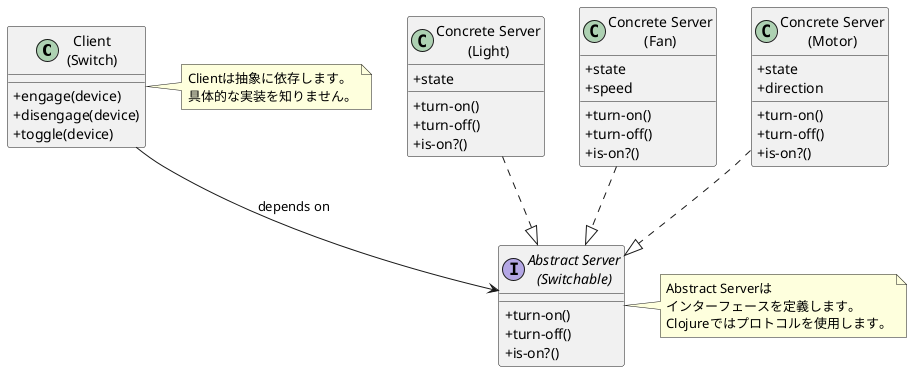
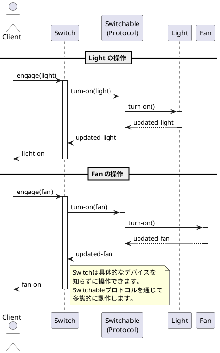
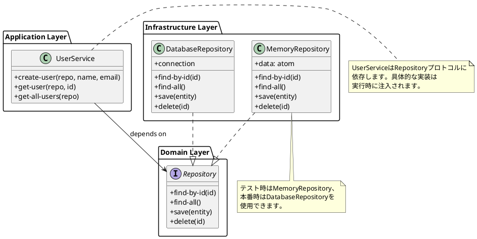
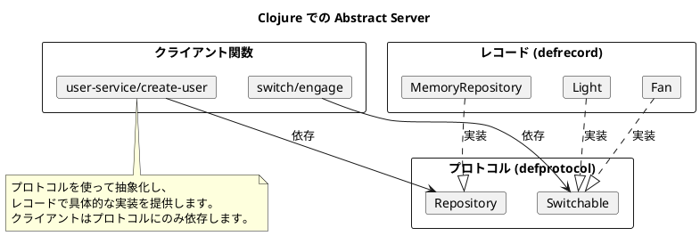

# 第14章: Abstract Server パターン

## はじめに

Abstract Server パターンは、依存関係逆転の原則（DIP）を実現するパターンです。高レベルモジュールが低レベルモジュールの詳細に依存するのではなく、両者が抽象に依存することで疎結合を実現します。

本章では、スイッチとデバイス、リポジトリとサービスの例を通じて、プロトコルによる Abstract Server パターンの実装を学びます。

## 1. パターンの構造

Abstract Server パターンは以下の要素で構成されます：

- **Client**: サービスを利用するモジュール
- **Abstract Server**: サービスの抽象インターフェース
- **Concrete Server**: 具体的なサービスの実装



## 2. Switchable プロトコル

### Abstract Server の定義

```clojure
(ns abstract-server.switchable)

(defprotocol Switchable
  "スイッチ可能なデバイスのインターフェース"
  (turn-on [this] "デバイスをオンにする")
  (turn-off [this] "デバイスをオフにする")
  (is-on? [this] "デバイスがオンかどうかを確認する"))
```

## 3. Concrete Server: Light

### 実装

```clojure
(ns abstract-server.light
  (:require [abstract-server.switchable :as switchable]))

(defrecord Light [state]
  switchable/Switchable
  (turn-on [this]
    (assoc this :state :on))
  (turn-off [this]
    (assoc this :state :off))
  (is-on? [this]
    (= (:state this) :on)))

(defn make
  "照明を作成（初期状態: オフ）"
  []
  (->Light :off))

(defn make-on
  "オン状態の照明を作成"
  []
  (->Light :on))
```

## 4. Concrete Server: Fan

### 実装

```clojure
(ns abstract-server.fan
  (:require [abstract-server.switchable :as switchable]))

(defrecord Fan [state speed]
  switchable/Switchable
  (turn-on [this]
    (assoc this :state :on :speed (or speed :low)))
  (turn-off [this]
    (assoc this :state :off :speed nil))
  (is-on? [this]
    (= (:state this) :on)))

(defn make []
  (->Fan :off nil))

(defn set-speed [fan speed]
  (if (switchable/is-on? fan)
    (assoc fan :speed speed)
    fan))
```

## 5. Concrete Server: Motor

### 実装

```clojure
(ns abstract-server.motor
  (:require [abstract-server.switchable :as switchable]))

(defrecord Motor [state direction]
  switchable/Switchable
  (turn-on [this]
    (assoc this :state :on :direction (or direction :forward)))
  (turn-off [this]
    (assoc this :state :off))
  (is-on? [this]
    (= (:state this) :on)))

(defn make []
  (->Motor :off nil))

(defn reverse-direction [motor]
  (if (switchable/is-on? motor)
    (let [current (:direction motor)]
      (assoc motor :direction (if (= current :forward) :reverse :forward)))
    motor))
```

## 6. Client: Switch

### 実装

```clojure
(ns abstract-server.switch
  (:require [abstract-server.switchable :as switchable]))

(defn engage
  "スイッチを入れる（デバイスをオンにする）"
  [device]
  (switchable/turn-on device))

(defn disengage
  "スイッチを切る（デバイスをオフにする）"
  [device]
  (switchable/turn-off device))

(defn toggle
  "スイッチを切り替える"
  [device]
  (if (switchable/is-on? device)
    (switchable/turn-off device)
    (switchable/turn-on device)))

(defn status
  "デバイスの状態を取得"
  [device]
  (if (switchable/is-on? device)
    :on
    :off))
```

### 使用例

```clojure
(require '[abstract-server.switch :as sw])
(require '[abstract-server.light :as light])
(require '[abstract-server.fan :as fan])
(require '[abstract-server.motor :as motor])

;; 同じSwitchコードで異なるデバイスを操作
(def l (sw/engage (light/make)))
(sw/status l) ;; => :on

(def f (sw/engage (fan/make)))
(sw/status f) ;; => :on

(def m (sw/engage (motor/make)))
(sw/status m) ;; => :on
```

## 7. シーケンス図



## 8. Repository の例

### Abstract Server: Repository プロトコル

```clojure
(ns abstract-server.repository)

(defprotocol Repository
  "データリポジトリのインターフェース"
  (find-by-id [this id] "IDでエンティティを取得")
  (find-all [this] "全てのエンティティを取得")
  (save [this entity] "エンティティを保存")
  (delete [this id] "エンティティを削除"))
```

### Concrete Server: MemoryRepository

```clojure
(ns abstract-server.memory-repository
  (:require [abstract-server.repository :as repo]))

(defrecord MemoryRepository [data]
  repo/Repository
  (find-by-id [this id]
    (get @(:data this) id))
  (find-all [this]
    (vals @(:data this)))
  (save [this entity]
    (let [id (or (:id entity) (str (java.util.UUID/randomUUID)))
          entity-with-id (assoc entity :id id)]
      (swap! (:data this) assoc id entity-with-id)
      entity-with-id))
  (delete [this id]
    (let [entity (get @(:data this) id)]
      (swap! (:data this) dissoc id)
      entity)))

(defn make []
  (->MemoryRepository (atom {})))
```

### Client: UserService

```clojure
(ns abstract-server.user-service
  (:require [abstract-server.repository :as repo]))

(defn create-user [repository name email]
  (let [user {:name name
              :email email
              :created-at (java.util.Date.)}]
    (repo/save repository user)))

(defn get-user [repository id]
  (repo/find-by-id repository id))

(defn get-all-users [repository]
  (repo/find-all repository))
```

## 9. 依存関係の図



## 10. パターンの利点

1. **疎結合**: クライアントは具体的な実装を知らない
2. **テスト容易性**: モック/スタブを簡単に注入可能
3. **柔軟性**: 実装の交換が容易
4. **依存関係逆転**: 高レベルモジュールが低レベルモジュールに依存しない

## 11. 関数型プログラミングでの特徴

Clojure での Abstract Server パターンの実装には以下の特徴があります：

1. **プロトコル**: インターフェースを定義
2. **レコード**: プロトコルを実装するデータ型
3. **イミュータブル**: 状態変更は新しいレコードを返す
4. **依存性注入**: 関数の引数としてリポジトリを渡す



## まとめ

本章では、Abstract Server パターンについて学びました：

1. **プロトコルによる抽象化**: Switchable、Repository
2. **レコードによる実装**: Light、Fan、Motor、MemoryRepository
3. **クライアントの独立性**: Switch、UserService
4. **依存関係逆転**: 高レベルモジュールが抽象に依存

Abstract Server パターンは、モジュール間の疎結合を実現し、テスト容易性と柔軟性を向上させます。

## 参考コード

本章のコード例は以下のファイルで確認できます：

- ソースコード: `app/clojure/part5/src/abstract_server/`
- テストコード: `app/clojure/part5/spec/abstract_server/`

## 第5部のまとめ

第5部では、生成パターンについて学びました：

- **Abstract Factory パターン**: 関連するオブジェクトのファミリーを一貫して生成
- **Abstract Server パターン**: 依存関係逆転による疎結合の実現

これらのパターンは、モジュールの独立性を高め、テスト容易性と保守性を向上させます。
