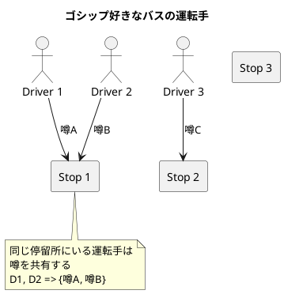
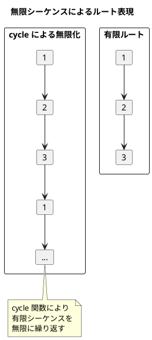
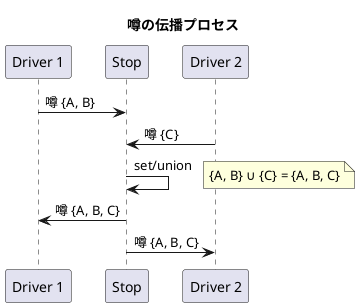
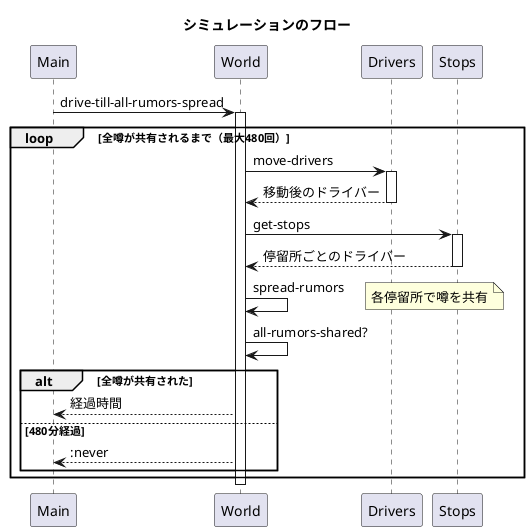

# 第15章: ゴシップ好きなバスの運転手

## はじめに

本章では、「ゴシップ好きなバスの運転手」という問題を通じて、関数型プログラミングの実践的なアプローチを学びます。この問題は、バス運転手が停留所で出会ったときに噂を共有するというシミュレーションです。

この問題を通じて以下の概念を学びます：

- 無限シーケンス（`cycle`）による循環データの表現
- 集合演算による状態の伝播
- データ変換パイプラインの設計

## 1. 問題の説明

複数のバス運転手がそれぞれのルートを巡回しています。各運転手は最初に1つ以上の噂を知っています。同じ停留所に複数の運転手がいると、彼らは知っている噂をすべて共有します。

**ゴール**: 全ての運転手が全ての噂を知るまでに何分かかるか？



## 2. データモデル

### ドライバーの表現

```clojure
(defn make-driver
  "ドライバーを作成する
   name - ドライバーの名前
   route - 停留所のシーケンス
   rumors - 知っている噂の集合"
  [name route rumors]
  {:name name
   :route (cycle route)  ; 無限シーケンスで循環ルート
   :rumors rumors})
```

ポイント:
- `cycle` 関数で有限のルートを無限の循環シーケンスに変換
- 噂は集合（set）として管理

### 無限シーケンスの活用

```clojure
;; ルート [1 2 3] は無限に繰り返される
(take 10 (cycle [1 2 3]))
;; => (1 2 3 1 2 3 1 2 3 1)
```



## 3. 移動と噂の伝播

### ドライバーの移動

```clojure
(defn current-stop
  "ドライバーの現在の停留所を取得"
  [driver]
  (first (:route driver)))

(defn move-driver
  "ドライバーを次の停留所に移動"
  [driver]
  (update driver :route rest))

(defn move-drivers
  "全ドライバーを次の停留所に移動"
  [world]
  (map move-driver world))
```

### 停留所ごとのドライバー集計

```clojure
(defn get-stops
  "各停留所にいるドライバーをマップとして取得
   {停留所番号 => [ドライバー1, ドライバー2, ...]}"
  [world]
  (loop [world world
         stops {}]
    (if (empty? world)
      stops
      (let [driver (first world)
            stop (current-stop driver)
            stops (update stops stop conj driver)]
        (recur (rest world) stops)))))
```

### 噂の共有

```clojure
(defn merge-rumors
  "同じ停留所にいるドライバー間で噂を共有
   全員の噂を統合し、各ドライバーに設定"
  [drivers]
  (let [rumors (map :rumors drivers)
        all-rumors (apply set/union rumors)]
    (map #(assoc % :rumors all-rumors) drivers)))

(defn spread-rumors
  "全停留所で噂を伝播"
  [world]
  (let [stops-with-drivers (get-stops world)
        drivers-by-stop (vals stops-with-drivers)]
    (flatten (map merge-rumors drivers-by-stop))))
```



## 4. シミュレーション

### 1ステップの処理

```clojure
(defn drive
  "1ステップ分のシミュレーション
   1. 全ドライバーを移動
   2. 同じ停留所にいるドライバー間で噂を共有"
  [world]
  (-> world
      move-drivers
      spread-rumors))
```

### 完了判定

```clojure
(defn all-rumors-shared?
  "全ドライバーが同じ噂を持っているか確認"
  [world]
  (apply = (map :rumors world)))

(defn drive-till-all-rumors-spread
  "全ての噂が共有されるまでシミュレーション
   480分（8時間）以内に共有されなければ :never を返す"
  [world]
  (loop [world (drive world)
         time 1]
    (cond
      (> time 480) :never
      (all-rumors-shared? world) time
      :else (recur (drive world) (inc time)))))
```

## 5. シーケンス図



## 6. 使用例

```clojure
(require '[gossiping-bus-drivers.core :as gbd])

;; 3人のドライバーを作成
(def world
  [(gbd/make-driver "D1" [3 1 2 3] #{:rumor-a})
   (gbd/make-driver "D2" [3 2 3 1] #{:rumor-b})
   (gbd/make-driver "D3" [4 2 3 4 5] #{:rumor-c})])

;; シミュレーション実行
(gbd/drive-till-all-rumors-spread world)
;; => 5 (5分で全噂が共有される)

;; 絶対に出会わないルートの場合
(def never-meet
  [(gbd/make-driver "D1" [1] #{:rumor-a})
   (gbd/make-driver "D2" [2] #{:rumor-b})])

(gbd/drive-till-all-rumors-spread never-meet)
;; => :never
```

## 7. 関数型アプローチの特徴

### 不変データ構造

すべての状態変更は新しいデータ構造を返します。元のデータは変更されません。

```clojure
;; ドライバーを移動しても元のドライバーは変更されない
(def original (gbd/make-driver "Test" [1 2 3] #{:a}))
(def moved (gbd/move-driver original))

(gbd/current-stop original) ;; => 1 (変更なし)
(gbd/current-stop moved)    ;; => 2
```

### 遅延評価

`cycle` による無限シーケンスは遅延評価されるため、メモリを効率的に使用できます。

### 純粋関数

すべての関数は副作用がなく、同じ入力に対して常に同じ出力を返します。これによりテストが容易になります。

## 8. パターンの応用

このパターンは以下のような場面で応用できます：

- **ネットワーク伝播**: ウイルスや情報の拡散シミュレーション
- **グラフ探索**: 巡回セールスマン問題の変形
- **状態同期**: 分散システムでの状態共有

## まとめ

本章では、ゴシップ好きなバスの運転手問題を通じて以下を学びました：

1. **無限シーケンス**: `cycle` による循環データの表現
2. **集合演算**: `set/union` による状態の統合
3. **データ変換パイプライン**: `->` マクロによる処理の連鎖
4. **終了条件の設計**: ループと条件分岐の組み合わせ

## 参考コード

本章のコード例は以下のファイルで確認できます：

- ソースコード: `app/clojure/part6/src/gossiping_bus_drivers/`
- テストコード: `app/clojure/part6/spec/gossiping_bus_drivers/`
