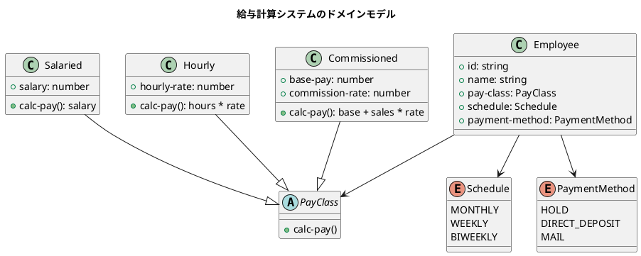
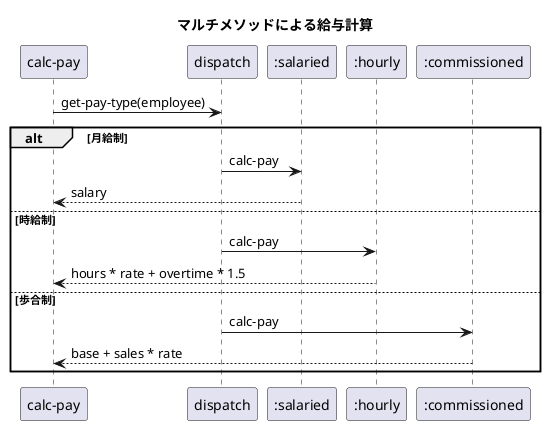

# 第16章: 給与計算システム

## はじめに

本章では、給与計算システムを題材に、関数型プログラミングにおけるドメインモデリングとマルチメソッドによる多態性の実現を学びます。

この問題を通じて以下の概念を学びます：

- Clojure Spec によるデータ仕様定義
- マルチメソッドによる給与タイプ別の計算
- 支払いスケジュールのモデリング

## 1. ドメインモデル

### 従業員の給与タイプ

給与計算システムでは、以下の3種類の給与タイプをサポートします：

- **月給制（Salaried）**: 固定月給
- **時給制（Hourly）**: 労働時間に基づく給与
- **歩合制（Commissioned）**: 基本給 + 売上に応じたコミッション



## 2. Clojure Spec による仕様定義

### 従業員の仕様

```clojure
(ns payroll.employee
  (:require [clojure.spec.alpha :as s]))

;; 基本属性
(s/def ::id string?)
(s/def ::name string?)
(s/def ::address string?)

;; 給与分類
(s/def ::salary number?)
(s/def ::hourly-rate number?)
(s/def ::base-pay number?)
(s/def ::commission-rate number?)

(s/def ::pay-class
  (s/or :salaried (s/tuple #{:salaried} ::salary)
        :hourly (s/tuple #{:hourly} ::hourly-rate)
        :commissioned (s/tuple #{:commissioned} ::base-pay ::commission-rate)))

;; 支払いスケジュール
(s/def ::schedule #{:monthly :weekly :biweekly})

;; 支払い方法
(s/def ::payment-method #{:hold :direct-deposit :mail})

;; 従業員
(s/def ::employee
  (s/keys :req [::id ::name ::pay-class ::schedule ::payment-method]
          :opt [::address]))
```

### コンストラクタ

```clojure
(defn make-salaried-employee
  "月給制従業員を作成"
  [id name salary]
  {::id id
   ::name name
   ::pay-class [:salaried salary]
   ::schedule :monthly
   ::payment-method :hold})

(defn make-hourly-employee
  "時給制従業員を作成"
  [id name hourly-rate]
  {::id id
   ::name name
   ::pay-class [:hourly hourly-rate]
   ::schedule :weekly
   ::payment-method :hold})

(defn make-commissioned-employee
  "歩合制従業員を作成"
  [id name base-pay commission-rate]
  {::id id
   ::name name
   ::pay-class [:commissioned base-pay commission-rate]
   ::schedule :biweekly
   ::payment-method :hold})
```

## 3. マルチメソッドによる給与計算

### 給与計算のディスパッチ

```clojure
(ns payroll.classification
  (:require [payroll.employee :as emp]))

(defmulti calc-pay
  "給与を計算する
   給与タイプに応じて異なる計算ロジックを適用"
  (fn [employee _context] (emp/get-pay-type employee)))
```

### 月給制

```clojure
(defmethod calc-pay :salaried
  [employee _context]
  (let [[_ salary] (emp/get-pay-class employee)]
    salary))
```

### 時給制

```clojure
(defmethod calc-pay :hourly
  [employee context]
  (let [[_ hourly-rate] (emp/get-pay-class employee)
        time-cards (get-in context [:time-cards (emp/get-id employee)] [])
        hours (map second time-cards)
        total-hours (reduce + 0 hours)
        ;; 週40時間を超える分は1.5倍
        regular-hours (min total-hours 40)
        overtime-hours (max 0 (- total-hours 40))]
    (+ (* regular-hours hourly-rate)
       (* overtime-hours hourly-rate 1.5))))
```

### 歩合制

```clojure
(defmethod calc-pay :commissioned
  [employee context]
  (let [[_ base-pay commission-rate] (emp/get-pay-class employee)
        sales-receipts (get-in context [:sales-receipts (emp/get-id employee)] [])
        total-sales (reduce + 0 (map second sales-receipts))]
    (+ base-pay (* total-sales commission-rate))))
```



## 4. 支払いスケジュール

### スケジュール判定

```clojure
(ns payroll.schedule
  (:require [payroll.employee :as emp]))

(defmulti is-pay-day?
  "指定日が支払日かどうかを判定"
  (fn [employee _date] (emp/get-schedule employee)))

;; 月次（月末）
(defmethod is-pay-day? :monthly
  [_employee date]
  (= (:day date) (last-day-of-month date)))

;; 週次（金曜日）
(defmethod is-pay-day? :weekly
  [_employee date]
  (= (:day-of-week date) :friday))

;; 隔週（隔週の金曜日）
(defmethod is-pay-day? :biweekly
  [_employee date]
  (and (= (:day-of-week date) :friday)
       (:is-pay-week date)))
```

## 5. 支払い処理

### 支払い方法によるディスパッチ

```clojure
(ns payroll.payroll
  (:require [payroll.employee :as emp]
            [payroll.classification :as class]
            [payroll.schedule :as sched]))

(defmulti process-payment
  "支払いを処理"
  (fn [employee _amount] (emp/get-payment-method employee)))

(defmethod process-payment :hold
  [employee amount]
  {:type :hold
   :employee-id (emp/get-id employee)
   :amount amount
   :message "支払いを保留"})

(defmethod process-payment :direct-deposit
  [employee amount]
  {:type :direct-deposit
   :employee-id (emp/get-id employee)
   :amount amount
   :message "口座に振り込み"})

(defmethod process-payment :mail
  [employee amount]
  {:type :mail
   :employee-id (emp/get-id employee)
   :amount amount
   :message "小切手を郵送"})
```

## 6. 給与支払いの実行

```clojure
(defn run-payroll
  "給与支払いを実行
   支払日に該当する従業員にのみ支払いを行う"
  [employees context date]
  (let [payable-employees (filter #(sched/is-pay-day? % date) employees)]
    (for [emp payable-employees
          :let [pay (class/calc-pay emp context)]]
      (process-payment emp pay))))
```

```plantuml
@startuml
title 給与支払いフロー

start
:従業員リストを取得;

:支払日の従業員をフィルタ;
note right: is-pay-day? でチェック

while (支払対象の従業員がある?) is (yes)
  :給与を計算;
  note right: calc-pay で計算

  :支払いを処理;
  note right: process-payment で
  支払い方法に応じた処理

endwhile (no)

:支払い結果を返す;
stop
@enduml
```

## 7. 使用例

```clojure
(require '[payroll.employee :as emp])
(require '[payroll.classification :as class])
(require '[payroll.schedule :as sched])
(require '[payroll.payroll :as payroll])

;; 従業員の作成
(def salaried-emp
  (emp/make-salaried-employee "E001" "田中太郎" 500000))

(def hourly-emp
  (emp/make-hourly-employee "E002" "佐藤花子" 1500))

(def commissioned-emp
  (emp/make-commissioned-employee "E003" "鈴木一郎" 200000 0.1))

;; コンテキストの作成（タイムカード、売上データ）
(def ctx
  (-> (class/make-context)
      (class/add-time-card "E002" "2024-01-15" 8)
      (class/add-time-card "E002" "2024-01-16" 10)
      (class/add-sales-receipt "E003" "2024-01-15" 100000)
      (class/add-sales-receipt "E003" "2024-01-16" 50000)))

;; 給与計算
(class/calc-pay salaried-emp ctx)     ;; => 500000
(class/calc-pay hourly-emp ctx)       ;; => 27000.0 (18時間 * 1500)
(class/calc-pay commissioned-emp ctx) ;; => 215000.0 (200000 + 15000)
```

## 8. 関数型アプローチの利点

### 1. テスト容易性

純粋関数であるため、テストが簡単です。

```clojure
(describe "給与計算 - 時給制"
  (it "残業時間は1.5倍で計算"
    (let [e (emp/make-hourly-employee "E002" "佐藤" 1000)
          ctx (class/add-time-card {} "E002" "2024-01-15" 45)]
      ;; 40 * 1000 + 5 * 1000 * 1.5 = 47500
      (should= 47500.0 (class/calc-pay e ctx)))))
```

### 2. 拡張容易性

新しい給与タイプの追加は、新しいメソッドを定義するだけです。

```clojure
;; 新しい給与タイプ: 契約制
(defmethod calc-pay :contract
  [employee context]
  (let [[_ contract-amount] (emp/get-pay-class employee)]
    contract-amount))
```

### 3. 関心の分離

- **employee**: データ構造とアクセサ
- **classification**: 給与計算ロジック
- **schedule**: 支払日判定
- **payroll**: 統合処理

## まとめ

本章では、給与計算システムを通じて以下を学びました：

1. **Clojure Spec**: データ仕様の定義
2. **マルチメソッド**: 給与タイプによるディスパッチ
3. **関心の分離**: モジュール化された設計
4. **純粋関数**: テスト容易な実装

## 参考コード

本章のコード例は以下のファイルで確認できます：

- ソースコード: `app/clojure/part6/src/payroll/`
- テストコード: `app/clojure/part6/spec/payroll/`
