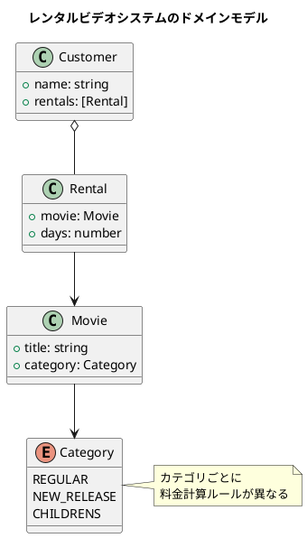
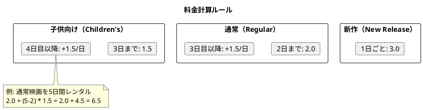
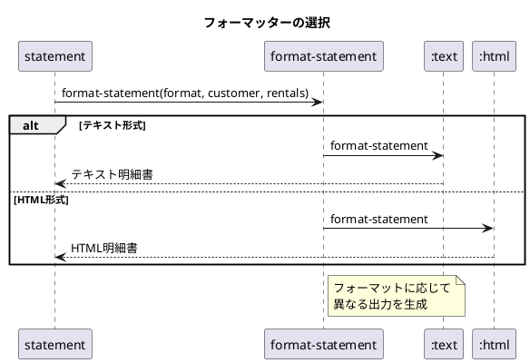
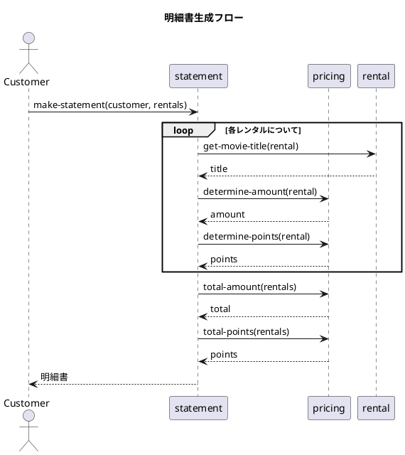

# 第17章: レンタルビデオシステム

## はじめに

本章では、Martin Fowler の「リファクタリング」で有名なレンタルビデオシステムを題材に、関数型プログラミングによる料金計算ロジックの設計を学びます。

この問題を通じて以下の概念を学びます：

- マルチメソッドによるポリシーパターン
- 明細書フォーマッターの実装
- データと処理の分離

## 1. ドメインモデル

### 映画のカテゴリ

レンタルビデオシステムでは、以下の3種類の映画カテゴリをサポートします：

- **通常（Regular）**: 2日まで2.0、以降1日ごとに1.5追加
- **新作（New Release）**: 1日ごとに3.0
- **子供向け（Children's）**: 3日まで1.5、以降1日ごとに1.5追加



## 2. 映画とレンタルのモデル

### 映画

```clojure
(ns video-rental.movie)

(def categories
  #{:regular :new-release :childrens})

(defn make-movie
  "映画を作成"
  [title category]
  {:title title
   :category category})

(defn make-regular [title]
  (make-movie title :regular))

(defn make-new-release [title]
  (make-movie title :new-release))

(defn make-childrens [title]
  (make-movie title :childrens))
```

### レンタル

```clojure
(ns video-rental.rental
  (:require [video-rental.movie :as movie]))

(defn make-rental
  "レンタルを作成"
  [movie days]
  {:movie movie
   :days days})

(defn get-movie [rental]
  (:movie rental))

(defn get-days [rental]
  (:days rental))

(defn get-movie-category [rental]
  (movie/get-category (:movie rental)))
```

## 3. 料金計算のマルチメソッド

### 料金計算

```clojure
(ns video-rental.pricing
  (:require [video-rental.rental :as rental]))

(defmulti determine-amount
  "レンタル料金を計算"
  (fn [r] (rental/get-movie-category r)))

;; 通常映画: 2日まで2.0、以降1日ごとに1.5追加
(defmethod determine-amount :regular
  [r]
  (let [days (rental/get-days r)]
    (if (> days 2)
      (+ 2.0 (* (- days 2) 1.5))
      2.0)))

;; 新作: 1日ごとに3.0
(defmethod determine-amount :new-release
  [r]
  (* (rental/get-days r) 3.0))

;; 子供向け: 3日まで1.5、以降1日ごとに1.5追加
(defmethod determine-amount :childrens
  [r]
  (let [days (rental/get-days r)]
    (if (> days 3)
      (+ 1.5 (* (- days 3) 1.5))
      1.5)))
```



### ポイント計算

```clojure
(defmulti determine-points
  "レンタルポイントを計算"
  (fn [r] (rental/get-movie-category r)))

;; 通常映画: 1ポイント
(defmethod determine-points :regular
  [_r]
  1)

;; 新作: 2日以上で2ポイント、それ以外は1ポイント
(defmethod determine-points :new-release
  [r]
  (if (> (rental/get-days r) 1)
    2
    1))

;; 子供向け: 1ポイント
(defmethod determine-points :childrens
  [_r]
  1)
```

## 4. 明細書フォーマッター

### マルチメソッドによるフォーマット

```clojure
(ns video-rental.statement
  (:require [video-rental.rental :as rental]
            [video-rental.pricing :as pricing]))

(defmulti format-statement
  "明細書をフォーマット"
  (fn [format _customer _rentals] format))

;; テキスト形式
(defmethod format-statement :text
  [_ customer rentals]
  (let [header (str "Rental Record for " customer "\n")
        lines (map (fn [r]
                     (str "\t" (rental/get-movie-title r)
                          "\t" (pricing/determine-amount r) "\n"))
                   rentals)
        total (pricing/total-amount rentals)
        points (pricing/total-points rentals)
        footer (str "Amount owed is " total "\n"
                    "You earned " points " frequent renter points")]
    (str header (apply str lines) footer)))

;; HTML形式
(defmethod format-statement :html
  [_ customer rentals]
  (let [header (str "<h1>Rental Record for <em>" customer "</em></h1>\n<ul>\n")
        lines (map (fn [r]
                     (str "  <li>" (rental/get-movie-title r)
                          " - " (pricing/determine-amount r) "</li>\n"))
                   rentals)
        total (pricing/total-amount rentals)
        points (pricing/total-points rentals)
        footer (str "</ul>\n"
                    "<p>Amount owed is <strong>" total "</strong></p>\n"
                    "<p>You earned <strong>" points "</strong> frequent renter points</p>")]
    (str header (apply str lines) footer)))
```



## 5. 明細データの生成

フォーマットに依存しないデータ構造を生成することで、テストや他の用途に活用できます。

```clojure
(defn statement-data
  "明細データを生成（フォーマット非依存）"
  [customer rentals]
  {:customer customer
   :rentals (map (fn [r]
                   {:title (rental/get-movie-title r)
                    :days (rental/get-days r)
                    :amount (pricing/determine-amount r)
                    :points (pricing/determine-points r)})
                 rentals)
   :total-amount (pricing/total-amount rentals)
   :total-points (pricing/total-points rentals)})
```

## 6. シーケンス図



## 7. 使用例

```clojure
(require '[video-rental.movie :as movie])
(require '[video-rental.rental :as rental])
(require '[video-rental.pricing :as pricing])
(require '[video-rental.statement :as stmt])

;; 映画の作成
(def inception (movie/make-regular "Inception"))
(def frozen (movie/make-childrens "Frozen"))
(def new-movie (movie/make-new-release "New Movie"))

;; レンタルの作成
(def rentals
  [(rental/make-rental inception 3)
   (rental/make-rental frozen 4)
   (rental/make-rental new-movie 2)])

;; 料金計算
(pricing/determine-amount (first rentals)) ;; => 3.5
(pricing/total-amount rentals)              ;; => 12.5
(pricing/total-points rentals)              ;; => 4

;; テキスト明細書
(println (stmt/make-statement "John" rentals))
;; Rental Record for John
;;   Inception  3.5
;;   Frozen     3.0
;;   New Movie  6.0
;; Amount owed is 12.5
;; You earned 4 frequent renter points

;; HTML明細書
(println (stmt/make-statement :html "John" rentals))
;; <h1>Rental Record for <em>John</em></h1>
;; <ul>
;;   <li>Inception - 3.5</li>
;;   <li>Frozen - 3.0</li>
;;   <li>New Movie - 6.0</li>
;; </ul>
;; <p>Amount owed is <strong>12.5</strong></p>
;; <p>You earned <strong>4</strong> frequent renter points</p>
```

## 8. リファクタリングのポイント

### オブジェクト指向版との比較

オブジェクト指向版では、`Movie` クラスに `getCharge()` メソッドを持たせることが多いですが、関数型では：

1. **データと処理の分離**: 映画はデータのみ、料金計算は別の関数
2. **マルチメソッド**: カテゴリに応じたディスパッチ
3. **オープン・クローズド原則**: 新しいカテゴリ追加時も既存コード変更不要

```plantuml
@startuml
title OOP vs FP アプローチ

rectangle "OOP" {
  class "Movie" as oop_movie {
    +getCharge(days)
    +getPoints(days)
  }

  class "RegularMovie" as oop_regular
  class "NewReleaseMovie" as oop_new
  class "ChildrensMovie" as oop_child

  oop_regular --|> oop_movie
  oop_new --|> oop_movie
  oop_child --|> oop_movie
}

rectangle "FP" {
  card "movie (data)" as fp_movie
  card "determine-amount (multimethod)" as fp_amount
  card ":regular impl" as fp_reg
  card ":new-release impl" as fp_new
  card ":childrens impl" as fp_child

  fp_amount --> fp_reg
  fp_amount --> fp_new
  fp_amount --> fp_child
  fp_amount ..> fp_movie : uses
}

note bottom of oop_movie
  クラス継承による
  ポリモーフィズム
end note

note bottom of fp_amount
  マルチメソッドによる
  ディスパッチ
end note
@enduml
```

## 9. 拡張性

### 新しいカテゴリの追加

```clojure
;; 新しいカテゴリ: プレミアム
(defmethod pricing/determine-amount :premium
  [r]
  (* (rental/get-days r) 5.0))

(defmethod pricing/determine-points :premium
  [r]
  (rental/get-days r))  ; 日数分のポイント
```

### 新しいフォーマットの追加

```clojure
;; JSON形式
(defmethod stmt/format-statement :json
  [_ customer rentals]
  (json/write-str (stmt/statement-data customer rentals)))
```

## まとめ

本章では、レンタルビデオシステムを通じて以下を学びました：

1. **マルチメソッド**: カテゴリによる料金計算のディスパッチ
2. **データと処理の分離**: 映画データと計算ロジックの分離
3. **フォーマッターパターン**: 複数の出力形式への対応
4. **拡張性**: 新しいカテゴリやフォーマットの追加が容易

## 参考コード

本章のコード例は以下のファイルで確認できます：

- ソースコード: `app/clojure/part6/src/video_rental/`
- テストコード: `app/clojure/part6/spec/video_rental/`
