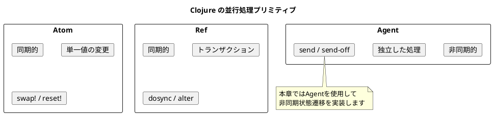
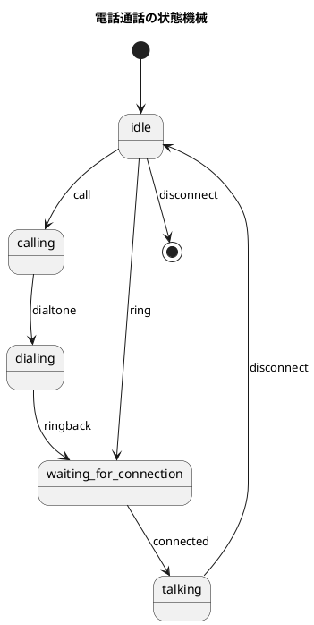
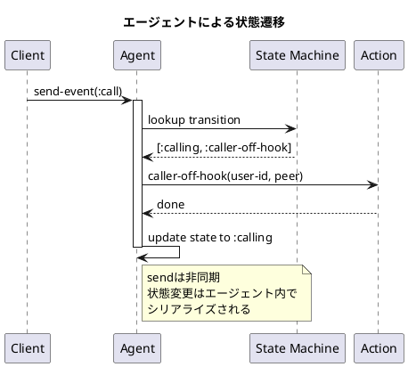
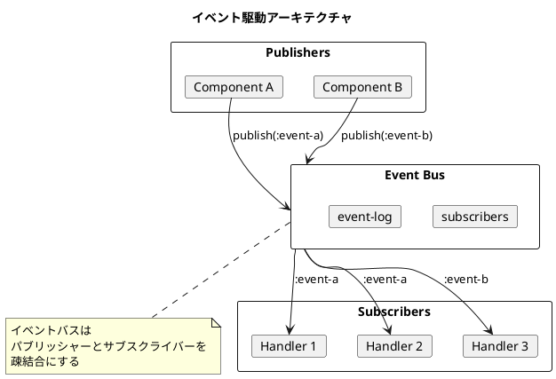
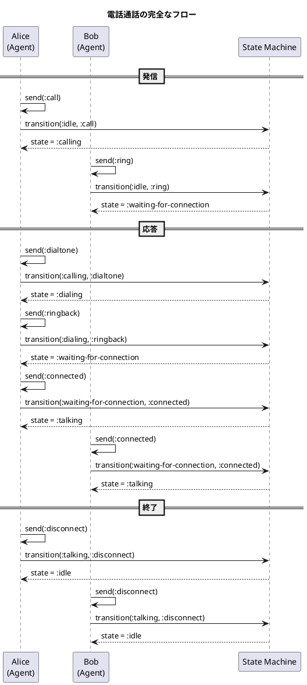

# 第18章: 並行処理システム

## はじめに

本章では、Clojure のエージェントを使った並行処理システムを学びます。電話通話システムを状態機械パターンで実装し、イベント駆動アーキテクチャの基礎を理解します。

この問題を通じて以下の概念を学びます：

- Clojure エージェントによる非同期状態管理
- 状態機械パターンの実装
- イベント駆動アーキテクチャ

## 1. Clojure の並行処理モデル

Clojure は複数の並行処理プリミティブを提供します：

| プリミティブ | 特徴 | 用途 |
|------------|------|------|
| Atom | 同期的、単一値 | 簡単な状態管理 |
| Ref | 同期的、トランザクション | 協調的な変更 |
| Agent | 非同期的 | 独立した状態変更 |



## 2. 状態機械パターン

### 電話通話の状態遷移



### 状態機械の定義

```clojure
(ns concurrency.state-machine)

(def user-sm
  "ユーザー状態機械の定義
   {現在の状態 {イベント [次の状態 アクション]}}"
  {:idle {:call [:calling :caller-off-hook]
          :ring [:waiting-for-connection :callee-off-hook]
          :disconnect [:idle nil]}
   :calling {:dialtone [:dialing :dial]}
   :dialing {:ringback [:waiting-for-connection nil]}
   :waiting-for-connection {:connected [:talking :talk]}
   :talking {:disconnect [:idle nil]}})
```

## 3. エージェントによる実装

### ユーザーエージェントの作成

```clojure
(defn make-user-agent
  "ユーザーエージェントを作成"
  [user-id]
  (agent {:user-id user-id
          :state :idle
          :machine user-sm
          :peer nil}))

(defn get-state
  "現在の状態を取得"
  [user-agent]
  (:state @user-agent))

(defn get-user-id
  "ユーザーIDを取得"
  [user-agent]
  (:user-id @user-agent))
```

### 状態遷移の実行

```clojure
(defn transition
  "状態遷移を実行"
  [agent-state event event-data]
  (let [{:keys [state machine user-id peer]} agent-state
        result (get-in machine [state event])]
    (if result
      (let [[next-state action-key] result
            action (get actions action-key)]
        (when action
          (action user-id (or (:peer event-data) peer "unknown")))
        (assoc agent-state
               :state next-state
               :peer (or (:peer event-data) peer)))
      (do
        (println (str "Invalid transition: " state " -> " event))
        agent-state))))

(defn send-event
  "イベントを送信"
  ([user-agent event]
   (send-event user-agent event {}))
  ([user-agent event event-data]
   (send user-agent transition event event-data)))
```



## 4. アクション関数

```clojure
(defn caller-off-hook
  "発信者がオフフック（受話器を上げる）"
  [from-user to-user]
  (println (str from-user " picked up the phone to call " to-user)))

(defn callee-off-hook
  "着信者がオフフック（電話に出る）"
  [from-user to-user]
  (println (str from-user " answered the call from " to-user)))

(defn dial
  "ダイヤル"
  [from-user to-user]
  (println (str from-user " is dialing " to-user)))

(defn talk
  "通話開始"
  [from-user to-user]
  (println (str from-user " is now talking with " to-user)))

(def actions
  {:caller-off-hook caller-off-hook
   :callee-off-hook callee-off-hook
   :dial dial
   :talk talk})
```

## 5. 電話操作の高レベルAPI

```clojure
(defn make-call
  "電話をかける"
  [caller callee]
  (let [callee-id (get-user-id callee)]
    (send-event caller :call {:peer callee-id})
    (send-event callee :ring {:peer (get-user-id caller)})))

(defn answer-call
  "電話に出る"
  [caller callee]
  (send-event caller :dialtone {})
  (send-event caller :ringback {})
  (send-event caller :connected {})
  (send-event callee :connected {}))

(defn hang-up
  "電話を切る"
  [caller callee]
  (send-event caller :disconnect {})
  (send-event callee :disconnect {}))
```

## 6. イベント駆動システム

### イベントバスの実装

```clojure
(ns concurrency.event-system)

(defn make-event-bus
  "イベントバスを作成"
  []
  (agent {:subscribers {}
          :event-log []}))

(defn subscribe
  "イベントを購読"
  [bus event-type handler]
  (send bus
        (fn [state]
          (update-in state [:subscribers event-type]
                     (fnil conj []) handler))))

(defn publish
  "イベントを発行"
  [bus event-type data]
  (send bus
        (fn [state]
          (let [handlers (get-in state [:subscribers event-type] [])
                event {:type event-type
                       :data data
                       :timestamp (System/currentTimeMillis)}]
            ;; ハンドラを実行
            (doseq [handler handlers]
              (try
                (handler event)
                (catch Exception e
                  (println "Handler error:" (.getMessage e)))))
            ;; イベントログに追加
            (update state :event-log conj event)))))
```



## 7. 使用例

### 電話通話のシミュレーション

```clojure
(require '[concurrency.state-machine :as sm])

;; ユーザーエージェントを作成
(def alice (sm/make-user-agent "Alice"))
(def bob (sm/make-user-agent "Bob"))

;; 初期状態の確認
(sm/get-state alice) ;; => :idle
(sm/get-state bob)   ;; => :idle

;; Alice が Bob に電話をかける
(sm/make-call alice bob)
(await alice bob)
;; Alice picked up the phone to call Bob
;; Bob answered the call from Alice

(sm/get-state alice) ;; => :calling
(sm/get-state bob)   ;; => :waiting-for-connection

;; Bob が電話に出る
(sm/answer-call alice bob)
(await alice bob)
;; Alice is dialing Bob
;; Alice is now talking with Bob
;; Bob is now talking with Alice

(sm/get-state alice) ;; => :talking
(sm/get-state bob)   ;; => :talking

;; 電話を切る
(sm/hang-up alice bob)
(await alice bob)

(sm/get-state alice) ;; => :idle
(sm/get-state bob)   ;; => :idle
```

### イベントシステムの使用

```clojure
(require '[concurrency.event-system :as es])

;; イベントバスを作成
(def bus (es/make-event-bus))

;; ハンドラを登録
(es/subscribe bus :user-logged-in
              (fn [event]
                (println "User logged in:" (:data event))))

(es/subscribe bus :user-logged-in
              (fn [event]
                (println "Sending welcome email to:" (:data event))))

;; イベントを発行
(es/publish bus :user-logged-in {:user-id "U001" :name "Alice"})
(await bus)
;; User logged in: {:user-id "U001", :name "Alice"}
;; Sending welcome email to: {:user-id "U001", :name "Alice"}

;; イベントログの確認
(es/get-event-log bus)
;; [{:type :user-logged-in, :data {...}, :timestamp 1234567890}]
```

## 8. 並行処理の特徴

### エージェントの利点

1. **非同期処理**: `send` は即座に戻り、処理はバックグラウンドで実行
2. **シリアライズ**: 同一エージェントへの更新は順序保証
3. **エラー処理**: エラーはエージェント内に閉じ込められる

### 注意点

```clojure
;; エージェントの処理完了を待つ場合
(await agent1 agent2)

;; または
(Thread/sleep 50)

;; エラー状態の確認
(agent-error user-agent)

;; エラー状態のリセット
(restart-agent user-agent initial-state)
```

## 9. シーケンス図



## まとめ

本章では、並行処理システムを通じて以下を学びました：

1. **Clojure エージェント**: 非同期状態管理
2. **状態機械パターン**: 宣言的な状態遷移定義
3. **イベント駆動アーキテクチャ**: 疎結合なコンポーネント間通信
4. **並行処理の安全性**: エージェントによるシリアライズ

## 参考コード

本章のコード例は以下のファイルで確認できます：

- ソースコード: `app/clojure/part6/src/concurrency/`
- テストコード: `app/clojure/part6/spec/concurrency/`
