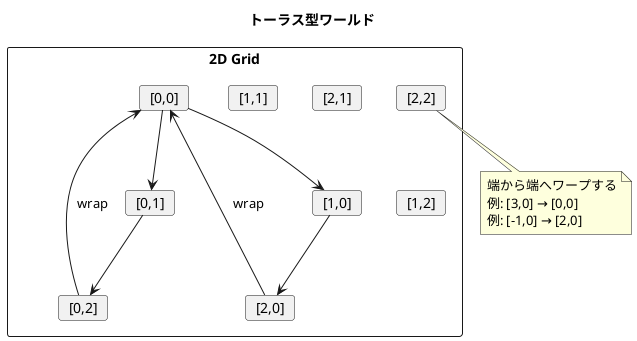
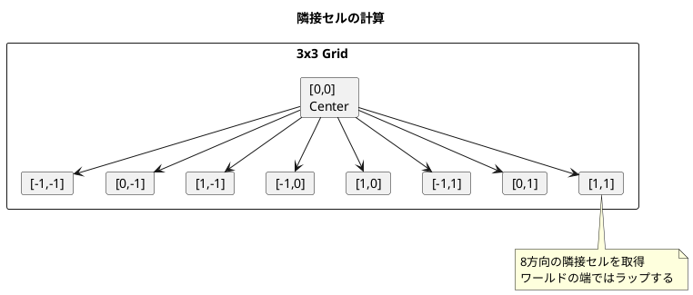
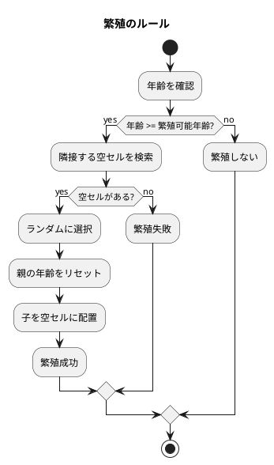
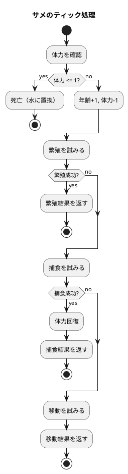
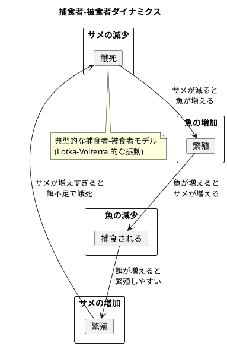
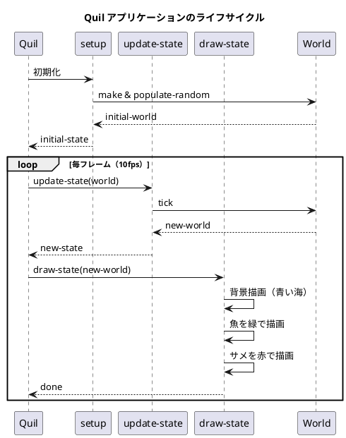

# 第19章: Wa-Tor シミュレーション

## はじめに

本章では、Wa-Tor（Water Torus）シミュレーションを通じて、セルオートマトンとマルチメソッドを使った捕食者-被食者モデルの実装を学びます。

Wa-Tor は1984年に A.K. Dewdney が Scientific American で紹介した古典的なシミュレーションで、魚（被食者）とサメ（捕食者）の生態系をモデル化します。

この問題を通じて以下の概念を学びます：

- セルオートマトンの実装
- マルチメソッドによる多態的な振る舞い
- トーラス型ワールドの座標計算
- 繁殖と捕食のルール実装

## 1. Wa-Tor の世界

### トーラス型ワールド

Wa-Tor の世界はトーラス（ドーナツ型）です。端に到達すると反対側に出現します。



### セルの種類

- **水（Water）**: 空のセル
- **魚（Fish）**: 被食者、移動と繁殖のみ
- **サメ（Shark）**: 捕食者、移動、繁殖、捕食

## 2. 段階的な実装

### Phase 1: 基本構造

まず、セルとワールドの基本構造を定義します。

```clojure
(ns wator.cell)

(defmulti tick
  "セルの1ステップを実行"
  (fn [cell & _args] (::type cell)))

(defmulti display
  "セルの表示文字を取得"
  ::type)
```

### Phase 2: 水セル

最もシンプルなセルである水を実装します。

```clojure
(ns wator.water
  (:require [wator.cell :as cell]))

(defn make
  "水セルを作成"
  []
  {::cell/type ::water})

(defn is?
  "水セルかどうか判定"
  [cell]
  (= ::water (::cell/type cell)))

(defmethod cell/tick ::water
  [_water _loc _world]
  nil)

(defmethod cell/display ::water
  [_water]
  ".")
```

### Phase 3: ワールド構造

```clojure
(ns wator.world
  (:require [wator.cell :as cell]
            [wator.water :as water]))

(declare neighbors get-cell)

(defn make
  "ワールドを作成"
  [width height]
  (let [locs (for [x (range width) y (range height)] [x y])
        cells (into {} (map (fn [loc] [loc (water/make)]) locs))]
    {:type ::world
     :width width
     :height height
     :cells cells
     :neighbors-fn neighbors
     :get-cell-fn get-cell}))
```

### Phase 4: 座標のラップ

```clojure
(defn wrap
  "座標をトーラス上でラップ"
  [world [x y]]
  (let [{:keys [width height]} world]
    [(mod x width) (mod y height)]))

(defn neighbors
  "隣接セルの座標を取得（8方向）"
  [world [x y]]
  (let [deltas (for [dx [-1 0 1] dy [-1 0 1]
                     :when (not (and (= dx 0) (= dy 0)))]
                 [dx dy])]
    (map (fn [[dx dy]]
           (wrap world [(+ x dx) (+ y dy)]))
         deltas)))
```



## 3. 動物の基本機能

### Phase 5: 動物の共通機能

```clojure
(ns wator.animal
  (:require [wator.cell :as cell]
            [wator.water :as water]))

(defmulti move (fn [animal & _args] (::cell/type animal)))
(defmulti reproduce (fn [animal & _args] (::cell/type animal)))
(defmulti make-child ::cell/type)
(defmulti get-reproduction-age ::cell/type)

(defn make
  "動物の基本属性を作成"
  []
  {::age 0})

(defn age [animal]
  (::age animal))

(defn increment-age [animal]
  (update animal ::age inc))
```

### Phase 6: 移動ロジック

```clojure
(defn find-empty-neighbors
  "隣接する空のセルを検索"
  [world loc]
  (let [neighbors ((:neighbors-fn world) world loc)]
    (filter #(water/is? ((:get-cell-fn world) world %)) neighbors)))

(defn do-move
  "動物を空のセルに移動"
  [animal loc world]
  (let [destinations (find-empty-neighbors world loc)]
    (if (empty? destinations)
      [nil {loc animal}]
      (let [new-loc (rand-nth destinations)]
        [{loc (water/make)} {new-loc animal}]))))
```

### Phase 7: 繁殖ロジック

```clojure
(defn do-reproduce
  "動物が繁殖を試みる"
  [animal loc world]
  (if (>= (age animal) (get-reproduction-age animal))
    (let [birth-places (find-empty-neighbors world loc)]
      (if (empty? birth-places)
        nil
        (let [new-loc (rand-nth birth-places)]
          [{loc (set-age animal 0)}
           {new-loc (make-child animal)}])))
    nil))
```



## 4. 魚の実装

### Phase 8: 魚クラス

```clojure
(ns wator.fish
  (:require [wator.cell :as cell]
            [wator.animal :as animal]
            [wator.config :as config]))

(defn is? [cell]
  (= ::fish (::cell/type cell)))

(defn make []
  (merge {::cell/type ::fish}
         (animal/make)))

(defmethod animal/make-child ::fish [_fish]
  (make))

(defmethod animal/get-reproduction-age ::fish [_fish]
  config/fish-reproduction-age)

(defmethod animal/move ::fish [fish loc world]
  (animal/do-move fish loc world))

(defmethod animal/reproduce ::fish [fish loc world]
  (animal/do-reproduce fish loc world))

(defmethod cell/tick ::fish [fish loc world]
  (animal/tick fish loc world))

(defmethod cell/display ::fish [_fish]
  "f")
```

## 5. サメの実装

### Phase 9: サメの基本構造

```clojure
(ns wator.shark
  (:require [wator.cell :as cell]
            [wator.animal :as animal]
            [wator.water :as water]
            [wator.fish :as fish]
            [wator.config :as config]))

(defn is? [cell]
  (= ::shark (::cell/type cell)))

(defn make []
  (merge {::cell/type ::shark
          ::health config/shark-starting-health}
         (animal/make)))
```

### Phase 10: サメの体力管理

```clojure
(defn health [shark]
  (::health shark))

(defn set-health [shark new-health]
  (assoc shark ::health new-health))

(defn decrement-health [shark]
  (update shark ::health dec))

(defn feed [shark]
  (let [new-health (min config/shark-max-health
                        (+ (health shark) config/shark-eating-health))]
    (set-health shark new-health)))
```

### Phase 11: サメの捕食

```clojure
(defn find-fish-neighbors
  "隣接する魚を検索"
  [world loc]
  (let [neighbors ((:neighbors-fn world) world loc)]
    (filter #(fish/is? ((:get-cell-fn world) world %)) neighbors)))

(defn eat
  "魚を食べる"
  [shark loc world]
  (let [fishy-neighbors (find-fish-neighbors world loc)]
    (if (empty? fishy-neighbors)
      nil
      (let [target (rand-nth fishy-neighbors)]
        [{loc (water/make)}
         {target (feed shark)}]))))
```

### Phase 12: サメのティック処理

```clojure
(defmethod cell/tick ::shark [shark loc world]
  (if (<= (health shark) 1)
    ;; 体力が尽きたら死亡
    [nil {loc (water/make)}]
    (let [aged-shark (-> shark
                         animal/increment-age
                         decrement-health)]
      ;; 優先順位: 繁殖 > 捕食 > 移動
      (or (animal/reproduce aged-shark loc world)
          (eat aged-shark loc world)
          (animal/move aged-shark loc world)))))
```



## 6. シミュレーションの実行

### Phase 13: ワールドの更新

```clojure
(defn tick-cell
  "1つのセルを更新"
  [world loc]
  (let [cell (get-cell world loc)]
    (cell/tick cell loc world)))

(defn tick
  "ワールドの1ステップを実行"
  [world]
  (let [locs (shuffle (keys (:cells world)))
        changes (map #(tick-cell world %) locs)]
    (apply-changes world (flatten (remove nil? changes)))))
```

## 7. 設定パラメータ

```clojure
(ns wator.config)

;; 魚の設定
(def fish-reproduction-age 6)

;; サメの設定
(def shark-reproduction-age 5)
(def shark-reproduction-health 8)
(def shark-starting-health 5)
(def shark-eating-health 5)
(def shark-max-health 10)
```

| パラメータ | 説明 | デフォルト値 |
|-----------|------|-------------|
| fish-reproduction-age | 魚の繁殖可能年齢 | 6 |
| shark-reproduction-age | サメの繁殖可能年齢 | 5 |
| shark-starting-health | サメの初期体力 | 5 |
| shark-eating-health | 捕食時の体力回復量 | 5 |
| shark-max-health | サメの最大体力 | 10 |
| shark-reproduction-health | 繁殖に必要な体力 | 8 |

## 8. 使用例

```clojure
(require '[wator.world :as world])
(require '[wator.fish :as fish])
(require '[wator.shark :as shark])

;; 10x10 のワールドを作成
(def w (world/make 10 10))

;; 魚20匹、サメ5匹をランダム配置
(def w (world/populate-random w 20 5))

;; 統計情報
(world/statistics w)
;; => {:fish 20, :sharks 5, :water 75, :total 100}

;; ワールドを表示
(println (world/display w))
;; ..f.......
;; .S....f...
;; ..f.......
;; ...f..f...
;; ....S.....
;; .f........
;; ......f...
;; ..f...S...
;; ....f.....
;; .......f..

;; 1ステップ実行
(def w' (world/tick w))

;; 100ステップ実行
(def w-100 (nth (iterate world/tick w) 100))
```

## 9. シミュレーションのダイナミクス



## 10. GUI との統合（Quil）

### Quil ライブラリ

Quil は Processing を Clojure から利用するためのライブラリです。シミュレーションを視覚化できます。

```clojure
(ns wator-gui.main
  (:require [quil.core :as q]
            [quil.middleware :as m]
            [wator.world :as world]
            [wator.fish :as fish]
            [wator.shark :as shark]
            [wator.water :as water]))
```

### セットアップ関数

```clojure
(def cell-size 10)
(def world-width 60)
(def world-height 40)

(defn setup []
  (q/frame-rate 10)
  (q/color-mode :rgb)
  ;; 初期ワールドを作成
  (-> (world/make world-width world-height)
      (world/populate-random 200 30)))

(defn draw-state [world]
  (q/background 0 100 200)  ; 青い海
  (doseq [[[x y] cell] (:cells world)]
    (cond
      (fish/is? cell)
      (do
        (q/fill 0 255 0)  ; 緑: 魚
        (q/rect (* x cell-size) (* y cell-size) cell-size cell-size))

      (shark/is? cell)
      (do
        (q/fill 255 0 0)  ; 赤: サメ
        (q/rect (* x cell-size) (* y cell-size) cell-size cell-size)))))
```

### 更新関数

```clojure
(defn update-state [world]
  (world/tick world))
```

### メイン関数

```clojure
(defn -main []
  (q/defsketch wator-simulation
    :title "Wa-Tor Simulation"
    :size [(* world-width cell-size) (* world-height cell-size)]
    :setup setup
    :update update-state
    :draw draw-state
    :middleware [m/fun-mode]))
```



### 統計情報の表示

```clojure
(defn draw-stats [world]
  (let [stats (world/statistics world)]
    (q/fill 255)
    (q/text-size 14)
    (q/text (str "Fish: " (:fish stats)) 10 20)
    (q/text (str "Sharks: " (:sharks stats)) 10 40)
    (q/text (str "Generation: " (:generation world 0)) 10 60)))
```

### キーボードインタラクション

```clojure
(defn key-pressed [world event]
  (case (:key event)
    :r (-> (world/make world-width world-height)
           (world/populate-random 200 30))  ; リセット
    :p (assoc world :paused (not (:paused world)))  ; 一時停止
    :+ (update world :speed inc)  ; 速度アップ
    :- (update world :speed dec)  ; 速度ダウン
    world))
```

### 関数型 GUI の特徴

Quil の `fun-mode` は関数型プログラミングの原則に従います：

1. **状態の不変性**: 各フレームで新しい状態を返す
2. **純粋な更新関数**: 副作用なしで状態を変換
3. **描画と状態の分離**: `update` と `draw` は独立

```clojure
;; 状態は常に新しいマップとして返される
(defn update-state [state]
  (if (:paused state)
    state
    (-> state
        (update :world world/tick)
        (update :generation inc))))
```

## 11. 関数型アプローチの特徴

### 不変性

すべての状態更新は新しいワールドを返します。

```clojure
;; 元のワールドは変更されない
(def w1 (world/make 5 5))
(def w2 (world/tick w1))

;; w1 と w2 は独立
(= w1 w2) ;; => false
```

### マルチメソッドによる拡張性

新しいセルタイプの追加が容易です。

```clojure
;; 新しいセルタイプ: 海藻
(defmethod cell/tick ::seaweed
  [seaweed loc world]
  ;; 海藻のティック処理
  ...)

(defmethod cell/display ::seaweed
  [_seaweed]
  "~")
```

### テスト容易性

純粋関数であるため、テストが簡単です。

```clojure
(describe "魚"
  (it "繁殖可能年齢に達したら繁殖する"
    (let [old-fish (-> (fish/make)
                       (animal/set-age 6))
          world (-> (world/make 3 3)
                    (world/set-cell [1 1] old-fish))]
      ;; テストロジック
      )))
```

## まとめ

本章では、Wa-Tor シミュレーションを通じて以下を学びました：

1. **セルオートマトン**: グリッドベースのシミュレーション
2. **マルチメソッド**: セルタイプによる多態的な振る舞い
3. **トーラス型ワールド**: 端のラップ処理
4. **捕食者-被食者モデル**: 繁殖、捕食、餓死のルール
5. **段階的な実装**: Phase 1-13 での漸進的な開発
6. **GUI との統合**: Quil による視覚化と関数型 GUI パターン

## 参考コード

本章のコード例は以下のファイルで確認できます：

- ソースコード: `app/clojure/part6/src/wator/`
- テストコード: `app/clojure/part6/spec/wator/`

## 第6部のまとめ

第6部では、5つのケーススタディを通じて関数型プログラミングの実践的な応用を学びました：

- **ゴシップ好きなバスの運転手**: 無限シーケンスと集合演算
- **給与計算システム**: ドメインモデリングとマルチメソッド
- **レンタルビデオシステム**: ポリシーパターンとフォーマッター
- **並行処理システム**: エージェントとイベント駆動
- **Wa-Tor シミュレーション**: セルオートマトンと多態性

これらのケーススタディを通じて、関数型プログラミングが実世界の問題に対してどのように適用できるかを理解しました。
