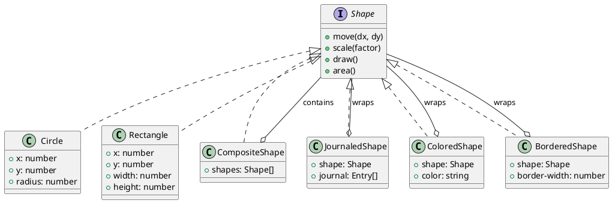
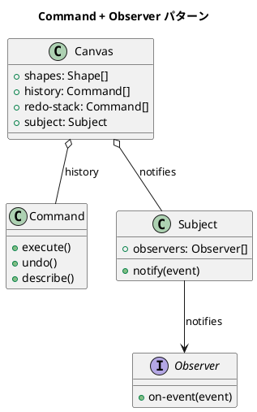
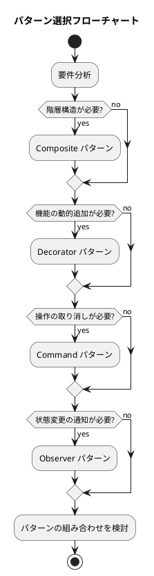

# 第20章: パターン間の相互作用

## 1. はじめに

デザインパターンは単独で使用されることもありますが、実際のアプリケーションでは複数のパターンを組み合わせて使用することが一般的です。本章では、関数型プログラミングにおけるパターンの組み合わせ方と、その相乗効果について解説します。

### 学習目標

- Composite と Decorator パターンの組み合わせを理解する
- Command と Observer パターンの連携を実装する
- 複合的なアーキテクチャ設計のアプローチを学ぶ

## 2. Composite + Decorator パターン

### 2.1 基本概念

**Composite パターン**は、オブジェクトを木構造で表現し、個別オブジェクトと複合オブジェクトを同一視できるようにします。

**Decorator パターン**は、オブジェクトに動的に機能を追加します。

これらを組み合わせることで、複合オブジェクトに対しても装飾を適用できます。



### 2.2 基本図形の実装

```clojure
(ns pattern-interactions.shape
  "図形の基本インターフェース - Composite パターンの基盤")

;; マルチメソッドによる図形操作
(defmulti move "図形を移動" :type)
(defmulti scale "図形を拡大/縮小" :type)
(defmulti draw "図形を描画" :type)
(defmulti area "図形の面積を計算" :type)

;; 円
(defn make-circle [x y radius]
  {:type :circle :x x :y y :radius radius})

(defmethod move :circle [shape dx dy]
  (-> shape
      (update :x + dx)
      (update :y + dy)))

(defmethod scale :circle [shape factor]
  (update shape :radius * factor))

(defmethod area :circle [shape]
  (* Math/PI (:radius shape) (:radius shape)))

;; 矩形
(defn make-rectangle [x y width height]
  {:type :rectangle :x x :y y :width width :height height})

(defmethod move :rectangle [shape dx dy]
  (-> shape
      (update :x + dx)
      (update :y + dy)))

(defmethod scale :rectangle [shape factor]
  (-> shape
      (update :width * factor)
      (update :height * factor)))

(defmethod area :rectangle [shape]
  (* (:width shape) (:height shape)))
```

### 2.3 Composite パターンの実装

```clojure
(ns pattern-interactions.composite-shape
  "複合図形 - Composite パターン"
  (:require [pattern-interactions.shape :as shape]))

(defn make-composite
  "複合図形を作成"
  ([] (make-composite []))
  ([shapes] {:type :composite :shapes shapes}))

(defn add-shape [composite s]
  (update composite :shapes conj s))

(defn remove-shape [composite s]
  (update composite :shapes (fn [shapes] (remove #(= % s) shapes))))

(defmethod shape/move :composite [composite dx dy]
  (update composite :shapes
          (fn [shapes] (mapv #(shape/move % dx dy) shapes))))

(defmethod shape/scale :composite [composite factor]
  (update composite :shapes
          (fn [shapes] (mapv #(shape/scale % factor) shapes))))

(defmethod shape/area :composite [composite]
  (reduce + 0 (map shape/area (:shapes composite))))
```

**ポイント**:
- `mapv` を使用してベクターを返す（イミュータブル）
- 各子要素に対して同じ操作を適用

### 2.4 Decorator パターンの実装

```clojure
(ns pattern-interactions.decorated-shape
  "装飾付き図形 - Decorator パターン"
  (:require [pattern-interactions.shape :as shape]))

;; ジャーナル付き図形（操作履歴を記録）
(defn make-journaled [s]
  {:type :journaled :shape s :journal []})

(defn get-journal [decorated]
  (:journal decorated))

(defn- add-journal-entry [decorated operation]
  (update decorated :journal conj
          {:operation operation
           :timestamp (System/currentTimeMillis)}))

(defmethod shape/move :journaled [decorated dx dy]
  (-> decorated
      (update :shape shape/move dx dy)
      (add-journal-entry (str "move(" dx ", " dy ")"))))

(defmethod shape/scale :journaled [decorated factor]
  (-> decorated
      (update :shape shape/scale factor)
      (add-journal-entry (str "scale(" factor ")"))))

;; 色付き図形
(defn make-colored [s color]
  {:type :colored :shape s :color color})

(defmethod shape/move :colored [decorated dx dy]
  (update decorated :shape shape/move dx dy))

(defmethod shape/draw :colored [decorated]
  (str "[" (:color decorated) "] " (shape/draw (:shape decorated))))
```

### 2.5 組み合わせの例

```clojure
;; Composite に Decorator を適用
(let [circle (shape/make-circle 0 0 10)
      rect (shape/make-rectangle 0 0 10 20)
      comp (-> (composite/make-composite)
               (composite/add-shape circle)
               (composite/add-shape rect))
      journaled (decorated/make-journaled comp)
      after-move (shape/move journaled 5 3)]
  (decorated/get-journal after-move))
;; => [{:operation "move(5, 3)" :timestamp ...}]

;; Decorated な図形を Composite に含める
(let [colored-circle (-> (shape/make-circle 0 0 10)
                         (decorated/make-colored "red"))
      bordered-rect (-> (shape/make-rectangle 0 0 10 20)
                        (decorated/make-bordered 2))
      comp (-> (composite/make-composite)
               (composite/add-shape colored-circle)
               (composite/add-shape bordered-rect))]
  (shape/draw comp))
;; => "Composite[\n  [red] Circle...\n  [Border: 2px] Rectangle...\n]"

;; 多重デコレータ
(let [circle (-> (shape/make-circle 0 0 10)
                 (decorated/make-colored "blue")
                 (decorated/make-bordered 3)
                 (decorated/make-journaled))]
  (shape/draw circle))
;; => "[Journaled: 0 ops] [Border: 3px] [blue] Circle..."
```

## 3. Command + Observer パターン

### 3.1 基本概念

**Command パターン**は、操作をオブジェクトとしてカプセル化し、Undo/Redo を可能にします。

**Observer パターン**は、状態の変更を監視者に通知します。

これらを組み合わせることで、コマンド実行時に自動的に通知を行うシステムを構築できます。



### 3.2 Observer パターンの実装

```clojure
(ns pattern-interactions.observer
  "Observer パターン - イベント通知システム")

(defn make-subject []
  (atom {:observers [] :state nil}))

(defn add-observer [subject observer-fn]
  (swap! subject update :observers conj observer-fn))

(defn notify-observers [subject event]
  (doseq [observer (:observers @subject)]
    (observer event)))

(defn set-state! [subject new-state]
  (swap! subject assoc :state new-state)
  (notify-observers subject {:type :state-changed
                             :new-state new-state}))
```

### 3.3 Command パターンの実装

```clojure
(ns pattern-interactions.command
  "Command パターン - 操作のカプセル化")

(defmulti execute "コマンドを実行" :command-type)
(defmulti undo "コマンドを取り消し" :command-type)
(defmulti describe "コマンドの説明" :command-type)

;; 図形追加コマンド
(defn make-add-shape-command [shape]
  {:command-type :add-shape :shape shape})

(defmethod execute :add-shape [cmd]
  (fn [canvas]
    (update canvas :shapes conj (:shape cmd))))

(defmethod undo :add-shape [cmd]
  (fn [canvas]
    (update canvas :shapes (fn [shapes] (vec (butlast shapes))))))

;; 図形移動コマンド
(defn make-move-shape-command [index dx dy]
  {:command-type :move-shape :index index :dx dx :dy dy})

(defmethod execute :move-shape [cmd]
  (fn [canvas]
    (update-in canvas [:shapes (:index cmd)] shape/move (:dx cmd) (:dy cmd))))

(defmethod undo :move-shape [cmd]
  (fn [canvas]
    (update-in canvas [:shapes (:index cmd)] shape/move (- (:dx cmd)) (- (:dy cmd)))))

;; マクロコマンド
(defn make-macro-command [commands]
  {:command-type :macro :commands commands})

(defmethod execute :macro [cmd]
  (fn [canvas]
    (reduce (fn [c sub-cmd] ((execute sub-cmd) c))
            canvas
            (:commands cmd))))

(defmethod undo :macro [cmd]
  (fn [canvas]
    (reduce (fn [c sub-cmd] ((undo sub-cmd) c))
            canvas
            (reverse (:commands cmd)))))
```

### 3.4 Command + Observer の統合

```clojure
(ns pattern-interactions.command-observer
  "Command + Observer パターンの統合"
  (:require [pattern-interactions.command :as cmd]
            [pattern-interactions.observer :as obs]))

(defn make-observable-canvas []
  {:shapes []
   :subject (obs/make-subject)
   :history []
   :redo-stack []})

(defn execute-command [canvas command]
  (let [executor (cmd/execute command)
        new-canvas (-> canvas
                       executor
                       (update :history conj command)
                       (assoc :redo-stack []))]
    ;; オブザーバーに通知
    (obs/notify-observers (:subject canvas)
                          {:type :command-executed
                           :command command
                           :description (cmd/describe command)})
    new-canvas))

(defn undo-last [canvas]
  (if (empty? (:history canvas))
    canvas
    (let [last-cmd (peek (:history canvas))
          undoer (cmd/undo last-cmd)
          new-canvas (-> canvas
                         undoer
                         (update :history pop)
                         (update :redo-stack conj last-cmd))]
      (obs/notify-observers (:subject canvas)
                            {:type :command-undone
                             :command last-cmd})
      new-canvas)))

(defn redo-last [canvas]
  (if (empty? (:redo-stack canvas))
    canvas
    (let [cmd-to-redo (peek (:redo-stack canvas))
          executor (cmd/execute cmd-to-redo)
          new-canvas (-> canvas
                         executor
                         (update :history conj cmd-to-redo)
                         (update :redo-stack pop))]
      (obs/notify-observers (:subject canvas)
                            {:type :command-redone
                             :command cmd-to-redo})
      new-canvas)))
```

### 3.5 使用例

```clojure
;; キャンバスを作成
(def canvas (cmd-obs/make-observable-canvas))

;; オブザーバーを登録
(def log (atom []))
(cmd-obs/add-observer canvas
  (fn [event]
    (swap! log conj (str (:type event) ": " (:description event)))))

;; コマンドを実行
(def canvas1
  (-> canvas
      (cmd-obs/execute-command
        (cmd/make-add-shape-command (shape/make-circle 0 0 10)))
      (cmd-obs/execute-command
        (cmd/make-move-shape-command 0 5 3))))

@log
;; => [":command-executed: Add shape: :circle"
;;     ":command-executed: Move shape[0] by (5, 3)"]

;; Undo
(def canvas2 (cmd-obs/undo-last canvas1))
@log
;; => [..., ":command-undone: ..."]

;; Redo
(def canvas3 (cmd-obs/redo-last canvas2))
```

## 4. 複合アーキテクチャの設計

### 4.1 パターン選択のガイドライン



### 4.2 パターン組み合わせのマトリクス

| パターン A | パターン B | 相乗効果 |
|-----------|-----------|---------|
| Composite | Decorator | 複合オブジェクト全体に装飾を適用 |
| Composite | Visitor | 木構造を走査して各要素に操作を適用 |
| Command | Observer | コマンド実行を監視・ログ |
| Command | Composite | マクロコマンドの実現 |
| Strategy | Decorator | 戦略にキャッシュ・ログを追加 |
| Factory | Strategy | 生成戦略の切り替え |

### 4.3 関数型での組み合わせの利点

1. **データとしてのパターン**
   - すべてのパターンがデータ構造として表現される
   - パターン間の境界が明確

2. **合成可能性**
   - 関数合成により自然にパターンを組み合わせ可能
   - パイプラインで処理を連結

3. **テスト容易性**
   - 各パターンが純粋関数で実装
   - 組み合わせもテストしやすい

## 5. テストコード

```clojure
(describe "Composite + Decorator の組み合わせ"
  (it "複合図形にデコレータを適用できる"
    (let [circle (shape/make-circle 0 0 10)
          rect (shape/make-rectangle 0 0 10 20)
          comp (-> (composite/make-composite)
                   (composite/add-shape circle)
                   (composite/add-shape rect))
          journaled (decorated/make-journaled comp)
          after-move (shape/move journaled 5 3)]
      (should= 1 (count (decorated/get-journal after-move)))))

  (it "多重デコレータを適用できる"
    (let [circle (-> (shape/make-circle 0 0 10)
                     (decorated/make-colored "blue")
                     (decorated/make-bordered 3)
                     (decorated/make-journaled))]
      (should-contain "[Journaled:" (shape/draw circle))
      (should-contain "[Border: 3px]" (shape/draw circle))
      (should-contain "[blue]" (shape/draw circle)))))

(describe "Command + Observer の統合"
  (it "コマンド実行時にオブザーバーに通知される"
    (let [canvas (cmd-obs/make-observable-canvas)
          notifications (atom [])
          observer (fn [event] (swap! notifications conj event))
          _ (cmd-obs/add-observer canvas observer)
          circle (shape/make-circle 0 0 10)
          cmd (cmd/make-add-shape-command circle)
          new-canvas (cmd-obs/execute-command canvas cmd)]
      (should= 1 (count @notifications))
      (should= :command-executed (:type (first @notifications)))))

  (it "Undo/Redo が機能する"
    (let [canvas (cmd-obs/make-observable-canvas)
          circle (shape/make-circle 0 0 10)
          cmd (cmd/make-add-shape-command circle)
          after-add (cmd-obs/execute-command canvas cmd)
          after-undo (cmd-obs/undo-last after-add)
          after-redo (cmd-obs/redo-last after-undo)]
      (should= 1 (count (cmd-obs/get-shapes after-add)))
      (should= 0 (count (cmd-obs/get-shapes after-undo)))
      (should= 1 (count (cmd-obs/get-shapes after-redo))))))
```

## 6. まとめ

### パターン組み合わせの原則

1. **単一責任を維持**: 各パターンは独自の責任を持つ
2. **疎結合を保つ**: パターン間は明確なインターフェースで連携
3. **データ中心**: パターン間のやり取りはデータで行う
4. **テスト可能性**: 組み合わせても個別にテスト可能

### 関数型アプローチの強み

- **透過的な合成**: 関数とデータの合成が自然
- **イミュータブル**: 状態の追跡が容易
- **マルチメソッド**: 柔軟な多態性の実現

### 次のステップ

- [第21章: 関数型デザインのベストプラクティス](./21-best-practices.md)
- [第22章: オブジェクト指向から関数型への移行](./22-oo-to-fp-migration.md)
