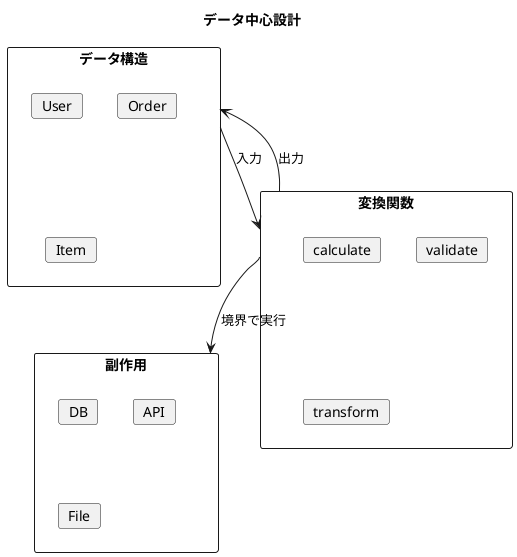
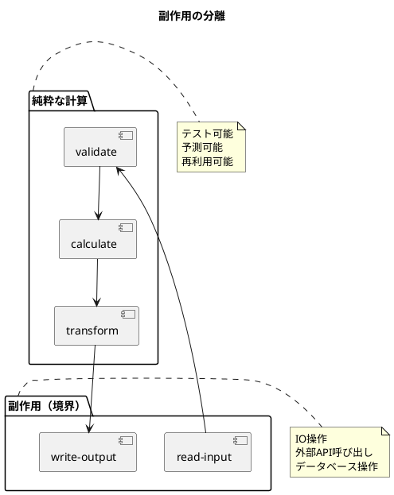

# 第21章: 関数型デザインのベストプラクティス

## 1. はじめに

本章では、関数型プログラミングにおける設計のベストプラクティスを体系的に解説します。これらの原則は、保守性が高く、テストしやすい、堅牢なソフトウェアを構築するための指針となります。

### 学習目標

- データ中心設計の原則を理解する
- 純粋関数と副作用の分離方法を学ぶ
- テスト可能な設計パターンを習得する

## 2. データ中心設計

### 2.1 基本原則

関数型プログラミングでは、**データが主役**です。まずデータ構造を設計し、そのデータを変換する関数を実装します。



### 2.2 データ構造の定義

```clojure
(ns best-practices.data-centric)

;; シンプルなマップでデータを表現
(defn make-user [id name email]
  {:id id
   :name name
   :email email
   :created-at (System/currentTimeMillis)})

(defn make-order [id user-id items]
  {:id id
   :user-id user-id
   :items items
   :status :pending
   :created-at (System/currentTimeMillis)})

(defn make-order-item [product-id quantity price]
  {:product-id product-id
   :quantity quantity
   :price price})
```

**ポイント**:
- プレーンなマップを使用（クラスではなく）
- 必要最小限のフィールド
- 明確な命名

### 2.3 小さな純粋関数

```clojure
;; 各関数は単一の責任を持つ
(defn calculate-item-total [item]
  (* (:quantity item) (:price item)))

(defn calculate-order-total [order]
  (reduce + 0 (map calculate-item-total (:items order))))

(defn apply-discount [total discount-rate]
  (* total (- 1.0 discount-rate)))
```

**原則**:
- 1つの関数は1つのことを行う
- 入力から出力への純粋な変換
- 副作用なし

### 2.4 データ変換パイプライン

```clojure
(defn enrich-order [order]
  (assoc order :total (calculate-order-total order)))

(defn apply-tax [order tax-rate]
  (let [total (:total order)
        tax (* total tax-rate)]
    (assoc order
           :tax tax
           :grand-total (+ total tax))))

(defn process-order [order discount-rate tax-rate]
  (-> order
      enrich-order
      (update :total apply-discount discount-rate)
      (apply-tax tax-rate)
      (assoc :status :processed)))
```

**スレッドマクロ `->` の活用**:
- データの流れが明確
- 各ステップが独立
- デバッグしやすい

### 2.5 データ検証

```clojure
(defn valid-email? [email]
  (and (string? email)
       (re-matches #"^[^@]+@[^@]+\.[^@]+$" email)))

(defn valid-user? [user]
  (and (map? user)
       (string? (:name user))
       (not (empty? (:name user)))
       (valid-email? (:email user))))

(defn valid-order? [order]
  (and (map? order)
       (not (empty? (:items order)))
       (every? valid-order-item? (:items order))))
```

**検証関数のパターン**:
- 述語関数（`?` で終わる）を使用
- 合成可能な小さな検証
- 明確なエラー条件

### 2.6 イミュータブルな更新

```clojure
(defn update-user-email [user new-email]
  (if (valid-email? new-email)
    (assoc user :email new-email :updated-at (System/currentTimeMillis))
    user))  ;; 無効な場合は元のデータを返す

(defn add-order-item [order item]
  (if (valid-order-item? item)
    (update order :items conj item)
    order))

(defn cancel-order [order]
  (if (= :pending (:status order))
    (assoc order :status :cancelled :cancelled-at (System/currentTimeMillis))
    order))
```

**イミュータビリティの利点**:
- 元のデータは変更されない
- 履歴の追跡が容易
- 並行処理が安全

## 3. 純粋関数と副作用の分離

### 3.1 純粋関数の特性

```clojure
;; 純粋関数の例
(defn add [a b]
  (+ a b))  ;; 同じ入力 → 同じ出力

(defn multiply [a b]
  (* a b))  ;; 副作用なし

(defn square [x]
  (* x x))  ;; 参照透過性
```

**純粋関数の条件**:
1. 同じ入力に対して常に同じ出力
2. 副作用がない
3. 外部状態に依存しない

### 3.2 副作用の分離



```clojure
;; ビジネスロジック（純粋）
(defn validate-amount [amount]
  (cond
    (nil? amount) {:valid false :error "Amount is required"}
    (<= amount 0) {:valid false :error "Amount must be positive"}
    :else {:valid true :amount amount}))

(defn calculate-fee [amount fee-rate]
  (* amount fee-rate))

(defn calculate-total [amount fee]
  (+ amount fee))

;; 副作用を含む処理（境界）
(defn process-payment! [amount fee-rate side-effect-fn]
  (let [validation (validate-amount amount)]
    (if (:valid validation)
      (let [fee (calculate-fee amount fee-rate)
            total (calculate-total amount fee)
            result {:amount amount :fee fee :total total :status :success}]
        ;; 副作用は最後に実行
        (side-effect-fn result)
        result)
      {:status :error :error (:error validation)})))
```

### 3.3 高階関数によるデコレーション

```clojure
(defn with-logging [f logger]
  "ロギング機能を追加するデコレータ"
  (fn [& args]
    (logger (str "Calling with args: " args))
    (let [result (apply f args)]
      (logger (str "Result: " result))
      result)))

;; 使用例
(def logged-add (with-logging add println))
(logged-add 2 3)
;; Calling with args: (2 3)
;; Result: 5
;; => 5
```

### 3.4 関数合成

```clojure
(defn pipeline [& fns]
  "パイプライン形式の関数合成"
  (fn [x]
    (reduce (fn [acc f] (f acc)) x fns)))

(def process-number
  (pipeline
   #(+ % 1)      ;; 1を加算
   #(* % 2)      ;; 2倍
   #(- % 3)))    ;; 3を減算

(process-number 5)  ;; => (5+1)*2-3 = 9
```

### 3.5 メモ化

```clojure
(defn memoize-fn [f]
  "参照透過性を活用したキャッシング"
  (let [cache (atom {})]
    (fn [& args]
      (if-let [cached (get @cache args)]
        cached
        (let [result (apply f args)]
          (swap! cache assoc args result)
          result)))))

;; フィボナッチ（メモ化版）
(def fib-memo
  (memoize-fn
   (fn [n]
     (if (<= n 1)
       n
       (+ (fib-memo (- n 1))
          (fib-memo (- n 2)))))))
```

## 4. テスト可能な設計

### 4.1 依存性注入

```clojure
;; 依存性を関数パラメータとして注入
(defn get-user [repository id]
  ((:find-by-id repository) id))

(defn save-user [repository user]
  ((:save repository) user))

;; テスト用モックリポジトリ
(defn make-mock-repository [initial-data]
  (let [data (atom initial-data)]
    {:find-by-id (fn [id]
                   (first (filter #(= (:id %) id) @data)))
     :find-all (fn [] @data)
     :save (fn [entity]
             (swap! data conj entity)
             entity)
     :delete (fn [id]
               (swap! data (fn [d] (remove #(= (:id %) id) d))))}))
```

### 4.2 時間の抽象化

```clojure
;; 時間を注入可能にする
(defn create-order [items now-fn]
  {:items items :created-at (now-fn)})

(defn is-expired? [order now-fn expiry-duration-ms]
  (let [age (- (now-fn) (:created-at order))]
    (> age expiry-duration-ms)))

;; テスト用の固定時刻関数
(defn make-fixed-clock [fixed-time]
  (fn [] fixed-time))

;; テスト
(let [clock (make-fixed-clock 1000)
      order (create-order [{:item "A"}] clock)
      later-clock (make-fixed-clock 2000)]
  (is-expired? order later-clock 500))  ;; => true
```

### 4.3 ランダム性の抽象化

```clojure
(defn create-entity [data id-gen-fn now-fn]
  (assoc data
         :id (id-gen-fn)
         :created-at (now-fn)))

;; テスト用シーケンシャルID生成器
(defn make-sequential-id-gen []
  (let [counter (atom 0)]
    (fn []
      (swap! counter inc)
      (str "id-" @counter))))

;; テスト
(let [id-gen (make-sequential-id-gen)
      clock (make-fixed-clock 1000)]
  (create-entity {:name "Test"} id-gen clock))
;; => {:name "Test" :id "id-1" :created-at 1000}
```

### 4.4 設定の分離

```clojure
(defn make-config [& {:keys [tax-rate discount-rate currency]
                      :or {tax-rate 0.1 discount-rate 0.0 currency "JPY"}}]
  {:tax-rate tax-rate
   :discount-rate discount-rate
   :currency currency})

(defn calculate-price [config base-price]
  (let [discounted (* base-price (- 1.0 (:discount-rate config)))
        with-tax (* discounted (+ 1.0 (:tax-rate config)))]
    {:base-price base-price
     :discounted discounted
     :tax (* discounted (:tax-rate config))
     :total with-tax
     :currency (:currency config)}))

;; テスト
(let [config (make-config :tax-rate 0.08 :discount-rate 0.1)]
  (calculate-price config 1000))
;; => {:base-price 1000, :discounted 900.0, :tax 72.0, :total 972.0, ...}
```

### 4.5 検証の分離

```clojure
(defn validate-input [input validations]
  (let [errors (keep (fn [[field validation]]
                       (let [value (get input field)]
                         (when-not (validation value)
                           field)))
                     validations)]
    (if (empty? errors)
      {:valid true :data input}
      {:valid false :errors errors})))

(def user-validations
  {:name (fn [v] (and (string? v) (not (empty? v))))
   :email (fn [v] (and (string? v) (re-matches #"^[^@]+@[^@]+\.[^@]+$" v)))
   :age (fn [v] (and (number? v) (>= v 0)))})

;; 使用例
(validate-input {:name "John" :email "john@example.com" :age 30}
                user-validations)
;; => {:valid true :data {...}}

(validate-input {:name "" :email "invalid" :age -1}
                user-validations)
;; => {:valid false :errors (:name :email :age)}
```

### 4.6 プロトコルによるモック

```clojure
(defprotocol Notifier
  (send-notification [this recipient message]))

;; 本番用実装
(defrecord EmailNotifier [smtp-config]
  Notifier
  (send-notification [_ recipient message]
    ;; 実際のメール送信
    {:sent true :recipient recipient}))

;; テスト用実装
(defrecord MockNotifier [sent-messages]
  Notifier
  (send-notification [_ recipient message]
    (swap! sent-messages conj {:recipient recipient :message message})
    {:sent true :recipient recipient}))

(defn make-mock-notifier []
  (->MockNotifier (atom [])))

(defn get-sent-messages [mock-notifier]
  @(:sent-messages mock-notifier))
```

## 5. テストコード

```clojure
(describe "データ中心設計"
  (it "注文の合計を計算できる"
    (let [items [(make-order-item "p1" 2 100)
                 (make-order-item "p2" 1 200)]
          order (make-order "o1" "u1" items)]
      (should= 400 (calculate-order-total order))))

  (it "イミュータブルな更新ができる"
    (let [user (make-user "u1" "John" "john@example.com")
          updated (update-user-email user "new@example.com")]
      (should= "new@example.com" (:email updated))
      (should= "john@example.com" (:email user)))))

(describe "テスト可能な設計"
  (it "モックリポジトリでテストできる"
    (let [repo (make-mock-repository [{:id "u1" :name "John"}])
          user (get-user repo "u1")]
      (should= "John" (:name user))))

  (it "固定時刻でテストできる"
    (let [clock (make-fixed-clock 1000)
          order (create-order [{:item "A"}] clock)]
      (should= 1000 (:created-at order)))))
```

## 6. まとめ

### ベストプラクティスの要約

| カテゴリ | プラクティス | 効果 |
|---------|------------|------|
| データ設計 | シンプルなマップを使用 | 柔軟性、汎用性 |
| 関数設計 | 小さな純粋関数 | テスト容易性、再利用性 |
| 副作用 | 境界に押し出す | 予測可能性、保守性 |
| 依存性 | 注入パターン | テスト容易性、疎結合 |
| 検証 | 宣言的な検証ルール | 明確性、拡張性 |

### 実践のポイント

1. **データファースト**: まずデータ構造を設計
2. **小さな関数**: 1関数1責任
3. **純粋性を優先**: 副作用は最後に
4. **テストを考慮**: 依存性は注入可能に
5. **パイプライン**: データの流れを明確に

### 次のステップ

- [第22章: オブジェクト指向から関数型への移行](./22-oo-to-fp-migration.md)
