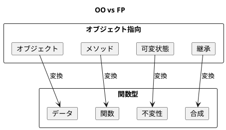
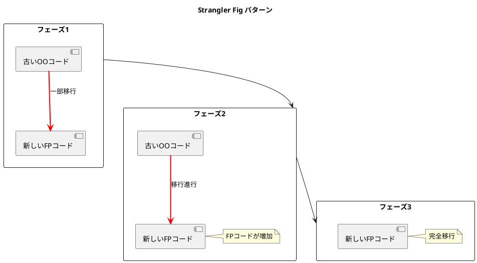
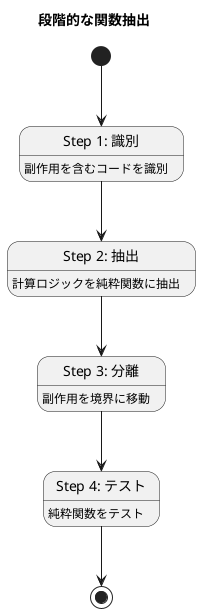
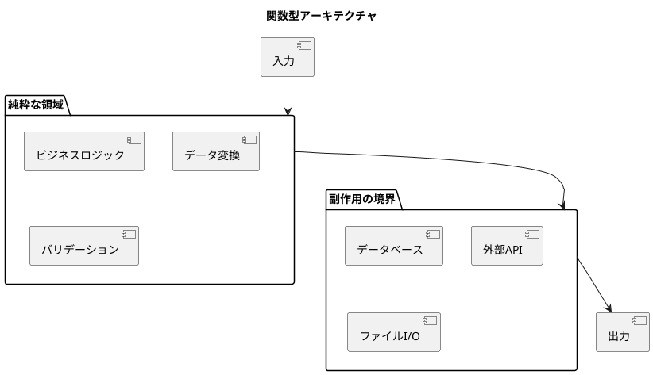

# 第22章: オブジェクト指向から関数型への移行

## 1. はじめに

本章では、オブジェクト指向（OO）スタイルのコードを関数型（FP）スタイルに移行するための戦略とテクニックを解説します。段階的なアプローチにより、既存のコードベースを安全に関数型に移行できます。

### 学習目標

- OO と FP の根本的な違いを理解する
- 段階的な移行戦略を学ぶ
- 実践的なリファクタリングパターンを習得する

## 2. OO と FP の対比

### 2.1 パラダイムの違い



| 概念 | オブジェクト指向 | 関数型 |
|-----|----------------|-------|
| 基本単位 | オブジェクト | データ + 関数 |
| 状態管理 | 可変（mutable） | 不変（immutable） |
| 多態性 | 継承・インターフェース | マルチメソッド・プロトコル |
| コード再利用 | 継承 | 関数合成 |
| 副作用 | どこでも可能 | 境界に分離 |

### 2.2 OO スタイルの例

```clojure
(ns oo-to-fp.oo-style)

;; OOスタイル: 内部状態を持つオブジェクト
(defn make-account-oo [id initial-balance]
  (let [state (atom {:id id
                     :balance initial-balance
                     :transactions []})]
    {:get-id (fn [] (:id @state))
     :get-balance (fn [] (:balance @state))
     :deposit (fn [amount]
                (when (pos? amount)
                  (swap! state update :balance + amount)
                  (swap! state update :transactions conj
                         {:type :deposit :amount amount})
                  (:balance @state)))
     :withdraw (fn [amount]
                 (when (and (pos? amount)
                            (>= (:balance @state) amount))
                   (swap! state update :balance - amount)
                   (swap! state update :transactions conj
                          {:type :withdrawal :amount amount})
                   (:balance @state)))}))

;; 使用例
;; (def acc (make-account-oo "A001" 1000))
;; ((:deposit acc) 500)   ;; => 1500
;; ((:withdraw acc) 200)  ;; => 1300
```

**問題点**:
- 内部状態が可変
- テストが困難（状態に依存）
- 履歴の追跡が難しい

### 2.3 FP スタイルへの変換

```clojure
(ns oo-to-fp.fp-style)

;; FPスタイル: プレーンなデータ + 純粋関数
(defn make-account [id initial-balance]
  {:id id
   :balance initial-balance
   :transactions []})

(defn get-balance [account]
  (:balance account))

(defn deposit [account amount]
  (if (pos? amount)
    (-> account
        (update :balance + amount)
        (update :transactions conj {:type :deposit :amount amount}))
    account))

(defn withdraw [account amount]
  (if (and (pos? amount)
           (>= (:balance account) amount))
    (-> account
        (update :balance - amount)
        (update :transactions conj {:type :withdrawal :amount amount}))
    account))

;; 使用例
;; (def acc (make-account "A001" 1000))
;; (def acc2 (deposit acc 500))   ;; acc は変更されない
;; (def acc3 (withdraw acc2 200)) ;; acc2 も変更されない
```

**利点**:
- 元のデータは不変
- テストが容易（入力 → 出力）
- 完全な履歴を保持

## 3. 移行戦略

### 3.1 Strangler Fig パターン

古いコードを徐々に新しいコードで「絞め殺す」パターン。



```clojure
(defn create-account-strangler [id initial-balance use-fp?]
  (if use-fp?
    ;; 新しいFPスタイル
    {:style :fp
     :data (fp/make-account id initial-balance)}
    ;; 古いOOスタイル（互換性のため）
    {:style :oo
     :data {:id id :balance initial-balance :transactions []}}))

(defn account-deposit [account amount]
  (if (= :fp (:style account))
    (update account :data fp/deposit amount)
    ;; OOスタイルも同じインターフェースで処理
    (update account :data
            (fn [data]
              (-> data
                  (update :balance + amount)
                  (update :transactions conj {:type :deposit :amount amount}))))))
```

### 3.2 アダプターパターン

古いインターフェースを維持しながら、内部実装を FP に移行。

```clojure
(defprotocol AccountOperations
  (get-account-balance [this])
  (deposit-to-account [this amount])
  (withdraw-from-account [this amount]))

;; FPスタイルのアダプター
(defrecord FPAccountAdapter [account-atom]
  AccountOperations
  (get-account-balance [_]
    (:balance @account-atom))
  (deposit-to-account [_ amount]
    (swap! account-atom fp/deposit amount)
    (:balance @account-atom))
  (withdraw-from-account [_ amount]
    (swap! account-atom fp/withdraw amount)
    (:balance @account-atom)))

(defn make-fp-account-adapter [id initial-balance]
  (->FPAccountAdapter (atom (fp/make-account id initial-balance))))
```

**使用例**:
```clojure
(let [adapter (make-fp-account-adapter "A001" 1000)]
  (deposit-to-account adapter 500)
  (get-account-balance adapter))  ;; => 1500
```

### 3.3 イベントソーシング移行

状態をイベントの履歴として表現。

```clojure
(defn account-event [event-type data]
  {:event-type event-type
   :data data
   :timestamp (System/currentTimeMillis)})

(defn apply-event [account event]
  (case (:event-type event)
    :created (merge account (:data event))
    :deposited (fp/deposit account (:amount (:data event)))
    :withdrawn (fp/withdraw account (:amount (:data event)))
    account))

(defn replay-events [events]
  (reduce apply-event {} events))

;; 既存データからイベントへの変換
(defn migrate-to-event-sourcing [account]
  (let [creation-event (account-event :created
                                      {:id (:id account)
                                       :balance 0
                                       :transactions []})
        transaction-events (map (fn [tx]
                                  (account-event
                                   (if (= :deposit (:type tx))
                                     :deposited
                                     :withdrawn)
                                   tx))
                                (:transactions account))]
    (cons creation-event transaction-events)))
```

**利点**:
- 完全な監査証跡
- 任意の時点の状態を再構築可能
- デバッグが容易

### 3.4 段階的な関数抽出

副作用を含むコードから純粋ロジックを段階的に抽出。



```clojure
;; Step 1: 計算ロジックを純粋関数に抽出
(defn calculate-interest [balance rate days]
  (* balance rate (/ days 365.0)))

(defn calculate-fee [balance fee-structure]
  (cond
    (< balance (:minimum-balance fee-structure))
    (:low-balance-fee fee-structure)

    (> balance (:premium-threshold fee-structure))
    0

    :else
    (:standard-fee fee-structure)))

;; Step 2: 業務ルールを純粋関数として表現
(defn can-withdraw? [account amount overdraft-limit]
  (>= (+ (:balance account) overdraft-limit) amount))

(defn calculate-new-balance [current-balance operation amount]
  (case operation
    :deposit (+ current-balance amount)
    :withdraw (- current-balance amount)
    current-balance))

;; Step 3: 副作用を境界に押し出す
(defn process-transaction [account operation amount rules]
  (let [{:keys [overdraft-limit]} rules
        can-process? (case operation
                       :deposit true
                       :withdraw (can-withdraw? account amount overdraft-limit))]
    (if can-process?
      {:success true
       :account (-> account
                    (update :balance calculate-new-balance operation amount)
                    (update :transactions conj {:type operation :amount amount}))}
      {:success false
       :account account
       :error "Insufficient funds"})))
```

## 4. マルチメソッドによる多態性

### 4.1 継承からマルチメソッドへ

```clojure
;; FPスタイル: マルチメソッドで多態性を実現
(defn make-circle [x y radius]
  {:type :circle :x x :y y :radius radius})

(defn make-rectangle [x y width height]
  {:type :rectangle :x x :y y :width width :height height})

(defmulti area :type)

(defmethod area :circle [shape]
  (* Math/PI (:radius shape) (:radius shape)))

(defmethod area :rectangle [shape]
  (* (:width shape) (:height shape)))

(defmulti scale :type)

(defmethod scale :circle [shape factor]
  (update shape :radius * factor))

(defmethod scale :rectangle [shape factor]
  (-> shape
      (update :width * factor)
      (update :height * factor)))
```

### 4.2 共通操作の実装

```clojure
;; 型に依存しない共通操作
(defn move [shape dx dy]
  (-> shape
      (update :x + dx)
      (update :y + dy)))

;; すべての図形で使用可能
(move (make-circle 0 0 10) 5 3)
;; => {:type :circle :x 5 :y 3 :radius 10}

(move (make-rectangle 0 0 10 20) 5 3)
;; => {:type :rectangle :x 5 :y 3 :width 10 :height 20}
```

## 5. イベント駆動アーキテクチャ

### 5.1 FP スタイルのイベントシステム

```clojure
(defn make-event-system []
  {:handlers {}
   :event-log []})

(defn subscribe [system event-type handler]
  (update-in system [:handlers event-type]
             (fnil conj []) handler))

(defn publish [system event-type data]
  (let [handlers (get-in system [:handlers event-type] [])
        event {:type event-type :data data}
        results (mapv #(% event) handlers)]
    {:system (update system :event-log conj event)
     :results results}))

(defn get-event-log [system]
  (:event-log system))
```

**使用例**:
```clojure
(let [system (-> (make-event-system)
                 (subscribe :user-created
                            (fn [e] (println "User created:" (:data e))))
                 (subscribe :user-created
                            (fn [e] (str "Welcome, " (:name (:data e))))))]
  (publish system :user-created {:name "John" :email "john@example.com"}))
```

## 6. 移行のチェックリスト

### 6.1 準備フェーズ

- [ ] 現在のコードの状態を把握
- [ ] テストカバレッジを確認
- [ ] 移行の優先順位を決定
- [ ] チームへの教育

### 6.2 実行フェーズ

- [ ] 純粋関数を抽出
- [ ] 副作用を分離
- [ ] マルチメソッドに移行
- [ ] テストを追加

### 6.3 完了フェーズ

- [ ] 古いコードを削除
- [ ] ドキュメントを更新
- [ ] パフォーマンスを確認
- [ ] チームレビュー

## 7. テストコード

```clojure
(describe "OO から FP への移行"

  (describe "FP スタイル"
    (it "入金がイミュータブル"
      (let [acc (fp/make-account "A001" 1000)
            new-acc (fp/deposit acc 500)]
        (should= 1000 (fp/get-balance acc))
        (should= 1500 (fp/get-balance new-acc))))

    (it "送金が正しく動作する"
      (let [from (fp/make-account "A001" 1000)
            to (fp/make-account "A002" 500)
            result (fp/transfer from to 300)]
        (should (:success result))
        (should= 700 (fp/get-balance (:from result)))
        (should= 800 (fp/get-balance (:to result))))))

  (describe "移行戦略"
    (it "アダプターで既存インターフェースを維持"
      (let [adapter (ms/make-fp-account-adapter "A001" 1000)]
        (ms/deposit-to-account adapter 500)
        (should= 1500 (ms/get-account-balance adapter))))

    (it "イベントをリプレイできる"
      (let [events [(ms/account-event :created {:id "A001" :balance 0 :transactions []})
                    (ms/account-event :deposited {:amount 1000})
                    (ms/account-event :withdrawn {:amount 300})]
            account (ms/replay-events events)]
        (should= 700 (:balance account))))))
```

## 8. まとめ

### 移行のポイント

1. **段階的に進める**: 一度にすべてを変更しない
2. **テストを書く**: 移行前後の動作を保証
3. **アダプターを活用**: 既存のインターフェースを維持
4. **純粋関数から始める**: 計算ロジックを先に抽出

### 関数型の利点

| 側面 | OO | FP |
|-----|----|----|
| テスト | モックが必要 | 入力 → 出力のみ |
| デバッグ | 状態の追跡が困難 | 値が不変で追跡容易 |
| 並行処理 | ロックが必要 | 不変データで安全 |
| 再利用 | 継承の制約 | 関数合成で自由 |

### 最終的なゴール



### シリーズのまとめ

本シリーズを通じて、以下を学びました：

1. **基礎原則**: 不変性、関数合成、多態性
2. **仕様とテスト**: Spec、プロパティベーステスト、TDD
3. **構造パターン**: Composite、Decorator、Adapter
4. **振る舞いパターン**: Strategy、Command、Visitor
5. **生成パターン**: Abstract Factory、Abstract Server
6. **ケーススタディ**: 実践的なアプリケーション
7. **ベストプラクティス**: データ中心設計、テスト可能な設計

関数型デザインは、シンプルで保守しやすく、テストしやすいソフトウェアを構築するための強力なアプローチです。これらの原則とパターンを活用して、より良いソフトウェアを作成してください。

---

**Simple made easy.**
