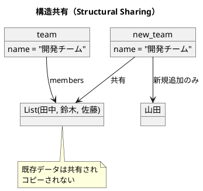

# 第1章: 不変性とデータ変換

## はじめに

関数型プログラミングの最も重要な概念の一つが**不変性（Immutability）**です。不変データ構造を使用することで、プログラムの予測可能性が向上し、並行処理でのバグを防ぎ、コードの理解と保守が容易になります。

本章では、Elixir における不変データ構造の基本から、パイプ演算子によるデータ変換、副作用の分離まで、実践的な例を通じて学びます。

## 1. 不変データ構造の基本

### なぜ不変性が重要なのか

Elixir ではすべてのデータがデフォルトで不変です。データを「変更」すると、常に新しいデータ構造が作成されます：

```elixir
defmodule Person do
  @enforce_keys [:name, :age]
  defstruct [:name, :age]
end

def update_age(%Person{} = person, new_age) do
  %{person | age: new_age}
end

# 使用例
original_person = %Person{name: "田中", age: 30}
updated_person = update_age(original_person, 31)

original_person   # => %Person{name: "田中", age: 30}  ← 元のデータは変わらない
updated_person    # => %Person{name: "田中", age: 31}  ← 新しいデータ
```

### 不変性の利点

1. **予測可能性**: データが変更されないため、関数の動作を予測しやすい
2. **スレッドセーフ**: 複数のプロセスから安全にアクセスできる
3. **履歴の保持**: 変更前のデータを保持できる（Undo/Redo の実装が容易）
4. **デバッグの容易さ**: データの変更履歴を追跡しやすい

## 2. 構造共有（Structural Sharing）

「毎回新しいデータ構造を作成すると非効率では？」と思うかもしれません。Elixir の永続的データ構造は**構造共有**により、効率的にメモリを使用します。

```elixir
defmodule Member do
  defstruct [:name, :role]
end

defmodule Team do
  defstruct [:name, :members]
end

def add_member(%Team{members: members} = team, %Member{} = member) do
  %{team | members: members ++ [member]}
end

team = %Team{name: "開発チーム", members: [
  %Member{name: "田中", role: "developer"},
  %Member{name: "鈴木", role: "designer"},
  %Member{name: "佐藤", role: "manager"}
]}

new_team = add_member(team, %Member{name: "山田", role: "developer"})
```

`new_team` は新しい Team ですが、`name` の値や既存のメンバーデータは `team` と共有されています。変更されていない部分はコピーされず、参照が共有されます。



## 3. データ変換パイプライン

関数型プログラミングでは、データを変換する一連の処理を**パイプライン**として表現します。Elixir ではパイプ演算子 `|>` を使用して、読みやすいパイプラインを構築できます。

### 実践例：注文処理システム

```elixir
defmodule Item do
  defstruct [:name, :price, :quantity]
end

defmodule Customer do
  defstruct [:name, :membership]
end

defmodule Order do
  defstruct [:items, :customer]
end

# 各アイテムの小計を計算
def calculate_subtotal(%Item{price: price, quantity: quantity}) do
  price * quantity
end

# 会員種別に応じた割引率を取得
def membership_discount(membership) do
  case membership do
    "gold"   -> 0.1
    "silver" -> 0.05
    "bronze" -> 0.02
    _        -> 0.0
  end
end

# 注文の合計金額を計算
def calculate_total(items) do
  items
  |> Enum.map(&calculate_subtotal/1)
  |> Enum.sum()
end

# 割引を適用した金額を計算
def apply_discount(total, membership) do
  discount_rate = membership_discount(membership)
  total * (1 - discount_rate)
end

# 注文を処理し、割引後の合計金額を返す
def process_order(%Order{items: items, customer: customer}) do
  items
  |> calculate_total()
  |> apply_discount(customer.membership)
end
```

### Elixir のパイプ演算子

パイプ演算子 `|>` は、左側の式の結果を右側の関数の第一引数として渡します：

```elixir
# パイプ演算子を使用
items
|> Enum.map(&calculate_subtotal/1)
|> Enum.sum()

# 上記と同等の入れ子呼び出し
Enum.sum(Enum.map(items, &calculate_subtotal/1))
```

パイプ演算子を使うと、データの流れが上から下へと明確になり、可読性が向上します。

## 4. 副作用の分離

関数型プログラミングでは、**純粋関数**と**副作用を持つ関数**を明確に分離することが重要です。

### 純粋関数とは

- 同じ入力に対して常に同じ出力を返す
- 外部の状態を変更しない（副作用がない）

```elixir
# 純粋関数
def calculate_tax(amount, tax_rate) do
  amount * tax_rate
end

# 何度呼んでも同じ結果
calculate_tax(1000, 0.1)  # => 100.0
calculate_tax(1000, 0.1)  # => 100.0
```

### 副作用の分離パターン

ビジネスロジック（純粋関数）と副作用（I/O）を分離します：

```elixir
defmodule Invoice do
  defstruct [:subtotal, :tax, :total]
end

# ビジネスロジック（純粋関数）
def calculate_invoice(items, tax_rate) do
  subtotal = calculate_total(items)
  tax = calculate_tax(subtotal, tax_rate)
  total = subtotal + tax
  %Invoice{subtotal: subtotal, tax: tax, total: total}
end

# 副作用を含む処理（分離）
def save_invoice(%Invoice{} = invoice) do
  # データベースへの保存（副作用）
  IO.puts("Saving invoice: #{inspect(invoice)}")
  invoice
end

def send_notification(%Invoice{} = invoice, customer_email) do
  # メール送信（副作用）
  IO.puts("Sending notification to: #{customer_email}")
  invoice
end

# 処理全体のオーケストレーション
def process_and_save_invoice(items, tax_rate, customer_email) do
  items
  |> calculate_invoice(tax_rate)
  |> save_invoice()
  |> send_notification(customer_email)
end
```

Elixir では慣例的に副作用を持つ関数に `!` サフィックスを付けることがあります（例：`File.read!`）。

## 5. 永続的データ構造の活用：Undo/Redo の実装

不変データ構造を活用すると、履歴管理が非常に簡単に実装できます。

```elixir
defmodule History do
  defstruct current: nil, past: [], future: []
end

# 空の履歴を作成
def create_history, do: %History{}

# 新しい状態を履歴にプッシュ
def push_state(%History{current: nil} = history, new_state) do
  %{history | current: new_state}
end

def push_state(%History{current: current, past: past} = history, new_state) do
  %{history | current: new_state, past: [current | past], future: []}
end

# 直前の状態に戻す（Undo）
def undo(%History{past: []} = history), do: history

def undo(%History{current: current, past: [previous | rest], future: future}) do
  %History{current: previous, past: rest, future: [current | future]}
end

# やり直し操作（Redo）
def redo(%History{future: []} = history), do: history

def redo(%History{current: current, past: past, future: [next | rest]}) do
  %History{current: next, past: [current | past], future: rest}
end
```

### 使用例

```elixir
history =
  create_history()
  |> push_state(%{text: "Hello"})
  |> push_state(%{text: "Hello World"})
  |> push_state(%{text: "Hello World!"})

history.current  # => %{text: "Hello World!"}

after_undo = undo(history)
after_undo.current  # => %{text: "Hello World"}

after_redo = redo(after_undo)
after_redo.current  # => %{text: "Hello World!"}
```

## 6. Stream による遅延評価

複数の変換を行う場合、通常の `Enum` では中間リストが作成されます。Elixir では **Stream** を使用すると、複数の変換を1回のパスで処理できます。

```elixir
# 通常の Enum 処理（中間リストが作成される）
def process_items(items) do
  items
  |> Enum.filter(&(&1.quantity > 0))
  |> Enum.map(fn item ->
    %ProcessedItem{
      name: item.name,
      price: item.price,
      quantity: item.quantity,
      subtotal: calculate_subtotal(item)
    }
  end)
  |> Enum.filter(&(&1.subtotal > 100))
end

# Stream を使用した遅延評価（中間リストを作成しない）
def process_items_lazy(items) do
  items
  |> Stream.filter(&(&1.quantity > 0))
  |> Stream.map(fn item ->
    %ProcessedItem{
      name: item.name,
      price: item.price,
      quantity: item.quantity,
      subtotal: calculate_subtotal(item)
    }
  end)
  |> Stream.filter(&(&1.subtotal > 100))
  |> Enum.to_list()
end
```

Stream の利点：
- 中間リストを作成しない
- 遅延評価により必要な要素のみ処理
- メモリ効率が良い

### 無限ストリーム

Stream は無限シーケンスも扱えます：

```elixir
def take_even_numbers(count) do
  Stream.iterate(1, &(&1 + 1))
  |> Stream.filter(&(rem(&1, 2) == 0))
  |> Enum.take(count)
end

take_even_numbers(5)  # => [2, 4, 6, 8, 10]
```

## 7. ネストしたデータの操作

Elixir には `get_in`、`put_in`、`update_in` というマクロがあり、ネストしたデータ構造を簡潔に操作できます。

```elixir
data = %{user: %{profile: %{name: "田中", age: 30}}}

# ネストした値の取得
get_in(data, [:user, :profile, :name])  # => "田中"

# ネストした値の更新（新しいマップを返す）
put_in(data, [:user, :profile, :name], "鈴木")
# => %{user: %{profile: %{name: "鈴木", age: 30}}}

# ネストした値を関数で更新
update_in(data, [:user, :profile, :age], &(&1 + 1))
# => %{user: %{profile: %{name: "田中", age: 31}}}

# 元のデータは変更されない
data  # => %{user: %{profile: %{name: "田中", age: 30}}}
```

## まとめ

本章では、関数型プログラミングの基礎である不変性について学びました：

1. **不変データ構造**: 構造体と `%{struct | key: value}` による不変性の実現
2. **構造共有**: 効率的なメモリ使用を実現する永続的データ構造
3. **パイプ演算子**: `|>` による読みやすいデータ変換パイプライン
4. **副作用の分離**: 純粋関数と I/O 処理の明確な分離
5. **履歴管理**: 不変性を活用した Undo/Redo の簡潔な実装
6. **Stream**: 効率的な遅延評価による複合変換
7. **ネストした操作**: `get_in`/`put_in`/`update_in` による簡潔な操作

これらの概念は、関数型プログラミングの他のすべてのパターンの基盤となります。

## 参考コード

本章のコード例は以下のファイルで確認できます：

- ソースコード: `app/elixir/part1/lib/chapter01.ex`
- テストコード: `app/elixir/part1/test/chapter01_test.exs`

## 次章予告

次章では、**関数合成と高階関数**について学びます。小さな関数を組み合わせて複雑な処理を構築する方法を探ります。
