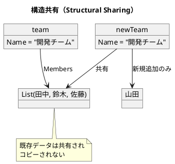

# 第1章: 不変性とデータ変換

## はじめに

関数型プログラミングの最も重要な概念の一つが**不変性（Immutability）**です。不変データ構造を使用することで、プログラムの予測可能性が向上し、並行処理でのバグを防ぎ、コードの理解と保守が容易になります。

本章では、F# における不変データ構造の基本から、データ変換パイプライン、副作用の分離まで、実践的な例を通じて学びます。

## 1. 不変データ構造の基本

### なぜ不変性が重要なのか

従来の命令型プログラミングでは、変数やオブジェクトの状態を直接変更します：

```csharp
// C#（可変）
person.Age = 31;  // 元のオブジェクトが変更される
```

これに対し、F# のレコードはデフォルトで不変です。データを「変更」すると、新しいデータ構造が作成されます：

```fsharp
type Person = { Name: string; Age: int }

let updateAge person newAge = { person with Age = newAge }

// 使用例
let originalPerson = { Name = "田中"; Age = 30 }
let updatedPerson = updateAge originalPerson 31

originalPerson   // => { Name = "田中"; Age = 30 }  ← 元のデータは変わらない
updatedPerson    // => { Name = "田中"; Age = 31 }  ← 新しいデータ
```

### 不変性の利点

1. **予測可能性**: データが変更されないため、関数の動作を予測しやすい
2. **スレッドセーフ**: 複数のスレッドから安全にアクセスできる
3. **履歴の保持**: 変更前のデータを保持できる（Undo/Redo の実装が容易）
4. **デバッグの容易さ**: データの変更履歴を追跡しやすい

## 2. 構造共有（Structural Sharing）

「毎回新しいデータ構造を作成すると非効率では？」と思うかもしれません。F# は**構造共有**により、効率的にメモリを使用します。

```fsharp
type Member = { Name: string; Role: string }
type Team = { Name: string; Members: Member list }

let addMember team newMember =
    { team with Members = team.Members @ [ newMember ] }

let team = 
    { Name = "開発チーム"
      Members = 
        [ { Name = "田中"; Role = "developer" }
          { Name = "鈴木"; Role = "designer" }
          { Name = "佐藤"; Role = "manager" } ] }

let newTeam = addMember team { Name = "山田"; Role = "developer" }
```

`newTeam` は新しい Team ですが、`Name` の値や既存のメンバーデータは `team` と共有されています。



## 3. データ変換パイプライン

関数型プログラミングでは、データを変換する一連の処理を**パイプライン**として表現します。F# では**パイプライン演算子**（`|>`）を使用して、読みやすいパイプラインを構築できます。

### 実践例：注文処理システム

```fsharp
type Item = { Name: string; Price: int; Quantity: int }

type Membership =
    | Gold
    | Silver
    | Bronze
    | Standard

type Customer = { Name: string; Membership: Membership }
type Order = { Items: Item list; Customer: Customer }

/// 小計を計算
let calculateSubtotal item = item.Price * item.Quantity

/// 会員種別に応じた割引率を取得
let membershipDiscount = function
    | Gold -> 0.1
    | Silver -> 0.05
    | Bronze -> 0.02
    | Standard -> 0.0

/// 注文の合計金額を計算
let calculateTotal order =
    order.Items |> List.map calculateSubtotal |> List.sum

/// 割引後の金額を計算
let applyDiscount order total =
    let discountRate = membershipDiscount order.Customer.Membership
    float total * (1.0 - discountRate)
```

### パイプライン演算子の活用

F# のパイプライン演算子 `|>` は、左辺の値を右辺の関数の最後の引数として渡します。

```fsharp
/// 注文処理パイプライン
let processOrder order =
    order
    |> calculateTotal
    |> applyDiscount order

// 使用例
let order = 
    { Items = 
        [ { Name = "商品A"; Price = 1000; Quantity = 2 }    // 2000
          { Name = "商品B"; Price = 500; Quantity = 3 }     // 1500
          { Name = "商品C"; Price = 2000; Quantity = 1 } ]  // 2000
      Customer = { Name = "山田"; Membership = Gold } }

let result = processOrder order  // 5500 * 0.9 = 4950.0
```

## 4. 副作用の分離

関数型プログラミングでは、**純粋関数**と**副作用を持つ関数**を明確に分離することが重要です。

### 純粋関数とは

- 同じ入力に対して常に同じ出力を返す
- 外部の状態を変更しない（副作用がない）

```fsharp
/// 税金を計算（純粋関数）
let calculateTax amount taxRate = float amount * taxRate

// 何度呼んでも同じ結果
calculateTax 1000 0.1  // => 100.0
calculateTax 1000 0.1  // => 100.0
```

### 副作用の分離パターン

ビジネスロジック（純粋関数）と副作用（I/O）を分離します：

```fsharp
type Invoice = 
    { Subtotal: int
      Tax: float
      Total: float }

/// 請求書を作成（純粋関数）
let calculateInvoice items taxRate =
    let subtotal = items |> List.map calculateSubtotal |> List.sum
    let tax = calculateTax subtotal taxRate
    let total = float subtotal + tax
    { Subtotal = subtotal; Tax = tax; Total = total }

/// 副作用を含む処理（分離）
let saveInvoice invoice =
    // データベースへの保存（副作用）
    printfn "Saving invoice: %A" invoice
    invoice

let sendNotification invoice customerEmail =
    // メール送信（副作用）
    printfn "Sending notification to: %s" customerEmail
    invoice

/// 処理全体のオーケストレーション
let processAndSaveInvoice items taxRate customerEmail =
    calculateInvoice items taxRate
    |> saveInvoice
    |> fun invoice -> sendNotification invoice customerEmail
```

## 5. 永続的データ構造の活用：Undo/Redo の実装

不変データ構造を活用すると、履歴管理が非常に簡単に実装できます。

```fsharp
type History<'T> =
    { Current: 'T option
      Past: 'T list
      Future: 'T list }

let createHistory () = { Current = None; Past = []; Future = [] }

let pushState newState history =
    let newPast =
        match history.Current with
        | Some current -> current :: history.Past
        | None -> history.Past
    { Current = Some newState; Past = newPast; Future = [] }

let undo history =
    match history.Past with
    | [] -> history
    | previous :: rest ->
        let newFuture =
            match history.Current with
            | Some current -> current :: history.Future
            | None -> history.Future
        { Current = Some previous; Past = rest; Future = newFuture }

let redo history =
    match history.Future with
    | [] -> history
    | next :: rest ->
        let newPast =
            match history.Current with
            | Some current -> current :: history.Past
            | None -> history.Past
        { Current = Some next; Past = newPast; Future = rest }

let currentState history = history.Current
```

### 使用例

```fsharp
let history =
    createHistory ()
    |> pushState {| Text = "Hello" |}
    |> pushState {| Text = "Hello World" |}
    |> pushState {| Text = "Hello World!" |}

currentState history  // => Some {| Text = "Hello World!" |}

let afterUndo = undo history
currentState afterUndo  // => Some {| Text = "Hello World" |}

let afterRedo = redo afterUndo
currentState afterRedo  // => Some {| Text = "Hello World!" |}
```

## 6. 効率的な変換（Seq による遅延評価）

複数の変換を行う場合、`Seq` を使用すると遅延評価により効率的に処理できます。

```fsharp
let processItemsEfficiently items =
    items
    |> Seq.filter (fun item -> item.Quantity > 0)
    |> Seq.map (fun item -> {| item with Subtotal = calculateSubtotal item |})
    |> Seq.filter (fun item -> item.Subtotal > 100)
    |> Seq.toList
```

`Seq` の利点：
- 中間コレクションを作成しない
- 必要な分だけ処理（遅延評価）
- メモリ効率が良い

## 7. 不変リストの操作

F# のリストは不変の連結リストです。

```fsharp
/// リストの先頭に追加（効率的：O(1)）
let prepend item list = item :: list

/// リストの末尾に追加（非効率：O(n)）
let append item list = list @ [ item ]

/// リストを結合
let concat list1 list2 = list1 @ list2

/// 条件でフィルタリング
let filterBy predicate list = List.filter predicate list

/// マッピング
let mapWith f list = List.map f list

/// 畳み込み
let foldWith folder initial list = List.fold folder initial list
```

## 8. 不変 Map の操作

```fsharp
/// エントリを追加
let addEntry key value map = Map.add key value map

/// エントリを削除
let removeEntry key map = Map.remove key map

/// 値を取得
let tryGetValue key map = Map.tryFind key map

/// キーが存在するか
let containsKey key map = Map.containsKey key map

/// 値を更新
let updateValue key updater map =
    match Map.tryFind key map with
    | Some value -> Map.add key (updater value) map
    | None -> map
```

## テストコード

```fsharp
[<Fact>]
let ``Person レコードは不変`` () =
    let original = { Name = "田中"; Age = 30 }
    let updated = updateAge original 31
    Assert.Equal(30, original.Age)  // 元は変わらない
    Assert.Equal(31, updated.Age)

[<Fact>]
let ``注文処理パイプライン`` () =
    let order = 
        { Items = 
            [ { Name = "商品A"; Price = 1000; Quantity = 2 }
              { Name = "商品B"; Price = 500; Quantity = 3 }
              { Name = "商品C"; Price = 2000; Quantity = 1 } ]
          Customer = { Name = "山田"; Membership = Gold } }
    let result = processOrder order
    Assert.Equal(4950.0, result)

[<Fact>]
let ``Undo で前の状態に戻る`` () =
    let history: History<string> =
        createHistory ()
        |> pushState "A"
        |> pushState "B"
        |> pushState "C"
        |> undo
    Assert.Equal(Some "B", currentState history)
```

## まとめ

本章では、関数型プログラミングの基礎である不変性について学びました：

1. **不変データ構造**: レコードはデフォルトで不変、`with` 式で新しいレコードを作成
2. **構造共有**: 効率的なメモリ使用を実現
3. **データ変換パイプライン**: `|>` 演算子による読みやすい変換処理
4. **副作用の分離**: 純粋関数と I/O 処理の明確な分離
5. **履歴管理**: 不変性を活用した Undo/Redo の簡潔な実装
6. **遅延評価**: `Seq` による効率的な変換

これらの概念は、関数型プログラミングの他のすべてのパターンの基盤となります。

## 参考コード

本章のコード例は以下のファイルで確認できます：

- ソースコード: `app/fsharp/part1/src/Library.fs`
- テストコード: `app/fsharp/part1/tests/Tests.fs`

## 次章予告

次章では、**関数合成と高階関数**について学びます。小さな関数を組み合わせて複雑な処理を構築する方法を探ります。
