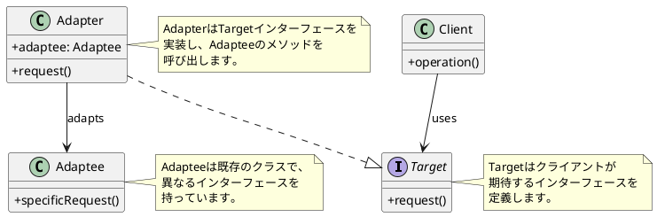

# 第9章: Adapter パターン

## はじめに

Adapter パターンは、既存のクラスのインターフェースを、クライアントが期待する別のインターフェースに変換するパターンです。このパターンを使用すると、互換性のないインターフェースを持つクラス同士を連携させることができます。

本章では、可変強度ライトのアダプターとデータフォーマット変換について学びます。

## 1. パターンの構造

Adapter パターンは以下の要素で構成されます：

- **Target**: クライアントが期待するインターフェース
- **Adaptee**: 既存のクラス（適応される側）
- **Adapter**: Target インターフェースを実装し、Adaptee を使用



## 2. VariableLight の例

### Switchable インターフェース (Target)

```fsharp
/// Switchableインターフェース（Target）
type Switchable =
    abstract member TurnOn: unit -> unit
    abstract member TurnOff: unit -> unit
```

### VariableLight (Adaptee)

可変強度を持つライトは、単純なオン/オフではなく、強度を指定する必要があります。

```fsharp
/// 可変強度ライト（Adaptee）
type VariableLight() =
    member this.SetIntensity(intensity: int) =
        printfn "VariableLight: intensity set to %d" intensity
        intensity
```

### VariableLightAdapter (Adapter)

```fsharp
/// VariableLightをSwitchableに適応させるアダプター
type VariableLightAdapter(light: VariableLight, minIntensity: int, maxIntensity: int) =
    interface Switchable with
        member this.TurnOn() =
            light.SetIntensity(maxIntensity) |> ignore
        member this.TurnOff() =
            light.SetIntensity(minIntensity) |> ignore
```

### 関数型アダプター

F# では、関数を使ったアダプターも自然に実装できます：

```fsharp
module VariableLightAdapter =
    /// VariableLight を Switchable 風の関数に適応
    let adapt (minIntensity: int) (maxIntensity: int) (light: VariableLight) =
        let turnOn () = light.SetIntensity(maxIntensity) |> ignore
        let turnOff () = light.SetIntensity(minIntensity) |> ignore
        (turnOn, turnOff)
```

### 使用例

```fsharp
// アダプターを作成（最小0、最大100）
let light = VariableLight()
let adapter = VariableLightAdapter(light, 0, 100) :> Switchable

// Switchableインターフェースで操作
adapter.TurnOn()   // VariableLight: intensity set to 100
adapter.TurnOff()  // VariableLight: intensity set to 0

// 関数型アダプターの場合
let (turnOn, turnOff) = VariableLightAdapter.adapt 0 100 light
turnOn()  // VariableLight: intensity set to 100
turnOff() // VariableLight: intensity set to 0
```

## 3. データフォーマットアダプター

### ユーザーフォーマット変換

異なるシステム間でデータフォーマットが異なる場合、アダプターを使って変換します。

```fsharp
/// 旧ユーザーフォーマット
type OldUserFormat =
    { FirstName: string
      LastName: string
      EmailAddress: string
      PhoneNumber: string }

/// 新ユーザーフォーマット
type NewUserFormat =
    { Name: string
      Email: string
      Phone: string
      Metadata: Map<string, obj> }

module UserFormatAdapter =
    /// 旧フォーマットを新フォーマットに変換
    let oldToNew (oldUser: OldUserFormat) : NewUserFormat =
        { Name = sprintf "%s %s" oldUser.LastName oldUser.FirstName
          Email = oldUser.EmailAddress
          Phone = oldUser.PhoneNumber
          Metadata = Map.ofList [ ("migrated", box true); ("originalFormat", box "old") ] }

    /// 新フォーマットを旧フォーマットに変換
    let newToOld (newUser: NewUserFormat) : OldUserFormat =
        let nameParts = newUser.Name.Split(' ')
        let lastName = if nameParts.Length > 0 then nameParts.[0] else ""
        let firstName = if nameParts.Length > 1 then nameParts.[1] else ""
        { FirstName = firstName
          LastName = lastName
          EmailAddress = newUser.Email
          PhoneNumber = newUser.Phone }
```

### 使用例

```fsharp
// 旧フォーマット → 新フォーマット
let oldUser =
    { FirstName = "太郎"
      LastName = "山田"
      EmailAddress = "taro@example.com"
      PhoneNumber = "090-1234-5678" }

let newUser = UserFormatAdapter.oldToNew oldUser
// { Name = "山田 太郎"
//   Email = "taro@example.com"
//   Phone = "090-1234-5678"
//   Metadata = ... }

// 新フォーマット → 旧フォーマット
let converted = UserFormatAdapter.newToOld newUser
// { FirstName = "太郎"
//   LastName = "山田"
//   EmailAddress = "taro@example.com"
//   PhoneNumber = "090-1234-5678" }
```

## 4. 温度変換アダプター

```fsharp
/// 温度の単位
[<RequireQualifiedAccess>]
type TemperatureUnit =
    | Celsius
    | Fahrenheit
    | Kelvin

type Temperature = { Value: float; Unit: TemperatureUnit }

module TemperatureAdapter =
    /// 華氏を摂氏に変換
    let fahrenheitToCelsius (temp: Temperature) : Temperature =
        match temp.Unit with
        | TemperatureUnit.Fahrenheit ->
            { Value = (temp.Value - 32.0) * 5.0 / 9.0
              Unit = TemperatureUnit.Celsius }
        | _ -> temp

    /// 摂氏を華氏に変換
    let celsiusToFahrenheit (temp: Temperature) : Temperature =
        match temp.Unit with
        | TemperatureUnit.Celsius ->
            { Value = temp.Value * 9.0 / 5.0 + 32.0
              Unit = TemperatureUnit.Fahrenheit }
        | _ -> temp

    /// ケルビンを摂氏に変換
    let kelvinToCelsius (temp: Temperature) : Temperature =
        match temp.Unit with
        | TemperatureUnit.Kelvin ->
            { Value = temp.Value - 273.15
              Unit = TemperatureUnit.Celsius }
        | _ -> temp
```

## 5. 日付・時刻変換アダプター

```fsharp
module DateTimeAdapter =
    /// Unix タイムスタンプを DateTime に変換
    let unixToDateTime (timestamp: int64) : System.DateTime =
        System.DateTimeOffset.FromUnixTimeSeconds(timestamp).DateTime

    /// DateTime を Unix タイムスタンプに変換
    let dateTimeToUnix (dt: System.DateTime) : int64 =
        System.DateTimeOffset(dt).ToUnixTimeSeconds()

    /// ISO8601 文字列を DateTime に変換
    let iso8601ToDateTime (iso: string) : System.DateTime option =
        match System.DateTime.TryParse(iso) with
        | true, dt -> Some dt
        | false, _ -> None

    /// DateTime を ISO8601 文字列に変換
    let dateTimeToIso8601 (dt: System.DateTime) : string =
        dt.ToString("o")
```

## 6. 通貨変換アダプター

```fsharp
[<RequireQualifiedAccess>]
type Currency =
    | USD of decimal
    | JPY of decimal
    | EUR of decimal
    | GBP of decimal

module CurrencyAdapter =
    let private rates =
        Map.ofList
            [ ("USD_JPY", 150.0m)
              ("EUR_USD", 1.08m)
              ("GBP_USD", 1.27m) ]

    /// USD を JPY に変換
    let usdToJpy (currency: Currency) : Currency =
        match currency with
        | Currency.USD amount ->
            Currency.JPY(amount * rates.["USD_JPY"])
        | _ -> currency

    /// JPY を USD に変換
    let jpyToUsd (currency: Currency) : Currency =
        match currency with
        | Currency.JPY amount ->
            Currency.USD(amount / rates.["USD_JPY"])
        | _ -> currency
```

## 7. ファイルパス変換アダプター

```fsharp
module FilePathAdapter =
    /// Windows パスを Unix パスに変換
    let windowsToUnix (path: string) : string =
        path.Replace("\\", "/")
            .Replace("C:", "/c")
            .Replace("D:", "/d")

    /// Unix パスを Windows パスに変換
    let unixToWindows (path: string) : string =
        let result = path.Replace("/", "\\")
        if result.StartsWith("\\c\\") then
            "C:" + result.Substring(2)
        elif result.StartsWith("\\d\\") then
            "D:" + result.Substring(2)
        else
            result
```

## 8. ログレベル変換アダプター

```fsharp
/// アプリケーションのログレベル
[<RequireQualifiedAccess>]
type AppLogLevel =
    | Trace
    | Debug
    | Info
    | Warning
    | Error
    | Fatal

/// 外部ライブラリのログレベル
type ExternalLogLevel =
    | Verbose = 0
    | Debug = 1
    | Information = 2
    | Warning = 3
    | Error = 4
    | Critical = 5

module LogLevelAdapter =
    /// アプリのログレベルを外部形式に変換
    let appToExternal level =
        match level with
        | AppLogLevel.Trace -> ExternalLogLevel.Verbose
        | AppLogLevel.Debug -> ExternalLogLevel.Debug
        | AppLogLevel.Info -> ExternalLogLevel.Information
        | AppLogLevel.Warning -> ExternalLogLevel.Warning
        | AppLogLevel.Error -> ExternalLogLevel.Error
        | AppLogLevel.Fatal -> ExternalLogLevel.Critical

    /// 外部形式をアプリのログレベルに変換
    let externalToApp level =
        match level with
        | ExternalLogLevel.Verbose -> AppLogLevel.Trace
        | ExternalLogLevel.Debug -> AppLogLevel.Debug
        | ExternalLogLevel.Information -> AppLogLevel.Info
        | ExternalLogLevel.Warning -> AppLogLevel.Warning
        | ExternalLogLevel.Error -> AppLogLevel.Error
        | ExternalLogLevel.Critical -> AppLogLevel.Fatal
        | _ -> AppLogLevel.Info
```

## 9. コレクション変換アダプター

```fsharp
module CollectionAdapter =
    /// Array を List に変換
    let arrayToList (arr: 'T array) = Array.toList arr

    /// List を Array に変換
    let listToArray (lst: 'T list) = List.toArray lst

    /// Seq を List に変換
    let seqToList (seq: 'T seq) = Seq.toList seq

    /// List を Seq に変換
    let listToSeq (lst: 'T list) = List.toSeq lst

    /// Dictionary を Map に変換
    let dictToMap (dict: System.Collections.Generic.Dictionary<'K, 'V>) =
        dict |> Seq.map (fun kvp -> (kvp.Key, kvp.Value)) |> Map.ofSeq

    /// Map を Dictionary に変換
    let mapToDict (map: Map<'K, 'V>) =
        let dict = System.Collections.Generic.Dictionary<'K, 'V>()
        map |> Map.iter (fun k v -> dict.[k] <- v)
        dict
```

## 10. Result 型変換アダプター

F# の `Result` 型と他の形式間の変換：

```fsharp
module ResultAdapter =
    /// Option を Result に変換
    let optionToResult (error: 'E) (opt: 'T option) : Result<'T, 'E> =
        match opt with
        | Some v -> Ok v
        | None -> Error error

    /// Result を Option に変換
    let resultToOption (result: Result<'T, 'E>) : 'T option =
        match result with
        | Ok v -> Some v
        | Error _ -> None

    /// 例外ベースの処理を Result に変換
    let tryToResult (f: unit -> 'T) : Result<'T, exn> =
        try
            Ok(f ())
        with ex ->
            Error ex

    /// Result を例外ベースに変換（例外をスロー）
    let resultToTry (result: Result<'T, exn>) : 'T =
        match result with
        | Ok v -> v
        | Error ex -> raise ex
```

### 使用例

```fsharp
// Option → Result
let maybeValue: int option = Some 42
let result = ResultAdapter.optionToResult "値が見つかりません" maybeValue
// Ok 42

let nothing: int option = None
let errorResult = ResultAdapter.optionToResult "値が見つかりません" nothing
// Error "値が見つかりません"

// 例外ベース → Result
let safeDiv =
    ResultAdapter.tryToResult (fun () -> 10 / 2)
// Ok 5

let failedDiv =
    ResultAdapter.tryToResult (fun () -> 10 / 0)
// Error (System.DivideByZeroException)
```

## 11. パターンの利点

1. **既存コードの再利用**: 既存のクラスを変更せずに新しいインターフェースで使用
2. **単一責任の原則**: インターフェース変換のロジックを分離
3. **開放/閉鎖の原則**: 新しいアダプターを追加しても既存コードは変更不要
4. **レガシーシステムとの統合**: 古いシステムと新しいシステムを連携

## 12. 関数型プログラミングでの特徴

F# での Adapter パターンの実装には以下の特徴があります：

1. **関数による変換**: 単純なデータ変換は関数で直接実装
2. **パイプライン演算子**: 変換を連鎖させやすい
3. **イミュータブルなデータ**: 変換後も元のデータは変更されない
4. **型安全**: コンパイル時に型の不整合を検出
5. **合成のしやすさ**: 複数のアダプターを `>>` で合成可能

```fsharp
// アダプターの合成例
let convertAndFormat =
    TemperatureAdapter.celsiusToFahrenheit
    >> fun temp -> sprintf "%.1f°F" temp.Value

let result = { Value = 100.0; Unit = TemperatureUnit.Celsius } |> convertAndFormat
// "212.0°F"
```

## まとめ

本章では、Adapter パターンについて学びました：

1. **VariableLightAdapter**: 可変強度ライトを単純なオン/オフインターフェースに適応
2. **データフォーマットアダプター**: 異なるデータ形式間の変換
3. **型変換アダプター**: 温度、通貨、日時などの単位変換
4. **コレクションアダプター**: 異なるコレクション型間の変換
5. **Result アダプター**: エラーハンドリング方式間の変換

F# では、関数とパイプライン演算子を活用することで、シンプルで合成しやすいアダプターを実装できます。

## 参考コード

本章のコード例は以下のファイルで確認できます：

- ソースコード: `app/fsharp/part3/src/Library.fs`
- テストコード: `app/fsharp/part3/tests/Tests.fs`

## 次章予告

次章では、**Strategy パターン**について学びます。アルゴリズムをカプセル化し、実行時に切り替え可能にする方法を探ります。
