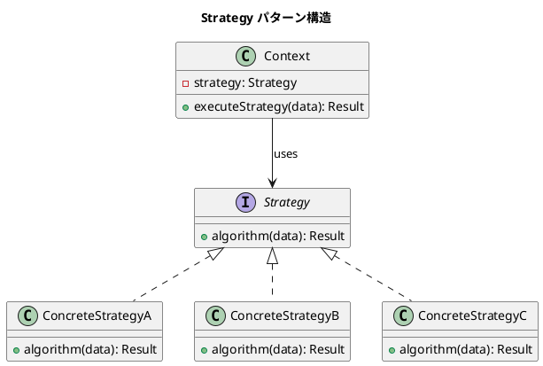

# 第10章: Strategy パターン

## はじめに

Strategy パターンは、アルゴリズムをカプセル化し、それらを交換可能にするパターンです。このパターンを使用すると、アルゴリズムをクライアントから独立して変更できます。

本章では、料金計算、配送料金、支払い方法などの例を通じて、判別共用体と高階関数による Strategy パターンの実装を学びます。

## 1. パターンの構造

Strategy パターンは以下の要素で構成されます：

- **Strategy**: アルゴリズムのインターフェース
- **ConcreteStrategy**: 具体的なアルゴリズムの実装
- **Context**: Strategy を使用するクライアント



## 2. 料金計算戦略（判別共用体版）

### 会員レベルと料金戦略の定義

```fsharp
/// 会員レベル
[<RequireQualifiedAccess>]
type MemberLevel =
    | Gold
    | Silver
    | Bronze

/// 料金計算戦略
[<RequireQualifiedAccess>]
type PricingStrategy =
    | Regular
    | Discount of rate: decimal
    | Member of level: MemberLevel
    | Bulk of threshold: decimal * bulkDiscount: decimal
```

### 料金計算の実装

```fsharp
module PricingStrategy =
    /// 料金を計算する
    let calculatePrice (strategy: PricingStrategy) (amount: decimal) : decimal =
        match strategy with
        | PricingStrategy.Regular -> amount
        | PricingStrategy.Discount rate -> amount * (1.0m - rate)
        | PricingStrategy.Member level ->
            let rate =
                match level with
                | MemberLevel.Gold -> 0.20m
                | MemberLevel.Silver -> 0.15m
                | MemberLevel.Bronze -> 0.10m
            amount * (1.0m - rate)
        | PricingStrategy.Bulk(threshold, bulkDiscount) ->
            if amount >= threshold then
                amount * (1.0m - bulkDiscount)
            else
                amount
```

### 使用例

```fsharp
// 通常料金
PricingStrategy.calculatePrice PricingStrategy.Regular 1000.0m
// => 1000.0m

// 10%割引
PricingStrategy.calculatePrice (PricingStrategy.Discount 0.10m) 1000.0m
// => 900.0m

// ゴールド会員料金
PricingStrategy.calculatePrice (PricingStrategy.Member MemberLevel.Gold) 1000.0m
// => 800.0m
```

## 3. Context: ショッピングカート

```fsharp
type CartItem =
    { Name: string
      Price: decimal
      Quantity: int }

type ShoppingCart =
    { Items: CartItem list
      Strategy: PricingStrategy }

module ShoppingCart =
    /// カートを作成
    let create (items: CartItem list) (strategy: PricingStrategy) : ShoppingCart =
        { Items = items; Strategy = strategy }

    /// カートの小計を計算
    let subtotal (cart: ShoppingCart) : decimal =
        cart.Items
        |> List.sumBy (fun item -> item.Price * decimal item.Quantity)

    /// カートの合計金額を計算
    let total (cart: ShoppingCart) : decimal =
        let sub = subtotal cart
        PricingStrategy.calculatePrice cart.Strategy sub

    /// 戦略を変更
    let changeStrategy (newStrategy: PricingStrategy) (cart: ShoppingCart) : ShoppingCart =
        { cart with Strategy = newStrategy }
```

### 使用例

```fsharp
// カートを作成
let items =
    [ { Name = "Item A"; Price = 500.0m; Quantity = 1 }
      { Name = "Item B"; Price = 500.0m; Quantity = 1 } ]

let cart = ShoppingCart.create items PricingStrategy.Regular
ShoppingCart.total cart  // => 1000.0m

// 戦略を変更
let discountedCart = ShoppingCart.changeStrategy (PricingStrategy.Member MemberLevel.Gold) cart
ShoppingCart.total discountedCart  // => 800.0m
```

## 4. 関数型アプローチ（高階関数版）

F# では、関数を第一級オブジェクトとして扱えるため、より簡潔に Strategy パターンを実装できます。

```fsharp
module FunctionalStrategy =
    /// 通常料金戦略
    let regularPricing: decimal -> decimal = id

    /// 割引料金戦略を作成
    let discountPricing (rate: decimal) : decimal -> decimal =
        fun amount -> amount * (1.0m - rate)

    /// 会員料金戦略を作成
    let memberPricing (level: MemberLevel) : decimal -> decimal =
        let rate =
            match level with
            | MemberLevel.Gold -> 0.20m
            | MemberLevel.Silver -> 0.15m
            | MemberLevel.Bronze -> 0.10m
        fun amount -> amount * (1.0m - rate)

    /// 税金戦略を作成
    let taxStrategy (taxRate: decimal) : decimal -> decimal =
        fun amount -> amount * (1.0m + taxRate)

    /// 複数の戦略を合成
    let composeStrategies (strategies: (decimal -> decimal) list) : decimal -> decimal =
        fun amount -> List.fold (fun acc strategy -> strategy acc) amount strategies

    /// 条件付き戦略
    let conditionalStrategy
        (predicate: decimal -> bool)
        (thenStrategy: decimal -> decimal)
        (elseStrategy: decimal -> decimal)
        : decimal -> decimal =
        fun amount ->
            if predicate amount then
                thenStrategy amount
            else
                elseStrategy amount
```

### 戦略の合成

関数型アプローチの大きな利点は、戦略を簡単に合成できることです。

```fsharp
// 割引後に税金を適用
let discount = FunctionalStrategy.discountPricing 0.10m
let tax = FunctionalStrategy.taxStrategy 0.08m
let combined = FunctionalStrategy.composeStrategies [ discount; tax ]

FunctionalStrategy.applyPricing combined 1000.0m
// => 972.0m  (1000 * 0.9 * 1.08)

// 条件付き戦略: 5000円以上で20%割引
let highValueDiscount =
    FunctionalStrategy.conditionalStrategy
        (fun amount -> amount >= 5000.0m)
        (FunctionalStrategy.discountPricing 0.20m)
        FunctionalStrategy.regularPricing

FunctionalStrategy.applyPricing highValueDiscount 6000.0m  // => 4800.0m
FunctionalStrategy.applyPricing highValueDiscount 3000.0m  // => 3000.0m
```

## 5. 配送料金戦略

```fsharp
[<RequireQualifiedAccess>]
type ShippingStrategy =
    | Standard
    | Express
    | FreeShipping of minOrderAmount: decimal
    | DistanceBased of ratePerKm: decimal

module ShippingStrategy =
    /// 配送料金を計算
    let calculateShipping (strategy: ShippingStrategy) (weight: decimal) (distance: decimal) (orderAmount: decimal) : decimal =
        match strategy with
        | ShippingStrategy.Standard ->
            weight * 10.0m + distance * 5.0m
        | ShippingStrategy.Express ->
            weight * 20.0m + distance * 15.0m
        | ShippingStrategy.FreeShipping minAmount ->
            if orderAmount >= minAmount then 0.0m
            else weight * 10.0m + distance * 5.0m
        | ShippingStrategy.DistanceBased ratePerKm ->
            distance * ratePerKm
```

## 6. 支払い方法戦略

```fsharp
[<RequireQualifiedAccess>]
type PaymentStrategy =
    | Cash
    | CreditCard of fee: decimal
    | Points of pointsPerYen: int
    | Combined of primary: PaymentStrategy * secondary: PaymentStrategy * primaryAmount: decimal

type PaymentResult =
    { AmountPaid: decimal
      Fee: decimal
      PointsUsed: int
      PointsEarned: int }

module PaymentStrategy =
    /// 支払いを処理
    let rec processPayment (strategy: PaymentStrategy) (amount: decimal) (availablePoints: int) : PaymentResult =
        match strategy with
        | PaymentStrategy.Cash ->
            { AmountPaid = amount
              Fee = 0.0m
              PointsUsed = 0
              PointsEarned = int (amount / 100.0m) }
        | PaymentStrategy.CreditCard fee ->
            let feeAmount = amount * fee
            { AmountPaid = amount + feeAmount
              Fee = feeAmount
              PointsUsed = 0
              PointsEarned = int (amount / 100.0m) * 2 }
        | PaymentStrategy.Points pointsPerYen ->
            let pointsNeeded = int amount * pointsPerYen
            let pointsToUse = min pointsNeeded availablePoints
            let pointsCoverage = decimal pointsToUse / decimal pointsPerYen
            let remaining = amount - pointsCoverage
            { AmountPaid = remaining
              Fee = 0.0m
              PointsUsed = pointsToUse
              PointsEarned = 0 }
        | PaymentStrategy.Combined(primary, secondary, primaryAmount) ->
            // 再帰的に処理
            let primaryResult = processPayment primary (min primaryAmount amount) availablePoints
            let remainingAmount = amount - primaryAmount
            if remainingAmount > 0.0m then
                let secondaryResult = processPayment secondary remainingAmount (availablePoints - primaryResult.PointsUsed)
                { AmountPaid = primaryResult.AmountPaid + secondaryResult.AmountPaid
                  Fee = primaryResult.Fee + secondaryResult.Fee
                  PointsUsed = primaryResult.PointsUsed + secondaryResult.PointsUsed
                  PointsEarned = primaryResult.PointsEarned + secondaryResult.PointsEarned }
            else
                primaryResult
```

## 7. ソート戦略

```fsharp
type Person =
    { Name: string
      Age: int
      Score: decimal }

module SortingStrategy =
    /// 名前でソート
    let sortByName (people: Person list) : Person list =
        people |> List.sortBy (fun p -> p.Name)

    /// 年齢でソート
    let sortByAge (people: Person list) : Person list =
        people |> List.sortBy (fun p -> p.Age)

    /// スコアで降順ソート
    let sortByScoreDesc (people: Person list) : Person list =
        people |> List.sortByDescending (fun p -> p.Score)

    /// カスタムソート戦略を適用
    let sortWith (sortFn: Person list -> Person list) (people: Person list) : Person list =
        sortFn people
```

## 8. バリデーション戦略

```fsharp
type ValidationResult =
    | Valid
    | Invalid of errors: string list

module ValidationStrategy =
    /// バリデーション結果を合成
    let combine (result1: ValidationResult) (result2: ValidationResult) : ValidationResult =
        match result1, result2 with
        | Valid, Valid -> Valid
        | Valid, Invalid errors -> Invalid errors
        | Invalid errors, Valid -> Invalid errors
        | Invalid errors1, Invalid errors2 -> Invalid(errors1 @ errors2)

    /// 必須フィールドバリデーション
    let required (fieldName: string) (value: string) : ValidationResult =
        if System.String.IsNullOrWhiteSpace(value) then
            Invalid [ sprintf "%sは必須です" fieldName ]
        else
            Valid

    /// 最小長バリデーション
    let minLength (fieldName: string) (min: int) (value: string) : ValidationResult =
        if String.length value < min then
            Invalid [ sprintf "%sは%d文字以上必要です" fieldName min ]
        else
            Valid

    /// 複数のバリデーションを適用
    let validate (validators: ValidationResult list) : ValidationResult =
        validators |> List.fold combine Valid
```

### 使用例

```fsharp
let result = ValidationStrategy.validate [
    ValidationStrategy.required "名前" "太郎"
    ValidationStrategy.minLength "パスワード" 8 "password123"
]
// => Valid

let errorResult = ValidationStrategy.validate [
    ValidationStrategy.required "名前" ""
    ValidationStrategy.minLength "パスワード" 8 "pass"
]
// => Invalid ["名前は必須です"; "パスワードは8文字以上必要です"]
```

## 9. パターンの利点

1. **アルゴリズムの交換**: 実行時に戦略を変更可能
2. **開放/閉鎖の原則**: 新しい戦略を追加しても既存コードは変更不要
3. **条件分岐の排除**: if/switch 文の代わりにポリモーフィズムを使用
4. **テストの容易さ**: 各戦略を独立してテスト可能

## 10. 関数型プログラミングでの特徴

F# での Strategy パターンの実装には以下の特徴があります：

1. **判別共用体**: 型安全な戦略の表現
2. **高階関数**: 関数を戦略として直接渡すことができる
3. **関数合成**: `>>` 演算子で複数の戦略を合成可能
4. **パターンマッチング**: 戦略の分岐を明確に表現
5. **イミュータブル**: 戦略の変更は新しいデータ構造を返す

```fsharp
// パイプライン演算子を使った戦略の適用
let finalPrice =
    1000.0m
    |> FunctionalStrategy.discountPricing 0.10m
    |> FunctionalStrategy.taxStrategy 0.08m
// => 972.0m
```

## まとめ

本章では、Strategy パターンについて学びました：

1. **判別共用体版**: 型安全なディスパッチによる実装
2. **関数型版**: 高階関数による簡潔な実装
3. **戦略の合成**: 複数の戦略を組み合わせる方法
4. **Context**: 戦略を使用するクライアントの実装
5. **応用例**: 配送、支払い、ソート、バリデーション

Strategy パターンは、アルゴリズムを柔軟に交換する必要がある場面で非常に有効です。

## 参考コード

本章のコード例は以下のファイルで確認できます：

- ソースコード: `app/fsharp/part4/src/Library.fs`
- テストコード: `app/fsharp/part4/tests/Tests.fs`

## 次章予告

次章では、**Command パターン**について学びます。コマンドをデータとして表現し、バッチ処理や Undo 機能を実装する方法を探ります。
