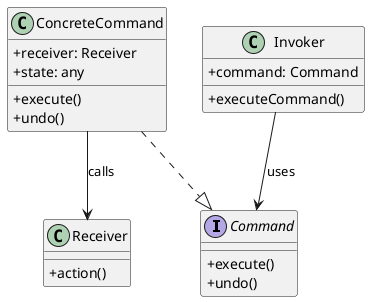

# 第11章: Command パターン

## はじめに

Command パターンは、リクエストをオブジェクトとしてカプセル化し、異なるリクエストでクライアントをパラメータ化したり、リクエストをキューに入れたり、操作の履歴を記録したりできるようにするパターンです。

本章では、テキスト編集とキャンバス操作の例を通じて、コマンドのデータ化、Undo/Redo 機能、バッチ処理の実装を学びます。

## 1. パターンの構造

Command パターンは以下の要素で構成されます：

- **Command**: コマンドのインターフェース（execute メソッド）
- **ConcreteCommand**: 具体的なコマンドの実装
- **Receiver**: コマンドを受け取り、実際の処理を行うオブジェクト
- **Invoker**: コマンドを実行するオブジェクト



## 2. テキスト操作コマンド

### コマンドの定義

```fsharp
/// テキストコマンド
[<RequireQualifiedAccess>]
type TextCommand =
    | Insert of position: int * text: string
    | Delete of startPos: int * endPos: int * deletedText: string
    | Replace of startPos: int * oldText: string * newText: string
```

### コマンドの実行と取り消し

```fsharp
module TextCommand =
    /// コマンドを実行
    let execute (command: TextCommand) (document: string) : string =
        match command with
        | TextCommand.Insert(pos, text) ->
            let before = document.Substring(0, pos)
            let after = document.Substring(pos)
            before + text + after
        | TextCommand.Delete(startPos, endPos, _) ->
            let before = document.Substring(0, startPos)
            let after = document.Substring(endPos)
            before + after
        | TextCommand.Replace(startPos, oldText, newText) ->
            let before = document.Substring(0, startPos)
            let after = document.Substring(startPos + oldText.Length)
            before + newText + after

    /// コマンドを取り消し
    let undo (command: TextCommand) (document: string) : string =
        match command with
        | TextCommand.Insert(pos, text) ->
            let before = document.Substring(0, pos)
            let after = document.Substring(pos + text.Length)
            before + after
        | TextCommand.Delete(startPos, _, deletedText) ->
            let before = document.Substring(0, startPos)
            let after = document.Substring(startPos)
            before + deletedText + after
        | TextCommand.Replace(startPos, oldText, newText) ->
            let before = document.Substring(0, startPos)
            let after = document.Substring(startPos + newText.Length)
            before + oldText + after
```

### 使用例

```fsharp
// 挿入コマンド
let insertCmd = TextCommand.Insert(5, " World")
let result = TextCommand.execute insertCmd "Hello"
// => "Hello World"

// Undo
let undone = TextCommand.undo insertCmd "Hello World"
// => "Hello"
```

## 3. キャンバス操作コマンド

### 図形とキャンバスの定義

```fsharp
type Shape =
    { Id: string
      ShapeType: string
      X: int
      Y: int
      Width: int
      Height: int }

type Canvas = { Shapes: Shape list }

/// キャンバスコマンド
[<RequireQualifiedAccess>]
type CanvasCommand =
    | AddShape of shape: Shape
    | RemoveShape of shapeId: string * removedShape: Shape option
    | MoveShape of shapeId: string * dx: int * dy: int
    | ResizeShape of shapeId: string * oldWidth: int * oldHeight: int * newWidth: int * newHeight: int
```

### コマンドの実行と取り消し

```fsharp
module CanvasCommand =
    /// コマンドを実行
    let execute (command: CanvasCommand) (canvas: Canvas) : Canvas =
        match command with
        | CanvasCommand.AddShape shape ->
            { canvas with Shapes = shape :: canvas.Shapes }
        | CanvasCommand.MoveShape(shapeId, dx, dy) ->
            { canvas with
                Shapes =
                    canvas.Shapes
                    |> List.map (fun s ->
                        if s.Id = shapeId then
                            { s with X = s.X + dx; Y = s.Y + dy }
                        else
                            s) }
        // ... 他のケース

    /// コマンドを取り消し
    let undo (command: CanvasCommand) (canvas: Canvas) : Canvas =
        match command with
        | CanvasCommand.AddShape shape ->
            { canvas with Shapes = canvas.Shapes |> List.filter (fun s -> s.Id <> shape.Id) }
        | CanvasCommand.MoveShape(shapeId, dx, dy) ->
            { canvas with
                Shapes =
                    canvas.Shapes
                    |> List.map (fun s ->
                        if s.Id = shapeId then
                            { s with X = s.X - dx; Y = s.Y - dy }
                        else
                            s) }
        // ... 他のケース
```

## 4. 汎用コマンド実行器

### 実行器の定義

```fsharp
type CommandExecutor<'TState, 'TCommand> =
    { State: 'TState
      UndoStack: 'TCommand list
      RedoStack: 'TCommand list
      ExecuteFn: 'TCommand -> 'TState -> 'TState
      UndoFn: 'TCommand -> 'TState -> 'TState }

module CommandExecutor =
    /// 実行器を作成
    let create
        (initialState: 'TState)
        (executeFn: 'TCommand -> 'TState -> 'TState)
        (undoFn: 'TCommand -> 'TState -> 'TState)
        : CommandExecutor<'TState, 'TCommand> =
        { State = initialState
          UndoStack = []
          RedoStack = []
          ExecuteFn = executeFn
          UndoFn = undoFn }

    /// コマンドを実行
    let execute (command: 'TCommand) (executor: CommandExecutor<'TState, 'TCommand>) =
        let newState = executor.ExecuteFn command executor.State
        { executor with
            State = newState
            UndoStack = command :: executor.UndoStack
            RedoStack = [] }

    /// アンドゥ
    let undo (executor: CommandExecutor<'TState, 'TCommand>) =
        match executor.UndoStack with
        | [] -> executor
        | command :: rest ->
            let newState = executor.UndoFn command executor.State
            { executor with
                State = newState
                UndoStack = rest
                RedoStack = command :: executor.RedoStack }

    /// リドゥ
    let redo (executor: CommandExecutor<'TState, 'TCommand>) =
        match executor.RedoStack with
        | [] -> executor
        | command :: rest ->
            let newState = executor.ExecuteFn command executor.State
            { executor with
                State = newState
                UndoStack = command :: executor.UndoStack
                RedoStack = rest }
```

### テキストエディタの作成

```fsharp
module TextEditor =
    /// テキストエディタを作成
    let create (initialText: string) : CommandExecutor<string, TextCommand> =
        CommandExecutor.create initialText TextCommand.execute TextCommand.undo
```

### 使用例

```fsharp
// エディタを作成
let editor = TextEditor.create "Hello"

// コマンドを実行
let editor = CommandExecutor.execute (TextCommand.Insert(5, " World")) editor
CommandExecutor.getState editor  // => "Hello World"

// Undo
let editor = CommandExecutor.undo editor
CommandExecutor.getState editor  // => "Hello"

// Redo
let editor = CommandExecutor.redo editor
CommandExecutor.getState editor  // => "Hello World"
```

## 5. マクロコマンド

複数のコマンドを一つのコマンドとして扱います。

```fsharp
type MacroCommand<'TCommand> = { Commands: 'TCommand list }

module MacroCommand =
    /// マクロコマンドを作成
    let create (commands: 'TCommand list) : MacroCommand<'TCommand> =
        { Commands = commands }

    /// マクロコマンドを実行
    let execute (executeFn: 'TCommand -> 'TState -> 'TState) (macro: MacroCommand<'TCommand>) (state: 'TState) : 'TState =
        List.fold (fun s cmd -> executeFn cmd s) state macro.Commands

    /// マクロコマンドを取り消し（逆順で実行）
    let undo (undoFn: 'TCommand -> 'TState -> 'TState) (macro: MacroCommand<'TCommand>) (state: 'TState) : 'TState =
        List.fold (fun s cmd -> undoFn cmd s) state (List.rev macro.Commands)
```

### 使用例

```fsharp
let macro = MacroCommand.create [
    TextCommand.Insert(5, " World")
    TextCommand.Insert(11, "!")
]

let result = MacroCommand.execute TextCommand.execute macro "Hello"
// => "Hello World!"

let undone = MacroCommand.undo TextCommand.undo macro "Hello World!"
// => "Hello"
```

## 6. バッチ実行

```fsharp
module BatchExecutor =
    /// 複数のコマンドをバッチ実行
    let executeBatch (commands: 'TCommand list) (executor: CommandExecutor<'TState, 'TCommand>) =
        List.fold (fun exec cmd -> CommandExecutor.execute cmd exec) executor commands

    /// すべてのコマンドを取り消し
    let undoAll (executor: CommandExecutor<'TState, 'TCommand>) =
        let rec loop exec =
            if CommandExecutor.canUndo exec then
                loop (CommandExecutor.undo exec)
            else
                exec
        loop executor
```

## 7. コマンドキュー

```fsharp
type CommandQueue<'TCommand> = { Queue: 'TCommand list }

module CommandQueue =
    /// 空のキューを作成
    let empty: CommandQueue<'TCommand> = { Queue = [] }

    /// コマンドをキューに追加
    let enqueue (command: 'TCommand) (queue: CommandQueue<'TCommand>) =
        { Queue = queue.Queue @ [ command ] }

    /// コマンドをデキュー
    let dequeue (queue: CommandQueue<'TCommand>) =
        match queue.Queue with
        | [] -> (None, queue)
        | head :: tail -> (Some head, { Queue = tail })

    /// すべてのコマンドを実行
    let executeAll (executor: CommandExecutor<'TState, 'TCommand>) (queue: CommandQueue<'TCommand>) =
        List.fold (fun exec cmd -> CommandExecutor.execute cmd exec) executor queue.Queue
```

## 8. 計算機コマンド

```fsharp
[<RequireQualifiedAccess>]
type CalculatorCommand =
    | Add of value: decimal
    | Subtract of value: decimal
    | Multiply of value: decimal
    | Divide of value: decimal
    | Clear

type CalculatorState =
    { Value: decimal
      History: (CalculatorCommand * decimal) list }

module Calculator =
    let create () : CalculatorState =
        { Value = 0.0m; History = [] }

    let execute (command: CalculatorCommand) (state: CalculatorState) =
        let previousValue = state.Value
        let newValue = CalculatorCommand.execute command state.Value
        { Value = newValue
          History = (command, previousValue) :: state.History }

    let undo (state: CalculatorState) =
        match state.History with
        | [] -> state
        | (_, previousValue) :: rest ->
            { Value = previousValue; History = rest }
```

### 使用例

```fsharp
let calc = Calculator.create ()
let calc = Calculator.execute (CalculatorCommand.Add 10.0m) calc
let calc = Calculator.execute (CalculatorCommand.Multiply 2.0m) calc
// calc.Value = 20.0m

let calc = Calculator.undo calc
// calc.Value = 10.0m
```

## 9. パターンの利点

1. **操作のオブジェクト化**: 操作をデータとして表現できる
2. **Undo/Redo**: 操作履歴の管理が容易
3. **バッチ処理**: 複数の操作をまとめて処理
4. **遅延実行**: コマンドをキューに入れて後で実行
5. **ログ記録**: 操作の履歴をログとして保存

## 10. 関数型プログラミングでの特徴

F# での Command パターンの実装には以下の特徴があります：

1. **コマンドはデータ**: 判別共用体でコマンドを表現
2. **純粋関数**: execute/undo は状態を受け取り新しい状態を返す純粋関数
3. **イミュータブル**: 状態は変更されず、新しい状態が返される
4. **型安全**: コンパイル時にコマンドの種類と引数を検証
5. **パターンマッチング**: コマンドの分岐処理が明確

```fsharp
// パイプライン演算子を使った連続操作
let result =
    "Hello"
    |> TextCommand.execute (TextCommand.Insert(5, " World"))
    |> TextCommand.execute (TextCommand.Insert(11, "!"))
// => "Hello World!"
```

## まとめ

本章では、Command パターンについて学びました：

1. **コマンドのデータ化**: 操作を判別共用体として表現
2. **Undo/Redo**: 履歴スタックを使った取り消し・やり直し
3. **汎用コマンド実行器**: 任意の状態とコマンドに対応
4. **マクロコマンド**: 複数のコマンドを一つにまとめる
5. **バッチ処理**: 複数のコマンドを一括実行
6. **コマンドキュー**: コマンドの遅延実行

Command パターンは、操作の履歴管理や取り消し機能が必要な場面で非常に有効です。

## 参考コード

本章のコード例は以下のファイルで確認できます：

- ソースコード: `app/fsharp/part4/src/Library.fs`
- テストコード: `app/fsharp/part4/tests/Tests.fs`

## 次章予告

次章では、**Visitor パターン**について学びます。オブジェクト構造を変更せずに新しい操作を追加する方法を探ります。
