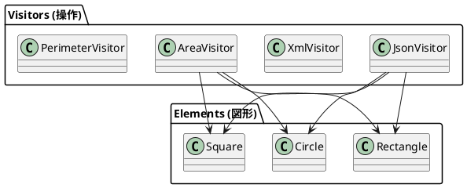

# 第12章: Visitor パターン

## はじめに

Visitor パターンは、データ構造と操作を分離し、既存のデータ構造を変更することなく新しい操作を追加できるようにするパターンです。

本章では、図形（Shape）に対する様々な操作（JSON 変換、XML 変換、面積計算、周囲長計算）を通じて、判別共用体とパターンマッチングによる Visitor パターンの実装を学びます。

## 1. パターンの構造

Visitor パターンは以下の要素で構成されます：

- **Visitor**: 操作のインターフェース
- **ConcreteVisitor**: 具体的な操作の実装
- **Element**: 訪問される要素のインターフェース
- **ConcreteElement**: 具体的な要素



## 2. Element: 図形の定義

### 判別共用体による図形定義

```fsharp
[<RequireQualifiedAccess>]
type Shape =
    | Circle of center: (float * float) * radius: float
    | Square of topLeft: (float * float) * side: float
    | Rectangle of topLeft: (float * float) * width: float * height: float
    | Triangle of p1: (float * float) * p2: (float * float) * p3: (float * float)
```

### 図形の操作

```fsharp
module Shape =
    /// 図形を移動
    let translate (dx: float) (dy: float) (shape: Shape) : Shape =
        match shape with
        | Shape.Circle((x, y), r) -> Shape.Circle((x + dx, y + dy), r)
        | Shape.Square((x, y), s) -> Shape.Square((x + dx, y + dy), s)
        | Shape.Rectangle((x, y), w, h) -> Shape.Rectangle((x + dx, y + dy), w, h)
        | Shape.Triangle((x1, y1), (x2, y2), (x3, y3)) ->
            Shape.Triangle((x1 + dx, y1 + dy), (x2 + dx, y2 + dy), (x3 + dx, y3 + dy))

    /// 図形を拡大/縮小
    let scale (factor: float) (shape: Shape) : Shape =
        match shape with
        | Shape.Circle(c, r) -> Shape.Circle(c, r * factor)
        | Shape.Square(tl, s) -> Shape.Square(tl, s * factor)
        | Shape.Rectangle(tl, w, h) -> Shape.Rectangle(tl, w * factor, h * factor)
        // ...
```

## 3. Visitor: JSON 変換

```fsharp
module JsonVisitor =
    /// 図形を JSON 文字列に変換
    let toJson (shape: Shape) : string =
        match shape with
        | Shape.Circle((x, y), r) ->
            sprintf """{"type":"circle","center":[%g,%g],"radius":%g}""" x y r
        | Shape.Square((x, y), s) ->
            sprintf """{"type":"square","topLeft":[%g,%g],"side":%g}""" x y s
        | Shape.Rectangle((x, y), w, h) ->
            sprintf """{"type":"rectangle","topLeft":[%g,%g],"width":%g,"height":%g}""" x y w h
        | Shape.Triangle((x1, y1), (x2, y2), (x3, y3)) ->
            sprintf """{"type":"triangle","points":[[%g,%g],[%g,%g],[%g,%g]]}""" x1 y1 x2 y2 x3 y3

    /// 複数の図形を JSON 配列に変換
    let shapesToJson (shapes: Shape list) : string =
        let jsonShapes = shapes |> List.map toJson |> String.concat ","
        sprintf "[%s]" jsonShapes
```

### 使用例

```fsharp
let circle = Shape.Circle((10.0, 20.0), 5.0)
let json = JsonVisitor.toJson circle
// => {"type":"circle","center":[10,20],"radius":5}
```

## 4. Visitor: XML 変換

```fsharp
module XmlVisitor =
    /// 図形を XML 文字列に変換
    let toXml (shape: Shape) : string =
        match shape with
        | Shape.Circle((x, y), r) ->
            sprintf """<circle><center x="%g" y="%g"/><radius>%g</radius></circle>""" x y r
        | Shape.Square((x, y), s) ->
            sprintf """<square><topLeft x="%g" y="%g"/><side>%g</side></square>""" x y s
        | Shape.Rectangle((x, y), w, h) ->
            sprintf """<rectangle><topLeft x="%g" y="%g"/><width>%g</width><height>%g</height></rectangle>""" x y w h
        | Shape.Triangle((x1, y1), (x2, y2), (x3, y3)) ->
            sprintf """<triangle><p1 x="%g" y="%g"/><p2 x="%g" y="%g"/><p3 x="%g" y="%g"/></triangle>""" x1 y1 x2 y2 x3 y3
```

## 5. Visitor: 面積計算

```fsharp
module AreaVisitor =
    /// 図形の面積を計算
    let calculateArea (shape: Shape) : float =
        match shape with
        | Shape.Circle(_, r) -> System.Math.PI * r * r
        | Shape.Square(_, s) -> s * s
        | Shape.Rectangle(_, w, h) -> w * h
        | Shape.Triangle((x1, y1), (x2, y2), (x3, y3)) ->
            // ヘロンの公式
            let a = sqrt((x2 - x1) ** 2.0 + (y2 - y1) ** 2.0)
            let b = sqrt((x3 - x2) ** 2.0 + (y3 - y2) ** 2.0)
            let c = sqrt((x1 - x3) ** 2.0 + (y1 - y3) ** 2.0)
            let s = (a + b + c) / 2.0
            sqrt(s * (s - a) * (s - b) * (s - c))

    /// 複数の図形の合計面積を計算
    let totalArea (shapes: Shape list) : float =
        shapes |> List.sumBy calculateArea
```

## 6. Visitor: 周囲長計算

```fsharp
module PerimeterVisitor =
    /// 図形の周囲長を計算
    let calculatePerimeter (shape: Shape) : float =
        match shape with
        | Shape.Circle(_, r) -> 2.0 * System.Math.PI * r
        | Shape.Square(_, s) -> 4.0 * s
        | Shape.Rectangle(_, w, h) -> 2.0 * (w + h)
        | Shape.Triangle((x1, y1), (x2, y2), (x3, y3)) ->
            let a = sqrt((x2 - x1) ** 2.0 + (y2 - y1) ** 2.0)
            let b = sqrt((x3 - x2) ** 2.0 + (y3 - y2) ** 2.0)
            let c = sqrt((x1 - x3) ** 2.0 + (y1 - y3) ** 2.0)
            a + b + c
```

## 7. Visitor: バウンディングボックス計算

```fsharp
type BoundingBox =
    { MinX: float
      MinY: float
      MaxX: float
      MaxY: float }

module BoundingBoxVisitor =
    /// 図形のバウンディングボックスを計算
    let calculateBoundingBox (shape: Shape) : BoundingBox =
        match shape with
        | Shape.Circle((x, y), r) ->
            { MinX = x - r; MinY = y - r; MaxX = x + r; MaxY = y + r }
        | Shape.Square((x, y), s) ->
            { MinX = x; MinY = y; MaxX = x + s; MaxY = y + s }
        | Shape.Rectangle((x, y), w, h) ->
            { MinX = x; MinY = y; MaxX = x + w; MaxY = y + h }
        // ...
```

## 8. Expression Visitor（式の評価）

```fsharp
[<RequireQualifiedAccess>]
type Expr =
    | Num of float
    | Add of Expr * Expr
    | Sub of Expr * Expr
    | Mul of Expr * Expr
    | Div of Expr * Expr
    | Neg of Expr
    | Var of string

module ExprVisitor =
    /// 式を評価
    let rec evaluate (env: Map<string, float>) (expr: Expr) : float =
        match expr with
        | Expr.Num n -> n
        | Expr.Add(a, b) -> evaluate env a + evaluate env b
        | Expr.Sub(a, b) -> evaluate env a - evaluate env b
        | Expr.Mul(a, b) -> evaluate env a * evaluate env b
        | Expr.Div(a, b) -> evaluate env a / evaluate env b
        | Expr.Neg e -> -(evaluate env e)
        | Expr.Var name -> Map.tryFind name env |> Option.defaultValue 0.0

    /// 式を文字列に変換
    let rec toString (expr: Expr) : string =
        match expr with
        | Expr.Num n -> sprintf "%g" n
        | Expr.Add(a, b) -> sprintf "(%s + %s)" (toString a) (toString b)
        // ...

    /// 式を簡約
    let rec simplify (expr: Expr) : Expr =
        match expr with
        | Expr.Add(Expr.Num 0.0, e) -> simplify e
        | Expr.Mul(Expr.Num 1.0, e) -> simplify e
        | Expr.Mul(Expr.Num 0.0, _) -> Expr.Num 0.0
        // ...
```

### 使用例

```fsharp
let expr = Expr.Add(Expr.Num 3.0, Expr.Mul(Expr.Num 2.0, Expr.Num 4.0))
let result = ExprVisitor.evaluate Map.empty expr
// => 11.0

let expr = Expr.Add(Expr.Var "x", Expr.Num 5.0)
let env = Map.ofList [ ("x", 10.0) ]
let result = ExprVisitor.evaluate env expr
// => 15.0
```

## 9. Tree Visitor

```fsharp
type Tree<'T> =
    | Leaf of 'T
    | Node of Tree<'T> list

module TreeVisitor =
    /// ツリーの全ての葉の値を収集
    let rec collectLeaves (tree: Tree<'T>) : 'T list =
        match tree with
        | Leaf v -> [ v ]
        | Node children -> children |> List.collect collectLeaves

    /// ツリーの深さを計算
    let rec depth (tree: Tree<'T>) : int =
        match tree with
        | Leaf _ -> 1
        | Node [] -> 1
        | Node children -> 1 + (children |> List.map depth |> List.max)

    /// ツリーを変換
    let rec map (f: 'T -> 'U) (tree: Tree<'T>) : Tree<'U> =
        match tree with
        | Leaf v -> Leaf(f v)
        | Node children -> Node(children |> List.map (map f))

    /// ツリーをフォールド
    let rec fold (leafFn: 'T -> 'Acc) (nodeFn: 'Acc list -> 'Acc) (tree: Tree<'T>) : 'Acc =
        match tree with
        | Leaf v -> leafFn v
        | Node children -> nodeFn (children |> List.map (fold leafFn nodeFn))
```

### 使用例

```fsharp
let tree = Node [ Leaf 1; Node [ Leaf 2; Leaf 3 ]; Leaf 4 ]

let leaves = TreeVisitor.collectLeaves tree
// => [1; 2; 3; 4]

let d = TreeVisitor.depth tree
// => 3

let sum = TreeVisitor.fold id List.sum tree
// => 10
```

## 10. パターンの利点

1. **操作の追加が容易**: 新しい Visitor を追加するだけで新しい操作を実装
2. **単一責任の原則**: 各 Visitor は一つの操作に専念
3. **関連する操作の一元化**: 同じ操作のコードが一箇所にまとまる
4. **データ構造と操作の分離**: 要素クラスを変更せずに操作を追加

## 11. 関数型プログラミングでの特徴

F# での Visitor パターンの実装には以下の特徴があります：

1. **パターンマッチング**: 判別共用体と match 式で自然に実装
2. **網羅性チェック**: コンパイラが全てのケースを処理しているか検証
3. **再帰的データ構造**: 式やツリーなどの再帰的構造に最適
4. **純粋関数**: 副作用のない変換処理
5. **合成しやすさ**: 複数の Visitor を組み合わせ可能

```fsharp
// パイプライン演算子を使った複数の操作
let shapes = [
    Shape.Circle((0.0, 0.0), 5.0)
    Shape.Square((10.0, 10.0), 10.0)
]

let totalArea = AreaVisitor.totalArea shapes
let json = JsonVisitor.shapesToJson shapes
```

## まとめ

本章では、Visitor パターンについて学びました：

1. **図形の定義**: 判別共用体による Element の表現
2. **JSON/XML 変換**: シリアライゼーション Visitor
3. **面積/周囲長計算**: 数学的計算 Visitor
4. **バウンディングボックス**: 空間計算 Visitor
5. **式の評価**: 再帰的データ構造への Visitor
6. **ツリー操作**: 汎用的なツリー Visitor

F# では、判別共用体とパターンマッチングにより、Visitor パターンを非常に自然に実装できます。

## 参考コード

本章のコード例は以下のファイルで確認できます：

- ソースコード: `app/fsharp/part4/src/Library.fs`
- テストコード: `app/fsharp/part4/tests/Tests.fs`

## 次章予告

次章では、**Abstract Factory パターン**について学びます。関連するオブジェクトのファミリーを生成するインターフェースを提供する方法を探ります。
