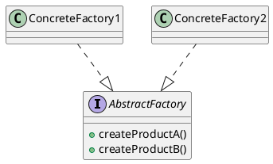

# 第13章: Abstract Factory パターン

## はじめに

Abstract Factory パターンは、関連するオブジェクトのファミリーを、その具体的なクラスを指定することなく生成するためのインターフェースを提供するパターンです。

本章では、図形ファクトリ、UI ファクトリ、データベースファクトリなどの例を通じて、判別共用体による Abstract Factory パターンの実装を学びます。

## 1. パターンの構造

Abstract Factory パターンは以下の要素で構成されます：

- **AbstractFactory**: オブジェクト生成の抽象インターフェース
- **ConcreteFactory**: 具体的なオブジェクトを生成するファクトリ
- **AbstractProduct**: 生成されるオブジェクトの抽象インターフェース
- **ConcreteProduct**: 具体的な製品



## 2. 図形ファクトリ

### スタイル情報の定義

```fsharp
type ShapeStyle =
    { OutlineColor: string option
      OutlineWidth: float option
      FillColor: string option
      Opacity: float option }

module ShapeStyle =
    let empty =
        { OutlineColor = None
          OutlineWidth = None
          FillColor = None
          Opacity = None }

    let withOutline color width style =
        { style with OutlineColor = Some color; OutlineWidth = Some width }

    let withFill color style =
        { style with FillColor = Some color }
```

### ファクトリの定義

```fsharp
[<RequireQualifiedAccess>]
type ShapeFactory =
    | Standard
    | Outlined of color: string * width: float
    | Filled of color: string
    | Custom of style: ShapeStyle
```

### ファクトリの実装

```fsharp
module ShapeFactory =
    /// 円を作成
    let createCircle (factory: ShapeFactory) (center: float * float) (radius: float) : StyledShape =
        let shape = Shape.Circle(center, radius)
        let style =
            match factory with
            | ShapeFactory.Standard -> ShapeStyle.empty
            | ShapeFactory.Outlined(color, width) -> ShapeStyle.empty |> ShapeStyle.withOutline color width
            | ShapeFactory.Filled color -> ShapeStyle.empty |> ShapeStyle.withFill color
            | ShapeFactory.Custom style -> style
        { Shape = shape; Style = style }
```

### 使用例

```fsharp
// 標準ファクトリ
let standardFactory = ShapeFactory.Standard
let circle = ShapeFactory.createCircle standardFactory (10.0, 20.0) 5.0

// 輪郭線付きファクトリ
let outlinedFactory = ShapeFactory.Outlined("black", 2.0)
let square = ShapeFactory.createSquare outlinedFactory (0.0, 0.0) 10.0

// カスタムスタイルファクトリ
let customStyle =
    ShapeStyle.empty
    |> ShapeStyle.withOutline "blue" 3.0
    |> ShapeStyle.withFill "yellow"
let customFactory = ShapeFactory.Custom customStyle
let rect = ShapeFactory.createRectangle customFactory (0.0, 0.0) 20.0 10.0
```

## 3. UI ファクトリ

### コンポーネントの定義

```fsharp
type Button =
    { Label: string
      Platform: string
      Style: Map<string, string> }

type TextField =
    { Placeholder: string
      Platform: string
      Style: Map<string, string> }

type Checkbox =
    { Label: string
      Checked: bool
      Platform: string
      Style: Map<string, string> }
```

### ファクトリの定義

```fsharp
[<RequireQualifiedAccess>]
type UIFactory =
    | Windows
    | MacOS
    | Linux
    | Web
```

### ファクトリの実装

```fsharp
module UIFactory =
    /// ボタンを作成
    let createButton (factory: UIFactory) (label: string) : Button =
        let platform = match factory with
            | UIFactory.Windows -> "windows"
            | UIFactory.MacOS -> "macos"
            | UIFactory.Linux -> "linux"
            | UIFactory.Web -> "web"
        let style = match factory with
            | UIFactory.Windows -> Map.ofList [ ("border", "1px solid gray") ]
            | UIFactory.MacOS -> Map.ofList [ ("borderRadius", "5px") ]
            // ...
        { Label = label; Platform = platform; Style = style }
```

### 使用例

```fsharp
// Windows UI を作成
let windowsFactory = UIFactory.Windows
let okButton = UIFactory.createButton windowsFactory "OK"
let nameField = UIFactory.createTextField windowsFactory "Enter name"

// MacOS UI を作成
let macFactory = UIFactory.MacOS
let submitButton = UIFactory.createButton macFactory "Submit"
```

## 4. データベースファクトリ

```fsharp
type DatabaseConnection =
    { ConnectionString: string
      DatabaseType: string
      MaxPoolSize: int }

[<RequireQualifiedAccess>]
type DatabaseFactory =
    | SqlServer of connectionString: string
    | PostgreSQL of connectionString: string
    | MySQL of connectionString: string
    | SQLite of filePath: string

module DatabaseFactory =
    let createConnection (factory: DatabaseFactory) : DatabaseConnection =
        match factory with
        | DatabaseFactory.SqlServer connStr ->
            { ConnectionString = connStr
              DatabaseType = "SqlServer"
              MaxPoolSize = 100 }
        | DatabaseFactory.PostgreSQL connStr ->
            { ConnectionString = connStr
              DatabaseType = "PostgreSQL"
              MaxPoolSize = 50 }
        | DatabaseFactory.SQLite path ->
            { ConnectionString = sprintf "Data Source=%s" path
              DatabaseType = "SQLite"
              MaxPoolSize = 1 }
        // ...
```

## 5. ドキュメントファクトリ

```fsharp
[<RequireQualifiedAccess>]
type DocumentFactory =
    | HTML
    | Markdown
    | PlainText

module DocumentFactory =
    /// 段落を作成
    let createParagraph (factory: DocumentFactory) (text: string) : string =
        match factory with
        | DocumentFactory.HTML -> sprintf "<p>%s</p>" text
        | DocumentFactory.Markdown -> text + "\n"
        | DocumentFactory.PlainText -> text + "\n"

    /// 見出しを作成
    let createHeading (factory: DocumentFactory) (level: int) (text: string) : string =
        match factory with
        | DocumentFactory.HTML -> sprintf "<h%d>%s</h%d>" level text level
        | DocumentFactory.Markdown -> String.replicate level "#" + " " + text + "\n"
        | DocumentFactory.PlainText -> text.ToUpper() + "\n"
```

## 6. テーマファクトリ

```fsharp
type ThemeColors =
    { Primary: string
      Secondary: string
      Background: string
      Text: string }

type Theme =
    { Name: string
      Colors: ThemeColors
      Fonts: ThemeFonts }

[<RequireQualifiedAccess>]
type ThemeFactory =
    | Light
    | Dark
    | HighContrast

module ThemeFactory =
    let createTheme (factory: ThemeFactory) : Theme =
        match factory with
        | ThemeFactory.Light ->
            { Name = "Light"
              Colors = { Primary = "#007bff"; Background = "#ffffff"; ... }
              ... }
        | ThemeFactory.Dark ->
            { Name = "Dark"
              Colors = { Primary = "#0d6efd"; Background = "#212529"; ... }
              ... }
```

## 7. パターンの利点

1. **製品ファミリーの一貫性**: 同じファクトリから生成された製品は互いに互換性がある
2. **具体クラスの分離**: クライアントは具体的な製品クラスを知る必要がない
3. **ファクトリの交換**: ファクトリを切り替えるだけで異なる製品ファミリーを使用可能
4. **新しいファミリーの追加**: 新しいファクトリを追加するだけで新しい製品ファミリーに対応

## 8. 関数型プログラミングでの特徴

F# での Abstract Factory パターンの実装には以下の特徴があります：

1. **判別共用体**: ファクトリの種類を型安全に表現
2. **パターンマッチング**: ファクトリの種類に応じた処理を明確に記述
3. **モジュール関数**: ファクトリの操作を関数として定義
4. **不変データ**: 生成された製品はイミュータブル
5. **合成しやすさ**: ファクトリ関数を合成可能

```fsharp
// パイプライン演算子を使った利用
let createForm factory =
    let button = UIFactory.createButton factory "Submit"
    let field = UIFactory.createTextField factory "Email"
    (button, field)

let (windowsBtn, windowsField) = createForm UIFactory.Windows
let (macBtn, macField) = createForm UIFactory.MacOS
```

## まとめ

本章では、Abstract Factory パターンについて学びました：

1. **図形ファクトリ**: スタイル付き図形の生成
2. **UI ファクトリ**: プラットフォーム別 UI コンポーネントの生成
3. **データベースファクトリ**: DB 接続とコマンドの生成
4. **ドキュメントファクトリ**: フォーマット別ドキュメント要素の生成
5. **テーマファクトリ**: テーマ設定の生成

F# では、判別共用体とパターンマッチングにより、Abstract Factory パターンを型安全かつ簡潔に実装できます。

## 参考コード

本章のコード例は以下のファイルで確認できます：

- ソースコード: `app/fsharp/part4/src/Library.fs`
- テストコード: `app/fsharp/part4/tests/Tests.fs`

## 次章予告

次章では、**Abstract Server パターン**について学びます。クライアントとサーバー間の抽象化層を提供する方法を探ります。
