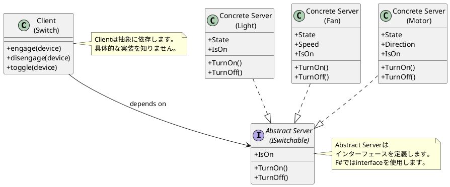
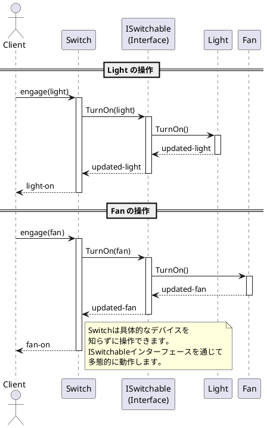
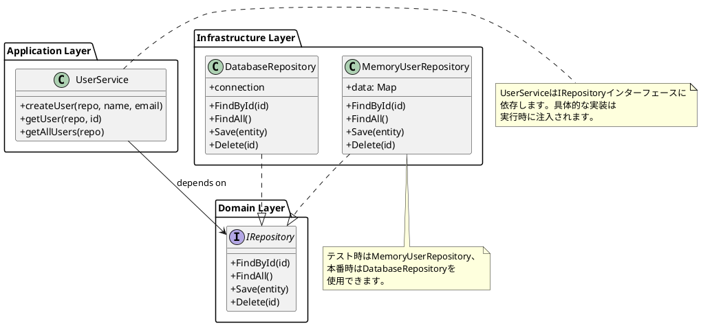
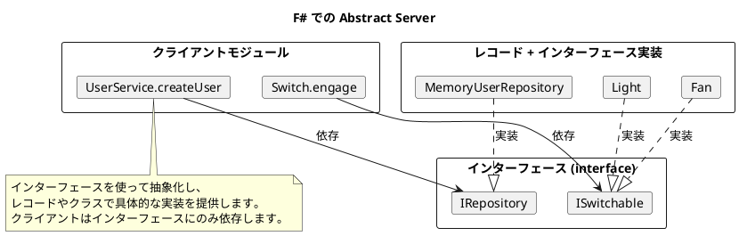

# 第14章: Abstract Server パターン

## はじめに

Abstract Server パターンは、依存関係逆転の原則（DIP）を実現するパターンです。高レベルモジュールが低レベルモジュールの詳細に依存するのではなく、両者が抽象に依存することで疎結合を実現します。

本章では、スイッチとデバイス、リポジトリとサービスの例を通じて、インターフェースによる Abstract Server パターンの実装を学びます。

## 1. パターンの構造

Abstract Server パターンは以下の要素で構成されます：

- **Client**: サービスを利用するモジュール
- **Abstract Server**: サービスの抽象インターフェース
- **Concrete Server**: 具体的なサービスの実装



## 2. ISwitchable インターフェース

### Abstract Server の定義

```fsharp
/// スイッチ可能なデバイスのインターフェース
type ISwitchable =
    abstract member TurnOn: unit -> ISwitchable
    abstract member TurnOff: unit -> ISwitchable
    abstract member IsOn: bool
```

F# のインターフェースは、メソッドを定義する abstract member として宣言します。イミュータブルな実装のため、`TurnOn` と `TurnOff` は新しい `ISwitchable` を返します。

## 3. Concrete Server: Light

### 実装

```fsharp
type Light =
    { State: bool }
    interface ISwitchable with
        member this.TurnOn() = { State = true } :> ISwitchable
        member this.TurnOff() = { State = false } :> ISwitchable
        member this.IsOn = this.State

module Light =
    let create () = { State = false }
    let createOn () = { State = true }
```

Light はレコード型として定義し、`ISwitchable` インターフェースを実装します。`:>` 演算子で基底型へのアップキャストを行います。

## 4. Concrete Server: Fan

### 実装

```fsharp
[<RequireQualifiedAccess>]
type FanSpeed = | Low | Medium | High

type Fan =
    { State: bool
      Speed: FanSpeed option }
    interface ISwitchable with
        member this.TurnOn() = { State = true; Speed = Some FanSpeed.Low } :> ISwitchable
        member this.TurnOff() = { State = false; Speed = None } :> ISwitchable
        member this.IsOn = this.State

module Fan =
    let create () = { State = false; Speed = None }
    let setSpeed (speed: FanSpeed) (fan: Fan) =
        if fan.State then { fan with Speed = Some speed }
        else fan
```

Fan はスピード設定を持つデバイスです。`[<RequireQualifiedAccess>]` 属性により、`FanSpeed.Low` のように修飾名でアクセスします。

## 5. Concrete Server: Motor

### 実装

```fsharp
[<RequireQualifiedAccess>]
type MotorDirection = | Forward | Reverse

type Motor =
    { State: bool
      Direction: MotorDirection option }
    interface ISwitchable with
        member this.TurnOn() = { State = true; Direction = Some MotorDirection.Forward } :> ISwitchable
        member this.TurnOff() = { State = false; Direction = None } :> ISwitchable
        member this.IsOn = this.State

module Motor =
    let create () = { State = false; Direction = None }
    let reverse (motor: Motor) =
        if motor.State then
            let newDir =
                match motor.Direction with
                | Some MotorDirection.Forward -> Some MotorDirection.Reverse
                | Some MotorDirection.Reverse -> Some MotorDirection.Forward
                | None -> Some MotorDirection.Forward
            { motor with Direction = newDir }
        else motor
```

Motor は方向を持つデバイスで、`reverse` 関数で方向を反転できます。

## 6. Client: Switch

### 実装

```fsharp
module Switch =
    /// スイッチを入れる
    let engage (device: ISwitchable) : ISwitchable =
        device.TurnOn()

    /// スイッチを切る
    let disengage (device: ISwitchable) : ISwitchable =
        device.TurnOff()

    /// スイッチを切り替える
    let toggle (device: ISwitchable) : ISwitchable =
        if device.IsOn then device.TurnOff()
        else device.TurnOn()

    /// デバイスの状態を取得
    let status (device: ISwitchable) : string =
        if device.IsOn then "ON" else "OFF"
```

### 使用例

```fsharp
// 同じSwitchコードで異なるデバイスを操作
let light = Light.create ()
let lightOn = Switch.engage (light :> ISwitchable)
printfn "%s" (Switch.status lightOn) // "ON"

let fan = Fan.create ()
let fanOn = Switch.engage (fan :> ISwitchable)
printfn "%s" (Switch.status fanOn) // "ON"

let motor = Motor.create ()
let motorOn = Switch.engage (motor :> ISwitchable)
printfn "%s" (Switch.status motorOn) // "ON"
```

## 7. シーケンス図



## 8. Repository の例

### Abstract Server: IRepository インターフェース

```fsharp
/// リポジトリインターフェース
type IRepository<'TEntity, 'TId> =
    abstract member FindById: 'TId -> 'TEntity option
    abstract member FindAll: unit -> 'TEntity list
    abstract member Save: 'TEntity -> 'TEntity
    abstract member Delete: 'TId -> bool
```

ジェネリック型パラメータを使用して、任意のエンティティと ID 型に対応します。

### Concrete Server: MemoryUserRepository

```fsharp
type User =
    { Id: string
      Name: string
      Email: string
      CreatedAt: System.DateTime }

type MemoryUserRepository(initialData: Map<string, User>) =
    let mutable data = initialData

    interface IRepository<User, string> with
        member _.FindById(id) = Map.tryFind id data
        member _.FindAll() = data |> Map.toList |> List.map snd
        member _.Save(user) =
            let userId = if user.Id = "" then System.Guid.NewGuid().ToString() else user.Id
            let userWithId = { user with Id = userId }
            data <- Map.add userId userWithId data
            userWithId
        member _.Delete(id) =
            if Map.containsKey id data then
                data <- Map.remove id data
                true
            else false

module MemoryUserRepository =
    let create () = MemoryUserRepository(Map.empty)
```

### Client: UserService

```fsharp
module UserService =
    /// ユーザーを作成
    let createUser (repo: IRepository<User, string>) (name: string) (email: string) : User =
        let user =
            { Id = ""
              Name = name
              Email = email
              CreatedAt = System.DateTime.UtcNow }
        repo.Save(user)

    /// ユーザーを取得
    let getUser (repo: IRepository<User, string>) (id: string) : User option =
        repo.FindById(id)

    /// 全ユーザーを取得
    let getAllUsers (repo: IRepository<User, string>) : User list =
        repo.FindAll()

    /// ユーザーを削除
    let deleteUser (repo: IRepository<User, string>) (id: string) : bool =
        repo.Delete(id)
```

## 9. 依存関係の図



## 10. 関数型アプローチ：レコード＋関数

F# では、インターフェースの代わりにレコード型で関数を束ねる方法もあります：

```fsharp
/// 関数型リポジトリ
type FunctionalRepository<'TEntity, 'TId> =
    { FindById: 'TId -> 'TEntity option
      FindAll: unit -> 'TEntity list
      Save: 'TEntity -> 'TEntity
      Delete: 'TId -> bool }

module FunctionalRepository =
    /// インメモリリポジトリを作成
    let createInMemory<'TId, 'TEntity when 'TId: comparison>
        (getId: 'TEntity -> 'TId)
        (setId: 'TId -> 'TEntity -> 'TEntity)
        (generateId: unit -> 'TId)
        : FunctionalRepository<'TEntity, 'TId> =
        let mutable data: Map<'TId, 'TEntity> = Map.empty
        { FindById = fun id -> Map.tryFind id data
          FindAll = fun () -> data |> Map.toList |> List.map snd
          Save = fun entity ->
              let entityId = if getId entity = Unchecked.defaultof<'TId> then generateId() else getId entity
              let entityWithId = setId entityId entity
              data <- Map.add entityId entityWithId data
              entityWithId
          Delete = fun id ->
              if Map.containsKey id data then
                  data <- Map.remove id data
                  true
              else false }
```

使用例：

```fsharp
type SimpleUser = { Id: int; Name: string }

let mutable nextId = 1
let repo = FunctionalRepository.createInMemory<int, SimpleUser>
               (fun u -> u.Id)
               (fun id u -> { u with Id = id })
               (fun () ->
                   let id = nextId
                   nextId <- nextId + 1
                   id)

let user = repo.Save { Id = 0; Name = "Alice" }
let found = repo.FindById user.Id
```

## 11. Logger と Cache の例

### ILogger インターフェース

```fsharp
[<RequireQualifiedAccess>]
type LogLevel = | Debug | Info | Warning | Error

type ILogger =
    abstract member Log: LogLevel -> string -> unit
    abstract member Debug: string -> unit
    abstract member Info: string -> unit
    abstract member Warning: string -> unit
    abstract member Error: string -> unit

type BufferedLogger() =
    let mutable logs: (LogLevel * string * System.DateTime) list = []

    interface ILogger with
        member _.Log level message =
            logs <- (level, message, System.DateTime.UtcNow) :: logs
        member this.Debug message = (this :> ILogger).Log LogLevel.Debug message
        member this.Info message = (this :> ILogger).Log LogLevel.Info message
        member this.Warning message = (this :> ILogger).Log LogLevel.Warning message
        member this.Error message = (this :> ILogger).Log LogLevel.Error message

    member _.GetLogs() = List.rev logs
    member _.Clear() = logs <- []

type NullLogger() =
    interface ILogger with
        member _.Log _ _ = ()
        member _.Debug _ = ()
        member _.Info _ = ()
        member _.Warning _ = ()
        member _.Error _ = ()
```

### ICache インターフェース

```fsharp
type ICache<'TKey, 'TValue> =
    abstract member Get: 'TKey -> 'TValue option
    abstract member Set: 'TKey -> 'TValue -> unit
    abstract member Remove: 'TKey -> bool
    abstract member Clear: unit -> unit

type MemoryCache<'TKey, 'TValue when 'TKey: comparison>() =
    let mutable data: Map<'TKey, 'TValue> = Map.empty

    interface ICache<'TKey, 'TValue> with
        member _.Get key = Map.tryFind key data
        member _.Set key value = data <- Map.add key value data
        member _.Remove key =
            if Map.containsKey key data then
                data <- Map.remove key data
                true
            else false
        member _.Clear() = data <- Map.empty
```

## 12. 依存性注入コンテナ

シンプルな DI コンテナの実装例：

```fsharp
type ServiceContainer() =
    let mutable services: Map<string, obj> = Map.empty

    member _.Register<'T>(key: string) (service: 'T) =
        services <- Map.add key (box service) services

    member _.Resolve<'T>(key: string) : 'T option =
        Map.tryFind key services |> Option.map (fun s -> s :?> 'T)

    member _.RegisterSingleton<'T>(service: 'T) =
        let key = typeof<'T>.FullName
        services <- Map.add key (box service) services

    member _.ResolveSingleton<'T>() : 'T option =
        let key = typeof<'T>.FullName
        Map.tryFind key services |> Option.map (fun s -> s :?> 'T)
```

## 13. パターンの利点

1. **疎結合**: クライアントは具体的な実装を知らない
2. **テスト容易性**: モック/スタブを簡単に注入可能
3. **柔軟性**: 実装の交換が容易
4. **依存関係逆転**: 高レベルモジュールが低レベルモジュールに依存しない

## 14. F# での特徴

F# での Abstract Server パターンの実装には以下の特徴があります：

1. **インターフェース**: 抽象サーバーを定義
2. **レコード型 + インターフェース実装**: 具体的なサーバーを実装
3. **イミュータブル**: 状態変更は新しいレコードを返す
4. **依存性注入**: 関数の引数としてインターフェースを渡す



## まとめ

本章では、Abstract Server パターンについて学びました：

1. **インターフェースによる抽象化**: ISwitchable、IRepository、ILogger、ICache
2. **レコード/クラスによる実装**: Light、Fan、Motor、MemoryUserRepository
3. **クライアントの独立性**: Switch、UserService
4. **依存関係逆転**: 高レベルモジュールが抽象に依存
5. **関数型アプローチ**: レコード型で関数を束ねる方法

Abstract Server パターンは、モジュール間の疎結合を実現し、テスト容易性と柔軟性を向上させます。

## 参考コード

本章のコード例は以下のファイルで確認できます：

- ソースコード: `app/fsharp/part4/src/Library.fs`
- テストコード: `app/fsharp/part4/tests/Tests.fs`

## 第4部のまとめ

第4部では、デザインパターンについて学びました：

- **Strategy パターン**: アルゴリズムをカプセル化して交換可能にする
- **Command パターン**: 操作をオブジェクトとしてカプセル化
- **Visitor パターン**: データ構造と処理を分離
- **Abstract Factory パターン**: 関連するオブジェクトのファミリーを一貫して生成
- **Abstract Server パターン**: 依存関係逆転による疎結合の実現

これらのパターンは、モジュールの独立性を高め、テスト容易性と保守性を向上させます。
