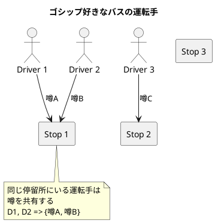
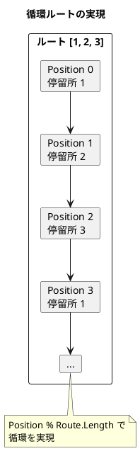
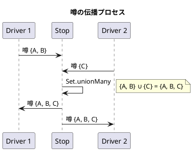
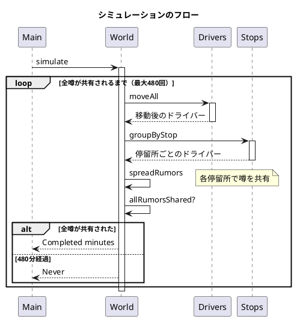

# 第15章: ゴシップ好きなバスの運転手

## はじめに

本章では、「ゴシップ好きなバスの運転手」という問題を通じて、関数型プログラミングの実践的なアプローチを学びます。この問題は、バス運転手が停留所で出会ったときに噂を共有するというシミュレーションです。

この問題を通じて以下の概念を学びます：

- 循環シーケンスによるルート表現
- 集合演算による状態の伝播
- データ変換パイプラインの設計

## 1. 問題の説明

複数のバス運転手がそれぞれのルートを巡回しています。各運転手は最初に1つ以上の噂を知っています。同じ停留所に複数の運転手がいると、彼らは知っている噂をすべて共有します。

**ゴール**: 全ての運転手が全ての噂を知るまでに何分かかるか？



## 2. データモデル

### ドライバーの表現

```fsharp
/// 噂の型（文字列の集合）
type Rumors = Set<string>

/// ドライバーの型
type Driver =
    { Name: string
      Route: int list       // 元のルート（循環用）
      Position: int         // 現在のルート位置
      Rumors: Rumors }
```

ポイント:
- `Route` はリストで保持し、`Position` でインデックスを管理
- 噂は `Set<string>` として管理（集合演算が容易）

### ドライバー操作

```fsharp
module Driver =
    /// ドライバーを作成
    let create (name: string) (route: int list) (rumors: Rumors) : Driver =
        { Name = name
          Route = route
          Position = 0
          Rumors = rumors }

    /// 現在の停留所を取得
    let currentStop (driver: Driver) : int =
        driver.Route.[driver.Position % driver.Route.Length]

    /// 次の停留所に移動
    let move (driver: Driver) : Driver =
        { driver with Position = driver.Position + 1 }

    /// 噂を追加
    let addRumors (newRumors: Rumors) (driver: Driver) : Driver =
        { driver with Rumors = Set.union driver.Rumors newRumors }
```

### 循環ルートの実現

```fsharp
// Position をルート長で割った余りを使用
let currentStop (driver: Driver) : int =
    driver.Route.[driver.Position % driver.Route.Length]

// 例: ルート [1; 2; 3] の場合
// Position 0 -> 停留所 1
// Position 1 -> 停留所 2
// Position 2 -> 停留所 3
// Position 3 -> 停留所 1 (3 % 3 = 0)
```



## 3. 移動と噂の伝播

### ワールド操作

```fsharp
/// ワールド = ドライバーのリスト
type World = Driver list

module World =
    /// 全ドライバーを移動
    let moveAll (world: World) : World =
        List.map Driver.move world

    /// 停留所ごとにドライバーをグループ化
    let groupByStop (world: World) : Map<int, Driver list> =
        world
        |> List.groupBy Driver.currentStop
        |> Map.ofList

    /// 同じ停留所にいるドライバー間で噂を共有
    let shareRumors (drivers: Driver list) : Driver list =
        let allRumors =
            drivers
            |> List.map (fun d -> d.Rumors)
            |> Set.unionMany
        drivers
        |> List.map (Driver.addRumors allRumors)

    /// 全停留所で噂を伝播
    let spreadRumors (world: World) : World =
        world
        |> groupByStop
        |> Map.toList
        |> List.map snd
        |> List.map shareRumors
        |> List.concat
```

### 噂の共有プロセス



## 4. シミュレーション

### 1ステップの処理

```fsharp
/// 1ステップのシミュレーション
/// 1. 全ドライバーを移動
/// 2. 同じ停留所にいるドライバー間で噂を共有
let drive (world: World) : World =
    world
    |> World.moveAll
    |> World.spreadRumors
```

### 完了判定

```fsharp
/// 全ドライバーが同じ噂を持っているか確認
let allRumorsShared (world: World) : bool =
    match world with
    | [] -> true
    | first :: rest ->
        rest |> List.forall (fun d -> d.Rumors = first.Rumors)
```

### シミュレーション実行

```fsharp
/// シミュレーション結果
type SimulationResult =
    | Completed of minutes: int
    | Never

/// 全噂が共有されるまでシミュレーション
let driveTillAllRumorsSpread (maxMinutes: int) (world: World) : SimulationResult =
    let rec loop (w: World) (time: int) =
        if time > maxMinutes then
            Never
        elif World.allRumorsShared w then
            Completed time
        else
            loop (drive w) (time + 1)
    loop (drive world) 1

/// 480分（8時間）を上限としてシミュレーション
let simulate (world: World) : SimulationResult =
    driveTillAllRumorsSpread 480 world
```

## 5. シーケンス図



## 6. 使用例

```fsharp
open FunctionalDesign.Part5.GossipingBusDrivers

// 3人のドライバーを作成
let world = [
    Driver.create "D1" [3; 1; 2; 3] (Set.ofList ["rumor-a"])
    Driver.create "D2" [3; 2; 3; 1] (Set.ofList ["rumor-b"])
    Driver.create "D3" [4; 2; 3; 4; 5] (Set.ofList ["rumor-c"])
]

// シミュレーション実行
match simulate world with
| Completed minutes -> printfn "%d分で全噂が共有されました" minutes
| Never -> printfn "8時間以内に全噂は共有されませんでした"

// 絶対に出会わないルートの場合
let neverMeet = [
    Driver.create "D1" [1] (Set.ofList ["rumor-a"])
    Driver.create "D2" [2] (Set.ofList ["rumor-b"])
]

match simulate neverMeet with
| Never -> printfn "ドライバーは出会いません"
| Completed _ -> printfn "予期しない結果"
```

## 7. 関数型アプローチの特徴

### 不変データ構造

すべての状態変更は新しいデータ構造を返します。元のデータは変更されません。

```fsharp
// ドライバーを移動しても元のドライバーは変更されない
let original = Driver.create "Test" [1; 2; 3] (Set.ofList ["a"])
let moved = Driver.move original

Driver.currentStop original // 1 (変更なし)
Driver.currentStop moved    // 2
```

### 集合演算の活用

```fsharp
// 複数の集合を統合
let rumors1 = Set.ofList ["a"; "b"]
let rumors2 = Set.ofList ["c"]
let rumors3 = Set.ofList ["a"; "d"]

Set.unionMany [rumors1; rumors2; rumors3]
// Set ["a"; "b"; "c"; "d"]
```

### 純粋関数

すべての関数は副作用がなく、同じ入力に対して常に同じ出力を返します。

## 8. パターンの応用

このパターンは以下のような場面で応用できます：

- **ネットワーク伝播**: ウイルスや情報の拡散シミュレーション
- **グラフ探索**: 巡回セールスマン問題の変形
- **状態同期**: 分散システムでの状態共有

## まとめ

本章では、ゴシップ好きなバスの運転手問題を通じて以下を学びました：

1. **循環ルート**: モジュロ演算による循環の実現
2. **集合演算**: `Set.union`、`Set.unionMany` による状態の統合
3. **データ変換パイプライン**: `|>` による処理の連鎖
4. **終了条件の設計**: 再帰関数と条件分岐の組み合わせ

## 参考コード

本章のコード例は以下のファイルで確認できます：

- ソースコード: `app/fsharp/part5/src/Library.fs`
- テストコード: `app/fsharp/part5/tests/Tests.fs`
