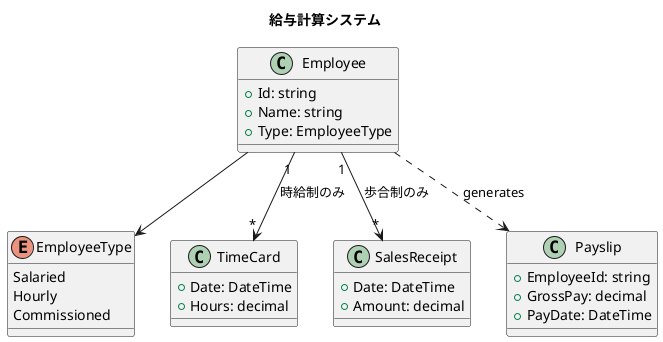
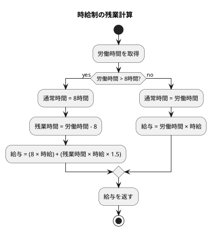
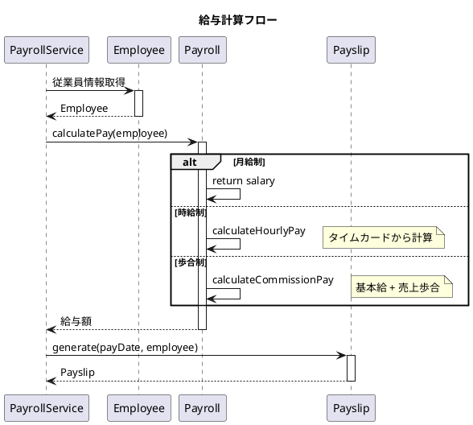

# 第16章: 給与計算システム

## はじめに

本章では、給与計算システムを通じて、関数型プログラミングで業務ドメインをモデリングする方法を学びます。異なる雇用形態（月給制、時給制、歩合制）に対応した給与計算を、判別共用体とパターンマッチングで実装します。

## 1. 問題の説明

給与計算システムは以下の要件を満たす必要があります：

- **月給制従業員**: 固定の月給を支払う
- **時給制従業員**: 労働時間に基づいて支払う（残業は1.5倍）
- **歩合制従業員**: 基本給 + 売上に応じた歩合を支払う



## 2. データモデル

### 従業員の種類

```fsharp
/// 従業員の種類
[<RequireQualifiedAccess>]
type EmployeeType =
    | Salaried       // 月給制
    | Hourly         // 時給制
    | Commissioned   // 歩合制
```

### タイムカードと売上レシート

```fsharp
/// タイムカードエントリ
type TimeCard =
    { Date: DateTime
      Hours: decimal }

/// 売上レシート
type SalesReceipt =
    { Date: DateTime
      Amount: decimal }
```

### 従業員

```fsharp
/// 従業員
type Employee =
    { Id: string
      Name: string
      Type: EmployeeType
      Salary: decimal option          // 月給（Salaried, Commissionedの場合）
      HourlyRate: decimal option      // 時給（Hourlyの場合）
      CommissionRate: decimal option  // 歩合率（Commissionedの場合）
      TimeCards: TimeCard list
      SalesReceipts: SalesReceipt list }
```

## 3. 従業員作成

```fsharp
module Employee =
    /// 月給制従業員を作成
    let createSalaried (id: string) (name: string) (salary: decimal) : Employee =
        { Id = id
          Name = name
          Type = EmployeeType.Salaried
          Salary = Some salary
          HourlyRate = None
          CommissionRate = None
          TimeCards = []
          SalesReceipts = [] }

    /// 時給制従業員を作成
    let createHourly (id: string) (name: string) (hourlyRate: decimal) : Employee =
        { Id = id
          Name = name
          Type = EmployeeType.Hourly
          Salary = None
          HourlyRate = Some hourlyRate
          CommissionRate = None
          TimeCards = []
          SalesReceipts = [] }

    /// 歩合制従業員を作成
    let createCommissioned (id: string) (name: string) (salary: decimal) (commissionRate: decimal) : Employee =
        { Id = id
          Name = name
          Type = EmployeeType.Commissioned
          Salary = Some salary
          HourlyRate = None
          CommissionRate = Some commissionRate
          TimeCards = []
          SalesReceipts = [] }

    /// タイムカードを追加
    let addTimeCard (timeCard: TimeCard) (employee: Employee) : Employee =
        { employee with TimeCards = timeCard :: employee.TimeCards }

    /// 売上レシートを追加
    let addSalesReceipt (receipt: SalesReceipt) (employee: Employee) : Employee =
        { employee with SalesReceipts = receipt :: employee.SalesReceipts }
```

## 4. 給与計算

### 計算ロジック

```fsharp
module Payroll =
    /// 時給制の給与計算（8時間を超えると1.5倍）
    let calculateHourlyPay (hourlyRate: decimal) (timeCards: TimeCard list) : decimal =
        timeCards
        |> List.sumBy (fun tc ->
            let regularHours = min tc.Hours 8.0m
            let overtimeHours = max (tc.Hours - 8.0m) 0.0m
            (regularHours * hourlyRate) + (overtimeHours * hourlyRate * 1.5m))

    /// 歩合制の給与計算
    let calculateCommissionPay (baseSalary: decimal) (commissionRate: decimal) (receipts: SalesReceipt list) : decimal =
        let totalSales = receipts |> List.sumBy (fun r -> r.Amount)
        baseSalary + (totalSales * commissionRate)

    /// 従業員の給与を計算
    let calculatePay (employee: Employee) : decimal =
        match employee.Type with
        | EmployeeType.Salaried ->
            employee.Salary |> Option.defaultValue 0m
        | EmployeeType.Hourly ->
            let rate = employee.HourlyRate |> Option.defaultValue 0m
            calculateHourlyPay rate employee.TimeCards
        | EmployeeType.Commissioned ->
            let salary = employee.Salary |> Option.defaultValue 0m
            let rate = employee.CommissionRate |> Option.defaultValue 0m
            calculateCommissionPay salary rate employee.SalesReceipts
```

### 残業計算の図解



## 5. 給与明細

### 給与明細の定義

```fsharp
/// 給与明細
type Payslip =
    { EmployeeId: string
      EmployeeName: string
      EmployeeType: EmployeeType
      GrossPay: decimal
      PayDate: DateTime }
```

### 給与明細の生成

```fsharp
module Payslip =
    /// 給与明細を生成
    let generate (payDate: DateTime) (employee: Employee) : Payslip =
        { EmployeeId = employee.Id
          EmployeeName = employee.Name
          EmployeeType = employee.Type
          GrossPay = Payroll.calculatePay employee
          PayDate = payDate }

    /// 複数従業員の給与明細を生成
    let generateAll (payDate: DateTime) (employees: Employee list) : Payslip list =
        employees |> List.map (generate payDate)
```

## 6. シーケンス図



## 7. 使用例

```fsharp
open System
open FunctionalDesign.Part5.PayrollSystem

// 月給制従業員
let alice = Employee.createSalaried "E001" "Alice" 5000.0m
let alicePay = Payroll.calculatePay alice
// 5000.0m

// 時給制従業員（残業あり）
let bob =
    Employee.createHourly "E002" "Bob" 25.0m
    |> Employee.addTimeCard { Date = DateTime(2024, 1, 15); Hours = 10.0m }
    |> Employee.addTimeCard { Date = DateTime(2024, 1, 16); Hours = 8.0m }
let bobPay = Payroll.calculatePay bob
// (8 * 25) + (2 * 25 * 1.5) + (8 * 25) = 200 + 75 + 200 = 475

// 歩合制従業員
let charlie =
    Employee.createCommissioned "E003" "Charlie" 2000.0m 0.10m
    |> Employee.addSalesReceipt { Date = DateTime(2024, 1, 15); Amount = 5000.0m }
let charliePay = Payroll.calculatePay charlie
// 2000 + 5000 * 0.10 = 2500

// 給与明細の生成
let payDate = DateTime(2024, 1, 31)
let slips = Payslip.generateAll payDate [alice; bob; charlie]
```

## 8. 関数型アプローチの特徴

### パターンマッチングによる分岐

```fsharp
match employee.Type with
| EmployeeType.Salaried -> ...
| EmployeeType.Hourly -> ...
| EmployeeType.Commissioned -> ...
```

コンパイラが網羅性をチェックするため、新しい従業員タイプを追加した場合にすべての分岐を更新する必要があることが保証されます。

### Option 型による安全な値アクセス

```fsharp
employee.Salary |> Option.defaultValue 0m
```

`null` チェックの代わりに `Option` 型を使用し、安全にデフォルト値を適用します。

### イミュータブルなデータ操作

```fsharp
// 元のデータは変更されず、新しいデータが返される
let updatedEmployee = Employee.addTimeCard timeCard employee
```

## 9. 拡張ポイント

このシステムは以下のように拡張できます：

- **税金計算**: 給与から税金を控除
- **福利厚生**: 健康保険、年金などの控除
- **支払いスケジュール**: 週払い、隔週払い、月払いの対応
- **休暇管理**: 有給休暇の追跡と給与への反映

## まとめ

本章では、給与計算システムを通じて以下を学びました：

1. **判別共用体**: 従業員タイプの表現
2. **パターンマッチング**: 型に基づく給与計算の分岐
3. **Option 型**: 安全な値アクセス
4. **データ変換**: 従業員情報から給与明細への変換

## 参考コード

本章のコード例は以下のファイルで確認できます：

- ソースコード: `app/fsharp/part5/src/Library.fs`
- テストコード: `app/fsharp/part5/tests/Tests.fs`
