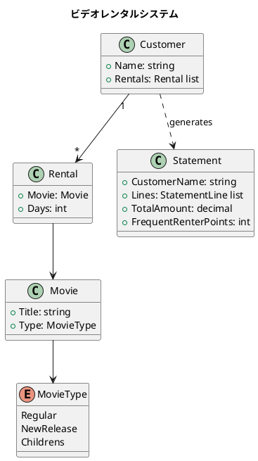
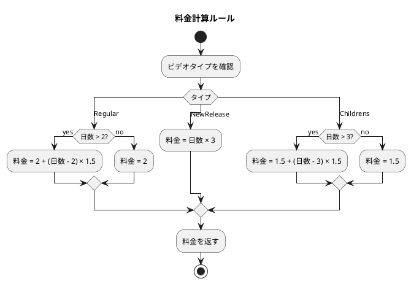
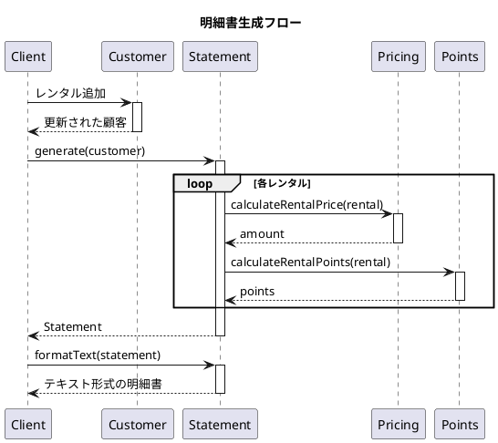

# 第17章: ビデオレンタルシステム

## はじめに

本章では、Martin Fowler の「リファクタリング」で有名なビデオレンタルシステムを F# で実装します。このシステムは、異なる種類のビデオに対する料金計算とポイント計算を行います。

## 1. 問題の説明

ビデオレンタルシステムは以下の機能を提供します：

- **料金計算**: ビデオの種類と日数に基づいて料金を計算
- **ポイント計算**: レンタルに応じたポイントを付与
- **明細書生成**: 顧客のレンタル明細を生成



## 2. データモデル

### ビデオの種類

```fsharp
/// ビデオの種類
[<RequireQualifiedAccess>]
type MovieType =
    | Regular       // 通常
    | NewRelease    // 新作
    | Childrens     // 子供向け
```

### ビデオとレンタル

```fsharp
/// ビデオ
type Movie =
    { Title: string
      Type: MovieType }

/// レンタル記録
type Rental =
    { Movie: Movie
      Days: int }

/// 顧客
type Customer =
    { Name: string
      Rentals: Rental list }
```

## 3. 料金計算

### 料金計算ルール

| ビデオの種類 | 基本料金 | 追加料金 |
|------------|---------|---------|
| 通常 | 2日まで $2 | 3日目から $1.5/日 |
| 新作 | $3/日 | なし |
| 子供向け | 3日まで $1.5 | 4日目から $1.5/日 |

```fsharp
module Pricing =
    /// 通常ビデオの料金計算
    let regularPrice (days: int) : decimal =
        let baseFee = 2.0m
        if days > 2 then
            baseFee + (decimal (days - 2) * 1.5m)
        else
            baseFee

    /// 新作ビデオの料金計算
    let newReleasePrice (days: int) : decimal =
        decimal days * 3.0m

    /// 子供向けビデオの料金計算
    let childrensPrice (days: int) : decimal =
        let baseFee = 1.5m
        if days > 3 then
            baseFee + (decimal (days - 3) * 1.5m)
        else
            baseFee

    /// レンタル料金を計算
    let calculateRentalPrice (rental: Rental) : decimal =
        match rental.Movie.Type with
        | MovieType.Regular -> regularPrice rental.Days
        | MovieType.NewRelease -> newReleasePrice rental.Days
        | MovieType.Childrens -> childrensPrice rental.Days
```

### 料金計算の図解



## 4. ポイント計算

```fsharp
module Points =
    /// レンタルポイントを計算
    let calculateRentalPoints (rental: Rental) : int =
        match rental.Movie.Type with
        | MovieType.NewRelease when rental.Days > 1 -> 2
        | _ -> 1
```

ポイントルール：
- 通常のレンタル: 1ポイント
- 新作2日以上: 2ポイント（ボーナス）

## 5. 明細書生成

### 明細書の定義

```fsharp
/// 明細行
type StatementLine =
    { MovieTitle: string
      Amount: decimal }

/// 明細書
type Statement =
    { CustomerName: string
      Lines: StatementLine list
      TotalAmount: decimal
      FrequentRenterPoints: int }
```

### 明細書の生成

```fsharp
module Statement =
    /// 明細行を生成
    let createLine (rental: Rental) : StatementLine =
        { MovieTitle = rental.Movie.Title
          Amount = Pricing.calculateRentalPrice rental }

    /// 明細書を生成
    let generate (customer: Customer) : Statement =
        let lines = customer.Rentals |> List.map createLine
        let total = lines |> List.sumBy (fun l -> l.Amount)
        let points = customer.Rentals |> List.sumBy Points.calculateRentalPoints
        { CustomerName = customer.Name
          Lines = lines
          TotalAmount = total
          FrequentRenterPoints = points }
```

### 明細書のフォーマット

```fsharp
    /// 明細書をテキスト形式でフォーマット
    let formatText (statement: Statement) : string =
        let header = sprintf "Rental Record for %s\n" statement.CustomerName
        let lines =
            statement.Lines
            |> List.map (fun l -> sprintf "\t%s\t%.2f\n" l.MovieTitle l.Amount)
            |> String.concat ""
        let footer =
            sprintf "Amount owed is %.2f\nYou earned %d frequent renter points"
                statement.TotalAmount
                statement.FrequentRenterPoints
        header + lines + footer

    /// 明細書をHTML形式でフォーマット
    let formatHtml (statement: Statement) : string =
        let header = sprintf "<h1>Rental Record for %s</h1>\n<table>\n" statement.CustomerName
        let lines =
            statement.Lines
            |> List.map (fun l -> sprintf "<tr><td>%s</td><td>%.2f</td></tr>\n" l.MovieTitle l.Amount)
            |> String.concat ""
        let footer =
            sprintf "</table>\n<p>Amount owed is %.2f</p>\n<p>You earned %d frequent renter points</p>"
                statement.TotalAmount
                statement.FrequentRenterPoints
        header + lines + footer
```

## 6. ユーティリティモジュール

```fsharp
module Movie =
    let createRegular title = { Title = title; Type = MovieType.Regular }
    let createNewRelease title = { Title = title; Type = MovieType.NewRelease }
    let createChildrens title = { Title = title; Type = MovieType.Childrens }

module Customer =
    let create name = { Name = name; Rentals = [] }
    let addRental rental customer =
        { customer with Rentals = rental :: customer.Rentals }

module Rental =
    let create movie days = { Movie = movie; Days = days }
```

## 7. シーケンス図



## 8. 使用例

```fsharp
open FunctionalDesign.Part5.VideoRentalSystem

// ビデオを作成
let jaws = Movie.createRegular "Jaws"
let dune = Movie.createNewRelease "Dune"
let frozen = Movie.createChildrens "Frozen"

// 顧客を作成してレンタルを追加
let customer =
    Customer.create "John"
    |> Customer.addRental (Rental.create jaws 3)     // 通常: $3.5
    |> Customer.addRental (Rental.create dune 2)     // 新作: $6
    |> Customer.addRental (Rental.create frozen 4)   // 子供: $3

// 明細書を生成
let statement = Statement.generate customer

// テキスト形式で出力
printfn "%s" (Statement.formatText statement)
// Rental Record for John
//     Jaws    3.50
//     Dune    6.00
//     Frozen  3.00
// Amount owed is 12.50
// You earned 4 frequent renter points

// HTML形式で出力
printfn "%s" (Statement.formatHtml statement)
```

## 9. 関数型アプローチの特徴

### データと振る舞いの分離

```fsharp
// データ定義
type Movie = { Title: string; Type: MovieType }

// 振る舞い（関数）
let calculateRentalPrice (rental: Rental) : decimal = ...
```

オブジェクト指向では `Movie` クラスに `calculatePrice` メソッドを持たせますが、関数型では純粋関数として分離します。

### パイプラインによる処理

```fsharp
let lines = customer.Rentals |> List.map createLine
let total = lines |> List.sumBy (fun l -> l.Amount)
let points = customer.Rentals |> List.sumBy Points.calculateRentalPoints
```

### 拡張の容易さ

新しいビデオタイプを追加する場合：

1. `MovieType` に新しいケースを追加
2. `Pricing` モジュールに新しい料金計算を追加
3. コンパイラが未処理のケースを警告

```fsharp
// 新しいタイプを追加
type MovieType =
    | Regular
    | NewRelease
    | Childrens
    | Premium  // 新規追加

// コンパイラが calculateRentalPrice の更新を促す
```

## 10. Strategy パターンとの関係

この実装は第10章の Strategy パターンと類似しています。料金計算のロジックを交換可能にする場合：

```fsharp
type PricingStrategy = int -> decimal

let regularPricing: PricingStrategy = Pricing.regularPrice
let newReleasePricing: PricingStrategy = Pricing.newReleasePrice
let childrensPricing: PricingStrategy = Pricing.childrensPrice

let calculateWithStrategy (strategy: PricingStrategy) (days: int) =
    strategy days
```

## まとめ

本章では、ビデオレンタルシステムを通じて以下を学びました：

1. **判別共用体**: ビデオタイプの表現
2. **パターンマッチング**: タイプに基づく料金計算
3. **データ変換**: レンタル情報から明細書への変換
4. **フォーマット戦略**: 同じデータの異なる表現形式

## 第5部のまとめ

第5部では、実践的なアプリケーションを通じて関数型プログラミングを学びました：

- **ゴシップ好きなバスの運転手**: シミュレーションと状態伝播
- **給与計算システム**: 業務ドメインのモデリング
- **ビデオレンタルシステム**: データ変換とフォーマット

これらの例を通じて、関数型プログラミングが実際のビジネス問題にどのように適用できるかを学びました。

## 参考コード

本章のコード例は以下のファイルで確認できます：

- ソースコード: `app/fsharp/part5/src/Library.fs`
- テストコード: `app/fsharp/part5/tests/Tests.fs`
