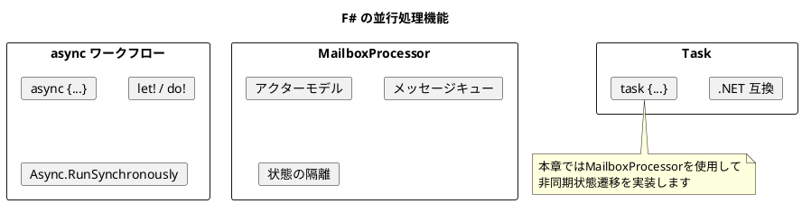
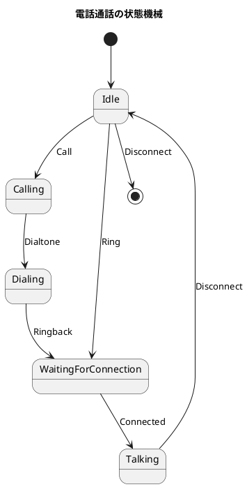
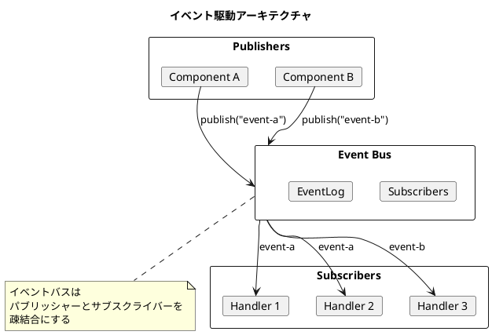
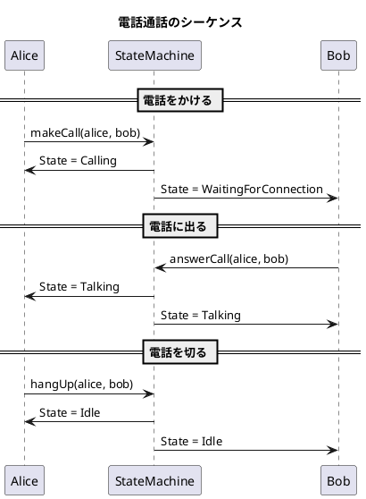

# 第18章: 並行処理システム

## はじめに

本章では、F# の並行処理機能を使った状態機械パターンとイベント駆動アーキテクチャを学びます。電話通話システムを例に、非同期状態管理の基礎を理解します。

この問題を通じて以下の概念を学びます：

- 状態機械パターンの実装
- イベント駆動アーキテクチャ
- MailboxProcessor による非同期処理

## 1. F# の並行処理モデル

F# は複数の並行処理機能を提供します：

| 機能 | 特徴 | 用途 |
|-----|------|------|
| async | 非同期ワークフロー | I/O バウンドの処理 |
| Task | .NET Task との互換 | 非同期操作 |
| MailboxProcessor | アクターモデル | メッセージベースの状態管理 |



## 2. 状態機械パターン

### 電話通話の状態遷移



### 状態とイベントの定義

```fsharp
/// 電話の状態
[<RequireQualifiedAccess>]
type PhoneState =
    | Idle
    | Calling
    | Dialing
    | WaitingForConnection
    | Talking

/// 電話イベント
[<RequireQualifiedAccess>]
type PhoneEvent =
    | Call
    | Ring
    | Dialtone
    | Ringback
    | Connected
    | Disconnect

/// ユーザー情報
type User =
    { Id: string
      State: PhoneState
      Peer: string option }
```

### 状態遷移テーブル

```fsharp
module StateMachine =
    /// 状態遷移テーブル
    let transitions : Map<PhoneState * PhoneEvent, PhoneState> =
        [
            (PhoneState.Idle, PhoneEvent.Call), PhoneState.Calling
            (PhoneState.Idle, PhoneEvent.Ring), PhoneState.WaitingForConnection
            (PhoneState.Idle, PhoneEvent.Disconnect), PhoneState.Idle
            (PhoneState.Calling, PhoneEvent.Dialtone), PhoneState.Dialing
            (PhoneState.Dialing, PhoneEvent.Ringback), PhoneState.WaitingForConnection
            (PhoneState.WaitingForConnection, PhoneEvent.Connected), PhoneState.Talking
            (PhoneState.Talking, PhoneEvent.Disconnect), PhoneState.Idle
        ] |> Map.ofList

    /// 状態遷移を実行
    let transition (state: PhoneState) (event: PhoneEvent) : PhoneState option =
        Map.tryFind (state, event) transitions
```

## 3. 電話操作

```fsharp
module Phone =
    /// ユーザーを作成
    let createUser (id: string) : User =
        { Id = id; State = PhoneState.Idle; Peer = None }

    /// 電話をかける
    let makeCall (caller: User) (callee: User) : User * User =
        let updatedCaller = StateMachine.sendEvent PhoneEvent.Call (Some callee.Id) caller
        let updatedCallee = StateMachine.sendEvent PhoneEvent.Ring (Some caller.Id) callee
        (updatedCaller, updatedCallee)

    /// 電話に出る
    let answerCall (caller: User) (callee: User) : User * User =
        let caller1 = StateMachine.sendEvent PhoneEvent.Dialtone None caller
        let caller2 = StateMachine.sendEvent PhoneEvent.Ringback None caller1
        let caller3 = StateMachine.sendEvent PhoneEvent.Connected None caller2
        let callee1 = StateMachine.sendEvent PhoneEvent.Connected None callee
        (caller3, callee1)

    /// 電話を切る
    let hangUp (caller: User) (callee: User) : User * User =
        let updatedCaller = StateMachine.sendEvent PhoneEvent.Disconnect None caller
        let updatedCallee = StateMachine.sendEvent PhoneEvent.Disconnect None callee
        (updatedCaller, updatedCallee)
```

## 4. イベントバス

### イベントバスの実装

```fsharp
/// イベント
type Event<'T> =
    { Type: string
      Data: 'T
      Timestamp: System.DateTime }

/// イベントバス
type EventBus<'T> =
    { Subscribers: Map<string, (Event<'T> -> unit) list>
      EventLog: Event<'T> list }

module EventBus =
    /// イベントバスを作成
    let create<'T> () : EventBus<'T> =
        { Subscribers = Map.empty; EventLog = [] }

    /// 購読を追加
    let subscribe (eventType: string) (handler: Event<'T> -> unit) (bus: EventBus<'T>) : EventBus<'T> =
        let handlers = Map.tryFind eventType bus.Subscribers |> Option.defaultValue []
        { bus with Subscribers = Map.add eventType (handler :: handlers) bus.Subscribers }

    /// イベントを発行
    let publish (eventType: string) (data: 'T) (bus: EventBus<'T>) : EventBus<'T> =
        let event = { Type = eventType; Data = data; Timestamp = System.DateTime.UtcNow }
        let handlers = Map.tryFind eventType bus.Subscribers |> Option.defaultValue []
        handlers |> List.iter (fun handler -> handler event)
        { bus with EventLog = event :: bus.EventLog }
```



## 5. MailboxProcessor（エージェント）

### エージェントの実装

```fsharp
/// メッセージ
type AgentMessage<'TState, 'TEvent> =
    | GetState of AsyncReplyChannel<'TState>
    | SendEvent of 'TEvent

/// エージェントを作成
let createAgent<'TState, 'TEvent> (initialState: 'TState) (update: 'TEvent -> 'TState -> 'TState) =
    MailboxProcessor.Start(fun inbox ->
        let rec loop state = async {
            let! msg = inbox.Receive()
            match msg with
            | GetState channel ->
                channel.Reply state
                return! loop state
            | SendEvent event ->
                let newState = update event state
                return! loop newState
        }
        loop initialState)

/// 状態を取得
let getAgentState (agent: MailboxProcessor<AgentMessage<'TState, 'TEvent>>) : 'TState =
    agent.PostAndReply(fun channel -> GetState channel)

/// イベントを送信
let sendAgentEvent (agent: MailboxProcessor<AgentMessage<'TState, 'TEvent>>) (event: 'TEvent) : unit =
    agent.Post(SendEvent event)
```

### エージェントの利点

1. **非同期処理**: `Post` は即座に戻り、処理はバックグラウンドで実行
2. **シリアライズ**: 同一エージェントへの更新は順序保証
3. **状態の隔離**: 状態は外部から直接アクセス不可

## 6. 使用例

### 電話通話のシミュレーション

```fsharp
open FunctionalDesign.Part6.ConcurrencySystem

// ユーザーを作成
let alice = Phone.createUser "Alice"
let bob = Phone.createUser "Bob"

// Alice が Bob に電話をかける
let (alice1, bob1) = Phone.makeCall alice bob
printfn "Alice: %A, Bob: %A" alice1.State bob1.State
// Alice: Calling, Bob: WaitingForConnection

// Bob が電話に出る
let (alice2, bob2) = Phone.answerCall alice1 bob1
printfn "Alice: %A, Bob: %A" alice2.State bob2.State
// Alice: Talking, Bob: Talking

// 電話を切る
let (alice3, bob3) = Phone.hangUp alice2 bob2
printfn "Alice: %A, Bob: %A" alice3.State bob3.State
// Alice: Idle, Bob: Idle
```

### イベントバスの使用

```fsharp
// イベントバスを作成
let bus = EventBus.create<string> ()

// ハンドラを登録
let bus' =
    bus
    |> EventBus.subscribe "user-logged-in" (fun event ->
        printfn "User logged in: %s" event.Data)
    |> EventBus.subscribe "user-logged-in" (fun event ->
        printfn "Sending welcome email to: %s" event.Data)

// イベントを発行
let bus'' = EventBus.publish "user-logged-in" "Alice" bus'
// User logged in: Alice
// Sending welcome email to: Alice
```

## 7. シーケンス図



## まとめ

本章では、並行処理システムについて学びました：

1. **状態機械パターン**: 状態と遷移をテーブルで管理
2. **イベントバス**: パブリッシャーとサブスクライバーの疎結合
3. **MailboxProcessor**: アクターモデルによる非同期状態管理

## 参考コード

本章のコード例は以下のファイルで確認できます：

- ソースコード: `app/fsharp/part6/src/Library.fs`
- テストコード: `app/fsharp/part6/tests/Tests.fs`
