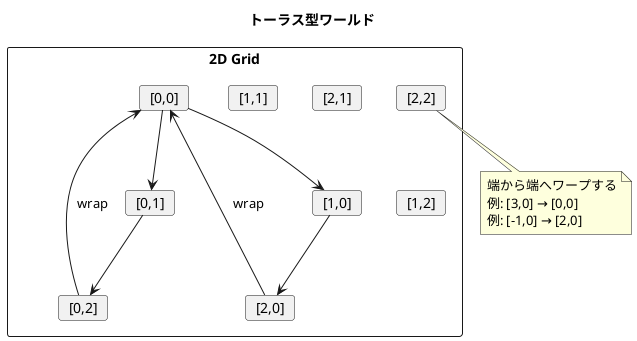
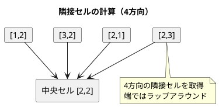
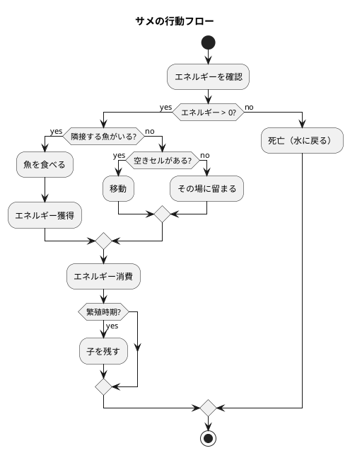
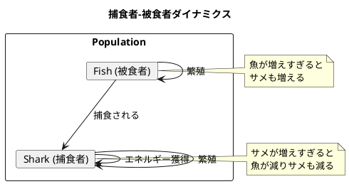

# 第19章: Wa-Tor シミュレーション

## はじめに

本章では、Wa-Tor（Water Torus）シミュレーションを通じて、セルオートマトンと判別共用体を使った捕食者-被食者モデルの実装を学びます。

Wa-Tor は1984年に A.K. Dewdney が Scientific American で紹介した古典的なシミュレーションで、魚（被食者）とサメ（捕食者）の生態系をモデル化します。

## 1. Wa-Tor の世界

### トーラス型ワールド

Wa-Tor の世界はトーラス（ドーナツ型）です。端に到達すると反対側に出現します。



### セルの種類

- **水（Water）**: 空のセル
- **魚（Fish）**: 被食者、移動と繁殖のみ
- **サメ（Shark）**: 捕食者、移動、繁殖、捕食

## 2. データモデル

### セルの定義

```fsharp
/// セルの種類
[<RequireQualifiedAccess>]
type Cell =
    | Water
    | Fish of age: int * breedTime: int
    | Shark of age: int * breedTime: int * energy: int

/// 座標
type Position = int * int

/// ワールド
type World =
    { Width: int
      Height: int
      Cells: Map<Position, Cell>
      FishBreedTime: int
      SharkBreedTime: int
      SharkInitialEnergy: int
      SharkEnergyFromFish: int }
```

判別共用体を使用することで、各セルの状態を型安全に表現できます。

## 3. 座標操作

### トーラス上での座標ラップ

```fsharp
module Position =
    /// トーラス上で座標をラップ
    let wrap (width: int) (height: int) ((x, y): Position) : Position =
        ((x % width + width) % width, (y % height + height) % height)

    /// 隣接セルの座標を取得（4方向）
    let neighbors (width: int) (height: int) ((x, y): Position) : Position list =
        [(x - 1, y); (x + 1, y); (x, y - 1); (x, y + 1)]
        |> List.map (wrap width height)
```



## 4. ワールド操作

```fsharp
module World =
    /// ワールドを作成
    let create (width: int) (height: int) : World =
        let positions = [ for x in 0..width-1 do for y in 0..height-1 -> (x, y) ]
        let cells = positions |> List.map (fun pos -> (pos, Cell.Water)) |> Map.ofList
        { Width = width
          Height = height
          Cells = cells
          FishBreedTime = 3
          SharkBreedTime = 8
          SharkInitialEnergy = 5
          SharkEnergyFromFish = 3 }

    /// セルを取得
    let getCell (pos: Position) (world: World) : Cell =
        Map.tryFind pos world.Cells |> Option.defaultValue Cell.Water

    /// セルを設定
    let setCell (pos: Position) (cell: Cell) (world: World) : World =
        { world with Cells = Map.add pos cell world.Cells }

    /// 特定のセル種類の隣接セルを取得
    let getNeighborsOfType (pos: Position) (predicate: Cell -> bool) (world: World) : Position list =
        Position.neighbors world.Width world.Height pos
        |> List.filter (fun p -> predicate (getCell p world))
```

## 5. シミュレーションルール

### 魚のルール

1. 隣接する空のセルにランダムに移動
2. 一定時間（breedTime）経過後、繁殖（現在位置に子を残す）
3. 移動できない場合はその場に留まる

```fsharp
/// 魚のティック処理
let fishTick (pos: Position) (age: int) (breedTime: int) (world: World) : (Position * Cell) list =
    let emptyNeighbors = World.getNeighborsOfType pos CellOps.isWater world
    match pickRandom emptyNeighbors with
    | Some newPos ->
        if age + 1 >= breedTime then
            // 繁殖: 現在位置に子を残し、新位置に移動
            [ (pos, Cell.Fish(0, world.FishBreedTime))
              (newPos, Cell.Fish(0, world.FishBreedTime)) ]
        else
            // 移動のみ
            [ (pos, Cell.Water)
              (newPos, Cell.Fish(age + 1, breedTime)) ]
    | None ->
        // 移動できない: その場で年を取る
        [ (pos, Cell.Fish(age + 1, breedTime)) ]
```

### サメのルール

1. 隣接する魚がいれば食べる（エネルギー獲得）
2. 魚がいなければ空のセルに移動
3. 毎ターン、エネルギーを1消費
4. エネルギーが0になると死亡
5. 一定時間経過後、繁殖

```fsharp
/// サメのティック処理
let sharkTick (pos: Position) (age: int) (breedTime: int) (energy: int) (world: World) : (Position * Cell) list =
    if energy <= 0 then
        // エネルギー切れで死亡
        [ (pos, Cell.Water) ]
    else
        let fishNeighbors = World.getNeighborsOfType pos CellOps.isFish world
        let emptyNeighbors = World.getNeighborsOfType pos CellOps.isWater world

        match pickRandom fishNeighbors with
        | Some fishPos ->
            // 魚を食べる
            let newEnergy = energy + world.SharkEnergyFromFish
            if age + 1 >= breedTime then
                [ (pos, Cell.Shark(0, world.SharkBreedTime, world.SharkInitialEnergy))
                  (fishPos, Cell.Shark(0, breedTime, newEnergy)) ]
            else
                [ (pos, Cell.Water)
                  (fishPos, Cell.Shark(age + 1, breedTime, newEnergy)) ]
        | None ->
            match pickRandom emptyNeighbors with
            | Some newPos ->
                // 移動
                ...
            | None ->
                // 移動できない
                [ (pos, Cell.Shark(age + 1, breedTime, energy - 1)) ]
```



## 6. シミュレーション実行

```fsharp
module Simulation =
    /// 1ステップ実行
    let tick (world: World) : World =
        let mutable newWorld = world

        // 魚を処理
        for pos in Map.toList world.Cells |> List.map fst do
            match World.getCell pos newWorld with
            | Cell.Fish(age, breedTime) ->
                let updates = Rules.fishTick pos age breedTime newWorld
                for (p, c) in updates do
                    newWorld <- World.setCell p c newWorld
            | _ -> ()

        // サメを処理
        for pos in Map.toList world.Cells |> List.map fst do
            match World.getCell pos newWorld with
            | Cell.Shark(age, breedTime, energy) ->
                let updates = Rules.sharkTick pos age breedTime energy newWorld
                for (p, c) in updates do
                    newWorld <- World.setCell p c newWorld
            | _ -> ()

        newWorld

    /// 複数ステップ実行
    let run (steps: int) (world: World) : World =
        let rec loop n w =
            if n <= 0 then w
            else loop (n - 1) (tick w)
        loop steps world
```

## 7. 表示

```fsharp
module Display =
    let cellToChar = function
        | Cell.Water -> '.'
        | Cell.Fish _ -> 'f'
        | Cell.Shark _ -> 'S'

    let worldToString (world: World) : string =
        let sb = System.Text.StringBuilder()
        for y in 0..world.Height-1 do
            for x in 0..world.Width-1 do
                sb.Append(cellToChar (World.getCell (x, y) world)) |> ignore
            sb.AppendLine() |> ignore
        sb.ToString()
```

出力例：
```
.....f....
..S.......
....f.....
..f...S...
..........
```

## 8. 使用例

```fsharp
open FunctionalDesign.Part6.WaTorSimulation

// 10x10 のワールドを作成
let world = World.create 10 10

// 魚とサメを配置
let world' =
    world
    |> World.placeFish (2, 2)
    |> World.placeFish (3, 3)
    |> World.placeFish (4, 4)
    |> World.placeShark (5, 5)
    |> World.placeShark (6, 6)

// 初期状態を表示
printfn "%s" (Display.worldToString world')

// 統計情報
let (fishCount, sharkCount, waterCount) = World.getStats world'
printfn "Fish: %d, Sharks: %d, Water: %d" fishCount sharkCount waterCount

// 10ステップ実行
let final = Simulation.run 10 world'

// 最終状態を表示
printfn "%s" (Display.worldToString final)
```

## 9. 生態系のダイナミクス

Wa-Tor シミュレーションは以下のような生態系のダイナミクスを示します：



典型的なシナリオ：
1. 魚の個体数が増加
2. サメの餌が増え、サメも増加
3. サメが増えすぎて魚が減少
4. 餌不足でサメが減少
5. 魚が再び増加（サイクルが繰り返される）

## まとめ

本章では、Wa-Tor シミュレーションを通じて以下を学びました：

1. **セルオートマトン**: グリッドベースのシミュレーション
2. **判別共用体**: セルの状態を型安全に表現
3. **トーラス座標**: モジュロ演算によるラップアラウンド
4. **生態系モデル**: 捕食者-被食者ダイナミクス

## 第6部のまとめ

第6部では、並行処理とシミュレーションについて学びました：

- **並行処理システム**: 状態機械、イベントバス、MailboxProcessor
- **Wa-Tor シミュレーション**: セルオートマトン、生態系モデル

これらの技術は、複雑なシステムのモデリングと並行処理の実装に応用できます。

## 参考コード

本章のコード例は以下のファイルで確認できます：

- ソースコード: `app/fsharp/part6/src/Library.fs`
- テストコード: `app/fsharp/part6/tests/Tests.fs`
