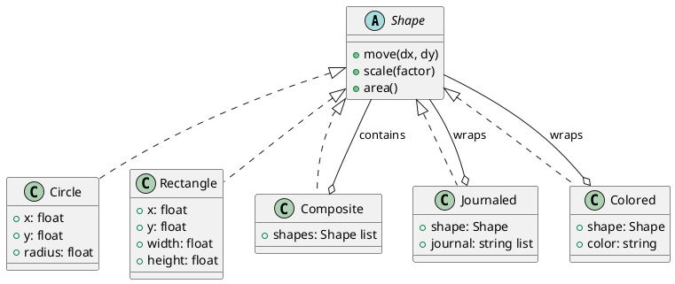
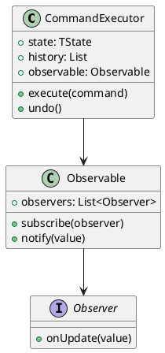
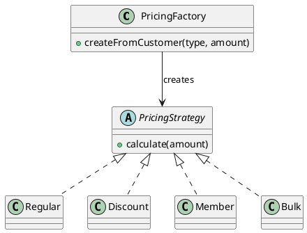

# 第20章: パターン間の相互作用

## はじめに

デザインパターンは単独で使用されることもありますが、実際のアプリケーションでは複数のパターンを組み合わせて使用することが一般的です。本章では、関数型プログラミングにおけるパターンの組み合わせ方と、その相乗効果について解説します。

### 学習目標

- Composite と Decorator パターンの組み合わせを理解する
- Command と Observer パターンの連携を実装する
- Strategy と Factory パターンの統合を学ぶ

## 1. Composite + Decorator パターン

### 基本概念

**Composite パターン**は、オブジェクトを木構造で表現し、個別オブジェクトと複合オブジェクトを同一視できるようにします。

**Decorator パターン**は、オブジェクトに動的に機能を追加します。

これらを組み合わせることで、複合オブジェクトに対しても装飾を適用できます。



### F# での実装

```fsharp
/// 図形（判別共用体で Composite + Decorator を表現）
type Shape =
    | Circle of x: float * y: float * radius: float
    | Rectangle of x: float * y: float * width: float * height: float
    | Composite of shapes: Shape list
    | Journaled of shape: Shape * journal: string list
    | Colored of shape: Shape * color: string
    | Bordered of shape: Shape * borderWidth: float

module Shape =
    /// 図形を移動（再帰的に適用）
    let rec move dx dy shape =
        match shape with
        | Circle(x, y, r) -> Circle(x + dx, y + dy, r)
        | Rectangle(x, y, w, h) -> Rectangle(x + dx, y + dy, w, h)
        | Composite shapes -> Composite(shapes |> List.map (move dx dy))
        | Journaled(s, journal) ->
            Journaled(move dx dy s, sprintf "moved(%.1f, %.1f)" dx dy :: journal)
        | Colored(s, c) -> Colored(move dx dy s, c)
        | Bordered(s, w) -> Bordered(move dx dy s, w)

    /// 面積を計算（再帰的に適用）
    let rec area shape =
        match shape with
        | Circle(_, _, r) -> System.Math.PI * r * r
        | Rectangle(_, _, w, h) -> w * h
        | Composite shapes -> shapes |> List.sumBy area
        | Journaled(s, _) -> area s
        | Colored(s, _) -> area s
        | Bordered(s, _) -> area s
```

### 使用例

```fsharp
// 複合図形を作成
let scene = Shape.composite [
    Shape.circle 0.0 0.0 5.0
    Shape.rectangle 10.0 10.0 20.0 15.0
]

// ジャーナル機能を追加
let journaledScene = Shape.journaled scene

// 移動と拡大を実行
let final =
    journaledScene
    |> Shape.move 5.0 5.0
    |> Shape.scale 2.0

// 履歴を確認
let history = Shape.getJournal final
// ["scaled(2.0)"; "moved(5.0, 5.0)"]
```

## 2. Command + Observer パターン

### 基本概念

**Command パターン**は、操作をオブジェクトとしてカプセル化します。

**Observer パターン**は、状態変更を購読者に通知します。

これらを組み合わせることで、コマンド実行時に自動的に観察者へ通知できます。



### F# での実装

```fsharp
/// オブザーバブル
type Observable<'T> =
    { Observers: Observer<'T> list }

/// コマンド実行器
type CommandExecutor<'TState> =
    { State: 'TState
      History: (Command<'TState> * 'TState) list
      Observable: Observable<'TState> }

module CommandExecutor =
    let execute (command: Command<'TState>) (executor: CommandExecutor<'TState>) =
        match command with
        | Execute(exec, _) ->
            let newState = exec executor.State
            Observable.notify newState executor.Observable  // 観察者に通知
            { executor with
                State = newState
                History = (command, executor.State) :: executor.History }
        | _ -> executor

    let subscribe (observer: Observer<'TState>) (executor: CommandExecutor<'TState>) =
        { executor with Observable = Observable.subscribe observer executor.Observable }
```

### 使用例

```fsharp
// カウンターの例
let mutable lastNotifiedValue = 0
let observer = fun v -> lastNotifiedValue <- v

let executor =
    CommandExecutor.create 0
    |> CommandExecutor.subscribe observer

let addCommand = Execute((fun s -> s + 10), "add 10")
let executor' = CommandExecutor.execute addCommand executor

// lastNotifiedValue は 10 になる（自動通知）
```

## 3. Strategy + Factory パターン

### 基本概念

**Strategy パターン**は、アルゴリズムをカプセル化して交換可能にします。

**Factory パターン**は、オブジェクト生成をカプセル化します。

これらを組み合わせることで、条件に基づいて適切な戦略を自動選択できます。



### F# での実装

```fsharp
/// 価格計算戦略
type PricingStrategy =
    | Regular
    | Discount of rate: decimal
    | Member of level: string
    | Bulk of threshold: decimal * rate: decimal

/// 戦略ファクトリ
module PricingFactory =
    let createFromCustomer (customerType: string) (purchaseAmount: decimal) : PricingStrategy =
        match customerType with
        | "guest" -> Regular
        | "member" -> Member "bronze"
        | "vip" -> Member "gold"
        | "wholesale" when purchaseAmount > 10000m -> Bulk(10000m, 0.15m)
        | _ -> Regular
```

### 使用例

```fsharp
// VIP 顧客には自動的にゴールド会員戦略を適用
let strategy = PricingFactory.createFromCustomer "vip" 5000m
let price = PricingStrategy.calculate strategy 1000m
// 800m (20% 割引)

// 卸売業者で大口注文には Bulk 戦略を適用
let bulkStrategy = PricingFactory.createFromCustomer "wholesale" 15000m
let bulkPrice = PricingStrategy.calculate bulkStrategy 15000m
// 12750m (15% 割引)
```

## まとめ

本章では、パターン間の相互作用について学びました：

1. **Composite + Decorator**: 複合オブジェクトへの動的機能追加
2. **Command + Observer**: コマンド実行と自動通知の連携
3. **Strategy + Factory**: 条件に基づく戦略の自動選択

パターンを組み合わせることで、より柔軟で保守性の高いシステムを構築できます。

## 参考コード

本章のコード例は以下のファイルで確認できます：

- ソースコード: `app/fsharp/part7/src/Library.fs`
- テストコード: `app/fsharp/part7/tests/Tests.fs`
