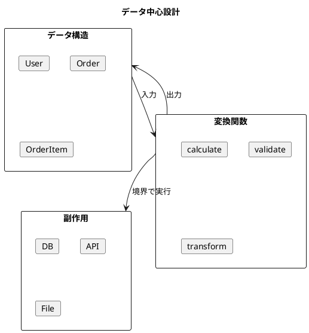
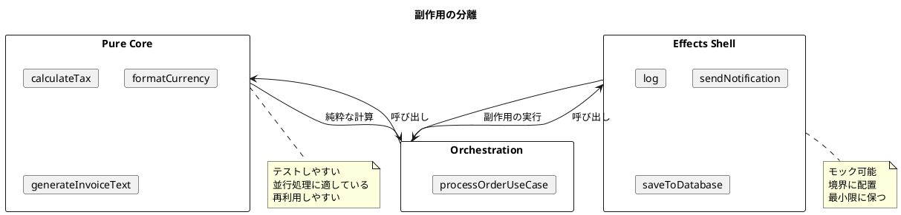

# 第21章: 関数型デザインのベストプラクティス

## はじめに

本章では、関数型プログラミングにおける設計のベストプラクティスを体系的に解説します。これらの原則は、保守性が高く、テストしやすい、堅牢なソフトウェアを構築するための指針となります。

### 学習目標

- データ中心設計の原則を理解する
- 純粋関数と副作用の分離方法を学ぶ
- テスト可能な設計パターンを習得する

## 1. データ中心設計

### 基本原則

関数型プログラミングでは、**データが主役**です。まずデータ構造を設計し、そのデータを変換する関数を実装します。



### データ構造の定義

```fsharp
/// ユーザー
type User =
    { Id: string
      Name: string
      Email: string
      CreatedAt: System.DateTime }

/// 注文
type Order =
    { Id: string
      UserId: string
      Items: OrderItem list
      Status: OrderStatus
      CreatedAt: System.DateTime }

and OrderItem =
    { ProductId: string
      Quantity: int
      Price: decimal }

and OrderStatus =
    | Pending
    | Confirmed
    | Shipped
    | Delivered
    | Cancelled
```

**ポイント**:
- プレーンなレコードを使用（クラスではなく）
- 必要最小限のフィールド
- 明確な命名

### 小さな純粋関数

```fsharp
module Order =
    // 各関数は単一の責任を持つ
    let calculateItemTotal (item: OrderItem) =
        decimal item.Quantity * item.Price

    let calculateTotal (order: Order) =
        order.Items |> List.sumBy calculateItemTotal

    let applyDiscount (rate: decimal) (total: decimal) =
        total * (1m - rate)
```

**原則**:
- 1つの関数は1つのことを行う
- 入力から出力への純粋な変換
- 副作用なし

## 2. パイプライン処理

### データ変換パイプライン

```fsharp
module Pipeline =
    /// 注文処理パイプライン
    let processOrder (discountRate: decimal) (order: Order) =
        order
        |> Order.calculateTotal
        |> Order.applyDiscount discountRate

    /// 注文ステータスの遷移
    let confirm (order: Order) =
        { order with Status = Confirmed }

    let ship (order: Order) =
        match order.Status with
        | Confirmed -> { order with Status = Shipped }
        | _ -> order

    let deliver (order: Order) =
        match order.Status with
        | Shipped -> { order with Status = Delivered }
        | _ -> order
```

### 使用例

```fsharp
let order = Order.create "O001" "U001" items

let finalPrice =
    order
    |> Pipeline.processOrder 0.10m

let shippedOrder =
    order
    |> Pipeline.confirm
    |> Pipeline.ship
```

## 3. Result 型によるエラーハンドリング

### バリデーション

```fsharp
module Validation =
    type ValidationError =
        | InvalidEmail of string
        | InvalidName of string
        | InvalidQuantity of string
        | InvalidPrice of string

    let validateEmail (email: string) : Result<string, ValidationError> =
        if email.Contains("@") then Ok email
        else Error (InvalidEmail "Email must contain @")

    let validateName (name: string) : Result<string, ValidationError> =
        if String.length name >= 2 then Ok name
        else Error (InvalidName "Name must be at least 2 characters")

    let validateQuantity (qty: int) : Result<int, ValidationError> =
        if qty > 0 then Ok qty
        else Error (InvalidQuantity "Quantity must be positive")
```

### Result の連鎖

```fsharp
    /// Result を連鎖させるヘルパー
    let bind (f: 'a -> Result<'b, 'e>) (result: Result<'a, 'e>) : Result<'b, 'e> =
        match result with
        | Ok v -> f v
        | Error e -> Error e

    /// 複数の検証を組み合わせる
    let validateOrderItem (productId: string) (qty: int) (price: decimal) =
        validateQuantity qty
        |> bind (fun q ->
            validatePrice price
            |> Result.map (fun p -> { ProductId = productId; Quantity = q; Price = p }))
```

## 4. 副作用の分離

### 純粋な計算部分

```fsharp
/// 純粋関数（副作用なし）
module Pure =
    let calculateTax (rate: decimal) (amount: decimal) =
        amount * rate

    let formatCurrency (amount: decimal) =
        sprintf "$%.2f" amount

    let generateInvoiceText (order: Order) (total: decimal) (tax: decimal) =
        let lines =
            order.Items
            |> List.map (fun item ->
                sprintf "%s x %d @ $%.2f = $%.2f"
                    item.ProductId item.Quantity item.Price
                    (decimal item.Quantity * item.Price))
        let header = sprintf "Invoice for Order %s" order.Id
        let subtotal = sprintf "Subtotal: $%.2f" total
        let taxLine = sprintf "Tax: $%.2f" tax
        let totalLine = sprintf "Total: $%.2f" (total + tax)
        String.concat "\n" (header :: lines @ [subtotal; taxLine; totalLine])
```

### 副作用を持つ部分（境界）

```fsharp
/// 副作用を持つ部分（システムの境界に配置）
module Effects =
    /// ログ出力（副作用）
    let log (message: string) =
        printfn "[LOG] %s" message

    /// 通知送信（副作用）
    type Notification =
        { Recipient: string
          Subject: string
          Body: string }

    let sendNotification (notification: Notification) =
        printfn "[NOTIFICATION] To: %s, Subject: %s"
            notification.Recipient notification.Subject
```

### 構造図



## 5. テスト可能な設計

### 原則

1. **純粋関数を増やす**: テストが簡単
2. **依存性を注入**: モック可能
3. **小さな関数**: 単体テストが容易

### テスト例

```fsharp
[<Fact>]
let ``注文の合計金額を計算できる`` () =
    let items = [
        { ProductId = "P001"; Quantity = 2; Price = 100m }
        { ProductId = "P002"; Quantity = 3; Price = 50m }
    ]
    let order = Order.create "O001" "U001" items
    let total = Order.calculateTotal order
    Assert.Equal(350m, total)

[<Fact>]
let ``有効なメールアドレスを検証できる`` () =
    let result = Validation.validateEmail "test@example.com"
    Assert.True(Result.isOk result)
```

## まとめ

本章では、関数型デザインのベストプラクティスを学びました：

1. **データ中心設計**: データ構造を先に、関数を後に
2. **パイプライン処理**: `|>` でデータを変換
3. **Result 型**: エラーを値として扱う
4. **副作用の分離**: 純粋な計算とシェルの分離
5. **テスト可能な設計**: 純粋関数と依存性注入

これらの原則に従うことで、保守性が高く、テストしやすいコードを書くことができます。

## 参考コード

本章のコード例は以下のファイルで確認できます：

- ソースコード: `app/fsharp/part7/src/Library.fs`
- テストコード: `app/fsharp/part7/tests/Tests.fs`
