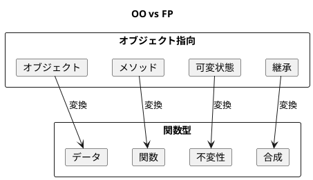
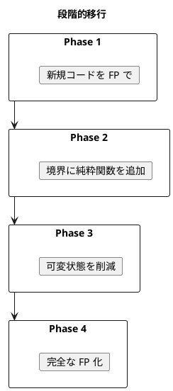

# 第22章: オブジェクト指向から関数型への移行

## はじめに

本章では、オブジェクト指向（OO）スタイルのコードを関数型（FP）スタイルに移行するための戦略とテクニックを解説します。段階的なアプローチにより、既存のコードベースを安全に関数型に移行できます。

### 学習目標

- OO と FP の根本的な違いを理解する
- 段階的な移行戦略を学ぶ
- 実践的なリファクタリングパターンを習得する

## 1. OO と FP の対比

### パラダイムの違い



| 概念 | オブジェクト指向 | 関数型 |
|-----|----------------|-------|
| 基本単位 | オブジェクト | データ + 関数 |
| 状態管理 | 可変（mutable） | 不変（immutable） |
| 多態性 | 継承・インターフェース | 判別共用体・パターンマッチング |
| コード再利用 | 継承 | 関数合成 |
| 副作用 | どこでも可能 | 境界に分離 |

## 2. OO スタイル → FP スタイル

### Before: OO スタイル（可変状態を持つ）

```fsharp
/// OO スタイルの銀行口座
type AccountOO(id: string, initialBalance: decimal) =
    let mutable balance = initialBalance
    let mutable transactions: (string * decimal * System.DateTime) list = []

    member _.Id = id
    member _.Balance = balance

    member _.Deposit(amount: decimal) =
        if amount > 0m then
            balance <- balance + amount
            transactions <- ("deposit", amount, System.DateTime.UtcNow) :: transactions
            true
        else false

    member _.Withdraw(amount: decimal) =
        if amount > 0m && balance >= amount then
            balance <- balance - amount
            transactions <- ("withdrawal", amount, System.DateTime.UtcNow) :: transactions
            true
        else false
```

**問題点**:
- 内部状態が可変
- テストが困難（状態に依存）
- 履歴の追跡が難しい
- 並行処理に弱い

### After: FP スタイル（イミュータブル）

```fsharp
/// トランザクション
type Transaction =
    { Type: TransactionType
      Amount: decimal
      Timestamp: System.DateTime }

and TransactionType =
    | Deposit
    | Withdrawal

/// 口座（イミュータブル）
type Account =
    { Id: string
      Balance: decimal
      Transactions: Transaction list }

module Account =
    /// 口座を作成
    let create (id: string) (initialBalance: decimal) : Account =
        { Id = id
          Balance = initialBalance
          Transactions = [] }

    /// 入金（新しい口座を返す）
    let deposit (amount: decimal) (account: Account) : Result<Account, string> =
        if amount > 0m then
            let tx = { Type = Deposit; Amount = amount; Timestamp = System.DateTime.UtcNow }
            Ok { account with
                    Balance = account.Balance + amount
                    Transactions = tx :: account.Transactions }
        else Error "Amount must be positive"

    /// 出金（新しい口座を返す）
    let withdraw (amount: decimal) (account: Account) : Result<Account, string> =
        if amount <= 0m then
            Error "Amount must be positive"
        elif amount > account.Balance then
            Error "Insufficient balance"
        else
            let tx = { Type = Withdrawal; Amount = amount; Timestamp = System.DateTime.UtcNow }
            Ok { account with
                    Balance = account.Balance - amount
                    Transactions = tx :: account.Transactions }
```

**改善点**:
- 状態が不変
- 元のデータは変更されない
- Result 型でエラーを表現
- テストが容易
- 並行処理に適している

## 3. 継承からコンポジションへ

### Before: 継承ベース

```fsharp
// OO スタイル（擬似コード）
// abstract class Animal
//   def speak(): String
// class Dog extends Animal
//   override def speak() = "Woof"
// class Cat extends Animal
//   override def speak() = "Meow"
```

### After: 判別共用体 + パターンマッチング

```fsharp
type Animal =
    | Dog of name: string
    | Cat of name: string
    | Bird of name: string

let speak (animal: Animal) : string =
    match animal with
    | Dog _ -> "Woof"
    | Cat _ -> "Meow"
    | Bird _ -> "Tweet"

let getName (animal: Animal) : string =
    match animal with
    | Dog name -> name
    | Cat name -> name
    | Bird name -> name
```

**利点**:
- 新しい動物を追加すると、コンパイラがすべての `match` を更新するよう警告
- 関数を追加しても既存のコードに影響なし
- パターンマッチングによる網羅性チェック

## 4. インターフェースから関数レコードへ

### Before: インターフェース

```fsharp
// OO スタイル
// interface IRepository<T>
//   def findById(id: String): Option<T>
//   def save(entity: T): T
//   def delete(id: String): Boolean
```

### After: 関数のレコード

```fsharp
type Repository<'T> =
    { FindById: string -> 'T option
      Save: 'T -> 'T
      Delete: string -> bool }

/// インメモリリポジトリを作成
let createInMemoryRepo<'T> (getId: 'T -> string) : Repository<'T> =
    let mutable data: Map<string, 'T> = Map.empty
    { FindById = fun id -> Map.tryFind id data
      Save = fun entity ->
          let id = getId entity
          data <- Map.add id entity data
          entity
      Delete = fun id ->
          if Map.containsKey id data then
              data <- Map.remove id data
              true
          else false }
```

**利点**:
- テスト用のモックが簡単
- 部分的な実装が可能
- 関数を引数として渡せる

## 5. イベントソーシングへの移行

### 従来の可変状態

```fsharp
// 状態を直接変更
account.Deposit(100m)
account.Withdraw(50m)
// 何が起きたかの履歴は失われる
```

### イベントソーシング

```fsharp
/// イベント
type AccountEvent =
    | AccountCreated of id: string * initialBalance: decimal
    | MoneyDeposited of amount: decimal
    | MoneyWithdrawn of amount: decimal

/// イベントを適用して状態を再構築
let applyEvent (state: Account) (event: AccountEvent) : Account =
    match event with
    | AccountCreated(id, balance) ->
        { Id = id; Balance = balance; Transactions = [] }
    | MoneyDeposited amount ->
        let tx = { Type = Deposit; Amount = amount; Timestamp = System.DateTime.UtcNow }
        { state with Balance = state.Balance + amount; Transactions = tx :: state.Transactions }
    | MoneyWithdrawn amount ->
        let tx = { Type = Withdrawal; Amount = amount; Timestamp = System.DateTime.UtcNow }
        { state with Balance = state.Balance - amount; Transactions = tx :: state.Transactions }

/// イベントリストから状態を再構築
let replay (events: AccountEvent list) : Account =
    let initial = { Id = ""; Balance = 0m; Transactions = [] }
    List.fold applyEvent initial events
```

**利点**:
- 完全な履歴を保持
- 任意の時点の状態を再構築可能
- 監査ログとして使用可能
- デバッグが容易

## 6. 移行戦略

### 段階的アプローチ

1. **新しいコードは FP で書く**
2. **既存コードの境界に純粋関数を追加**
3. **可変状態を減らしていく**
4. **テストを追加しながらリファクタリング**



## まとめ

本章では、OO から FP への移行について学びました：

1. **可変状態 → 不変データ**: レコード型と `with` キーワード
2. **継承 → 判別共用体**: パターンマッチングによる多態性
3. **インターフェース → 関数レコード**: 柔軟な依存性注入
4. **状態変更 → イベントソーシング**: 完全な履歴保持

## 第7部のまとめ

第7部では、関数型プログラミングの実践的な技術を学びました：

- **パターン間の相互作用**: 複数パターンの組み合わせ
- **ベストプラクティス**: データ中心設計、副作用の分離
- **OO から FP への移行**: 段階的なリファクタリング

これらの知識を活用して、保守性が高く、テストしやすい、堅牢なソフトウェアを構築してください。

## 参考コード

本章のコード例は以下のファイルで確認できます：

- ソースコード: `app/fsharp/part7/src/Library.fs`
- テストコード: `app/fsharp/part7/tests/Tests.fs`
