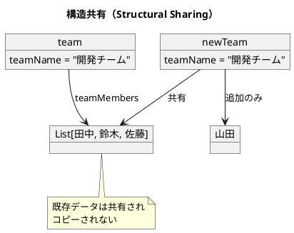

# 第1章: 不変性とデータ変換

## はじめに

関数型プログラミングの最も重要な概念の一つが**不変性（Immutability）**です。Haskell はデフォルトで不変であり、すべての値は一度作成されると変更できません。これにより、プログラムの予測可能性が向上し、並行処理での問題を防ぎます。

本章では、Haskell における不変データ構造の基本から、データ変換パイプライン、副作用の分離まで、実践的な例を通じて学びます。

## 1. 不変データ構造の基本

### レコード型による不変データ

Haskell のレコード構文を使ってデータ型を定義します：

```haskell
-- | Person レコード（不変）
data Person = Person
    { personName :: String
    , personAge  :: Int
    } deriving (Show, Eq)

-- | 年齢を更新する関数（新しい Person を返す）
updateAge :: Person -> Int -> Person
updateAge person newAge = person { personAge = newAge }

-- 使用例
let original = Person "田中" 30
let updated = updateAge original 31

original   -- => Person {personName = "田中", personAge = 30}  ← 元は変わらない
updated    -- => Person {personName = "田中", personAge = 31}  ← 新しい値
```

### 不変性の利点

1. **参照透過性**: 同じ入力に対して常に同じ出力
2. **スレッドセーフ**: 複数スレッドから安全にアクセス可能
3. **推論の容易さ**: 値が変わらないため動作を追跡しやすい
4. **遅延評価との相性**: 必要になるまで計算を遅延できる

## 2. 構造共有（Structural Sharing）

Haskell のリストや木構造は構造共有により効率的にメモリを使用します：

```haskell
-- | チームメンバー
data Role = Developer | Designer | Manager
    deriving (Show, Eq)

data Member = Member
    { memberName :: String
    , memberRole :: Role
    } deriving (Show, Eq)

-- | チーム
data Team = Team
    { teamName    :: String
    , teamMembers :: [Member]
    } deriving (Show, Eq)

-- | メンバーを追加（既存リストは共有される）
addMember :: Team -> Member -> Team
addMember team newMember = team { teamMembers = teamMembers team ++ [newMember] }
```



## 3. データ変換パイプライン

### パイプライン演算子と関数適用

Haskell では `$` と `&`（Data.Function から）を使ってパイプラインを構築します：

```haskell
import Data.Function ((&))

-- | 注文アイテム
data Item = Item
    { itemName     :: String
    , itemPrice    :: Int
    , itemQuantity :: Int
    } deriving (Show, Eq)

-- | 会員種別
data Membership = Gold | Silver | Bronze | Regular
    deriving (Show, Eq)

-- | 顧客
data Customer = Customer
    { customerName       :: String
    , customerMembership :: Membership
    } deriving (Show, Eq)

-- | 注文
data Order = Order
    { orderItems    :: [Item]
    , orderCustomer :: Customer
    } deriving (Show, Eq)

-- | アイテムの小計を計算
calculateSubtotal :: Item -> Int
calculateSubtotal item = itemPrice item * itemQuantity item

-- | 会員割引率を取得
membershipDiscount :: Membership -> Double
membershipDiscount Gold   = 0.1
membershipDiscount Silver = 0.05
membershipDiscount Bronze = 0.02
membershipDiscount Regular = 0.0

-- | 注文合計を計算
calculateTotal :: Order -> Int
calculateTotal order = sum $ map calculateSubtotal (orderItems order)

-- | 割引を適用
applyDiscount :: Order -> Int -> Double
applyDiscount order total =
    let discountRate = membershipDiscount (customerMembership (orderCustomer order))
    in fromIntegral total * (1 - discountRate)

-- | 注文処理パイプライン
processOrder :: Order -> Double
processOrder order =
    let total = calculateTotal order
    in applyDiscount order total

-- または & を使った記法
processOrderPipe :: Order -> Double
processOrderPipe order =
    order
    & calculateTotal
    & applyDiscount order
```

## 4. 副作用の分離

Haskell では副作用は IO モナドで明示的に扱います：

```haskell
-- | 請求書データ
data Invoice = Invoice
    { invoiceSubtotal :: Int
    , invoiceTax      :: Double
    , invoiceTotal    :: Double
    } deriving (Show, Eq)

-- | 請求書を計算（純粋関数）
calculateInvoice :: [Item] -> Double -> Invoice
calculateInvoice items taxRate =
    let subtotal = sum $ map calculateSubtotal items
        tax = fromIntegral subtotal * taxRate
        total = fromIntegral subtotal + tax
    in Invoice subtotal tax total

-- | 請求書を保存（IO を含む副作用）
saveInvoice :: Invoice -> IO ()
saveInvoice invoice = do
    putStrLn $ "Saving invoice: " ++ show invoice
    -- 実際のDB保存処理

-- | 通知を送信（IO を含む副作用）
sendNotification :: Invoice -> String -> IO ()
sendNotification invoice email = do
    putStrLn $ "Sending to: " ++ email
    -- 実際のメール送信処理

-- | 処理全体のオーケストレーション
processAndSaveInvoice :: [Item] -> Double -> String -> IO ()
processAndSaveInvoice items taxRate email = do
    let invoice = calculateInvoice items taxRate  -- 純粋な計算
    saveInvoice invoice                            -- 副作用
    sendNotification invoice email                 -- 副作用
```

## 5. 永続的データ構造：Undo/Redo の実装

不変データを活用した履歴管理：

```haskell
-- | 履歴を保持するデータ構造
data History a = History
    { historyCurrent :: Maybe a
    , historyPast    :: [a]
    , historyFuture  :: [a]
    } deriving (Show, Eq)

-- | 空の履歴を作成
createHistory :: History a
createHistory = History Nothing [] []

-- | 新しい状態をプッシュ
pushState :: History a -> a -> History a
pushState history newState =
    History
        { historyCurrent = Just newState
        , historyPast = case historyCurrent history of
            Nothing -> historyPast history
            Just current -> current : historyPast history
        , historyFuture = []  -- 新状態で未来はクリア
        }

-- | Undo 操作
undo :: History a -> History a
undo history = case historyPast history of
    [] -> history  -- 戻る履歴がない
    (prev:rest) -> History
        { historyCurrent = Just prev
        , historyPast = rest
        , historyFuture = case historyCurrent history of
            Nothing -> historyFuture history
            Just current -> current : historyFuture history
        }

-- | Redo 操作
redo :: History a -> History a
redo history = case historyFuture history of
    [] -> history  -- 進む履歴がない
    (next:rest) -> History
        { historyCurrent = Just next
        , historyPast = case historyCurrent history of
            Nothing -> historyPast history
            Just current -> current : historyPast history
        , historyFuture = rest
        }

-- | 現在の状態を取得
currentState :: History a -> Maybe a
currentState = historyCurrent

-- | Undo 可能か
canUndo :: History a -> Bool
canUndo = not . null . historyPast

-- | Redo 可能か
canRedo :: History a -> Bool
canRedo = not . null . historyFuture
```

### 使用例

```haskell
-- 履歴の操作
let h1 = createHistory :: History Int
let h2 = pushState h1 1
let h3 = pushState h2 2
let h4 = pushState h3 3

currentState h4  -- => Just 3
canUndo h4       -- => True

let h5 = undo h4
currentState h5  -- => Just 2
canRedo h5       -- => True

let h6 = redo h5
currentState h6  -- => Just 3
```

## 6. まとめ

Haskell における不変性の特徴：

| 概念 | Haskell での実現 |
|-----|-----------------|
| 不変データ | デフォルトで不変（let で束縛） |
| レコード更新 | `{ record \| field = newValue }` 構文 |
| 構造共有 | 自動的に最適化される |
| パイプライン | `$`、`&`、関数合成 (.) |
| 副作用分離 | IO モナドで明示的に |

### 次のステップ

- 第2章では関数合成と高階関数を学びます
- 第3章では型クラスによる多態性を探ります
