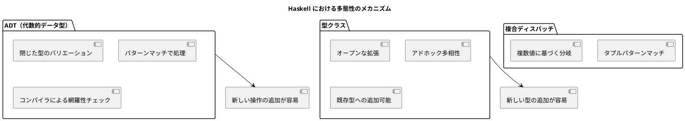

# 第3章: 多態性とディスパッチ

## はじめに

多態性（ポリモーフィズム）は、同じインターフェースで異なる振る舞いを実現する強力な概念です。Haskell では、代数的データ型（ADT）、型クラス、パターンマッチという複数のメカニズムで多態性を実現します。

本章では、これらのメカニズムを使い分けて、柔軟で拡張性の高いコードを書く方法を学びます。

## 1. 代数的データ型（ADT）による多態性

### 基本的な使い方

Haskell の代数的データ型は有限のバリエーションを定義するのに最適です：

```haskell
-- | 図形を表す代数的データ型
data Shape
    = Rectangle' { rectWidth :: Double, rectHeight :: Double }
    | Circle' { circleRadius :: Double }
    | Triangle' { triBase :: Double, triHeight :: Double }
    | Square' { squareSide :: Double }
    deriving (Show, Eq)

-- | 面積を計算（パターンマッチ）
calculateArea :: Shape -> Double
calculateArea shape = case shape of
    Rectangle' w h -> w * h
    Circle' r      -> pi * r * r
    Triangle' b h  -> b * h / 2
    Square' s      -> s * s

-- | 周囲長を計算
calculatePerimeter :: Shape -> Double
calculatePerimeter shape = case shape of
    Rectangle' w h -> 2 * (w + h)
    Circle' r      -> 2 * pi * r
    Triangle' b h  -> b + 2 * sqrt ((b/2)^2 + h^2)
    Square' s      -> 4 * s

-- 使用例
calculateArea (Rectangle' 4 5)  -- => 20.0
calculateArea (Circle' 3)       -- => 28.27...
calculateArea (Triangle' 6 5)   -- => 15.0
```

### ADT の利点

1. **網羅性チェック**: コンパイラがすべてのケースをカバーしているか確認
2. **型安全性**: 不正な型の値を渡せない
3. **パターンマッチ**: 分岐を簡潔に記述可能

## 2. 複合ディスパッチ

タプルを使ったパターンマッチで、複数の値に基づくディスパッチを実現できます：

```haskell
-- | 支払い方法
data PaymentMethod
    = CreditCard
    | BankTransfer
    | Cash
    | Cryptocurrency
    deriving (Show, Eq)

-- | 通貨
data Currency = JPY | USD | EUR
    deriving (Show, Eq)

-- | 支払い情報
data Payment = Payment
    { paymentMethod   :: PaymentMethod
    , paymentCurrency :: Currency
    , paymentAmount   :: Int
    } deriving (Show, Eq)

-- | 支払い結果
data PaymentResult = PaymentResult
    { resultStatus    :: String
    , resultMessage   :: String
    , resultAmount    :: Int
    , resultConverted :: Maybe Int
    } deriving (Show, Eq)

-- | 支払い処理（複合ディスパッチ）
processPayment :: Payment -> PaymentResult
processPayment payment = case (paymentMethod payment, paymentCurrency payment) of
    (CreditCard, JPY) -> PaymentResult
        { resultStatus = "processed"
        , resultMessage = "クレジットカード（円）で処理しました"
        , resultAmount = paymentAmount payment
        , resultConverted = Nothing
        }
    (CreditCard, USD) -> PaymentResult
        { resultStatus = "processed"
        , resultMessage = "Credit card (USD) processed"
        , resultAmount = paymentAmount payment
        , resultConverted = Just (paymentAmount payment * 150)
        }
    (BankTransfer, JPY) -> PaymentResult
        { resultStatus = "pending"
        , resultMessage = "銀行振込を受け付けました"
        , resultAmount = paymentAmount payment
        , resultConverted = Nothing
        }
    (Cash, _) -> PaymentResult
        { resultStatus = "processed"
        , resultMessage = "現金で処理しました"
        , resultAmount = paymentAmount payment
        , resultConverted = Nothing
        }
    _ -> PaymentResult
        { resultStatus = "error"
        , resultMessage = "サポートされていない支払い方法です"
        , resultAmount = paymentAmount payment
        , resultConverted = Nothing
        }
```

## 3. 階層的ディスパッチ

ADT を使って型階層を表現できます：

```haskell
-- | 口座タイプ
data AccountType
    = Savings
    | PremiumSavings  -- Savings の特化型
    | Checking
    deriving (Show, Eq)

-- | 口座
data Account = Account
    { accountType    :: AccountType
    , accountBalance :: Int
    } deriving (Show, Eq)

-- | 利率を取得
getInterestRate :: AccountType -> Double
getInterestRate Savings        = 0.02
getInterestRate PremiumSavings = 0.05
getInterestRate Checking       = 0.001

-- | 利息を計算
calculateInterest :: Account -> Double
calculateInterest account =
    fromIntegral (accountBalance account) * getInterestRate (accountType account)

-- 使用例
calculateInterest (Account Savings 10000)        -- => 200.0
calculateInterest (Account PremiumSavings 10000) -- => 500.0
calculateInterest (Account Checking 10000)       -- => 10.0
```

## 4. 型クラス（アドホック多相性）

型クラスは、異なる型に共通の操作を定義する Haskell の主要な多態性メカニズムです：

### 型クラスの定義

```haskell
-- | 2D座標
data Point = Point
    { pointX :: Double
    , pointY :: Double
    } deriving (Show, Eq)

-- | 描画可能な型クラス
class Drawable a where
    draw :: a -> String
    boundingBox :: a -> (Point, Point)  -- (最小点, 最大点)

-- | 変換可能な型クラス
class Transformable a where
    translate :: Double -> Double -> a -> a
    scale :: Double -> a -> a
```

### 型クラスのインスタンス

```haskell
-- | 矩形
data Rectangle = Rectangle
    { rectangleX      :: Double
    , rectangleY      :: Double
    , rectangleWidth  :: Double
    , rectangleHeight :: Double
    } deriving (Show, Eq)

-- | 円
data Circle = Circle
    { circleCenterX :: Double
    , circleCenterY :: Double
    , circleR       :: Double
    } deriving (Show, Eq)

-- Drawable インスタンス
instance Drawable Rectangle where
    draw r = "Rectangle at (" ++ show (rectangleX r) ++ ", " ++ show (rectangleY r) ++ 
             ") with size " ++ show (rectangleWidth r) ++ "x" ++ show (rectangleHeight r)
    boundingBox r = 
        ( Point (rectangleX r) (rectangleY r)
        , Point (rectangleX r + rectangleWidth r) (rectangleY r + rectangleHeight r)
        )

instance Drawable Circle where
    draw c = "Circle at (" ++ show (circleCenterX c) ++ ", " ++ show (circleCenterY c) ++ 
             ") with radius " ++ show (circleR c)
    boundingBox c =
        ( Point (circleCenterX c - circleR c) (circleCenterY c - circleR c)
        , Point (circleCenterX c + circleR c) (circleCenterY c + circleR c)
        )

-- Transformable インスタンス
instance Transformable Rectangle where
    translate dx dy r = r { rectangleX = rectangleX r + dx, rectangleY = rectangleY r + dy }
    scale factor r = r { rectangleWidth = rectangleWidth r * factor
                       , rectangleHeight = rectangleHeight r * factor }

instance Transformable Circle where
    translate dx dy c = c { circleCenterX = circleCenterX c + dx
                          , circleCenterY = circleCenterY c + dy }
    scale factor c = c { circleR = circleR c * factor }
```

### 型クラスの利点

1. **オープンな拡張**: 新しい型にインスタンスを追加可能
2. **型安全**: コンパイル時に型チェック
3. **既存型の拡張**: 自分で定義していない型にもインスタンスを定義可能

## 5. 存在型による異種コレクション

異なる型を同じリストに格納するには存在型を使用します：

```haskell
-- | 描画可能な図形のラッパー
data DrawableShape
    = DrawableRect Rectangle
    | DrawableCircle Circle
    deriving (Show, Eq)

instance Drawable DrawableShape where
    draw (DrawableRect r) = draw r
    draw (DrawableCircle c) = draw c
    boundingBox (DrawableRect r) = boundingBox r
    boundingBox (DrawableCircle c) = boundingBox c

-- 異種リストの使用
shapes :: [DrawableShape]
shapes = 
    [ DrawableRect (Rectangle 0 0 10 10)
    , DrawableCircle (Circle 5 5 3)
    ]

-- すべての図形を描画
drawAll :: [DrawableShape] -> [String]
drawAll = map draw
```

## 6. 式の評価（Expression Problem）

ADT は閉じた型のセットに対する操作の追加に適しています：

```haskell
-- | 式を表すADT
data Expr
    = Lit Int
    | Add Expr Expr
    | Mul Expr Expr
    | Neg Expr
    deriving (Show, Eq)

-- | 式を評価
eval :: Expr -> Int
eval expr = case expr of
    Lit n     -> n
    Add e1 e2 -> eval e1 + eval e2
    Mul e1 e2 -> eval e1 * eval e2
    Neg e     -> negate (eval e)

-- | 式を整形表示
prettyPrint :: Expr -> String
prettyPrint expr = case expr of
    Lit n     -> show n
    Add e1 e2 -> "(" ++ prettyPrint e1 ++ " + " ++ prettyPrint e2 ++ ")"
    Mul e1 e2 -> "(" ++ prettyPrint e1 ++ " * " ++ prettyPrint e2 ++ ")"
    Neg e     -> "(-" ++ prettyPrint e ++ ")"

-- 使用例
let expr = Add (Mul (Lit 2) (Lit 3)) (Neg (Lit 1))
eval expr        -- => 5
prettyPrint expr -- => "(2 * 3) + (-1)"
```

## 7. 動物の鳴き声（古典的な例）

```haskell
-- | 動物のADT
data Animal
    = Dog { dogName :: String }
    | Cat { catName :: String }
    | Bird { birdName :: String, birdCanFly :: Bool }
    deriving (Show, Eq)

-- | 鳴き声
speak :: Animal -> String
speak animal = case animal of
    Dog name   -> name ++ " says: Woof!"
    Cat name   -> name ++ " says: Meow!"
    Bird name _ -> name ++ " says: Tweet!"

-- | 移動方法
move :: Animal -> String
move animal = case animal of
    Dog name      -> name ++ " runs on four legs"
    Cat name      -> name ++ " prowls silently"
    Bird name True -> name ++ " flies through the air"
    Bird name False -> name ++ " hops on the ground"

-- 使用例
speak (Dog "Pochi")      -- => "Pochi says: Woof!"
move (Bird "Kiwi" False) -- => "Kiwi hops on the ground"
```

## 8. まとめ



| 方法 | 用途 | 利点 |
|-----|------|------|
| ADT + パターンマッチ | 閉じた型セット | 網羅性チェック、操作追加が容易 |
| 型クラス | オープンな拡張 | 新しい型の追加が容易 |
| 複合ディスパッチ | 複数条件での分岐 | 柔軟なマッチング |

### 次のステップ

- 第4章ではデータ検証について学びます
- 第5章ではプロパティベーステスト（QuickCheck）を探ります
