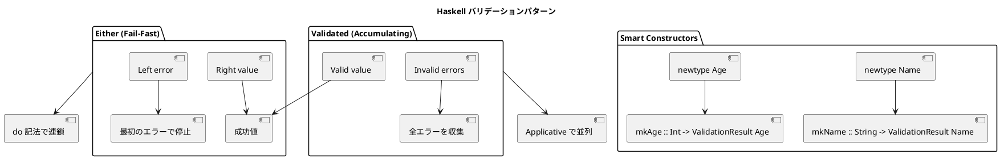

# 第4章: データバリデーション

## はじめに

Haskell では型システムと組み合わせて、コンパイル時と実行時の両方でデータの整合性を保証できます。本章では、`Either`、`Validated` パターン、スマートコンストラクタを使ったデータバリデーションの手法を学びます。

## 1. 基本的なバリデーション（Either を使用）

### Either によるバリデーション

`Either a b` は失敗時に `Left`、成功時に `Right` を返す型です：

```haskell
-- | バリデーションエラー型
data ValidationError
    = EmptyValue String
    | TooShort String Int Int  -- field, actual, minimum
    | TooLong String Int Int   -- field, actual, maximum
    | OutOfRange String Int Int Int
    | InvalidFormat String String
    deriving (Show, Eq)

-- | バリデーション結果
type ValidationResult a = Either ValidationError a

-- | 名前のバリデーション
validateNonEmpty :: String -> String -> ValidationResult String
validateNonEmpty field value
    | null value = Left (EmptyValue field)
    | otherwise = Right value

-- | 年齢のバリデーション
validateRange :: String -> Int -> Int -> Int -> ValidationResult Int
validateRange field minVal maxVal value
    | value < minVal || value > maxVal = Left (OutOfRange field value minVal maxVal)
    | otherwise = Right value

-- 使用例
validateNonEmpty "name" "田中"  -- => Right "田中"
validateNonEmpty "name" ""      -- => Left (EmptyValue "name")
validateRange "age" 0 150 25    -- => Right 25
validateRange "age" 0 150 (-1)  -- => Left (OutOfRange "age" (-1) 0 150)
```

## 2. スマートコンストラクタ

### ドメインプリミティブ

newtypes とスマートコンストラクタを組み合わせて、不正な値を型レベルで防ぎます：

```haskell
-- | Name ドメイン型
newtype Name = Name { unName :: String }
    deriving (Show, Eq)

-- | スマートコンストラクタ
mkName :: String -> ValidationResult Name
mkName value = do
    _ <- validateNonEmpty "name" value
    _ <- validateMaxLength "name" 100 value
    Right (Name value)

-- | Age ドメイン型
newtype Age = Age { unAge :: Int }
    deriving (Show, Eq)

mkAge :: Int -> ValidationResult Age
mkAge value = do
    _ <- validateRange "age" 0 150 value
    Right (Age value)

-- | Email ドメイン型
newtype Email = Email { unEmail :: String }
    deriving (Show, Eq)

mkEmail :: String -> ValidationResult Email
mkEmail value = do
    _ <- validateNonEmpty "email" value
    _ <- validateEmail value
    Right (Email value)

-- 使用例
mkName "田中太郎"  -- => Right (Name "田中太郎")
mkName ""          -- => Left (EmptyValue "name")
mkAge 25           -- => Right (Age 25)
mkAge 200          -- => Left (OutOfRange "age" 200 0 150)
```

## 3. Validated パターン（エラー蓄積）

`Either` は最初のエラーで停止しますが、すべてのエラーを収集したい場合は `Validated` パターンを使用：

```haskell
-- | Validated 型
data Validated a
    = Valid a
    | Invalid [ValidationError]
    deriving (Show, Eq)

instance Functor Validated where
    fmap f (Valid a) = Valid (f a)
    fmap _ (Invalid es) = Invalid es

instance Applicative Validated where
    pure = Valid
    Valid f <*> Valid a = Valid (f a)
    Invalid es1 <*> Invalid es2 = Invalid (es1 ++ es2)  -- エラーを蓄積
    Invalid es <*> _ = Invalid es
    _ <*> Invalid es = Invalid es

-- | Either から Validated への変換
fromResult :: ValidationResult a -> Validated a
fromResult (Right a) = Valid a
fromResult (Left e) = Invalid [e]

-- 使用例：複数フィールドの検証
validatePersonV :: String -> Int -> String -> Validated (Name, Age, Email)
validatePersonV name age email =
    (,,) <$> fromResult (mkName name)
         <*> fromResult (mkAge age)
         <*> fromResult (mkEmail email)

-- 有効なデータ
validatePersonV "田中" 30 "tanaka@example.com"
-- => Valid (Name "田中", Age 30, Email "tanaka@example.com")

-- 複数のエラー
validatePersonV "" (-5) "invalid"
-- => Invalid [EmptyValue "name", OutOfRange "age" (-5) 0 150, InvalidFormat "email" "invalid"]
```

## 4. 列挙型とパーサー

```haskell
-- | 会員種別
data Membership = Bronze | Silver | Gold | Platinum
    deriving (Show, Eq, Ord, Enum, Bounded)

-- | 文字列からパース
parseMembership :: String -> ValidationResult Membership
parseMembership s = case map toLower s of
    "bronze" -> Right Bronze
    "silver" -> Right Silver
    "gold" -> Right Gold
    "platinum" -> Right Platinum
    _ -> Left (InvalidValue "membership" ("unknown: " ++ s))

-- | 文字列へ変換
membershipToString :: Membership -> String
membershipToString Bronze = "bronze"
membershipToString Silver = "silver"
membershipToString Gold = "gold"
membershipToString Platinum = "platinum"
```

## 5. 複合データのバリデーション

### Person バリデーション

```haskell
-- | Person レコード
data Person = Person
    { personName :: Name
    , personAge  :: Age
    , personEmail :: Maybe Email
    , personMembership :: Maybe Membership
    } deriving (Show, Eq)

-- | 入力データ
data PersonInput = PersonInput
    { inputName :: String
    , inputAge :: Int
    , inputEmail :: Maybe String
    , inputMembership :: Maybe String
    } deriving (Show, Eq)

-- | バリデーション（do 記法で連鎖）
validatePerson :: PersonInput -> ValidationResult Person
validatePerson input = do
    name <- mkName (inputName input)
    age <- mkAge (inputAge input)
    email <- traverse mkEmail (inputEmail input)
    membership <- traverse parseMembership (inputMembership input)
    Right Person
        { personName = name
        , personAge = age
        , personEmail = email
        , personMembership = membership
        }
```

### 注文バリデーション

```haskell
-- | 商品ID（PROD-XXXXX形式）
newtype ProductId = ProductId { unProductId :: String }
    deriving (Show, Eq)

mkProductId :: String -> ValidationResult ProductId
mkProductId value
    | length value == 10 &&
      take 5 value == "PROD-" &&
      all isDigit (drop 5 value) = Right (ProductId value)
    | otherwise = Left (InvalidFormat "product ID" value)

-- | 商品
data Product = Product
    { productId :: ProductId
    , productName :: String
    , productPrice :: Int
    } deriving (Show, Eq)

-- | 注文アイテム
data OrderItem = OrderItem
    { orderItemProduct :: Product
    , orderItemQuantity :: Int
    } deriving (Show, Eq)

-- | 注文
data Order = Order
    { orderItems :: [OrderItem]
    , orderCustomer :: Person
    } deriving (Show, Eq)
```

## 6. まとめ



| パターン | 用途 | 特徴 |
|---------|------|------|
| Either | 順次バリデーション | 最初のエラーで停止 |
| Validated | 並列バリデーション | すべてのエラーを収集 |
| Smart Constructor | ドメインプリミティブ | 型安全な値の作成 |
| newtype | 型の区別 | ランタイムコストなし |
