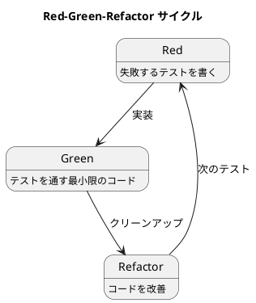

# 第6章: テスト駆動開発と関数型プログラミング

## はじめに

テスト駆動開発（TDD）は、テストを先に書いてから実装を行う開発手法です。関数型プログラミングと TDD は相性が良く、純粋関数はテストが容易で、不変データ構造は予測可能な動作を保証します。

本章では、Red-Green-Refactor サイクルを Haskell で実践する方法を学びます。

## 1. TDD の基本サイクル



1. **Red（赤）**: 失敗するテストを書く
2. **Green（緑）**: テストを通す最小限のコードを書く
3. **Refactor（リファクタリング）**: コードを改善する

## 2. FizzBuzz - TDD の典型例

### Step 1: Red（最初のテスト）

```haskell
-- test/TddFunctionalSpec.hs
spec :: Spec
spec = do
    describe "FizzBuzz" $ do
        it "1 returns \"1\"" $
            fizzBuzz 1 `shouldBe` "1"
```

### Step 2: Green（最小限の実装）

```haskell
-- src/TddFunctional.hs
fizzBuzz :: Int -> String
fizzBuzz _ = "1"
```

### Step 3: 次のテストを追加

```haskell
it "2 returns \"2\"" $
    fizzBuzz 2 `shouldBe` "2"
```

### 段階的に実装を発展

```haskell
-- 小さなヘルパー関数に分割
fizz :: Int -> Bool
fizz n = n `mod` 3 == 0

buzz :: Int -> Bool
buzz n = n `mod` 5 == 0

fizzBuzz :: Int -> String
fizzBuzz n
    | fizz n && buzz n = "FizzBuzz"
    | fizz n = "Fizz"
    | buzz n = "Buzz"
    | otherwise = show n
```

### 最終テストスイート

```haskell
describe "FizzBuzz (Basic TDD)" $ do
    it "1 returns \"1\"" $
        fizzBuzz 1 `shouldBe` "1"
    it "2 returns \"2\"" $
        fizzBuzz 2 `shouldBe` "2"
    it "3 returns \"Fizz\"" $
        fizzBuzz 3 `shouldBe` "Fizz"
    it "5 returns \"Buzz\"" $
        fizzBuzz 5 `shouldBe` "Buzz"
    it "15 returns \"FizzBuzz\"" $
        fizzBuzz 15 `shouldBe` "FizzBuzz"
```

## 3. ローマ数字変換

### TDD で段階的に実装

```haskell
-- Step 1: 最初のテスト
it "converts 1 to I" $
    toRoman 1 `shouldBe` "I"

-- Step 2: 最小限の実装
toRoman :: Int -> String
toRoman 1 = "I"
toRoman _ = ""

-- Step 3: テストを追加しながら発展
it "converts 4 to IV" $
    toRoman 4 `shouldBe` "IV"
it "converts 5 to V" $
    toRoman 5 `shouldBe` "V"
```

### 完成した実装

```haskell
toRoman :: Int -> String
toRoman n
    | n <= 0 = ""
    | n >= 1000 = "M" ++ toRoman (n - 1000)
    | n >= 900 = "CM" ++ toRoman (n - 900)
    | n >= 500 = "D" ++ toRoman (n - 500)
    | n >= 400 = "CD" ++ toRoman (n - 400)
    | n >= 100 = "C" ++ toRoman (n - 100)
    | n >= 90 = "XC" ++ toRoman (n - 90)
    | n >= 50 = "L" ++ toRoman (n - 50)
    | n >= 40 = "XL" ++ toRoman (n - 40)
    | n >= 10 = "X" ++ toRoman (n - 10)
    | n >= 9 = "IX" ++ toRoman (n - 9)
    | n >= 5 = "V" ++ toRoman (n - 5)
    | n >= 4 = "IV" ++ toRoman (n - 4)
    | otherwise = "I" ++ toRoman (n - 1)

fromRoman :: String -> Int
fromRoman = go 0
  where
    go acc [] = acc
    go acc [x] = acc + romanCharValue x
    go acc (x:y:rest)
        | romanCharValue x < romanCharValue y = go (acc - romanCharValue x) (y:rest)
        | otherwise = go (acc + romanCharValue x) (y:rest)
    
    romanCharValue 'I' = 1
    romanCharValue 'V' = 5
    romanCharValue 'X' = 10
    romanCharValue 'L' = 50
    romanCharValue 'C' = 100
    romanCharValue 'D' = 500
    romanCharValue 'M' = 1000
    romanCharValue _ = 0
```

## 4. ボウリングスコア

### ゲームの状態

```haskell
type Game = ([Int], Int)  -- (rolls, current frame)

newGame :: Game
newGame = ([], 1)

roll :: Int -> Game -> Game
roll pins (rolls, frame) = (rolls ++ [pins], frame)
```

### スコア計算

```haskell
score :: Game -> Int
score (rolls, _) = scoreFrames rolls 1 0

scoreFrames :: [Int] -> Int -> Int -> Int
scoreFrames _ 11 acc = acc  -- 10フレーム超えたら終了
scoreFrames [] _ acc = acc
scoreFrames rolls@(r1:rest) frame acc
    | frame == 10 = acc + sum rolls  -- 10フレーム目
    | r1 == 10 = scoreFrames rest (frame + 1) (acc + 10 + bonus2 rest)  -- Strike
    | otherwise = case rest of
        [] -> acc + r1
        (r2:rest2)
            | r1 + r2 == 10 -> scoreFrames rest2 (frame + 1) (acc + 10 + bonus1 rest2)  -- Spare
            | otherwise -> scoreFrames rest2 (frame + 1) (acc + r1 + r2)
  where
    bonus1 (x:_) = x
    bonus1 [] = 0
    bonus2 (x:y:_) = x + y
    bonus2 (x:_) = x
    bonus2 [] = 0
```

### テスト

```haskell
describe "Bowling Game" $ do
    it "starts with score 0" $
        score newGame `shouldBe` 0
    
    it "scores 0 for all zeros" $ do
        let game = foldr roll newGame (replicate 20 0)
        score game `shouldBe` 0
    
    it "scores 20 for all ones" $ do
        let game = foldr roll newGame (replicate 20 1)
        score game `shouldBe` 20
    
    it "spare adds next roll bonus" $ do
        let rolls = [5, 5, 3] ++ replicate 17 0
        let game = foldr roll newGame (reverse rolls)
        score game `shouldBe` 16
```

## 5. String Calculator Kata

```haskell
add :: String -> Int
add "" = 0
add s = sum $ parseNumbers s

parseNumbers :: String -> [Int]
parseNumbers s = map read $ splitOn ',' $ map replaceNewline s
  where
    replaceNewline '\n' = ','
    replaceNewline c = c
    
    splitOn _ [] = []
    splitOn delim str = 
        let (before, after) = break (== delim) str
        in before : case after of
            [] -> []
            (_:rest) -> splitOn delim rest
```

## 6. 素因数分解

```haskell
primeFactors :: Int -> [Int]
primeFactors n = factorize n 2
  where
    factorize 1 _ = []
    factorize num factor
        | factor * factor > num = [num]
        | num `mod` factor == 0 = factor : factorize (num `div` factor) factor
        | otherwise = factorize num (factor + 1)
```

### テスト

```haskell
describe "Prime Factors" $ do
    it "returns empty for 1" $
        primeFactors 1 `shouldBe` []
    it "returns [2] for 2" $
        primeFactors 2 `shouldBe` [2]
    it "returns [2,2] for 4" $
        primeFactors 4 `shouldBe` [2, 2]
    it "returns [2,3] for 6" $
        primeFactors 6 `shouldBe` [2, 3]
    
    -- プロパティベーステスト
    it "product of factors equals original" $ property $
        \(Positive n) ->
            let n' = max 2 (n `mod` 1000)
            in product (primeFactors n') == n'
```

## 7. まとめ

### TDD と FP の相性

| 特徴 | メリット |
|-----|---------|
| 純粋関数 | 入出力が明確でテストしやすい |
| 不変データ | 状態管理の複雑さがない |
| 型システム | 多くのバグをコンパイル時に検出 |
| パターンマッチ | 網羅的なケース処理 |

### TDD のベストプラクティス

1. **小さなステップで進める**: 一度に大きな変更をしない
2. **最初に失敗するテストを書く**: テストが本当に機能していることを確認
3. **最小限のコードで通す**: 過度な一般化を避ける
4. **リファクタリングはグリーンの後**: テストが通った状態でのみ改善
5. **プロパティベーステストを併用**: エッジケースの発見
