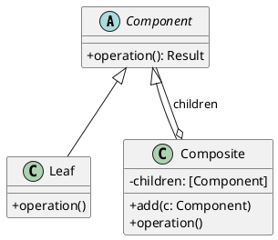

# 第7章: Composite パターン

## はじめに

Composite パターンは、オブジェクトをツリー構造で構成し、個々のオブジェクトとオブジェクトの集合を同じように扱うことができるようにするパターンです。このパターンを使用すると、クライアントは個々のオブジェクトとその組み合わせを区別せずに操作できます。

本章では、図形（Shape）、スイッチ（Switchable）、ファイルシステム、メニュー、数式、組織構造など、様々な例を通じて Composite パターンの実装を学びます。

## 1. パターンの構造

Composite パターンは以下の要素で構成されます：

- **Component**: 全てのオブジェクトの共通インターフェース
- **Leaf**: 子要素を持たない末端オブジェクト
- **Composite**: 子要素を持つコンテナオブジェクト



## 2. Shape - 図形の Composite パターン

### 代数的データ型による実装

Haskell では代数的データ型（ADT）を使って Component を表現します：

```haskell
-- | 2D Point
data Point = Point
  { pointX :: Double
  , pointY :: Double
  } deriving (Show, Eq)

-- | Shape - Composite pattern for geometric shapes
data Shape
  = Circle Point Double           -- ^ Circle with center and radius
  | Square Point Double           -- ^ Square with top-left corner and side length
  | Rectangle Point Double Double -- ^ Rectangle with top-left, width, and height
  | CompositeShape [Shape]        -- ^ Composite containing multiple shapes
  deriving (Show, Eq)
```

### 再帰的な操作

```haskell
-- | Translate a shape by (dx, dy)
translateShape :: Double -> Double -> Shape -> Shape
translateShape dx dy shape = case shape of
  Circle (Point x y) r -> Circle (Point (x + dx) (y + dy)) r
  Square (Point x y) s -> Square (Point (x + dx) (y + dy)) s
  Rectangle (Point x y) w h -> Rectangle (Point (x + dx) (y + dy)) w h
  CompositeShape shapes -> CompositeShape (map (translateShape dx dy) shapes)

-- | Scale a shape by a factor
scaleShape :: Double -> Shape -> Shape
scaleShape factor shape = case shape of
  Circle c r -> Circle c (r * factor)
  Square tl s -> Square tl (s * factor)
  Rectangle tl w h -> Rectangle tl (w * factor) (h * factor)
  CompositeShape shapes -> CompositeShape (map (scaleShape factor) shapes)

-- | Calculate the area of a shape
shapeArea :: Shape -> Double
shapeArea shape = case shape of
  Circle _ r -> pi * r * r
  Square _ s -> s * s
  Rectangle _ w h -> w * h
  CompositeShape shapes -> sum (map shapeArea shapes)
```

### 使用例

```haskell
-- 個々の図形を作成
let circle = Circle (Point 10 10) 5
let square = Square (Point 0 0) 10

-- 複合図形を作成
let group = addShape square (addShape circle emptyComposite)
-- CompositeShape [Circle (Point 10 10) 5, Square (Point 0 0) 10]

-- 複合図形を移動（全ての子要素が移動する）
let moved = translateShape 5 5 group
-- CompositeShape [Circle (Point 15 15) 5, Square (Point 5 5) 10]

-- 複合図形を拡大（全ての子要素が拡大する）
let scaled = scaleShape 2 group
-- CompositeShape [Circle (Point 10 10) 10, Square (Point 0 0) 20]

-- 面積は全ての子要素の合計
let totalArea = shapeArea group  -- pi * 25 + 100
```

## 3. Switchable - スイッチの Composite パターン

```haskell
-- | Switchable - Composite pattern for switchable devices
data Switchable
  = Light String Bool             -- ^ Light with name and on/off state
  | DimmableLight String Int      -- ^ Dimmable light with name and intensity (0-100)
  | Fan String Bool Int           -- ^ Fan with name, on/off state, and speed
  | CompositeSwitchable String [Switchable]  -- ^ Composite with name and list
  deriving (Show, Eq)

-- | Turn on a switchable
turnOn :: Switchable -> Switchable
turnOn switchable = case switchable of
  Light name _ -> Light name True
  DimmableLight name _ -> DimmableLight name 100
  Fan name _ speed -> Fan name True (max speed 1)
  CompositeSwitchable name items -> CompositeSwitchable name (map turnOn items)

-- | Check if a switchable is on
isOn :: Switchable -> Bool
isOn switchable = case switchable of
  Light _ on -> on
  DimmableLight _ intensity -> intensity > 0
  Fan _ on _ -> on
  CompositeSwitchable _ items -> any isOn items
```

### 使用例

```haskell
-- 部屋のスイッチグループを作成
let bedroom = emptySwitchableComposite "Bedroom"
            |> addSwitchable (Light "Ceiling" False)
            |> addSwitchable (DimmableLight "Bedside" 0)

let livingRoom = emptySwitchableComposite "LivingRoom"
               |> addSwitchable (Light "Main" False)
               |> addSwitchable (Fan "CeilingFan" False 0)

-- 家全体のグループ
let house = emptySwitchableComposite "House"
          |> addSwitchable bedroom
          |> addSwitchable livingRoom

-- 家中の全てのスイッチをオン
let allOn = turnOn house
```

## 4. FileSystem - ファイルシステムの Composite パターン

```haskell
-- | FileSystemEntry - Composite pattern for file system
data FileSystemEntry
  = File String Int String        -- ^ File with name, size, and extension
  | Directory String [FileSystemEntry]  -- ^ Directory with name and children
  deriving (Show, Eq)

-- | Get the total size of a file system entry
fileSize :: FileSystemEntry -> Int
fileSize entry = case entry of
  File _ size _ -> size
  Directory _ children -> sum (map fileSize children)

-- | Find files by extension
findByExtension :: String -> FileSystemEntry -> [FileSystemEntry]
findByExtension ext entry = case entry of
  File _ _ fileExt | fileExt == ext -> [entry]
  File {} -> []
  Directory _ children -> concatMap (findByExtension ext) children
```

### 使用例

```haskell
-- ファイルシステム構造を構築
let readme = File "readme.txt" 1024 ".txt"
let config = File "config.json" 512 ".json"
let src = Directory "src" 
      [ File "main.fs" 2048 ".fs"
      , File "util.fs" 1024 ".fs"
      ]
let root = Directory "project" [readme, config, src]

-- 総サイズを取得
let totalSize = fileSize root  -- 4608

-- .fs ファイルを検索
let fsFiles = findByExtension ".fs" root  -- 2 files
```

## 5. MenuItem - メニューの Composite パターン

```haskell
-- | MenuItem - Composite pattern for menu items
data MenuItem
  = Item String Double String     -- ^ Item with name, price, and category
  | SetMenu String [MenuItem] Double  -- ^ Set menu with name, items, and discount rate
  deriving (Show, Eq)

-- | Calculate the price of a menu item
menuPrice :: MenuItem -> Double
menuPrice item = case item of
  Item _ price _ -> price
  SetMenu _ items discountRate -> 
    let totalPrice = sum (map menuPrice items)
    in totalPrice * (1 - discountRate)
```

### 使用例

```haskell
-- 単品メニュー
let burger = Item "Hamburger" 500 "Main"
let fries = Item "Fries" 200 "Side"
let drink = Item "Cola" 150 "Drink"

-- セットメニュー（10%割引）
let lunchSet = SetMenu "Lunch Set" [burger, fries, drink] 0.1

-- セット価格 = (500 + 200 + 150) * 0.9 = 765
let setPrice = menuPrice lunchSet
```

## 6. Expression - 数式の Composite パターン

```haskell
-- | Expression - Composite pattern for mathematical expressions
data Expr
  = Number Double                 -- ^ Numeric literal
  | Variable String (Maybe Double)  -- ^ Variable with optional bound value
  | Add Expr Expr                 -- ^ Addition
  | Subtract Expr Expr            -- ^ Subtraction
  | Multiply Expr Expr            -- ^ Multiplication
  | Divide Expr Expr              -- ^ Division
  | Negate Expr                   -- ^ Negation
  deriving (Show, Eq)

-- | Evaluate an expression
evaluate :: Expr -> Maybe Double
evaluate expr = case expr of
  Number n -> Just n
  Variable _ (Just v) -> Just v
  Variable _ Nothing -> Nothing  -- Unbound variable
  Add l r -> (+) <$> evaluate l <*> evaluate r
  Subtract l r -> (-) <$> evaluate l <*> evaluate r
  Multiply l r -> (*) <$> evaluate l <*> evaluate r
  Divide l r -> do
    lv <- evaluate l
    rv <- evaluate r
    if rv == 0 then Nothing else Just (lv / rv)
  Negate e -> negate <$> evaluate e

-- | Simplify an expression
simplify :: Expr -> Expr
simplify expr = case expr of
  Add l r -> case (simplify l, simplify r) of
    (Number 0, r') -> r'
    (l', Number 0) -> l'
    (Number a, Number b) -> Number (a + b)
    (l', r') -> Add l' r'
  -- ... other cases
```

### 使用例

```haskell
-- (2 + 3) * 4 = 20
let expr = Multiply (Add (Number 2) (Number 3)) (Number 4)
let result = evaluate expr  -- Just 20

-- 変数を含む式
let exprWithVars = Add (Variable "x" Nothing) (Variable "y" Nothing)
let bound = bindVars [("x", 10), ("y", 20)] exprWithVars
let value = evaluate bound  -- Just 30

-- 式の簡略化
let simplified = simplify (Add (Variable "x" Nothing) (Number 0))
-- => Variable "x" Nothing
```

## 7. Organization - 組織構造の Composite パターン

```haskell
-- | OrganizationMember - Composite pattern for organizational structure
data OrganizationMember
  = Employee String Double String  -- ^ Employee with name, salary, and role
  | Department String (Maybe String) [OrganizationMember]  
      -- ^ Department with name, manager, and members
  deriving (Show, Eq)

-- | Calculate the total salary
totalSalary :: OrganizationMember -> Double
totalSalary member = case member of
  Employee _ salary _ -> salary
  Department _ _ members -> sum (map totalSalary members)

-- | Find employees by role
findByRole :: String -> OrganizationMember -> [OrganizationMember]
findByRole role member = case member of
  Employee _ _ r | r == role -> [member]
  Employee {} -> []
  Department _ _ members -> concatMap (findByRole role) members
```

## パターンの利点

1. **統一的な操作**: 個々のオブジェクトとグループを同じインターフェースで操作可能
2. **階層構造**: ネストした構造を自然に表現可能
3. **拡張性**: 新しい Leaf や Composite を追加しやすい
4. **再帰的な構造**: Composite は他の Composite を含むことも可能

## Haskell での特徴

### 代数的データ型による型安全性

```haskell
-- 全てのケースを網羅するパターンマッチ
shapeArea :: Shape -> Double
shapeArea shape = case shape of
  Circle _ r -> pi * r * r
  Square _ s -> s * s
  Rectangle _ w h -> w * h
  CompositeShape shapes -> sum (map shapeArea shapes)
  -- 新しいケースを追加すると、コンパイラが警告を出す
```

### 不変性による安全な操作

```haskell
-- 元のオブジェクトは変更されない
let original = addShape (Circle (Point 0 0) 5) emptyComposite
let moved = translateShape 10 10 original
-- original は変更されていない
```

### 再帰関数と高階関数

```haskell
-- 再帰的な処理も簡潔に
let result = emptyComposite
           & addShape circle
           & addShape square
           & translateShape 5 5
           & scaleShape 2
           & shapeArea
```

## Clojure/F# との比較

| 概念 | Clojure | F# | Haskell |
|------|---------|-----|---------|
| インターフェース | マルチメソッド | 判別共用体 | ADT |
| Leaf | defmethod | Union case | Constructor |
| Composite | defmethod + mapv | Union case with list | Constructor with list |
| 操作の委譲 | mapv | List.map | map |
| 不変性 | デフォルト | デフォルト | 強制 |
| 網羅性チェック | なし | 完全チェック | 完全チェック |

## まとめ

本章では、Composite パターンについて学びました：

1. **Shape の例**: 図形の移動と拡大を統一的に操作
2. **Switchable の例**: 複数のスイッチをグループ化して操作
3. **FileSystem の例**: ファイルとディレクトリの階層構造
4. **Menu の例**: 単品とセットメニューの価格計算
5. **Expression の例**: 数式の評価と簡略化
6. **Organization の例**: 組織構造の給与計算

Composite パターンは、ツリー構造のデータを扱う際に非常に有効なパターンです。Haskell の代数的データ型とパターンマッチを使うことで、型安全で不変なツリー構造を簡潔に実装できます。

## 参考コード

本章のコード例は以下のファイルで確認できます：

- ソースコード: `app/haskell/part3/src/CompositePattern.hs`
- テストコード: `app/haskell/part3/test/CompositePatternSpec.hs`

## 次章予告

次章では、**Decorator パターン**について学びます。既存の機能に新しい機能を動的に追加する方法を探ります。
