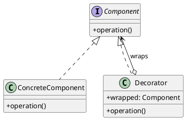
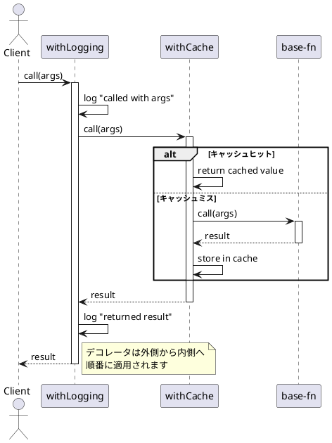

# 第8章: Decorator パターン

## はじめに

Decorator パターンは、既存のオブジェクトに新しい機能を動的に追加するパターンです。このパターンを使用すると、サブクラス化による継承よりも柔軟な方法で機能を拡張できます。

関数型プログラミングでは、高階関数を使って関数をラップし、横断的関心事（ログ、キャッシュ、認証など）を追加します。本章では、形状のジャーナリングと関数デコレータについて学びます。

## 1. パターンの構造

Decorator パターンは以下の要素で構成されます：

- **Component**: デコレート対象の共通インターフェース
- **ConcreteComponent**: 具体的なコンポーネント
- **Decorator**: Component をラップし、追加機能を提供



## 2. JournaledShape の例

### データ型の定義

形状オブジェクトに操作の履歴を記録する機能を追加するデコレータです。

```haskell
-- | Journal entry for shape operations
data JournalEntry
  = TranslateEntry Double Double  -- ^ Translation by (dx, dy)
  | ScaleEntry Double             -- ^ Scale by factor
  deriving (Show, Eq)

-- | Shape with operation history
data JournaledShape = JournaledShape
  { jsJournal :: [JournalEntry]   -- ^ History of operations
  , jsShape :: Shape              -- ^ The wrapped shape
  } deriving (Show, Eq)

-- | Wrap a shape with journaling
journalShape :: Shape -> JournaledShape
journalShape shape = JournaledShape
  { jsJournal = []
  , jsShape = shape
  }

-- | Get the journal entries
getJournal :: JournaledShape -> [JournalEntry]
getJournal = jsJournal

-- | Get the underlying shape
getShape :: JournaledShape -> Shape
getShape = jsShape
```

### デコレートされた操作

```haskell
-- | Translate a journaled shape
translateJournaled :: Double -> Double -> JournaledShape -> JournaledShape
translateJournaled dx dy js = JournaledShape
  { jsJournal = jsJournal js ++ [TranslateEntry dx dy]
  , jsShape = translateShape dx dy (jsShape js)
  }

-- | Scale a journaled shape
scaleJournaled :: Double -> JournaledShape -> JournaledShape
scaleJournaled factor js = JournaledShape
  { jsJournal = jsJournal js ++ [ScaleEntry factor]
  , jsShape = scaleShape factor (jsShape js)
  }
```

### 使用例

```haskell
-- 形状をデコレート
let journaledSquare = journalShape (Square (Point 0 0) 1)
                    & translateJournaled 2 3
                    & scaleJournaled 5

-- ジャーナルを確認
getJournal journaledSquare
-- [TranslateEntry 2 3, ScaleEntry 5]

-- 実際の形状を確認
getShape journaledSquare
-- Square (Point 2 3) 5
```

## 3. 関数デコレータ

関数型プログラミングでは、高階関数を使って関数をデコレートします。

### ログ出力デコレータ

```haskell
-- | Add logging to a function (collects log entries)
withLogging :: String -> (a -> b) -> (a -> (b, [String]))
withLogging name f = \x -> 
  let result = f x
  in (result, ["[LOG] " ++ name ++ " called", "[LOG] " ++ name ++ " returned"])

-- 使用例
let addLogged = withLogging "double" (* 2)
let (result, logs) = addLogged 5
-- result = 10
-- logs = ["[LOG] double called", "[LOG] double returned"]
```

### リトライデコレータ

```haskell
-- | Add retry logic to a function that might fail
withRetry :: Int -> (a -> Either String b) -> (a -> Either String b)
withRetry maxRetries f = go 0
  where
    go attempts x
      | attempts >= maxRetries = Left "Max retries exceeded"
      | otherwise = case f x of
          Right result -> Right result
          Left _ -> go (attempts + 1) x

-- 使用例
let unreliable _ = Left "error" :: Either String String
let withRetries = withRetry 3 unreliable
withRetries ()  -- Left "Max retries exceeded"
```

### キャッシュデコレータ

```haskell
-- | Add caching to a function (using a Map for pure memoization)
withCache :: Ord a => (a -> b) -> (Map a b -> a -> (b, Map a b))
withCache f = \cache x ->
  case Map.lookup x cache of
    Just cached -> (cached, cache)
    Nothing -> 
      let result = f x
      in (result, Map.insert x result cache)

-- 使用例
let expensiveFn x = x * x  -- expensive computation
let cached = withCache expensiveFn
let (result1, cache1) = cached Map.empty 5    -- computes
let (result2, cache2) = cached cache1 5       -- cache hit
```

### バリデーションデコレータ

```haskell
-- | Add validation to a function
withValidation :: (a -> Bool) -> String -> (a -> Either String b) -> (a -> Either String b)
withValidation validator errMsg f = \x ->
  if validator x
    then f x
    else Left errMsg

-- 使用例
let positiveOnly = withValidation (> 0) "Must be positive" (\x -> Right (x * 2))
positiveOnly 5   -- Right 10
positiveOnly (-5) -- Left "Must be positive"
```

## 4. デコレータの組み合わせ

複数のデコレータを組み合わせて使用できます。

```haskell
-- | Compose multiple function transformations
composeDecorators :: [a -> a] -> a -> a
composeDecorators = foldr (.) id

-- 使用例
let add1 = (+ 1) :: Int -> Int
let mul2 = (* 2)
let decorators = [add1, mul2]  -- (x * 2) + 1
let composed = composeDecorators decorators
composed 5  -- 11 = (5 * 2) + 1
```

### 組み合わせのシーケンス図



## 5. カウンタ付き操作

```haskell
-- | Result with call count
data CountedResult a = CountedResult
  { crResult :: a
  , crCount :: Int
  } deriving (Show, Eq)

-- | Wrap a function to count calls
withCounter :: (a -> b) -> ([a] -> [CountedResult b])
withCounter f = zipWith (\i x -> CountedResult (f x) i) [1..]

-- 使用例
let counted = withCounter (* 2)
counted [1, 2, 3]
-- [CountedResult 2 1, CountedResult 4 2, CountedResult 6 3]
```

## 6. パターンの利点

1. **単一責任の原則**: 各デコレータは一つの機能のみを追加
2. **開放/閉鎖の原則**: 既存コードを変更せずに機能を追加
3. **柔軟な組み合わせ**: 必要な機能だけを選択して組み合わせ可能
4. **実行時の決定**: どのデコレータを適用するか実行時に決定可能

## 7. Haskell での特徴

Haskell での Decorator パターンの実装には以下の特徴があります：

1. **高階関数**: 関数を引数に取り、新しい関数を返す
2. **純粋性**: 副作用を避け、状態はデータ構造で明示的に管理
3. **イミュータブルなデータ**: デコレート後も元のデータは変更されない
4. **合成のしやすさ**: `(.)` 演算子や `foldr` で簡単に組み合わせ可能
5. **型安全性**: 型システムによりデコレータの適用ミスを防止

### Haskell 特有の考慮事項

```haskell
-- Haskell では副作用を持つ操作は IO モナドを使用
-- 純粋なデコレータでは状態を明示的に渡す必要がある

-- 純粋なキャッシュ（状態を明示的に渡す）
withCache :: Ord a => (a -> b) -> (Map a b -> a -> (b, Map a b))

-- IO モナドを使ったキャッシュ（内部状態を持つ）
withCacheIO :: Ord a => (a -> b) -> IO (a -> IO b)
withCacheIO f = do
  ref <- newIORef Map.empty
  return $ \x -> do
    cache <- readIORef ref
    case Map.lookup x cache of
      Just v -> return v
      Nothing -> do
        let v = f x
        modifyIORef ref (Map.insert x v)
        return v
```

## まとめ

本章では、Decorator パターンについて学びました：

1. **JournaledShape**: 形状操作の履歴を記録するデコレータ
2. **関数デコレータ**: ログ、リトライ、キャッシュなどの横断的関心事
3. **デコレータの組み合わせ**: 複数のデコレータを柔軟に組み合わせ

Decorator パターンは、既存のコードを変更せずに機能を拡張する強力なパターンです。Haskell では高階関数と純粋関数を活用することで、型安全で合成しやすいデコレータを実装できます。

## 参考コード

本章のコード例は以下のファイルで確認できます：

- ソースコード: `app/haskell/part3/src/DecoratorPattern.hs`
- テストコード: `app/haskell/part3/test/DecoratorPatternSpec.hs`

## 次章予告

次章では、**Adapter パターン**について学びます。異なるインターフェース間の変換とレガシーシステムとの統合を探ります。
