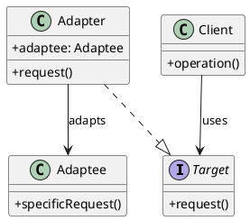

# 第9章: Adapter パターン

## はじめに

Adapter パターンは、既存のクラスのインターフェースを、クライアントが期待する別のインターフェースに変換するパターンです。このパターンを使用すると、互換性のないインターフェースを持つクラス同士を連携させることができます。

本章では、可変強度ライトのアダプター、データフォーマット変換、温度・通貨変換について学びます。

## 1. パターンの構造

Adapter パターンは以下の要素で構成されます：

- **Target**: クライアントが期待するインターフェース
- **Adaptee**: 既存のクラス（適応される側）
- **Adapter**: Target インターフェースを実装し、Adaptee を使用



## 2. VariableLight の例

### Switchable インターフェース (Target)

```haskell
-- | Result of a switch operation
data SwitchResult = SwitchResult
  { srOn :: Bool
  , srIntensity :: Maybe Int
  } deriving (Show, Eq)

-- | Switchable interface - the target interface
class Switchable a where
  switchTurnOn :: a -> (a, SwitchResult)
  switchTurnOff :: a -> (a, SwitchResult)
```

### VariableLight (Adaptee)

可変強度を持つライトは、単純なオン/オフではなく、強度を指定する必要があります。

```haskell
-- | Variable light with intensity control
data VariableLight = VariableLight
  { vlIntensity :: Int  -- ^ 0-100
  } deriving (Show, Eq)

-- | Set the light intensity (the adaptee's specific method)
setLightIntensity :: Int -> VariableLight -> VariableLight
setLightIntensity intensity vl = vl { vlIntensity = max 0 (min 100 intensity) }
```

### VariableLightAdapter (Adapter)

```haskell
-- | Adapter that wraps VariableLight and provides Switchable interface
data VariableLightAdapter = VariableLightAdapter
  { vlaLight :: VariableLight
  , vlaMinIntensity :: Int
  , vlaMaxIntensity :: Int
  } deriving (Show, Eq)

-- | Create a variable light adapter
makeVariableLightAdapter :: Int -> Int -> VariableLightAdapter
makeVariableLightAdapter minI maxI = VariableLightAdapter
  { vlaLight = VariableLight 0
  , vlaMinIntensity = minI
  , vlaMaxIntensity = maxI
  }

-- | Turn on through the adapter
adaptedTurnOn :: VariableLightAdapter -> (VariableLightAdapter, SwitchResult)
adaptedTurnOn adapter =
  let newLight = setLightIntensity (vlaMaxIntensity adapter) (vlaLight adapter)
      newAdapter = adapter { vlaLight = newLight }
      result = SwitchResult True (Just $ vlIntensity newLight)
  in (newAdapter, result)

-- | Turn off through the adapter
adaptedTurnOff :: VariableLightAdapter -> (VariableLightAdapter, SwitchResult)
adaptedTurnOff adapter =
  let newLight = setLightIntensity (vlaMinIntensity adapter) (vlaLight adapter)
      newAdapter = adapter { vlaLight = newLight }
      result = SwitchResult False (Just $ vlIntensity newLight)
  in (newAdapter, result)

-- Make VariableLightAdapter an instance of Switchable
instance Switchable VariableLightAdapter where
  switchTurnOn = adaptedTurnOn
  switchTurnOff = adaptedTurnOff
```

### 使用例

```haskell
-- アダプターを作成（最小0、最大100）
let adapter = makeVariableLightAdapter 0 100

-- クライアントはSwitchableインターフェースで操作
let (onAdapter, onResult) = switchTurnOn adapter
-- onResult = SwitchResult True (Just 100)

let (offAdapter, offResult) = switchTurnOff onAdapter
-- offResult = SwitchResult False (Just 0)
```

## 3. データフォーマットアダプター

### ユーザーフォーマット変換

異なるシステム間でデータフォーマットが異なる場合、アダプターを使って変換します。

```haskell
-- | Old user format (legacy system)
data OldUserFormat = OldUserFormat
  { oufFirstName :: String
  , oufLastName :: String
  , oufEmailAddress :: String
  , oufPhoneNumber :: String
  } deriving (Show, Eq)

-- | Metadata for converted users
data UserMetadata = UserMetadata
  { umMigrated :: Bool
  , umOriginalFormat :: String
  } deriving (Show, Eq)

-- | New user format (modern system)
data NewUserFormat = NewUserFormat
  { nufName :: String
  , nufEmail :: String
  , nufPhone :: String
  , nufMetadata :: Maybe UserMetadata
  } deriving (Show, Eq)

-- | Adapt old user format to new format
adaptOldToNew :: OldUserFormat -> NewUserFormat
adaptOldToNew old = NewUserFormat
  { nufName = oufLastName old ++ " " ++ oufFirstName old
  , nufEmail = oufEmailAddress old
  , nufPhone = oufPhoneNumber old
  , nufMetadata = Just UserMetadata
      { umMigrated = True
      , umOriginalFormat = "old"
      }
  }

-- | Adapt new user format to old format
adaptNewToOld :: NewUserFormat -> OldUserFormat
adaptNewToOld new =
  case nonEmpty (words (nufName new)) of
    Nothing -> OldUserFormat "" "" (nufEmail new) (nufPhone new)
    Just ne -> OldUserFormat
      { oufFirstName = unwords (NE.tail ne)
      , oufLastName = NE.head ne
      , oufEmailAddress = nufEmail new
      , oufPhoneNumber = nufPhone new
      }
```

### 使用例

```haskell
-- 旧フォーマット → 新フォーマット
let oldUser = OldUserFormat "Taro" "Yamada" "taro@example.com" "090-1234-5678"
let newUser = adaptOldToNew oldUser
-- newUser = NewUserFormat 
--   { nufName = "Yamada Taro"
--   , nufEmail = "taro@example.com"
--   , nufPhone = "090-1234-5678"
--   , nufMetadata = Just UserMetadata {umMigrated = True, umOriginalFormat = "old"}
--   }

-- 新フォーマット → 旧フォーマット
let back = adaptNewToOld newUser
-- back = OldUserFormat "Taro" "Yamada" "taro@example.com" "090-1234-5678"
```

## 4. 温度アダプター

```haskell
-- | Temperature in Celsius
newtype Celsius = Celsius { getCelsius :: Double }
  deriving (Show, Eq)

-- | Temperature in Fahrenheit
newtype Fahrenheit = Fahrenheit { getFahrenheit :: Double }
  deriving (Show, Eq)

-- | Convert Celsius to Fahrenheit
celsiusToFahrenheit :: Celsius -> Fahrenheit
celsiusToFahrenheit (Celsius c) = Fahrenheit (c * 9/5 + 32)

-- | Convert Fahrenheit to Celsius
fahrenheitToCelsius :: Fahrenheit -> Celsius
fahrenheitToCelsius (Fahrenheit f) = Celsius ((f - 32) * 5/9)
```

### 使用例

```haskell
let freezing = Celsius 0
let boiling = Celsius 100

celsiusToFahrenheit freezing  -- Fahrenheit 32
celsiusToFahrenheit boiling   -- Fahrenheit 212

-- 往復変換
let temp = Celsius 25
let converted = fahrenheitToCelsius (celsiusToFahrenheit temp)
-- converted ≈ Celsius 25
```

## 5. 通貨アダプター

```haskell
-- | US Dollars
newtype USD = USD { getUsd :: Double }
  deriving (Show, Eq)

-- | Euros
newtype EUR = EUR { getEur :: Double }
  deriving (Show, Eq)

-- | Japanese Yen
newtype JPY = JPY { getJpy :: Double }
  deriving (Show, Eq)

-- | Convert USD to EUR (simplified rate)
convertUsdToEur :: USD -> EUR
convertUsdToEur (USD usd) = EUR (usd * 0.85)

-- | Convert USD to JPY (simplified rate)
convertUsdToJpy :: USD -> JPY
convertUsdToJpy (USD usd) = JPY (usd * 110)

-- | Convert EUR to USD
convertEurToUsd :: EUR -> USD
convertEurToUsd (EUR eur) = USD (eur / 0.85)

-- | Convert JPY to USD
convertJpyToUsd :: JPY -> USD
convertJpyToUsd (JPY jpy) = USD (jpy / 110)
```

## 6. 汎用アダプター

```haskell
-- | Generic bidirectional adapter
data Adapter a b = Adapter
  { adapterTo :: a -> b    -- ^ Convert from A to B
  , adapterFrom :: b -> a  -- ^ Convert from B to A
  }

-- | Apply adapter to convert from A to B
adapt :: Adapter a b -> a -> b
adapt = adapterTo

-- | Apply adapter to convert from B to A
adaptBack :: Adapter a b -> b -> a
adaptBack = adapterFrom
```

### 使用例

```haskell
-- 温度変換アダプター
let tempAdapter = Adapter
  { adapterTo = \(Celsius c) -> Fahrenheit (c * 9/5 + 32)
  , adapterFrom = \(Fahrenheit f) -> Celsius ((f - 32) * 5/9)
  }

adapt tempAdapter (Celsius 0)      -- Fahrenheit 32
adaptBack tempAdapter (Fahrenheit 32)  -- Celsius 0

-- Int <-> String アダプター
let intStringAdapter = Adapter
  { adapterTo = show :: Int -> String
  , adapterFrom = read
  }

adapt intStringAdapter 42      -- "42"
adaptBack intStringAdapter "42"  -- 42
```

## 7. パターンの利点

1. **既存コードの再利用**: 既存のクラスを変更せずに新しいインターフェースで使用
2. **単一責任の原則**: インターフェース変換のロジックを分離
3. **開放/閉鎖の原則**: 新しいアダプターを追加しても既存コードは変更不要
4. **レガシーシステムとの統合**: 古いシステムと新しいシステムを連携

## 8. Haskell での特徴

Haskell での Adapter パターンの実装には以下の特徴があります：

1. **型クラス**: ターゲットインターフェースを型クラスとして定義
2. **newtype**: 異なるドメインの値を型で区別（Celsius, Fahrenheit など）
3. **関数による変換**: 単純なデータ変換は純粋関数で直接実装
4. **イミュータブルなデータ**: 変換後も元のデータは変更されない
5. **合成のしやすさ**: 複数のアダプターを組み合わせ可能

### 型クラスによるインターフェース

```haskell
-- 型クラスでターゲットインターフェースを定義
class Switchable a where
  switchTurnOn :: a -> (a, SwitchResult)
  switchTurnOff :: a -> (a, SwitchResult)

-- 任意の型をインスタンスにできる
instance Switchable VariableLightAdapter where
  switchTurnOn = adaptedTurnOn
  switchTurnOff = adaptedTurnOff

-- ジェネリックな関数で使用
engageSwitch :: Switchable a => a -> (a, SwitchResult, SwitchResult)
engageSwitch s = 
  let (s1, onResult) = switchTurnOn s
      (s2, offResult) = switchTurnOff s1
  in (s2, onResult, offResult)
```

### newtype による型安全性

```haskell
-- newtype を使うことで、同じ内部表現でも異なる型として扱える
newtype Celsius = Celsius Double
newtype Fahrenheit = Fahrenheit Double

-- コンパイル時に型チェックされる
add :: Celsius -> Celsius -> Celsius
add (Celsius a) (Celsius b) = Celsius (a + b)

-- これはコンパイルエラーになる
-- add (Celsius 10) (Fahrenheit 50)  -- 型不一致
```

## まとめ

本章では、Adapter パターンについて学びました：

1. **VariableLightAdapter**: 可変強度ライトを単純なオン/オフインターフェースに適応
2. **データフォーマットアダプター**: 異なるデータ形式間の変換
3. **温度・通貨アダプター**: 単位変換の実装
4. **汎用アダプター**: 双方向変換を抽象化

Adapter パターンは、既存のコードを変更せずに異なるシステムを連携させる際に非常に有効です。Haskell では型クラスと newtype を活用することで、型安全で再利用性の高いアダプターを実装できます。

## 参考コード

本章のコード例は以下のファイルで確認できます：

- ソースコード: `app/haskell/part3/src/AdapterPattern.hs`
- テストコード: `app/haskell/part3/test/AdapterPatternSpec.hs`

## 次章予告

次章では、**Strategy パターン**について学びます。アルゴリズムをカプセル化し、実行時に切り替える方法を探ります。
