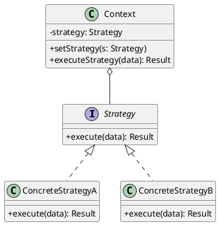

# 第10章: Strategy パターン

## はじめに

Strategy パターンは、アルゴリズムを個別に定義し、それらを交換可能にするパターンです。これにより、アルゴリズムをクライアントから独立して変更できます。

本章では、価格計算戦略、配送戦略、ショッピングカート、戦略の合成、ソートアルゴリズムなどを通じて Strategy パターンの実装を学びます。

## 1. パターンの構造

Strategy パターンは以下の要素で構成されます：

- **Strategy**: アルゴリズムの共通インターフェース
- **ConcreteStrategy**: 具体的なアルゴリズムの実装
- **Context**: Strategy を使用するクラス



## 2. 価格計算戦略

### newtype による戦略の定義

Haskell では関数を `newtype` でラップして戦略を表現します：

```haskell
-- | Pricing strategy is a function from amount to final price
newtype PricingStrategy = PricingStrategy
  { runPricing :: Double -> Double
  }

-- | Apply pricing strategy
calculatePrice :: PricingStrategy -> Double -> Double
calculatePrice = runPricing
```

### 具体的な戦略の実装

```haskell
-- | Regular pricing (no change)
regularPricing :: PricingStrategy
regularPricing = PricingStrategy id

-- | Percentage discount
discountPricing :: Double -> PricingStrategy
discountPricing percentage = PricingStrategy $ \amount ->
  amount * (1 - percentage)

-- | Fixed discount
fixedDiscountPricing :: Double -> PricingStrategy
fixedDiscountPricing discount = PricingStrategy $ \amount ->
  max 0 (amount - discount)

-- | Bulk discount: apply percentage if amount exceeds threshold
bulkDiscountPricing :: Double -> Double -> PricingStrategy
bulkDiscountPricing threshold percentage = PricingStrategy $ \amount ->
  if amount >= threshold
    then amount * (1 - percentage)
    else amount
```

### 使用例

```haskell
-- 10% ディスカウント
let strategy = discountPricing 0.10
calculatePrice strategy 1000  -- 900.0

-- 5000円以上で20%ディスカウント
let bulkStrategy = bulkDiscountPricing 5000 0.20
calculatePrice bulkStrategy 6000  -- 4800.0
calculatePrice bulkStrategy 4000  -- 4000.0
```

## 3. 配送戦略

### 重量と距離に基づく配送料金

```haskell
-- | Shipping strategy takes weight and distance, returns shipping cost
newtype ShippingStrategy = ShippingStrategy
  { runShipping :: Double -> Double -> Double
  }

-- | Calculate shipping cost
calculateShipping :: ShippingStrategy -> Double -> Double -> Double
calculateShipping = runShipping

-- | Standard shipping: $0.05 per kg per km
standardShipping :: ShippingStrategy
standardShipping = ShippingStrategy $ \weight distance ->
  weight * distance * 0.05

-- | Express shipping: 2x standard
expressShipping :: ShippingStrategy
expressShipping = ShippingStrategy $ \weight distance ->
  weight * distance * 0.10

-- | Free shipping
freeShipping :: ShippingStrategy
freeShipping = ShippingStrategy $ \_ _ -> 0
```

## 4. ショッピングカート

### 戦略を持つコンテキスト

```haskell
-- | Cart item
data CartItem = CartItem
  { itemName :: String
  , itemPrice :: Double
  , itemQuantity :: Int
  } deriving (Show, Eq)

-- | Shopping cart with pricing strategy
data ShoppingCart = ShoppingCart
  { cartItems :: [CartItem]
  , cartPricingStrategy :: PricingStrategy
  }

-- | Create an empty cart with regular pricing
makeCart :: ShoppingCart
makeCart = ShoppingCart [] regularPricing

-- | Add item to cart
addItem :: CartItem -> ShoppingCart -> ShoppingCart
addItem item cart = cart { cartItems = item : cartItems cart }

-- | Calculate subtotal
cartSubtotal :: ShoppingCart -> Double
cartSubtotal cart = sum [itemPrice i * fromIntegral (itemQuantity i) 
                        | i <- cartItems cart]

-- | Calculate total with pricing strategy
cartTotal :: ShoppingCart -> Double
cartTotal cart = calculatePrice (cartPricingStrategy cart) (cartSubtotal cart)

-- | Change pricing strategy
changeStrategy :: PricingStrategy -> ShoppingCart -> ShoppingCart
changeStrategy strategy cart = cart { cartPricingStrategy = strategy }
```

## 5. 戦略の合成

### 戦略をモノイドとして合成

```haskell
-- | Compose multiple pricing strategies (apply left to right)
composeStrategies :: [PricingStrategy] -> PricingStrategy
composeStrategies strategies = PricingStrategy $ \amount ->
  foldl (flip runPricing) amount strategies

-- | Conditional strategy
conditionalStrategy :: (Double -> Bool) -> PricingStrategy -> PricingStrategy -> PricingStrategy
conditionalStrategy predicate thenStrategy elseStrategy = PricingStrategy $ \amount ->
  if predicate amount
    then runPricing thenStrategy amount
    else runPricing elseStrategy amount

-- | Tax strategy
taxStrategy :: Double -> PricingStrategy
taxStrategy rate = PricingStrategy $ \amount -> amount * (1 + rate)
```

### 使用例

```haskell
-- 10%ディスカウント後に8%の税金
let discount = discountPricing 0.10
    tax = taxStrategy 0.08
    composed = composeStrategies [discount, tax]
calculatePrice composed 1000  -- 972.0
```

## 6. ソート戦略

### 複数のソートアルゴリズム

```haskell
-- | Sorting strategy
newtype SortStrategy a = SortStrategy
  { runSort :: [a] -> [a]
  }

-- | Sort with a strategy
sortWith :: Ord a => SortStrategy a -> [a] -> [a]
sortWith strategy = runSort strategy

-- | Bubble sort
bubbleSort :: Ord a => SortStrategy a
bubbleSort = SortStrategy bubble
  where
    bubble [] = []
    bubble xs = let (sorted, rest) = bubblePass xs
                in if null rest then sorted else bubble sorted
    bubblePass [] = ([], [])
    bubblePass [x] = ([x], [])
    bubblePass (x:y:xs)
      | x > y = let (sorted, rest) = bubblePass (x:xs) in (y:sorted, rest)
      | otherwise = let (sorted, rest) = bubblePass (y:xs) in (x:sorted, rest)

-- | Quick sort
quickSort :: Ord a => SortStrategy a
quickSort = SortStrategy qsort
  where
    qsort [] = []
    qsort (x:xs) = qsort [y | y <- xs, y < x] 
                   ++ [x] 
                   ++ qsort [y | y <- xs, y >= x]

-- | Merge sort
mergeSort :: Ord a => SortStrategy a
mergeSort = SortStrategy msort
  where
    msort [] = []
    msort [x] = [x]
    msort xs = merge (msort left) (msort right)
      where
        (left, right) = splitAt (length xs `div` 2) xs
    merge xs [] = xs
    merge [] ys = ys
    merge (x:xs) (y:ys)
      | x <= y    = x : merge xs (y:ys)
      | otherwise = y : merge (x:xs) ys
```

## 7. テスト

```haskell
describe "Pricing Strategies" $ do
  it "applies regular pricing" $ do
    calculatePrice regularPricing 100 `shouldBe` 100
  
  it "applies percentage discount" $ do
    calculatePrice (discountPricing 0.20) 100 `shouldBe` 80
  
  it "applies bulk discount when threshold met" $ do
    calculatePrice (bulkDiscountPricing 5000 0.20) 6000 `shouldBe` 4800

describe "Shopping Cart" $ do
  it "calculates total with strategy" $ do
    let cart = addItem (CartItem "Book" 1000 2) 
             $ changeStrategy (discountPricing 0.10) makeCart
    cartTotal cart `shouldBe` 1800

describe "Sorting Strategies" $ do
  it "all strategies produce same result" $ property $ \xs ->
    let sorted = sort (xs :: [Int])
    in sortWith quickSort xs == sorted 
       && sortWith mergeSort xs == sorted
```

## まとめ

Strategy パターンの Haskell における実装のポイント：

1. **関数ファースト**: 戦略を関数として表現し、`newtype` でラップ
2. **型安全性**: 異なる戦略の型を分離（`PricingStrategy` vs `ShippingStrategy`）
3. **合成可能性**: 戦略を合成して複雑な振る舞いを構築
4. **テスト容易性**: 純粋関数として戦略をテスト可能
5. **QuickCheck**: プロパティベーステストで戦略の正当性を検証
