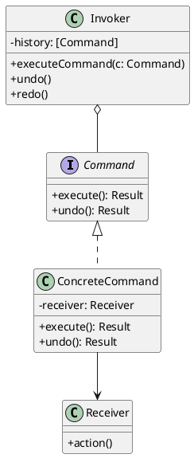

# 第11章: Command パターン

## はじめに

Command パターンは、リクエストをオブジェクトとしてカプセル化し、異なるリクエストでクライアントをパラメータ化したり、リクエストをキューに入れたり、操作の履歴を記録したりすることができるパターンです。

本章では、テキスト編集コマンド、キャンバス操作コマンド、Undo/Redo 機能、バッチ処理、マクロコマンドなどを通じて Command パターンの実装を学びます。

## 1. パターンの構造

Command パターンは以下の要素で構成されます：

- **Command**: コマンドの共通インターフェース
- **ConcreteCommand**: 具体的なコマンドの実装
- **Invoker**: コマンドを実行するクラス
- **Receiver**: コマンドが操作する対象



## 2. テキスト編集コマンド

### ADT によるコマンドの定義

```haskell
-- | Text editing commands
data TextCommand
  = InsertCommand Int String    -- ^ Insert text at position
  | DeleteCommand Int Int       -- ^ Delete from position with length
  | ReplaceCommand Int String String  -- ^ Replace old with new at position
  deriving (Show, Eq)

-- | Execute a text command on a string
executeTextCommand :: TextCommand -> String -> String
executeTextCommand cmd text = case cmd of
  InsertCommand pos str ->
    let (before, after) = splitAt pos text
    in before ++ str ++ after
  
  DeleteCommand pos len ->
    let (before, rest) = splitAt pos text
        (_, after) = splitAt len rest
    in before ++ after
  
  ReplaceCommand pos old new ->
    let (before, rest) = splitAt pos text
        (_, after) = splitAt (length old) rest
    in before ++ new ++ after
```

### Undo の実装

```haskell
-- | Undo a text command
undoTextCommand :: TextCommand -> String -> String
undoTextCommand cmd text = case cmd of
  InsertCommand pos str ->
    let (before, rest) = splitAt pos text
        (_, after) = splitAt (length str) rest
    in before ++ after
  
  DeleteCommand pos len ->
    -- Note: needs original deleted text for proper undo
    text
  
  ReplaceCommand pos old new ->
    let (before, rest) = splitAt pos text
        (_, after) = splitAt (length new) rest
    in before ++ old ++ after
```

## 3. キャンバスコマンド

### 図形操作のコマンド

```haskell
-- | Canvas shape
data CanvasShape = CanvasShape
  { shapeId :: Int
  , shapeType :: String
  , shapeX :: Double
  , shapeY :: Double
  } deriving (Show, Eq)

-- | Canvas state
type Canvas = [CanvasShape]

-- | Canvas commands
data CanvasCommand
  = AddShapeCommand CanvasShape
  | MoveShapeCommand Int Double Double  -- ^ id, dx, dy
  | DeleteShapeCommand Int
  deriving (Show, Eq)

-- | Execute canvas command
executeCanvasCommand :: CanvasCommand -> Canvas -> Canvas
executeCanvasCommand cmd canvas = case cmd of
  AddShapeCommand shape -> shape : canvas
  
  MoveShapeCommand shapeId dx dy ->
    map (\s -> if shapeId == CanvasShape.shapeId s
               then s { shapeX = shapeX s + dx, shapeY = shapeY s + dy }
               else s) canvas
  
  DeleteShapeCommand shapeId ->
    filter (\s -> CanvasShape.shapeId s /= shapeId) canvas
```

## 4. 汎用的なコマンドエグゼキュータ

### Undo/Redo スタックの実装

```haskell
-- | Command executor with undo/redo support
data CommandExecutor cmd state = CommandExecutor
  { executorState :: state
  , executorUndoStack :: [(cmd, state)]  -- ^ (command, state before execution)
  , executorRedoStack :: [(cmd, state)]
  }

-- | Create a new executor
makeExecutor :: state -> CommandExecutor cmd state
makeExecutor initialState = CommandExecutor
  { executorState = initialState
  , executorUndoStack = []
  , executorRedoStack = []
  }

-- | Execute a command
executeCommand :: (cmd -> state -> state) 
               -> cmd 
               -> CommandExecutor cmd state 
               -> CommandExecutor cmd state
executeCommand exec cmd executor = CommandExecutor
  { executorState = exec cmd (executorState executor)
  , executorUndoStack = (cmd, executorState executor) : executorUndoStack executor
  , executorRedoStack = []  -- Clear redo stack on new command
  }
```

### Undo と Redo

```haskell
-- | Undo the last command
undoCommand :: (cmd -> state -> state)
            -> CommandExecutor cmd state
            -> CommandExecutor cmd state
undoCommand undoFn executor = case executorUndoStack executor of
  [] -> executor  -- Nothing to undo
  ((cmd, prevState) : rest) -> CommandExecutor
    { executorState = prevState
    , executorUndoStack = rest
    , executorRedoStack = (cmd, executorState executor) : executorRedoStack executor
    }

-- | Redo the last undone command
redoCommand :: (cmd -> state -> state)
            -> CommandExecutor cmd state
            -> CommandExecutor cmd state
redoCommand exec executor = case executorRedoStack executor of
  [] -> executor  -- Nothing to redo
  ((cmd, _) : rest) -> CommandExecutor
    { executorState = exec cmd (executorState executor)
    , executorUndoStack = (cmd, executorState executor) : executorUndoStack executor
    , executorRedoStack = rest
    }
```

## 5. バッチ処理

```haskell
-- | Execute multiple commands in sequence
executeBatch :: (cmd -> state -> state)
             -> [cmd]
             -> CommandExecutor cmd state
             -> CommandExecutor cmd state
executeBatch exec commands executor =
  foldl (flip (executeCommand exec)) executor commands

-- | Undo all commands
undoAll :: (cmd -> state -> state)
        -> CommandExecutor cmd state
        -> CommandExecutor cmd state
undoAll undoFn executor =
  iterate (undoCommand undoFn) executor !! length (executorUndoStack executor)
```

## 6. マクロコマンド

```haskell
-- | Macro command (composite of commands)
newtype MacroCommand cmd = MacroCommand { macroCommands :: [cmd] }
  deriving (Show, Eq)

-- | Create a macro from commands
makeMacro :: [cmd] -> MacroCommand cmd
makeMacro = MacroCommand

-- | Execute a macro command
executeMacro :: (cmd -> state -> state)
             -> MacroCommand cmd
             -> state
             -> state
executeMacro exec (MacroCommand cmds) state =
  foldl (flip exec) state cmds

-- | Undo a macro command (in reverse order)
undoMacro :: (cmd -> state -> state)
          -> MacroCommand cmd
          -> state
          -> state
undoMacro undoFn (MacroCommand cmds) state =
  foldl (flip undoFn) state (reverse cmds)
```

## 7. 使用例

```haskell
-- テキスト編集の例
let initial = "Hello World"
    executor = makeExecutor initial
    
-- コマンドを実行
let executor' = executeCommand executeTextCommand 
                              (InsertCommand 5 ",") executor
-- "Hello, World"

-- Undo
let executor'' = undoCommand undoTextCommand executor'
-- "Hello World"

-- バッチ実行
let commands = [ InsertCommand 0 ">>> "
               , InsertCommand 15 " <<<"
               ]
    result = executeBatch executeTextCommand commands executor
-- ">>> Hello World <<<"
```

## 8. テスト

```haskell
describe "Text Commands" $ do
  describe "InsertCommand" $ do
    it "inserts text at position" $ do
      executeTextCommand (InsertCommand 5 ", ") "HelloWorld" 
        `shouldBe` "Hello, World"
    
    it "undoes insert" $ do
      let cmd = InsertCommand 5 ", "
          result = executeTextCommand cmd "HelloWorld"
      undoTextCommand cmd result `shouldBe` "HelloWorld"

describe "CommandExecutor" $ do
  it "supports undo/redo" $ do
    let executor = makeExecutor "Hello"
        executor' = executeCommand executeTextCommand 
                                  (InsertCommand 5 " World") executor
        executor'' = undoCommand undoTextCommand executor'
        executor''' = redoCommand executeTextCommand executor''
    executorState executor' `shouldBe` "Hello World"
    executorState executor'' `shouldBe` "Hello"
    executorState executor''' `shouldBe` "Hello World"
```

## まとめ

Command パターンの Haskell における実装のポイント：

1. **ADT によるコマンド表現**: コマンドを代数的データ型で定義
2. **純粋関数としての実行**: 状態を引数として受け取り、新しい状態を返す
3. **履歴管理**: Undo/Redo スタックを不変データ構造で管理
4. **合成可能性**: マクロコマンドによるコマンドの組み合わせ
5. **型安全性**: 異なるドメインのコマンドを型で分離
