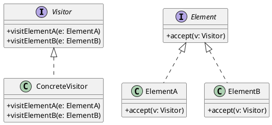

# 第12章: Visitor パターン

## はじめに

Visitor パターンは、オブジェクト構造の要素に対して実行する操作を分離し、構造を変更せずに新しい操作を追加できるようにするパターンです。

本章では、図形のシリアライズ、数式の評価と簡約、ツリー構造の操作などを通じて Visitor パターンの実装を学びます。

## 1. パターンの構造

Visitor パターンは以下の要素で構成されます：

- **Visitor**: 各要素型に対する操作を定義
- **Element**: accept メソッドを持つ要素
- **ConcreteElement**: 具体的な要素の実装



## 2. Haskell における Visitor パターン

Haskell では ADT とパターンマッチングにより、Visitor パターンを自然に表現できます。Visitor は単なる関数として実装されます。

### 図形の定義

```haskell
-- | 2D Point
data Point = Point Double Double
  deriving (Show, Eq)

-- | Shape ADT
data Shape
  = Circle Point Double           -- ^ Circle with center and radius
  | Square Point Double           -- ^ Square with top-left and side
  | Rectangle Point Double Double -- ^ Rectangle with top-left, width, height
  deriving (Show, Eq)
```

## 3. 図形への Visitor

### JSON シリアライズ

```haskell
-- | Convert shape to JSON string
shapeToJson :: Shape -> String
shapeToJson shape = case shape of
  Circle (Point x y) r ->
    "{\"type\":\"circle\",\"center\":[" ++ show x ++ "," ++ show y 
    ++ "],\"radius\":" ++ show r ++ "}"
  
  Square (Point x y) s ->
    "{\"type\":\"square\",\"topLeft\":[" ++ show x ++ "," ++ show y 
    ++ "],\"side\":" ++ show s ++ "}"
  
  Rectangle (Point x y) w h ->
    "{\"type\":\"rectangle\",\"topLeft\":[" ++ show x ++ "," ++ show y 
    ++ "],\"width\":" ++ show w ++ ",\"height\":" ++ show h ++ "}"
```

### XML シリアライズ

```haskell
-- | Convert shape to XML string
shapeToXml :: Shape -> String
shapeToXml shape = case shape of
  Circle (Point x y) r ->
    "<circle><center x=\"" ++ show x ++ "\" y=\"" ++ show y 
    ++ "\"/><radius>" ++ show r ++ "</radius></circle>"
  
  Square (Point x y) s ->
    "<square><topLeft x=\"" ++ show x ++ "\" y=\"" ++ show y 
    ++ "\"/><side>" ++ show s ++ "</side></square>"
  
  Rectangle (Point x y) w h ->
    "<rectangle><topLeft x=\"" ++ show x ++ "\" y=\"" ++ show y 
    ++ "\"/><width>" ++ show w ++ "</width><height>" 
    ++ show h ++ "</height></rectangle>"
```

### 面積と周囲長の計算

```haskell
-- | Calculate shape area
shapeArea :: Shape -> Double
shapeArea shape = case shape of
  Circle _ r -> pi * r * r
  Square _ s -> s * s
  Rectangle _ w h -> w * h

-- | Calculate shape perimeter
shapePerimeter :: Shape -> Double
shapePerimeter shape = case shape of
  Circle _ r -> 2 * pi * r
  Square _ s -> 4 * s
  Rectangle _ w h -> 2 * (w + h)

-- | Calculate bounding box (minX, minY, maxX, maxY)
shapeBoundingBox :: Shape -> (Double, Double, Double, Double)
shapeBoundingBox shape = case shape of
  Circle (Point x y) r -> (x - r, y - r, x + r, y + r)
  Square (Point x y) s -> (x, y, x + s, y + s)
  Rectangle (Point x y) w h -> (x, y, x + w, y + h)
```

## 4. Visitor の合成

```haskell
-- | Visit multiple shapes with a visitor function
visitShapes :: (Shape -> a) -> [Shape] -> [a]
visitShapes = map

-- | Calculate total area of shapes
totalArea :: [Shape] -> Double
totalArea = sum . visitShapes shapeArea

-- | Calculate total perimeter of shapes
totalPerimeter :: [Shape] -> Double
totalPerimeter = sum . visitShapes shapePerimeter
```

## 5. 数式への Visitor

### 数式 ADT

```haskell
-- | Expression ADT
data Expr
  = Num Double                    -- ^ Numeric literal
  | Var String                    -- ^ Variable
  | Add Expr Expr                 -- ^ Addition
  | Sub Expr Expr                 -- ^ Subtraction
  | Mul Expr Expr                 -- ^ Multiplication
  | Div Expr Expr                 -- ^ Division
  | Neg Expr                      -- ^ Negation
  deriving (Show, Eq)
```

### 評価 Visitor

```haskell
-- | Evaluate an expression with variable bindings
evaluate :: [(String, Double)] -> Expr -> Maybe Double
evaluate env expr = case expr of
  Num n -> Just n
  Var name -> lookup name env
  Add l r -> (+) <$> evaluate env l <*> evaluate env r
  Sub l r -> (-) <$> evaluate env l <*> evaluate env r
  Mul l r -> (*) <$> evaluate env l <*> evaluate env r
  Div l r -> do
    lv <- evaluate env l
    rv <- evaluate env r
    if rv == 0 then Nothing else Just (lv / rv)
  Neg e -> negate <$> evaluate env e
```

### Pretty Print Visitor

```haskell
-- | Pretty print an expression
prettyPrint :: Expr -> String
prettyPrint expr = case expr of
  Num n -> show n
  Var name -> name
  Add l r -> "(" ++ prettyPrint l ++ " + " ++ prettyPrint r ++ ")"
  Sub l r -> "(" ++ prettyPrint l ++ " - " ++ prettyPrint r ++ ")"
  Mul l r -> "(" ++ prettyPrint l ++ " * " ++ prettyPrint r ++ ")"
  Div l r -> "(" ++ prettyPrint l ++ " / " ++ prettyPrint r ++ ")"
  Neg e -> "-" ++ prettyPrint e
```

### 変数抽出 Visitor

```haskell
-- | Get all variable names in an expression
exprVariables :: Expr -> [String]
exprVariables expr = nub $ go expr
  where
    go (Num _) = []
    go (Var name) = [name]
    go (Add l r) = go l ++ go r
    go (Sub l r) = go l ++ go r
    go (Mul l r) = go l ++ go r
    go (Div l r) = go l ++ go r
    go (Neg e) = go e
```

### 簡約 Visitor

```haskell
-- | Simplify an expression
simplify :: Expr -> Expr
simplify expr = case expr of
  Add l r -> case (simplify l, simplify r) of
    (Num 0, r') -> r'
    (l', Num 0) -> l'
    (Num a, Num b) -> Num (a + b)
    (l', r') -> Add l' r'
  
  Sub l r -> case (simplify l, simplify r) of
    (l', Num 0) -> l'
    (Num a, Num b) -> Num (a - b)
    (l', r') | l' == r' -> Num 0
    (l', r') -> Sub l' r'
  
  Mul l r -> case (simplify l, simplify r) of
    (Num 0, _) -> Num 0
    (_, Num 0) -> Num 0
    (Num 1, r') -> r'
    (l', Num 1) -> l'
    (Num a, Num b) -> Num (a * b)
    (l', r') -> Mul l' r'
  
  Neg e -> case simplify e of
    Num n -> Num (-n)
    Neg e' -> e'
    e' -> Neg e'
  
  e -> e
```

## 6. ツリーへの Visitor

### ジェネリックなツリー構造

```haskell
-- | Generic tree
data Tree a
  = Leaf a
  | Node a [Tree a]
  deriving (Show, Eq)
```

### Fold Visitor

```haskell
-- | Fold a tree with functions for leaf and node
treeFold :: (a -> b) -> (a -> [b] -> b) -> Tree a -> b
treeFold leafFn nodeFn tree = case tree of
  Leaf x -> leafFn x
  Node x children -> nodeFn x (map (treeFold leafFn nodeFn) children)

-- | Map a function over tree values
treeMap :: (a -> b) -> Tree a -> Tree b
treeMap f tree = case tree of
  Leaf x -> Leaf (f x)
  Node x children -> Node (f x) (map (treeMap f) children)
```

### 派生する Visitor

```haskell
-- | Count nodes in tree
treeSize :: Tree a -> Int
treeSize = treeFold (const 1) (\_ sizes -> 1 + sum sizes)

-- | Calculate tree depth
treeDepth :: Tree a -> Int
treeDepth = treeFold (const 1) (\_ depths -> 1 + maximum (0 : depths))

-- | Convert tree to list (preorder)
treeToList :: Tree a -> [a]
treeToList = treeFold (: []) (\x childLists -> x : concat childLists)
```

## 7. テスト

```haskell
describe "Shape Visitors" $ do
  it "converts to JSON" $ do
    shapeToJson (Circle (Point 10 20) 5) 
      `shouldBe` "{\"type\":\"circle\",\"center\":[10.0,20.0],\"radius\":5.0}"
  
  it "calculates area" $ do
    shapeArea (Square (Point 0 0) 4) `shouldBe` 16

describe "Expression Visitors" $ do
  it "evaluates expression" $ do
    evaluate [("x", 2)] (Add (Var "x") (Num 3)) `shouldBe` Just 5
  
  it "simplifies expression" $ do
    simplify (Add (Var "x") (Num 0)) `shouldBe` Var "x"

describe "Tree Visitors" $ do
  it "counts nodes" $ do
    let tree = Node 1 [Leaf 2, Node 3 [Leaf 4, Leaf 5]]
    treeSize tree `shouldBe` 5
```

## まとめ

Visitor パターンの Haskell における実装のポイント：

1. **パターンマッチング**: ADT に対するパターンマッチングで自然に Visitor を実装
2. **関数としての Visitor**: 各 Visitor は単なる関数として表現
3. **合成可能性**: `map` や `fold` を使って Visitor を合成
4. **再帰的構造**: ツリーや数式などの再帰的データ構造に対応
5. **新しい操作の追加**: 既存の型を変更せずに新しい Visitor を追加可能
