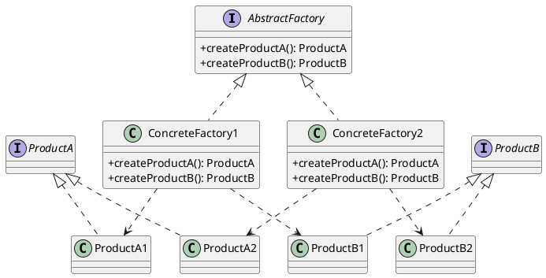

# 第13章: Abstract Factory パターン

## はじめに

Abstract Factory パターンは、関連するオブジェクトの家族を、その具体的なクラスを指定せずに生成するためのインターフェースを提供するパターンです。

本章では、図形ファクトリー（標準、アウトライン、塗りつぶし）と UI ファクトリー（Windows、MacOS、Linux）を通じて Abstract Factory パターンの実装を学びます。

## 1. パターンの構造

Abstract Factory パターンは以下の要素で構成されます：

- **AbstractFactory**: 製品群を生成するインターフェース
- **ConcreteFactory**: 具体的な製品群を生成するファクトリー
- **AbstractProduct**: 製品の抽象インターフェース
- **ConcreteProduct**: 具体的な製品



## 2. 図形ファクトリー

### 製品の定義

```haskell
-- | 2D Point
data Point = Point Double Double
  deriving (Show, Eq)

-- | Shape style
data ShapeStyle = ShapeStyle
  { styleOutlineColor :: Maybe String
  , styleOutlineWidth :: Maybe Double
  , styleFillColor :: Maybe String
  } deriving (Show, Eq)

-- | Default (empty) style
defaultStyle :: ShapeStyle
defaultStyle = ShapeStyle Nothing Nothing Nothing

-- | Shape with style
data Shape
  = Circle Point Double ShapeStyle
  | Square Point Double ShapeStyle
  | Rectangle Point Double Double ShapeStyle
  deriving (Show, Eq)
```

### 型クラスによるファクトリーの定義

```haskell
-- | Abstract factory for creating shapes
class ShapeFactory f where
  createCircle :: f -> Point -> Double -> Shape
  createSquare :: f -> Point -> Double -> Shape
  createRectangle :: f -> Point -> Double -> Double -> Shape
```

### 標準ファクトリー

```haskell
-- | Standard shape factory (no styling)
data StandardFactory = StandardFactory
  deriving (Show, Eq)

instance ShapeFactory StandardFactory where
  createCircle _ center radius = Circle center radius defaultStyle
  createSquare _ topLeft side = Square topLeft side defaultStyle
  createRectangle _ topLeft width height = Rectangle topLeft width height defaultStyle
```

### アウトラインファクトリー

```haskell
-- | Factory that creates shapes with outline
data OutlinedFactory = OutlinedFactory
  { ofOutlineColor :: String
  , ofOutlineWidth :: Double
  } deriving (Show, Eq)

-- | Create an outlined factory
makeOutlinedFactory :: String -> Double -> OutlinedFactory
makeOutlinedFactory = OutlinedFactory

instance ShapeFactory OutlinedFactory where
  createCircle f center radius = Circle center radius style
    where style = defaultStyle { styleOutlineColor = Just (ofOutlineColor f)
                                , styleOutlineWidth = Just (ofOutlineWidth f) }
  
  createSquare f topLeft side = Square topLeft side style
    where style = defaultStyle { styleOutlineColor = Just (ofOutlineColor f)
                                , styleOutlineWidth = Just (ofOutlineWidth f) }
  
  createRectangle f topLeft width height = Rectangle topLeft width height style
    where style = defaultStyle { styleOutlineColor = Just (ofOutlineColor f)
                                , styleOutlineWidth = Just (ofOutlineWidth f) }
```

### 塗りつぶしファクトリー

```haskell
-- | Factory that creates shapes with fill color
data FilledFactory = FilledFactory
  { ffFillColor :: String
  } deriving (Show, Eq)

-- | Create a filled factory
makeFilledFactory :: String -> FilledFactory
makeFilledFactory = FilledFactory

instance ShapeFactory FilledFactory where
  createCircle f center radius = Circle center radius style
    where style = defaultStyle { styleFillColor = Just (ffFillColor f) }
  
  createSquare f topLeft side = Square topLeft side style
    where style = defaultStyle { styleFillColor = Just (ffFillColor f) }
  
  createRectangle f topLeft width height = Rectangle topLeft width height style
    where style = defaultStyle { styleFillColor = Just (ffFillColor f) }
```

## 3. UI ファクトリー

### UI コンポーネントの定義

```haskell
-- | Button component
data Button = Button
  { buttonLabel :: String
  , buttonPlatform :: String
  } deriving (Show, Eq)

-- | Text field component
data TextField = TextField
  { textFieldPlaceholder :: String
  , textFieldPlatform :: String
  } deriving (Show, Eq)

-- | Check box component
data CheckBox = CheckBox
  { checkBoxLabel :: String
  , checkBoxChecked :: Bool
  , checkBoxPlatform :: String
  } deriving (Show, Eq)
```

### UI ファクトリーの型クラス

```haskell
-- | Abstract factory for creating UI components
class UIFactory f where
  createButton :: f -> String -> Button
  createTextField :: f -> String -> TextField
  createCheckBox :: f -> String -> Bool -> CheckBox
```

### プラットフォーム別ファクトリー

```haskell
-- | Windows UI factory
data WindowsFactory = WindowsFactory
  deriving (Show, Eq)

instance UIFactory WindowsFactory where
  createButton _ label = Button label "windows"
  createTextField _ placeholder = TextField placeholder "windows"
  createCheckBox _ label checked = CheckBox label checked "windows"

-- | MacOS UI factory
data MacOSFactory = MacOSFactory
  deriving (Show, Eq)

instance UIFactory MacOSFactory where
  createButton _ label = Button label "macos"
  createTextField _ placeholder = TextField placeholder "macos"
  createCheckBox _ label checked = CheckBox label checked "macos"

-- | Linux UI factory
data LinuxFactory = LinuxFactory
  deriving (Show, Eq)

instance UIFactory LinuxFactory where
  createButton _ label = Button label "linux"
  createTextField _ placeholder = TextField placeholder "linux"
  createCheckBox _ label checked = CheckBox label checked "linux"
```

## 4. レンダリング

```haskell
-- | Render a button to string
renderButton :: Button -> String
renderButton btn = case buttonPlatform btn of
  "windows" -> "[" ++ buttonLabel btn ++ "]"
  "macos"   -> "(" ++ buttonLabel btn ++ ")"
  "linux"   -> "<" ++ buttonLabel btn ++ ">"
  _         -> buttonLabel btn

-- | Render a text field to string
renderTextField :: TextField -> String
renderTextField tf = case textFieldPlatform tf of
  "windows" -> "[____" ++ textFieldPlaceholder tf ++ "____]"
  "macos"   -> "(____" ++ textFieldPlaceholder tf ++ "____)"
  "linux"   -> "<____" ++ textFieldPlaceholder tf ++ "____>"
  _         -> textFieldPlaceholder tf

-- | Render a check box to string
renderCheckBox :: CheckBox -> String
renderCheckBox cb = 
  let mark = if checkBoxChecked cb then "X" else " "
  in case checkBoxPlatform cb of
    "windows" -> "[" ++ mark ++ "] " ++ checkBoxLabel cb
    "macos"   -> "(" ++ mark ++ ") " ++ checkBoxLabel cb
    "linux"   -> "<" ++ mark ++ "> " ++ checkBoxLabel cb
    _         -> "[" ++ mark ++ "] " ++ checkBoxLabel cb
```

## 5. ファクトリーを使用するコード

```haskell
-- | Form containing UI components
data Form = Form
  { formButton :: Button
  , formTextField :: TextField
  , formCheckBox :: CheckBox
  } deriving (Show, Eq)

-- | Create a form using a factory
createForm :: UIFactory f => f -> Form
createForm factory = Form
  { formButton = createButton factory "Submit"
  , formTextField = createTextField factory "Email"
  , formCheckBox = createCheckBox factory "Subscribe" False
  }
```

### 使用例

```haskell
-- Windows フォーム
let windowsForm = createForm WindowsFactory
renderButton (formButton windowsForm)  -- "[Submit]"

-- MacOS フォーム
let macForm = createForm MacOSFactory
renderButton (formButton macForm)  -- "(Submit)"

-- Linux フォーム
let linuxForm = createForm LinuxFactory
renderButton (formButton linuxForm)  -- "<Submit>"
```

## 6. テスト

```haskell
describe "Shape Factory" $ do
  describe "StandardFactory" $ do
    it "creates shapes without style" $ do
      let factory = StandardFactory
          circle = createCircle factory (Point 0 0) 10
      case circle of
        Circle _ _ style -> do
          styleOutlineColor style `shouldBe` Nothing
          styleFillColor style `shouldBe` Nothing
        _ -> expectationFailure "Expected Circle"
  
  describe "OutlinedFactory" $ do
    it "creates shapes with outline" $ do
      let factory = makeOutlinedFactory "black" 2.0
          circle = createCircle factory (Point 0 0) 10
      case circle of
        Circle _ _ style -> do
          styleOutlineColor style `shouldBe` Just "black"
          styleOutlineWidth style `shouldBe` Just 2.0
        _ -> expectationFailure "Expected Circle"

describe "UI Factory" $ do
  it "creates platform-specific components" $ do
    let form = createForm WindowsFactory
    buttonPlatform (formButton form) `shouldBe` "windows"
    
    let macForm = createForm MacOSFactory
    buttonPlatform (formButton macForm) `shouldBe` "macos"
```

## まとめ

Abstract Factory パターンの Haskell における実装のポイント：

1. **型クラスによる抽象化**: ファクトリーインターフェースを型クラスで定義
2. **インスタンスによる具象化**: 各具象ファクトリーを型クラスのインスタンスとして実装
3. **多態的な使用**: `UIFactory f => f -> ...` のような制約付きの型で抽象ファクトリーを使用
4. **製品の一貫性**: 同じファクトリーから生成される製品は一貫したスタイル/プラットフォームを持つ
5. **テスト容易性**: ファクトリーを差し替えることでテストが容易
