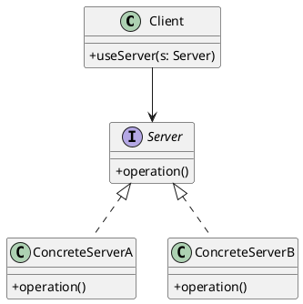

# 第14章: Abstract Server パターン

## はじめに

Abstract Server パターンは、Dependency Inversion Principle（DIP）の適用例であり、高レベルモジュールが低レベルモジュールに依存せず、両者が抽象に依存するようにするパターンです。

本章では、スイッチャブルインターフェース（Light, Fan, Motor）、リポジトリインターフェース、ロガーインターフェースを通じて Abstract Server パターンの実装を学びます。

## 1. パターンの構造

Abstract Server パターンは以下の要素で構成されます：

- **Client**: 抽象インターフェースに依存するクライアント
- **Abstract Server**: サーバーの抽象インターフェース
- **Concrete Server**: 具体的なサーバーの実装



## 2. Switchable インターフェース

### 抽象サーバーの定義

```haskell
-- | State of a switchable device
data SwitchState = On | Off
  deriving (Show, Eq)

-- | Switchable interface (Abstract Server)
class Switchable a where
  turnOn :: a -> a
  turnOff :: a -> a
  isOn :: a -> Bool
```

### Light の実装

```haskell
-- | Light device
data Light = Light
  { lightState :: SwitchState
  , lightName :: String
  } deriving (Show, Eq)

-- | Create a light (off by default)
makeLight :: String -> Light
makeLight name = Light Off name

-- | Create a light that is on
makeLightOn :: String -> Light
makeLightOn name = Light On name

instance Switchable Light where
  turnOn light = light { lightState = On }
  turnOff light = light { lightState = Off }
  isOn light = lightState light == On
```

### Fan の実装

```haskell
-- | Fan speed levels
data FanSpeed = Low | Medium | High
  deriving (Show, Eq, Ord)

-- | Fan device
data Fan = Fan
  { fanState :: SwitchState
  , fanSpeed :: FanSpeed
  , fanName :: String
  } deriving (Show, Eq)

-- | Create a fan
makeFan :: String -> Fan
makeFan name = Fan Off Low name

-- | Set fan speed (only works when on)
setFanSpeed :: FanSpeed -> Fan -> Fan
setFanSpeed speed fan
  | isOn fan = fan { fanSpeed = speed }
  | otherwise = fan

instance Switchable Fan where
  turnOn fan = fan { fanState = On }
  turnOff fan = fan { fanState = Off }
  isOn fan = fanState fan == On
```

### Motor の実装

```haskell
-- | Motor direction
data MotorDirection = Forward | Reverse
  deriving (Show, Eq)

-- | Motor device
data Motor = Motor
  { motorState :: SwitchState
  , motorDirection :: MotorDirection
  , motorName :: String
  } deriving (Show, Eq)

-- | Create a motor
makeMotor :: String -> Motor
makeMotor name = Motor Off Forward name

-- | Reverse motor direction (only works when on)
reverseMotor :: Motor -> Motor
reverseMotor motor
  | isOn motor = motor { motorDirection = flipDir (motorDirection motor) }
  | otherwise = motor
  where
    flipDir Forward = Reverse
    flipDir Reverse = Forward

instance Switchable Motor where
  turnOn motor = motor { motorState = On }
  turnOff motor = motor { motorState = Off }
  isOn motor = motorState motor == On
```

## 3. クライアントコード

```haskell
-- | Engage a switch (turn on)
engage :: Switchable a => a -> a
engage = turnOn

-- | Disengage a switch (turn off)
disengage :: Switchable a => a -> a
disengage = turnOff

-- | Toggle a switch
toggle :: Switchable a => a -> a
toggle device
  | isOn device = turnOff device
  | otherwise = turnOn device

-- | Get switch status
switchStatus :: Switchable a => a -> SwitchState
switchStatus device
  | isOn device = On
  | otherwise = Off
```

## 4. Repository インターフェース

### Associated Type を使用した定義

```haskell
{-# LANGUAGE TypeFamilies #-}

-- | Entity with ID
class Entity a where
  entityId :: a -> String
  setEntityId :: String -> a -> a

-- | Repository interface (Abstract Server)
class Repository r where
  type Item r
  findById :: r -> String -> Maybe (Item r)
  findAll :: r -> [Item r]
  save :: r -> Item r -> (r, Item r)
  delete :: r -> String -> (r, Maybe (Item r))
```

### Memory Repository の実装

```haskell
import qualified Data.Map.Strict as Map

-- | In-memory repository
data MemoryRepository a = MemoryRepository
  { memData :: Map String a
  , memNextId :: Int
  } deriving (Show, Eq)

-- | Create an empty memory repository
makeMemoryRepo :: MemoryRepository a
makeMemoryRepo = MemoryRepository Map.empty 1

instance Entity a => Repository (MemoryRepository a) where
  type Item (MemoryRepository a) = a
  
  findById repo idVal = Map.lookup idVal (memData repo)
  
  findAll repo = Map.elems (memData repo)
  
  save repo entity = 
    let id' = entityId entity
        newId = if null id' then show (memNextId repo) else id'
        entity' = setEntityId newId entity
        newData = Map.insert newId entity' (memData repo)
        newNextId = if null id' then memNextId repo + 1 else memNextId repo
    in (repo { memData = newData, memNextId = newNextId }, entity')
  
  delete repo idVal =
    let entity = Map.lookup idVal (memData repo)
        newData = Map.delete idVal (memData repo)
    in (repo { memData = newData }, entity)
```

### Mock Repository の実装

```haskell
-- | Mock repository for testing
data MockRepository a = MockRepository
  { mockData :: [a]
  } deriving (Show, Eq)

-- | Create a mock repository with predefined data
makeMockRepo :: [a] -> MockRepository a
makeMockRepo = MockRepository

instance Entity a => Repository (MockRepository a) where
  type Item (MockRepository a) = a
  
  findById repo idVal = 
    case filter (\x -> entityId x == idVal) (mockData repo) of
      (x:_) -> Just x
      [] -> Nothing
  
  findAll repo = mockData repo
  
  save repo entity =
    let id' = entityId entity
        newId = if null id' then show (length (mockData repo) + 1) else id'
        entity' = setEntityId newId entity
        newData = mockData repo ++ [entity']
    in (repo { mockData = newData }, entity')
  
  delete repo idVal =
    let (deleted, remaining) = partition (\x -> entityId x == idVal) (mockData repo)
    in (repo { mockData = remaining }, listToMaybe deleted)
```

## 5. サービス層

```haskell
-- | User entity
data User = User
  { userId :: String
  , userName :: String
  , userEmail :: String
  } deriving (Show, Eq)

instance Entity User where
  entityId = userId
  setEntityId idVal user = user { userId = idVal }

-- | Create a new user
createUser :: (Repository r, Item r ~ User) => r -> String -> String -> (r, User)
createUser repo name email = 
  let user = User "" name email
  in save repo user

-- | Get a user by ID
getUser :: Repository r => r -> String -> Maybe (Item r)
getUser = findById

-- | Get all users
getAllUsers :: Repository r => r -> [Item r]
getAllUsers = findAll

-- | Delete a user
deleteUser :: Repository r => r -> String -> (r, Maybe (Item r))
deleteUser = delete
```

## 6. Logger インターフェース

```haskell
-- | Log levels
data LogLevel = Debug | Info | Warning | Error
  deriving (Show, Eq, Ord)

-- | Logger interface (Abstract Server)
class Logger l where
  logMessage :: l -> LogLevel -> String -> (l, String)

-- | Console logger
data ConsoleLogger = ConsoleLogger
  { clMinLevel :: LogLevel
  } deriving (Show, Eq)

instance Logger ConsoleLogger where
  logMessage logger level msg
    | level >= clMinLevel logger = 
        let output = "[" ++ show level ++ "] " ++ msg
        in (logger, output)
    | otherwise = (logger, "")

-- | Null logger (discards all messages)
data NullLogger = NullLogger
  deriving (Show, Eq)

instance Logger NullLogger where
  logMessage logger _ _ = (logger, "")

-- | File logger (stores messages in a list)
data FileLogger = FileLogger
  { flPath :: String
  , flMessages :: [String]
  } deriving (Show, Eq)

instance Logger FileLogger where
  logMessage logger level msg =
    let formatted = "[" ++ show level ++ "] " ++ msg
        newMessages = flMessages logger ++ [formatted]
    in (logger { flMessages = newMessages }, formatted)
```

## 7. テスト

```haskell
describe "Switchable" $ do
  it "can toggle any switchable device" $ do
    let light = toggle (makeLight "Test")
        fan = toggle (makeFan "Test")
    isOn light `shouldBe` True
    isOn fan `shouldBe` True

describe "Repository" $ do
  it "works with memory repository" $ do
    let repo = makeMemoryRepo :: MemoryRepository User
        (repo', user) = createUser repo "John" "john@test.com"
    getUser repo' (entityId user) `shouldBe` Just user
  
  it "works with mock repository" $ do
    let user1 = User "1" "Alice" "alice@test.com"
        repo = makeMockRepo [user1]
    findById repo "1" `shouldBe` Just user1

describe "Logger" $ do
  it "console logger filters by level" $ do
    let logger = ConsoleLogger Warning
        (_, output1) = logMessage logger Info "Info"
        (_, output2) = logMessage logger Error "Error"
    output1 `shouldBe` ""
    output2 `shouldBe` "[Error] Error"
  
  it "null logger discards all" $ do
    let (_, output) = logMessage NullLogger Error "Error"
    output `shouldBe` ""
```

## まとめ

Abstract Server パターンの Haskell における実装のポイント：

1. **型クラスによる抽象化**: インターフェースを型クラスで定義
2. **Associated Types**: リポジトリのように関連する型がある場合は Associated Types を使用
3. **多態的なクライアント**: クライアントコードは型クラス制約のみに依存
4. **テスト容易性**: Mock 実装を使ってテストが容易
5. **DIP の実現**: 高レベルモジュール（サービス層）が低レベルモジュール（リポジトリ実装）に依存しない
6. **拡張性**: 新しい実装を追加しても既存コードに影響しない
