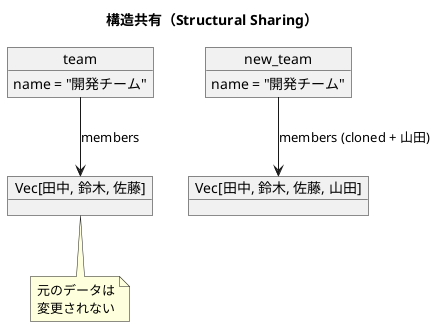

# 第1章: 不変性とデータ変換

## はじめに

関数型プログラミングの最も重要な概念の一つが**不変性（Immutability）**です。不変データ構造を使用することで、プログラムの予測可能性が向上し、並行処理でのバグを防ぎ、コードの理解と保守が容易になります。

本章では、Rust における不変データ構造の基本から、データ変換パイプライン、副作用の分離まで、実践的な例を通じて学びます。

## 1. 不変データ構造の基本

### なぜ不変性が重要なのか

従来の命令型プログラミングでは、変数やオブジェクトの状態を直接変更します：

```java
// Java（可変）
person.setAge(31);  // 元のオブジェクトが変更される
```

これに対し、Rust の変数はデフォルトで不変です。データを「変更」すると、新しいデータ構造が作成されます：

```rust
#[derive(Debug, Clone, PartialEq)]
pub struct Person {
    pub name: String,
    pub age: u32,
}

impl Person {
    pub fn new(name: &str, age: u32) -> Self {
        Person {
            name: name.to_string(),
            age,
        }
    }

    /// 年齢を更新した新しい Person を返す（元のデータは変更しない）
    pub fn with_age(&self, new_age: u32) -> Self {
        Person {
            name: self.name.clone(),
            age: new_age,
        }
    }
}

// 使用例
let original_person = Person::new("田中", 30);
let updated_person = original_person.with_age(31);

// original_person.age => 30  ← 元のデータは変わらない
// updated_person.age => 31   ← 新しいデータ
```

### 不変性の利点

1. **予測可能性**: データが変更されないため、関数の動作を予測しやすい
2. **スレッドセーフ**: 複数のスレッドから安全にアクセスできる
3. **履歴の保持**: 変更前のデータを保持できる（Undo/Redo の実装が容易）
4. **デバッグの容易さ**: データの変更履歴を追跡しやすい

### Rust の所有権システムと不変性

Rust は所有権システムにより、コンパイル時にメモリ安全性を保証します：

- デフォルトで変数は不変（`let` で宣言）
- 可変にするには明示的に `mut` を付ける
- 借用（`&`）はデフォルトで不変、可変借用は `&mut`

```rust
let person = Person::new("田中", 30);  // 不変
// person.age = 31;  // コンパイルエラー！

let mut mutable_person = Person::new("田中", 30);  // 可変
mutable_person.age = 31;  // OK
```

## 2. 構造共有（Structural Sharing）

「毎回新しいデータ構造を作成すると非効率では？」と思うかもしれません。Rust では `Clone` トレイトにより、効率的にデータをコピーできます。

```rust
#[derive(Debug, Clone, PartialEq)]
pub struct Member {
    pub name: String,
    pub role: String,
}

#[derive(Debug, Clone, PartialEq)]
pub struct Team {
    pub name: String,
    pub members: Vec<Member>,
}

impl Team {
    pub fn add_member(&self, member: Member) -> Self {
        let mut new_members = self.members.clone();
        new_members.push(member);
        Team {
            name: self.name.clone(),
            members: new_members,
        }
    }
}

let team = Team::new("開発チーム", vec![
    Member::new("田中", "developer"),
    Member::new("鈴木", "designer"),
    Member::new("佐藤", "manager"),
]);

let new_team = team.add_member(Member::new("山田", "developer"));
```

`new_team` は新しい Team ですが、元の `team` は変更されません。



## 3. データ変換パイプライン

関数型プログラミングでは、データを変換する一連の処理を**パイプライン**として表現します。Rust ではイテレータのメソッドチェーンを使用して、読みやすいパイプラインを構築できます。

### 実践例：注文処理システム

```rust
#[derive(Debug, Clone, PartialEq)]
pub struct Item {
    pub name: String,
    pub price: i32,
    pub quantity: i32,
}

impl Item {
    /// 小計を計算する
    pub fn subtotal(&self) -> i32 {
        self.price * self.quantity
    }
}

#[derive(Debug, Clone, PartialEq)]
pub struct Customer {
    pub name: String,
    pub membership: String,
}

#[derive(Debug, Clone, PartialEq)]
pub struct Order {
    pub items: Vec<Item>,
    pub customer: Customer,
}

/// 会員種別に応じた割引率を取得する
pub fn membership_discount(membership: &str) -> f64 {
    match membership {
        "gold" => 0.1,
        "silver" => 0.05,
        "bronze" => 0.02,
        _ => 0.0,
    }
}

impl Order {
    /// 注文の合計金額を計算する
    pub fn calculate_total(&self) -> i32 {
        self.items.iter().map(|item| item.subtotal()).sum()
    }

    /// 割引後の金額を計算する
    pub fn apply_discount(&self, total: i32) -> f64 {
        let discount_rate = membership_discount(&self.customer.membership);
        total as f64 * (1.0 - discount_rate)
    }

    /// 注文を処理し、割引後の合計金額を返す
    pub fn process(&self) -> f64 {
        let total = self.calculate_total();
        self.apply_discount(total)
    }
}
```

### Rust のパイプライン記法

Rust ではイテレータのメソッドチェーンでパイプラインを表現します：

```rust
// メソッドチェーン
self.items.iter().map(|item| item.subtotal()).sum()

// パターンマッチング
match membership {
    "gold" => 0.1,
    "silver" => 0.05,
    _ => 0.0,
}

// filter と map の組み合わせ
items
    .iter()
    .filter(|item| item.quantity > 0)
    .map(|item| item.subtotal())
    .sum::<i32>()
```

## 4. 副作用の分離

関数型プログラミングでは、**純粋関数**と**副作用を持つ関数**を明確に分離することが重要です。

### 純粋関数とは

- 同じ入力に対して常に同じ出力を返す
- 外部の状態を変更しない（副作用がない）

```rust
/// 純粋関数：税額を計算する
pub fn pure_calculate_tax(amount: i32, tax_rate: f64) -> f64 {
    amount as f64 * tax_rate
}

// 何度呼んでも同じ結果
pure_calculate_tax(1000, 0.1)  // => 100.0
pure_calculate_tax(1000, 0.1)  // => 100.0
```

### 副作用の分離パターン

ビジネスロジック（純粋関数）と副作用（I/O）を分離します：

```rust
#[derive(Debug, Clone, PartialEq)]
pub struct Invoice {
    pub subtotal: i32,
    pub tax: f64,
    pub total: f64,
}

/// ビジネスロジック（純粋関数）：請求書を計算する
pub fn calculate_invoice(items: &[Item], tax_rate: f64) -> Invoice {
    let subtotal: i32 = items.iter().map(|item| item.subtotal()).sum();
    let tax = pure_calculate_tax(subtotal, tax_rate);
    let total = subtotal as f64 + tax;
    Invoice::new(subtotal, tax, total)
}

/// データベースへの保存（副作用）
pub fn save_invoice(invoice: Invoice) -> Invoice {
    println!("Saving invoice: {:?}", invoice);
    invoice
}

/// メール送信（副作用）
pub fn send_notification(invoice: Invoice, customer_email: &str) -> Invoice {
    println!("Sending notification to: {}", customer_email);
    invoice
}

/// 処理全体のオーケストレーション
pub fn process_and_save_invoice(items: &[Item], tax_rate: f64, customer_email: &str) -> Invoice {
    let invoice = calculate_invoice(items, tax_rate);
    let saved = save_invoice(invoice);
    send_notification(saved, customer_email)
}
```

Rust では副作用を持つ関数に特別なサフィックスを付ける慣例はありませんが、型シグネチャ（`Result<T, E>` など）やドキュメントで明示することが推奨されます。

## 5. 永続的データ構造の活用：Undo/Redo の実装

不変データ構造を活用すると、履歴管理が非常に簡単に実装できます。

```rust
/// 履歴を保持するデータ構造
#[derive(Debug, Clone, PartialEq)]
pub struct History<T: Clone> {
    pub current: Option<T>,
    pub past: Vec<T>,
    pub future: Vec<T>,
}

impl<T: Clone> History<T> {
    /// 空の履歴を作成する
    pub fn new() -> Self {
        History {
            current: None,
            past: Vec::new(),
            future: Vec::new(),
        }
    }

    /// 新しい状態を履歴にプッシュする
    pub fn push_state(&self, new_state: T) -> Self {
        let mut new_past = Vec::new();
        if let Some(ref current) = self.current {
            new_past.push(current.clone());
        }
        new_past.extend(self.past.clone());

        History {
            current: Some(new_state),
            past: new_past,
            future: Vec::new(),
        }
    }

    /// 直前の状態に戻す
    pub fn undo(&self) -> Self {
        match self.past.first() {
            None => self.clone(),
            Some(previous) => {
                let mut new_future = Vec::new();
                if let Some(ref current) = self.current {
                    new_future.push(current.clone());
                }
                new_future.extend(self.future.clone());

                History {
                    current: Some(previous.clone()),
                    past: self.past[1..].to_vec(),
                    future: new_future,
                }
            }
        }
    }

    /// やり直し操作
    pub fn redo(&self) -> Self {
        match self.future.first() {
            None => self.clone(),
            Some(next_state) => {
                let mut new_past = Vec::new();
                if let Some(ref current) = self.current {
                    new_past.push(current.clone());
                }
                new_past.extend(self.past.clone());

                History {
                    current: Some(next_state.clone()),
                    past: new_past,
                    future: self.future[1..].to_vec(),
                }
            }
        }
    }
}
```

### 使用例

```rust
use std::collections::HashMap;

let history: History<HashMap<String, String>> = History::new();
let history = history.push_state(HashMap::from([("text".to_string(), "Hello".to_string())]));
let history = history.push_state(HashMap::from([("text".to_string(), "Hello World".to_string())]));
let history = history.push_state(HashMap::from([("text".to_string(), "Hello World!".to_string())]));

// history.current => Some({"text": "Hello World!"})

let after_undo = history.undo();
// after_undo.current => Some({"text": "Hello World"})

let after_redo = after_undo.redo();
// after_redo.current => Some({"text": "Hello World!"})
```

## 6. Iterator による効率的な変換

複数の変換を行う場合、Rust のイテレータは**遅延評価**されるため、中間コレクションを作成しません。

```rust
#[derive(Debug, Clone, PartialEq)]
pub struct ProcessedItem {
    pub name: String,
    pub price: i32,
    pub quantity: i32,
    pub subtotal: i32,
}

/// 複数の変換を合成した処理
pub fn process_items_efficiently(items: &[Item]) -> Vec<ProcessedItem> {
    items
        .iter()
        .filter(|item| item.quantity > 0)           // 数量が0より大きいものをフィルタ
        .map(ProcessedItem::from_item)              // ProcessedItem に変換
        .filter(|item| item.subtotal > 100)         // 小計が100より大きいものをフィルタ
        .collect()                                  // Vec に収集
}
```

Rust イテレータの利点：
- **遅延評価**: `collect()` が呼ばれるまで実際の処理は行われない
- **中間コレクションなし**: 各要素が一度のパスで処理される
- **ゼロコスト抽象化**: コンパイル時に最適化され、手書きのループと同等の性能

### 遅延評価の例

```rust
let numbers: Vec<i32> = (1..)           // 無限イテレータ
    .filter(|n| n % 2 == 0)              // 偶数をフィルタ
    .take(10)                            // 最初の10個を取得
    .collect();                          // Vec に収集
// => [2, 4, 6, 8, 10, 12, 14, 16, 18, 20]
```

## まとめ

本章では、関数型プログラミングの基礎である不変性について学びました：

1. **不変データ構造**: Rust のデフォルト不変性と `Clone` による新しいデータの作成
2. **構造共有**: 効率的なメモリ使用を実現する `Clone` トレイト
3. **データ変換パイプライン**: イテレータのメソッドチェーンによる読みやすい変換処理
4. **副作用の分離**: 純粋関数と I/O 処理の明確な分離
5. **履歴管理**: 不変性を活用した Undo/Redo の簡潔な実装
6. **Iterator**: 遅延評価による効率的な複合変換

これらの概念は、関数型プログラミングの他のすべてのパターンの基盤となります。

## 参考コード

本章のコード例は以下のファイルで確認できます：

- ソースコード: `app/rust/part1/src/chapter01.rs`

## 次章予告

次章では、**関数合成と高階関数**について学びます。小さな関数を組み合わせて複雑な処理を構築する方法を探ります。
