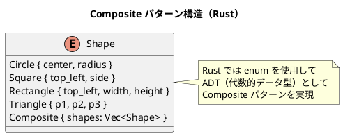

# 第7章: Composite パターン

## はじめに

Composite パターンは、オブジェクトをツリー構造で構成し、個々のオブジェクトとオブジェクトの集合を同じように扱うことができるようにするパターンです。このパターンを使用すると、クライアントは個々のオブジェクトとその組み合わせを区別せずに操作できます。

本章では、図形（Shape）、スイッチ（Switchable）、ファイルシステム、メニュー、数式など、様々な例を通じて Composite パターンの Rust での実装を学びます。

## 1. パターンの構造

Composite パターンは以下の要素で構成されます：

- **Component**: 全てのオブジェクトの共通インターフェース（Rust では `enum` または `trait`）
- **Leaf**: 子要素を持たない末端オブジェクト
- **Composite**: 子要素を持つコンテナオブジェクト



## 2. Shape の例 - 図形の Composite パターン

### enum による共通インターフェース

```rust
/// 2D座標
#[derive(Debug, Clone, Copy, PartialEq)]
pub struct Point {
    pub x: f64,
    pub y: f64,
}

impl Point {
    pub fn new(x: f64, y: f64) -> Point {
        Point { x, y }
    }

    pub fn add(&self, other: &Point) -> Point {
        Point::new(self.x + other.x, self.y + other.y)
    }

    pub fn scale(&self, factor: f64) -> Point {
        Point::new(self.x * factor, self.y * factor)
    }
}

/// 図形（enum による ADT）
#[derive(Debug, Clone, PartialEq)]
pub enum Shape {
    Circle {
        center: Point,
        radius: f64,
    },
    Square {
        top_left: Point,
        side: f64,
    },
    Rectangle {
        top_left: Point,
        width: f64,
        height: f64,
    },
    Triangle {
        p1: Point,
        p2: Point,
        p3: Point,
    },
    Composite {
        shapes: Vec<Shape>,
    },
}
```

### 図形操作の実装

```rust
impl Shape {
    /// 図形を移動
    pub fn translate(&self, dx: f64, dy: f64) -> Shape {
        match self {
            Shape::Circle { center, radius } => Shape::Circle {
                center: Point::new(center.x + dx, center.y + dy),
                radius: *radius,
            },
            Shape::Square { top_left, side } => Shape::Square {
                top_left: Point::new(top_left.x + dx, top_left.y + dy),
                side: *side,
            },
            Shape::Composite { shapes } => Shape::Composite {
                shapes: shapes.iter().map(|s| s.translate(dx, dy)).collect(),
            },
            // ... 他の図形
        }
    }

    /// 図形を拡大縮小
    pub fn scale(&self, factor: f64) -> Shape {
        match self {
            Shape::Circle { center, radius } => Shape::Circle {
                center: *center,
                radius: radius * factor,
            },
            Shape::Square { top_left, side } => Shape::Square {
                top_left: *top_left,
                side: side * factor,
            },
            Shape::Composite { shapes } => Shape::Composite {
                shapes: shapes.iter().map(|s| s.scale(factor)).collect(),
            },
            // ... 他の図形
        }
    }

    /// 面積を計算
    pub fn area(&self) -> f64 {
        match self {
            Shape::Circle { radius, .. } => PI * radius * radius,
            Shape::Square { side, .. } => side * side,
            Shape::Rectangle { width, height, .. } => width * height,
            Shape::Triangle { p1, p2, p3 } => {
                ((p2.x - p1.x) * (p3.y - p1.y) - (p3.x - p1.x) * (p2.y - p1.y)).abs() / 2.0
            }
            Shape::Composite { shapes } => shapes.iter().map(|s| s.area()).sum(),
        }
    }
}
```

### 使用例

```rust
// 個々の図形を作成
let circle = Shape::Circle {
    center: Point::new(10.0, 10.0),
    radius: 5.0,
};
let square = Shape::Square {
    top_left: Point::new(0.0, 0.0),
    side: 10.0,
};

// 複合図形を作成
let group = Shape::Composite {
    shapes: vec![circle.clone(), square.clone()],
};

// 複合図形を移動（全ての子要素が移動する）
let moved = group.translate(5.0, 5.0);

// 面積は全ての子要素の合計
let total_area = group.area();
```

## 3. Switchable の例 - スイッチの Composite パターン

```rust
/// スイッチ可能なデバイス
#[derive(Debug, Clone, PartialEq)]
pub enum Switchable {
    Light {
        on: bool,
        name: String,
    },
    DimmableLight {
        intensity: u8,
        name: String,
    },
    Fan {
        speed: u8,
        name: String,
    },
    Composite {
        switchables: Vec<Switchable>,
        name: String,
    },
}

impl Switchable {
    pub fn turn_on(&self) -> Switchable {
        match self {
            Switchable::Light { name, .. } => Switchable::Light {
                on: true,
                name: name.clone(),
            },
            Switchable::DimmableLight { name, .. } => Switchable::DimmableLight {
                intensity: 100,
                name: name.clone(),
            },
            Switchable::Composite { switchables, name } => Switchable::Composite {
                switchables: switchables.iter().map(|s| s.turn_on()).collect(),
                name: name.clone(),
            },
            // ... 他のデバイス
        }
    }

    pub fn is_on(&self) -> bool {
        match self {
            Switchable::Light { on, .. } => *on,
            Switchable::DimmableLight { intensity, .. } => *intensity > 0,
            Switchable::Composite { switchables, .. } => switchables.iter().any(|s| s.is_on()),
            // ... 他のデバイス
        }
    }
}
```

## 4. FileSystem の例

```rust
/// ファイルシステムエントリ
#[derive(Debug, Clone, PartialEq)]
pub enum FileSystemEntry {
    File {
        name: String,
        size: u64,
        parent_path: String,
    },
    Directory {
        name: String,
        children: Vec<FileSystemEntry>,
        parent_path: String,
    },
}

impl FileSystemEntry {
    pub fn size(&self) -> u64 {
        match self {
            FileSystemEntry::File { size, .. } => *size,
            FileSystemEntry::Directory { children, .. } => {
                children.iter().map(|c| c.size()).sum()
            }
        }
    }

    pub fn file_count(&self) -> usize {
        match self {
            FileSystemEntry::File { .. } => 1,
            FileSystemEntry::Directory { children, .. } => {
                children.iter().map(|c| c.file_count()).sum()
            }
        }
    }
}
```

## 5. Expression の例 - 数式の Composite パターン

```rust
/// 数式
#[derive(Debug, Clone, PartialEq)]
pub enum Expression {
    Number(f64),
    Variable { name: String, value: Option<f64> },
    Add(Box<Expression>, Box<Expression>),
    Subtract(Box<Expression>, Box<Expression>),
    Multiply(Box<Expression>, Box<Expression>),
    Divide(Box<Expression>, Box<Expression>),
}

impl Expression {
    pub fn evaluate(&self) -> Result<f64, String> {
        match self {
            Expression::Number(n) => Ok(*n),
            Expression::Variable { name, value } => {
                value.ok_or_else(|| format!("Variable {} has no value", name))
            }
            Expression::Add(left, right) => {
                Ok(left.evaluate()? + right.evaluate()?)
            }
            Expression::Multiply(left, right) => {
                Ok(left.evaluate()? * right.evaluate()?)
            }
            // ... 他の演算
        }
    }

    pub fn simplify(&self) -> Expression {
        match self {
            Expression::Add(left, right) => {
                let l = left.simplify();
                let r = right.simplify();
                match (&l, &r) {
                    (Expression::Number(0.0), _) => r,
                    (_, Expression::Number(0.0)) => l,
                    (Expression::Number(a), Expression::Number(b)) => {
                        Expression::Number(a + b)
                    }
                    _ => Expression::Add(Box::new(l), Box::new(r)),
                }
            }
            // ... 他の演算
            _ => self.clone(),
        }
    }
}
```

## 6. パターンの利点

1. **統一的な操作**: 個々のオブジェクトとグループを同じインターフェースで操作可能
2. **階層構造**: ネストした構造を自然に表現可能
3. **拡張性**: enum にバリアントを追加することで新しい型を追加可能
4. **型安全性**: Rust の enum によるパターンマッチで網羅性チェック

## 7. Rust での特徴

### enum による網羅性チェック

```rust
fn process(shape: &Shape) {
    match shape {
        Shape::Circle { .. } => { /* ... */ }
        Shape::Square { .. } => { /* ... */ }
        Shape::Rectangle { .. } => { /* ... */ }
        Shape::Triangle { .. } => { /* ... */ }
        Shape::Composite { .. } => { /* ... */ }
        // 全ケースをカバーしないとコンパイルエラー
    }
}
```

### 所有権による安全性

```rust
// 全ての操作が新しいオブジェクトを返す（元のオブジェクトは変更されない）
let original = Shape::Composite {
    shapes: vec![Shape::Circle {
        center: Point::new(0.0, 0.0),
        radius: 5.0,
    }],
};
let moved = original.translate(10.0, 10.0);
// original は変更されていない
```

## Scala との比較

| 概念 | Scala | Rust |
|------|-------|------|
| インターフェース | sealed trait | enum |
| Leaf/Composite | case class extends trait | enum variant |
| データ構造 | case class | struct / enum variant |
| 操作の委譲 | shapes.map(...) | shapes.iter().map(...).collect() |
| 不変性 | デフォルト | デフォルト（mut で可変） |
| パターンマッチ | match | match |

## まとめ

本章では、Composite パターンについて学びました：

1. **Shape の例**: 図形の移動と拡大を統一的に操作
2. **Switchable の例**: 複数のスイッチをグループ化して操作
3. **FileSystem の例**: ファイルとディレクトリの階層構造
4. **Menu の例**: 単品とセットメニューの価格計算
5. **Expression の例**: 数式の評価と簡略化

Composite パターンは、ツリー構造のデータを扱う際に非常に有効なパターンです。Rust の enum を使うことで、型安全で不変なツリー構造を簡潔に実装できます。

## 参考コード

本章のコード例は以下のファイルで確認できます：

- ソースコード: `app/rust/part3/src/chapter07.rs`

## 次章予告

次章では、**Decorator パターン**について学びます。既存の機能に新しい機能を動的に追加する方法を探ります。
