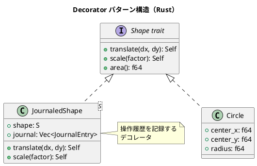

# 第8章: Decorator パターン

## はじめに

Decorator パターンは、既存のオブジェクトに新しい機能を動的に追加するパターンです。関数型プログラミングでは、高階関数を使って関数をラップし、横断的関心事（ロギング、キャッシング、タイミング計測など）を追加します。

本章では、図形の操作履歴、関数のデコレーション、テキスト処理など、様々な例を通じて Decorator パターンの Rust での実装を学びます。

## 1. パターンの構造



## 2. JournaledShape - 形状デコレータ

### 基本実装

```rust
/// ジャーナルエントリ
#[derive(Debug, Clone, PartialEq)]
pub enum JournalEntry {
    Translate { dx: f64, dy: f64 },
    Scale { factor: f64 },
    Rotate { angle: f64 },
}

/// 基本的な形状 trait
pub trait Shape: Clone {
    fn translate(&self, dx: f64, dy: f64) -> Self;
    fn scale(&self, factor: f64) -> Self;
    fn area(&self) -> f64;
}

/// 円
#[derive(Debug, Clone, PartialEq)]
pub struct Circle {
    pub center_x: f64,
    pub center_y: f64,
    pub radius: f64,
}

impl Shape for Circle {
    fn translate(&self, dx: f64, dy: f64) -> Circle {
        Circle {
            center_x: self.center_x + dx,
            center_y: self.center_y + dy,
            radius: self.radius,
        }
    }

    fn scale(&self, factor: f64) -> Circle {
        Circle {
            center_x: self.center_x,
            center_y: self.center_y,
            radius: self.radius * factor,
        }
    }

    fn area(&self) -> f64 {
        std::f64::consts::PI * self.radius * self.radius
    }
}
```

### ジャーナル付き形状

```rust
/// 操作履歴を記録するデコレータ
#[derive(Debug, Clone, PartialEq)]
pub struct JournaledShape<S: Shape> {
    pub shape: S,
    pub journal: Vec<JournalEntry>,
}

impl<S: Shape> JournaledShape<S> {
    pub fn new(shape: S) -> JournaledShape<S> {
        JournaledShape {
            shape,
            journal: Vec::new(),
        }
    }

    pub fn translate(&self, dx: f64, dy: f64) -> JournaledShape<S> {
        JournaledShape {
            shape: self.shape.translate(dx, dy),
            journal: {
                let mut j = self.journal.clone();
                j.push(JournalEntry::Translate { dx, dy });
                j
            },
        }
    }

    pub fn scale(&self, factor: f64) -> JournaledShape<S> {
        JournaledShape {
            shape: self.shape.scale(factor),
            journal: {
                let mut j = self.journal.clone();
                j.push(JournalEntry::Scale { factor });
                j
            },
        }
    }

    pub fn operation_count(&self) -> usize {
        self.journal.len()
    }
}
```

### 使用例

```rust
let circle = Circle::new(0.0, 0.0, 10.0);
let journaled = JournaledShape::new(circle);

let moved = journaled.translate(5.0, 5.0);
let scaled = moved.scale(2.0);

assert_eq!(scaled.operation_count(), 2);
assert_eq!(scaled.shape.radius, 20.0);
```

## 3. 関数デコレータ

### ロギングデコレータ

```rust
/// ロギングデコレータ
pub fn with_logging<A, B, F>(
    f: F,
    name: &str,
    logs: Rc<RefCell<Vec<String>>>,
) -> impl Fn(A) -> B
where
    F: Fn(A) -> B,
    A: std::fmt::Debug,
    B: std::fmt::Debug,
{
    let name = name.to_string();
    move |arg: A| {
        logs.borrow_mut()
            .push(format!("{} called with {:?}", name, arg));
        let result = f(arg);
        logs.borrow_mut()
            .push(format!("{} returned {:?}", name, result));
        result
    }
}
```

### タイミングデコレータ

```rust
/// 実行時間を計測するデコレータ
pub fn with_timing<A, B, F>(
    f: F,
    timings: Arc<Mutex<Vec<Duration>>>,
) -> impl Fn(A) -> B
where
    F: Fn(A) -> B,
{
    move |arg: A| {
        let start = Instant::now();
        let result = f(arg);
        let elapsed = start.elapsed();
        timings.lock().unwrap().push(elapsed);
        result
    }
}
```

### キャッシュデコレータ

```rust
/// 結果をキャッシュするデコレータ
pub fn with_memoization<A, B, F>(f: F) -> impl Fn(A) -> B
where
    F: Fn(A) -> B,
    A: Clone + std::hash::Hash + Eq,
    B: Clone,
{
    let cache = Rc::new(RefCell::new(HashMap::new()));
    move |arg: A| {
        let mut cache = cache.borrow_mut();
        if let Some(result) = cache.get(&arg) {
            return result.clone();
        }
        let result = f(arg.clone());
        cache.insert(arg, result.clone());
        result
    }
}
```

### 使用例

```rust
// ロギング付き関数
let logs = Rc::new(RefCell::new(Vec::new()));
let add_one = |x: i32| x + 1;
let logged_add = with_logging(add_one, "add_one", logs.clone());

let result = logged_add(5);
assert_eq!(result, 6);
assert_eq!(logs.borrow().len(), 2);

// メモ化付きフィボナッチ
let fib = with_memoization(|n: u64| {
    if n <= 1 { n } else { /* recursive call */ n }
});
```

## 4. テキストデコレータ

```rust
/// テキスト変換タイプ
pub type TextTransformer = Box<dyn Fn(&str) -> String>;

/// 大文字変換
pub fn uppercase() -> TextTransformer {
    Box::new(|s: &str| s.to_uppercase())
}

/// トリム
pub fn trim() -> TextTransformer {
    Box::new(|s: &str| s.trim().to_string())
}

/// プレフィックス追加
pub fn add_prefix(prefix: &str) -> TextTransformer {
    let prefix = prefix.to_string();
    Box::new(move |s: &str| format!("{}{}", prefix, s))
}

/// デコレータを合成
pub fn compose_transformers(transformers: Vec<TextTransformer>) -> TextTransformer {
    Box::new(move |s: &str| {
        transformers
            .iter()
            .fold(s.to_string(), |acc, t| t(&acc))
    })
}
```

### 使用例

```rust
let transform = compose_transformers(vec![
    trim(),
    uppercase(),
    add_prefix(">>> "),
]);

let result = transform("  hello world  ");
assert_eq!(result, ">>> HELLO WORLD");
```

## 5. リトライデコレータ

```rust
/// リトライデコレータ
pub fn with_retry<A, B, E, F>(
    f: F,
    max_retries: usize,
) -> impl Fn(A) -> Result<B, E>
where
    F: Fn(A) -> Result<B, E>,
    A: Clone,
{
    move |arg: A| {
        let mut attempts = 0;
        loop {
            match f(arg.clone()) {
                Ok(result) => return Ok(result),
                Err(e) if attempts < max_retries => {
                    attempts += 1;
                    continue;
                }
                Err(e) => return Err(e),
            }
        }
    }
}
```

## 6. パターンの利点

1. **関心の分離**: 本質的なロジックと横断的関心事を分離
2. **再利用性**: デコレータを様々な関数/型に適用可能
3. **合成可能**: 複数のデコレータを組み合わせ可能
4. **テスト容易性**: 各デコレータを独立してテスト可能

## 7. Rust での特徴

### ジェネリクスとトレイト境界

```rust
pub fn with_logging<A, B, F>(f: F, ...) -> impl Fn(A) -> B
where
    F: Fn(A) -> B,
    A: std::fmt::Debug,
    B: std::fmt::Debug,
```

### クロージャによるカプセル化

```rust
// 状態をクロージャ内にキャプチャ
let cache = Rc::new(RefCell::new(HashMap::new()));
move |arg: A| {
    // cache を使用
}
```

### 所有権と借用

```rust
// Rc<RefCell<T>> で共有可変状態を管理
let logs = Rc::new(RefCell::new(Vec::new()));
let logged_fn = with_logging(f, "name", logs.clone());
```

## Scala との比較

| 概念 | Scala | Rust |
|------|-------|------|
| 高階関数 | `(A => B) => (A => B)` | `Fn(A) -> B` |
| 状態管理 | var / mutable collection | Rc<RefCell<T>> |
| 型制約 | 暗黙的な型推論 | where 句でトレイト境界 |
| クロージャ | 自動キャプチャ | move で所有権移動 |

## まとめ

本章では、Decorator パターンについて学びました：

1. **JournaledShape**: 操作履歴を記録する図形デコレータ
2. **ロギングデコレータ**: 関数呼び出しをログに記録
3. **タイミングデコレータ**: 実行時間を計測
4. **キャッシュデコレータ**: 結果をメモ化
5. **テキストデコレータ**: 文字列変換の合成

Rust では、ジェネリクス、トレイト境界、クロージャを組み合わせることで、型安全で柔軟なデコレータを実装できます。

## 参考コード

本章のコード例は以下のファイルで確認できます：

- ソースコード: `app/rust/part3/src/chapter08.rs`

## 次章予告

次章では、**Adapter パターン**について学びます。異なるインターフェース間の変換方法を探ります。
