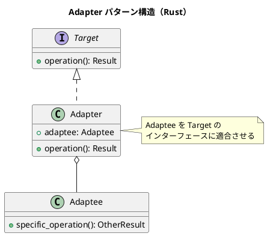

# 第9章: Adapter パターン

## はじめに

Adapter パターンは、互換性のないインターフェースを持つクラスを協調して動作させるパターンです。関数型プログラミングでは、データ変換関数を使って異なるデータ形式間の変換を行います。

本章では、温度変換、データフォーマット変換、レガシーシステムとの統合など、様々な例を通じて Adapter パターンの Rust での実装を学びます。

## 1. パターンの構造



## 2. 温度変換アダプタ

```rust
/// 摂氏温度
#[derive(Debug, Clone, PartialEq)]
pub struct Celsius(pub f64);

/// 華氏温度
#[derive(Debug, Clone, PartialEq)]
pub struct Fahrenheit(pub f64);

/// ケルビン温度
#[derive(Debug, Clone, PartialEq)]
pub struct Kelvin(pub f64);

/// 温度変換トレイト
pub trait TemperatureConverter {
    fn to_celsius(&self) -> Celsius;
    fn to_fahrenheit(&self) -> Fahrenheit;
    fn to_kelvin(&self) -> Kelvin;
}

impl TemperatureConverter for Celsius {
    fn to_celsius(&self) -> Celsius {
        self.clone()
    }

    fn to_fahrenheit(&self) -> Fahrenheit {
        Fahrenheit(self.0 * 9.0 / 5.0 + 32.0)
    }

    fn to_kelvin(&self) -> Kelvin {
        Kelvin(self.0 + 273.15)
    }
}

impl TemperatureConverter for Fahrenheit {
    fn to_celsius(&self) -> Celsius {
        Celsius((self.0 - 32.0) * 5.0 / 9.0)
    }

    fn to_fahrenheit(&self) -> Fahrenheit {
        self.clone()
    }

    fn to_kelvin(&self) -> Kelvin {
        self.to_celsius().to_kelvin()
    }
}
```

### 使用例

```rust
let celsius = Celsius(100.0);
let fahrenheit = celsius.to_fahrenheit();
assert_eq!(fahrenheit.0, 212.0);

let kelvin = celsius.to_kelvin();
assert_eq!(kelvin.0, 373.15);
```

## 3. データフォーマットアダプタ

```rust
/// レガシーユーザーデータ
#[derive(Debug, Clone)]
pub struct LegacyUser {
    pub first_name: String,
    pub last_name: String,
    pub email_address: String,
    pub phone_number: String,
}

/// 新しいユーザーデータ
#[derive(Debug, Clone)]
pub struct NewUser {
    pub name: String,
    pub email: String,
    pub contacts: Vec<Contact>,
}

#[derive(Debug, Clone)]
pub struct Contact {
    pub contact_type: String,
    pub value: String,
}

/// レガシーから新形式への変換
impl From<LegacyUser> for NewUser {
    fn from(legacy: LegacyUser) -> NewUser {
        NewUser {
            name: format!("{} {}", legacy.first_name, legacy.last_name),
            email: legacy.email_address,
            contacts: vec![Contact {
                contact_type: "phone".to_string(),
                value: legacy.phone_number,
            }],
        }
    }
}

/// 新形式からレガシーへの変換
impl From<NewUser> for LegacyUser {
    fn from(new_user: NewUser) -> LegacyUser {
        let name_parts: Vec<&str> = new_user.name.split_whitespace().collect();
        let phone = new_user
            .contacts
            .iter()
            .find(|c| c.contact_type == "phone")
            .map(|c| c.value.clone())
            .unwrap_or_default();

        LegacyUser {
            first_name: name_parts.first().unwrap_or(&"").to_string(),
            last_name: name_parts.get(1).unwrap_or(&"").to_string(),
            email_address: new_user.email,
            phone_number: phone,
        }
    }
}
```

## 4. 外部 API アダプタ

```rust
/// 外部 API のレスポンス形式
#[derive(Debug, Clone)]
pub struct ExternalApiResponse {
    pub status_code: i32,
    pub body: String,
    pub headers: HashMap<String, String>,
}

/// 内部形式
#[derive(Debug, Clone)]
pub struct InternalResponse {
    pub success: bool,
    pub data: String,
    pub metadata: ResponseMetadata,
}

#[derive(Debug, Clone)]
pub struct ResponseMetadata {
    pub content_type: String,
    pub timestamp: i64,
}

/// アダプタ関数
pub fn adapt_external_response(external: ExternalApiResponse) -> InternalResponse {
    InternalResponse {
        success: external.status_code >= 200 && external.status_code < 300,
        data: external.body,
        metadata: ResponseMetadata {
            content_type: external
                .headers
                .get("Content-Type")
                .cloned()
                .unwrap_or_else(|| "application/json".to_string()),
            timestamp: std::time::SystemTime::now()
                .duration_since(std::time::UNIX_EPOCH)
                .unwrap()
                .as_secs() as i64,
        },
    }
}
```

## 5. 関数アダプタ

```rust
/// 異なる引数の順序を適応
pub fn swap_args<A, B, C, F>(f: F) -> impl Fn(B, A) -> C
where
    F: Fn(A, B) -> C,
{
    move |b, a| f(a, b)
}

/// カリー化
pub fn curry<A, B, C, F>(f: F) -> impl Fn(A) -> Box<dyn Fn(B) -> C>
where
    F: Fn(A, B) -> C + Clone + 'static,
    A: Clone + 'static,
{
    move |a: A| {
        let f = f.clone();
        let a = a.clone();
        Box::new(move |b: B| f(a.clone(), b))
    }
}

/// 部分適用
pub fn partial<A, B, C, F>(f: F, a: A) -> impl Fn(B) -> C
where
    F: Fn(A, B) -> C,
    A: Clone,
{
    move |b: B| f(a.clone(), b)
}
```

### 使用例

```rust
let divide = |a: f64, b: f64| a / b;
let swapped = swap_args(divide);

assert_eq!(divide(10.0, 2.0), 5.0);
assert_eq!(swapped(2.0, 10.0), 5.0);

let add = |a: i32, b: i32| a + b;
let add_5 = partial(add, 5);
assert_eq!(add_5(3), 8);
```

## 6. イテレータアダプタ

```rust
/// カスタムイテレータアダプタ
pub trait IteratorAdapter: Iterator {
    /// 要素をグループ化
    fn group_by_key<K, F>(self, key_fn: F) -> HashMap<K, Vec<Self::Item>>
    where
        Self: Sized,
        K: Eq + std::hash::Hash,
        F: Fn(&Self::Item) -> K,
    {
        let mut groups = HashMap::new();
        for item in self {
            let key = key_fn(&item);
            groups.entry(key).or_insert_with(Vec::new).push(item);
        }
        groups
    }

    /// ウィンドウを作成
    fn windowed(self, size: usize) -> Vec<Vec<Self::Item>>
    where
        Self: Sized,
        Self::Item: Clone,
    {
        let items: Vec<_> = self.collect();
        items.windows(size).map(|w| w.to_vec()).collect()
    }
}

impl<I: Iterator> IteratorAdapter for I {}
```

## 7. パターンの利点

1. **互換性**: 異なるインターフェース間の橋渡し
2. **再利用**: 既存コードを新しいコンテキストで利用可能
3. **分離**: 変換ロジックを一箇所に集約
4. **テスト容易性**: 変換ロジックを独立してテスト可能

## Rust での特徴

### From/Into トレイト

```rust
impl From<LegacyUser> for NewUser {
    fn from(legacy: LegacyUser) -> NewUser {
        // 変換ロジック
    }
}

// 使用
let new_user: NewUser = legacy_user.into();
```

### 型安全な変換

```rust
// コンパイル時に型チェック
let celsius = Celsius(100.0);
let fahrenheit: Fahrenheit = celsius.to_fahrenheit();
// 型が異なるので直接代入できない
```

## まとめ

本章では、Adapter パターンについて学びました：

1. **温度変換アダプタ**: 異なる温度単位間の変換
2. **データフォーマットアダプタ**: レガシー形式と新形式の相互変換
3. **外部 API アダプタ**: 外部データを内部形式に適合
4. **関数アダプタ**: 引数の順序や数を調整
5. **イテレータアダプタ**: イテレータに追加機能を提供

Rust の From/Into トレイトと強い型システムを活用することで、型安全な変換を実現できます。

## 参考コード

本章のコード例は以下のファイルで確認できます：

- ソースコード: `app/rust/part3/src/chapter09.rs`

## 次章予告

次章では、**Strategy パターン**について学びます。アルゴリズムをカプセル化して交換可能にする方法を探ります。
