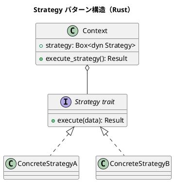

# 第10章: Strategy パターン

## はじめに

Strategy パターンは、アルゴリズムをカプセル化し、クライアントから独立して交換可能にするパターンです。関数型プログラミングでは、関数を第一級オブジェクトとして扱うことで、このパターンを自然に実現できます。

本章では、ソート戦略、価格計算、フィルタリング、フォーマット戦略など、様々な例を通じて Strategy パターンの Rust での実装を学びます。

## 1. パターンの構造



## 2. ソート戦略

### トレイトベースの実装

```rust
/// ソート戦略トレイト
pub trait SortStrategy<T> {
    fn sort(&self, items: &mut Vec<T>);
}

/// 昇順ソート
pub struct AscendingSort;

impl<T: Ord> SortStrategy<T> for AscendingSort {
    fn sort(&self, items: &mut Vec<T>) {
        items.sort();
    }
}

/// 降順ソート
pub struct DescendingSort;

impl<T: Ord> SortStrategy<T> for DescendingSort {
    fn sort(&self, items: &mut Vec<T>) {
        items.sort_by(|a, b| b.cmp(a));
    }
}

/// カスタムソート
pub struct CustomSort<T, F: Fn(&T, &T) -> std::cmp::Ordering> {
    comparator: F,
    _marker: std::marker::PhantomData<T>,
}

impl<T, F: Fn(&T, &T) -> std::cmp::Ordering> SortStrategy<T> for CustomSort<T, F> {
    fn sort(&self, items: &mut Vec<T>) {
        items.sort_by(&self.comparator);
    }
}
```

### 関数ベースの実装

```rust
/// ソート戦略（関数型）
pub type SortFn<T> = Box<dyn Fn(&mut Vec<T>)>;

pub fn ascending_sort<T: Ord + 'static>() -> SortFn<T> {
    Box::new(|items| items.sort())
}

pub fn descending_sort<T: Ord + 'static>() -> SortFn<T> {
    Box::new(|items| items.sort_by(|a, b| b.cmp(a)))
}

pub fn sort_by_key<T: 'static, K: Ord>(key_fn: impl Fn(&T) -> K + 'static) -> SortFn<T> {
    Box::new(move |items| items.sort_by_key(|x| key_fn(x)))
}
```

### 使用例

```rust
let mut numbers = vec![3, 1, 4, 1, 5, 9, 2, 6];

// トレイトベース
AscendingSort.sort(&mut numbers);
assert_eq!(numbers, vec![1, 1, 2, 3, 4, 5, 6, 9]);

// 関数ベース
let sort_desc = descending_sort::<i32>();
sort_desc(&mut numbers);
assert_eq!(numbers, vec![9, 6, 5, 4, 3, 2, 1, 1]);
```

## 3. 価格計算戦略

```rust
/// 価格計算戦略
pub trait PricingStrategy {
    fn calculate(&self, base_price: f64) -> f64;
}

/// 通常価格
pub struct RegularPricing;

impl PricingStrategy for RegularPricing {
    fn calculate(&self, base_price: f64) -> f64 {
        base_price
    }
}

/// 割引価格
pub struct DiscountPricing {
    pub discount_rate: f64,
}

impl PricingStrategy for DiscountPricing {
    fn calculate(&self, base_price: f64) -> f64 {
        base_price * (1.0 - self.discount_rate)
    }
}

/// 会員価格
pub struct MemberPricing {
    pub member_discount: f64,
    pub points_discount: f64,
}

impl PricingStrategy for MemberPricing {
    fn calculate(&self, base_price: f64) -> f64 {
        base_price * (1.0 - self.member_discount) - self.points_discount
    }
}

/// 価格計算コンテキスト
pub struct PriceCalculator {
    strategy: Box<dyn PricingStrategy>,
}

impl PriceCalculator {
    pub fn new(strategy: Box<dyn PricingStrategy>) -> Self {
        PriceCalculator { strategy }
    }

    pub fn calculate(&self, base_price: f64) -> f64 {
        self.strategy.calculate(base_price)
    }
}
```

### 使用例

```rust
let regular = PriceCalculator::new(Box::new(RegularPricing));
assert_eq!(regular.calculate(100.0), 100.0);

let discount = PriceCalculator::new(Box::new(DiscountPricing { discount_rate: 0.2 }));
assert_eq!(discount.calculate(100.0), 80.0);

let member = PriceCalculator::new(Box::new(MemberPricing {
    member_discount: 0.1,
    points_discount: 5.0,
}));
assert_eq!(member.calculate(100.0), 85.0);
```

## 4. フィルタリング戦略

```rust
/// フィルタ戦略
pub type FilterFn<T> = Box<dyn Fn(&T) -> bool>;

/// フィルタを合成
pub fn and_filter<T: 'static>(
    f1: FilterFn<T>,
    f2: FilterFn<T>,
) -> FilterFn<T> {
    Box::new(move |item| f1(item) && f2(item))
}

pub fn or_filter<T: 'static>(
    f1: FilterFn<T>,
    f2: FilterFn<T>,
) -> FilterFn<T> {
    Box::new(move |item| f1(item) || f2(item))
}

pub fn not_filter<T: 'static>(f: FilterFn<T>) -> FilterFn<T> {
    Box::new(move |item| !f(item))
}
```

### 使用例

```rust
let is_positive: FilterFn<i32> = Box::new(|&x| x > 0);
let is_even: FilterFn<i32> = Box::new(|&x| x % 2 == 0);

let is_positive_and_even = and_filter(is_positive, is_even);

let numbers = vec![-4, -2, 0, 2, 4, 6];
let filtered: Vec<_> = numbers.iter().filter(|x| is_positive_and_even(x)).collect();
assert_eq!(filtered, vec![&2, &4, &6]);
```

## 5. フォーマット戦略

```rust
/// フォーマット戦略
pub trait FormatStrategy {
    fn format(&self, data: &Data) -> String;
}

#[derive(Debug)]
pub struct Data {
    pub name: String,
    pub value: f64,
}

/// JSON フォーマット
pub struct JsonFormat;

impl FormatStrategy for JsonFormat {
    fn format(&self, data: &Data) -> String {
        format!(r#"{{"name":"{}","value":{}}}"#, data.name, data.value)
    }
}

/// XML フォーマット
pub struct XmlFormat;

impl FormatStrategy for XmlFormat {
    fn format(&self, data: &Data) -> String {
        format!(
            "<data><name>{}</name><value>{}</value></data>",
            data.name, data.value
        )
    }
}

/// CSV フォーマット
pub struct CsvFormat;

impl FormatStrategy for CsvFormat {
    fn format(&self, data: &Data) -> String {
        format!("{},{}", data.name, data.value)
    }
}
```

## 6. パターンの利点

1. **柔軟性**: アルゴリズムを実行時に切り替え可能
2. **分離**: アルゴリズムの実装と使用を分離
3. **テスト容易性**: 各戦略を独立してテスト可能
4. **拡張性**: 新しい戦略を簡単に追加可能

## 7. Rust での特徴

### クロージャによる簡潔な実装

```rust
// 関数として戦略を渡す
fn process_with_strategy<T, F>(items: &[T], strategy: F) -> Vec<T>
where
    F: Fn(&T) -> T,
    T: Clone,
{
    items.iter().map(|x| strategy(x)).collect()
}

// 使用
let doubled = process_with_strategy(&[1, 2, 3], |x| x * 2);
```

### トレイトオブジェクト vs ジェネリクス

```rust
// トレイトオブジェクト（動的ディスパッチ）
fn with_dyn(strategy: &dyn PricingStrategy, price: f64) -> f64 {
    strategy.calculate(price)
}

// ジェネリクス（静的ディスパッチ）
fn with_generic<S: PricingStrategy>(strategy: &S, price: f64) -> f64 {
    strategy.calculate(price)
}
```

## Scala との比較

| 概念 | Scala | Rust |
|------|-------|------|
| 戦略定義 | trait | trait |
| 関数戦略 | `A => B` | `Fn(A) -> B` |
| 動的選択 | Any / type test | Box<dyn Trait> |
| 合成 | andThen/compose | カスタム関数 |

## まとめ

本章では、Strategy パターンについて学びました：

1. **ソート戦略**: 異なるソートアルゴリズムを切り替え
2. **価格計算戦略**: 様々な価格計算ルールを適用
3. **フィルタリング戦略**: フィルタを合成して複雑な条件を表現
4. **フォーマット戦略**: 異なる出力形式に対応

Rust では、トレイトとクロージャを組み合わせることで、型安全で柔軟な Strategy パターンを実現できます。

## 参考コード

本章のコード例は以下のファイルで確認できます：

- ソースコード: `app/rust/part4/src/chapter10.rs`

## 次章予告

次章では、**Command パターン**について学びます。操作をオブジェクトとしてカプセル化する方法を探ります。
