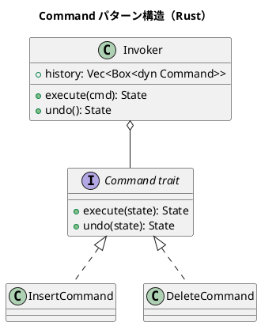

# 第11章: Command パターン

## はじめに

Command パターンは、操作をオブジェクトとしてカプセル化し、実行、取り消し、再実行を可能にするパターンです。関数型プログラミングでは、コマンドをデータとして表現し、純粋関数で操作を実行します。

本章では、ドキュメント編集、グラフィックス操作、トランザクション処理など、様々な例を通じて Command パターンの Rust での実装を学びます。

## 1. パターンの構造



## 2. ドキュメント編集コマンド

### コマンドトレイト

```rust
/// ドキュメント状態
#[derive(Debug, Clone, PartialEq)]
pub struct Document {
    pub content: String,
    pub cursor: usize,
}

impl Document {
    pub fn new() -> Document {
        Document {
            content: String::new(),
            cursor: 0,
        }
    }
}

/// コマンドトレイト
pub trait Command: CloneCommand {
    fn execute(&self, doc: &Document) -> Document;
    fn undo(&self, doc: &Document) -> Document;
}

/// コマンドを複製可能にするトレイト
pub trait CloneCommand {
    fn clone_box(&self) -> Box<dyn Command>;
}

impl<T: Command + Clone + 'static> CloneCommand for T {
    fn clone_box(&self) -> Box<dyn Command> {
        Box::new(self.clone())
    }
}
```

### 具体的なコマンド

```rust
/// テキスト挿入コマンド
#[derive(Clone)]
pub struct InsertCommand {
    pub text: String,
    pub position: usize,
}

impl Command for InsertCommand {
    fn execute(&self, doc: &Document) -> Document {
        let mut content = doc.content.clone();
        content.insert_str(self.position, &self.text);
        Document {
            content,
            cursor: self.position + self.text.len(),
        }
    }

    fn undo(&self, doc: &Document) -> Document {
        let mut content = doc.content.clone();
        content.replace_range(self.position..self.position + self.text.len(), "");
        Document {
            content,
            cursor: self.position,
        }
    }
}

/// テキスト削除コマンド
#[derive(Clone)]
pub struct DeleteCommand {
    pub start: usize,
    pub end: usize,
    pub deleted_text: String,
}

impl Command for DeleteCommand {
    fn execute(&self, doc: &Document) -> Document {
        let mut content = doc.content.clone();
        content.replace_range(self.start..self.end, "");
        Document {
            content,
            cursor: self.start,
        }
    }

    fn undo(&self, doc: &Document) -> Document {
        let mut content = doc.content.clone();
        content.insert_str(self.start, &self.deleted_text);
        Document {
            content,
            cursor: self.start + self.deleted_text.len(),
        }
    }
}
```

### コマンド履歴管理

```rust
/// コマンド履歴
pub struct CommandHistory {
    history: Vec<Box<dyn Command>>,
    current: usize,
}

impl CommandHistory {
    pub fn new() -> CommandHistory {
        CommandHistory {
            history: Vec::new(),
            current: 0,
        }
    }

    pub fn execute(&mut self, cmd: Box<dyn Command>, doc: &Document) -> Document {
        // 現在位置以降の履歴を削除
        self.history.truncate(self.current);
        self.history.push(cmd.clone_box());
        self.current += 1;
        cmd.execute(doc)
    }

    pub fn undo(&mut self, doc: &Document) -> Option<Document> {
        if self.current > 0 {
            self.current -= 1;
            Some(self.history[self.current].undo(doc))
        } else {
            None
        }
    }

    pub fn redo(&mut self, doc: &Document) -> Option<Document> {
        if self.current < self.history.len() {
            let result = self.history[self.current].execute(doc);
            self.current += 1;
            Some(result)
        } else {
            None
        }
    }
}
```

### 使用例

```rust
let mut doc = Document::new();
let mut history = CommandHistory::new();

// テキストを挿入
let insert = InsertCommand {
    text: "Hello".to_string(),
    position: 0,
};
doc = history.execute(Box::new(insert), &doc);
assert_eq!(doc.content, "Hello");

// 元に戻す
doc = history.undo(&doc).unwrap();
assert_eq!(doc.content, "");

// やり直す
doc = history.redo(&doc).unwrap();
assert_eq!(doc.content, "Hello");
```

## 3. マクロコマンド

```rust
/// 複数のコマンドをまとめて実行
#[derive(Clone)]
pub struct MacroCommand {
    pub commands: Vec<Box<dyn Command>>,
}

impl Command for MacroCommand {
    fn execute(&self, doc: &Document) -> Document {
        self.commands
            .iter()
            .fold(doc.clone(), |d, cmd| cmd.execute(&d))
    }

    fn undo(&self, doc: &Document) -> Document {
        self.commands
            .iter()
            .rev()
            .fold(doc.clone(), |d, cmd| cmd.undo(&d))
    }
}
```

## 4. 関数型コマンド

```rust
/// 関数型コマンド
pub type CommandFn<S> = Box<dyn Fn(&S) -> S>;

/// コマンドを合成
pub fn compose_commands<S: Clone + 'static>(
    commands: Vec<CommandFn<S>>,
) -> CommandFn<S> {
    Box::new(move |state| {
        commands.iter().fold(state.clone(), |s, cmd| cmd(&s))
    })
}

/// 可逆コマンド
pub struct ReversibleCommand<S> {
    pub execute: Box<dyn Fn(&S) -> S>,
    pub undo: Box<dyn Fn(&S) -> S>,
}

impl<S> ReversibleCommand<S> {
    pub fn new<E, U>(execute: E, undo: U) -> Self
    where
        E: Fn(&S) -> S + 'static,
        U: Fn(&S) -> S + 'static,
    {
        ReversibleCommand {
            execute: Box::new(execute),
            undo: Box::new(undo),
        }
    }
}
```

## 5. トランザクションコマンド

```rust
/// トランザクション結果
pub enum TransactionResult<T> {
    Success(T),
    Failure(String),
    Rollback(T),
}

/// トランザクションコマンド
pub struct TransactionCommand<S> {
    pub commands: Vec<ReversibleCommand<S>>,
}

impl<S: Clone> TransactionCommand<S> {
    pub fn execute(&self, state: &S) -> TransactionResult<S> {
        let mut current = state.clone();
        let mut executed = Vec::new();

        for cmd in &self.commands {
            let new_state = (cmd.execute)(&current);
            executed.push(cmd);
            current = new_state;
        }

        TransactionResult::Success(current)
    }

    pub fn rollback(&self, state: &S, executed: &[&ReversibleCommand<S>]) -> S {
        executed
            .iter()
            .rev()
            .fold(state.clone(), |s, cmd| (cmd.undo)(&s))
    }
}
```

## 6. パターンの利点

1. **元に戻す/やり直す**: 操作の履歴を管理
2. **遅延実行**: コマンドをキューに入れて後で実行
3. **ログ記録**: 操作をログとして保存
4. **トランザクション**: 複数の操作をアトミックに実行

## 7. Rust での特徴

### トレイトオブジェクトとクローン

```rust
// Box<dyn Command> をクローン可能にする
pub trait CloneCommand {
    fn clone_box(&self) -> Box<dyn Command>;
}
```

### 所有権と不変性

```rust
// コマンドは状態を変更せず、新しい状態を返す
fn execute(&self, doc: &Document) -> Document {
    // doc は借用、新しい Document を返す
}
```

## Scala との比較

| 概念 | Scala | Rust |
|------|-------|------|
| コマンド定義 | case class | struct + trait |
| 履歴管理 | List | Vec |
| 不変更新 | copy() | Clone + 手動構築 |
| 多態性 | trait | trait object |

## まとめ

本章では、Command パターンについて学びました：

1. **ドキュメント編集**: 挿入、削除、置換コマンド
2. **履歴管理**: Undo/Redo 機能
3. **マクロコマンド**: 複数コマンドの合成
4. **関数型コマンド**: 関数としてのコマンド
5. **トランザクション**: アトミックな操作実行

Rust では、トレイトオブジェクトと所有権システムを活用して、型安全なコマンドパターンを実現できます。

## 参考コード

本章のコード例は以下のファイルで確認できます：

- ソースコード: `app/rust/part4/src/chapter11.rs`

## 次章予告

次章では、**Visitor パターン**について学びます。データ構造を走査して操作を適用する方法を探ります。
